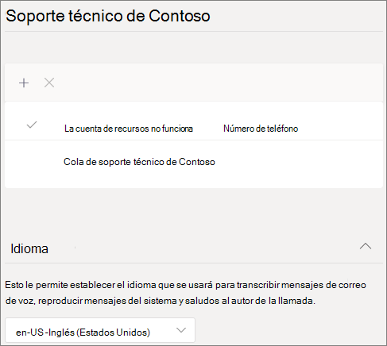
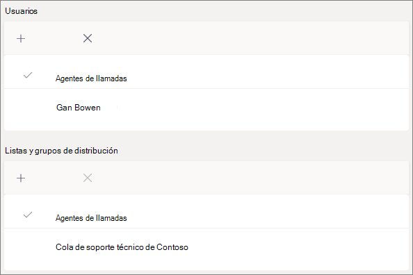
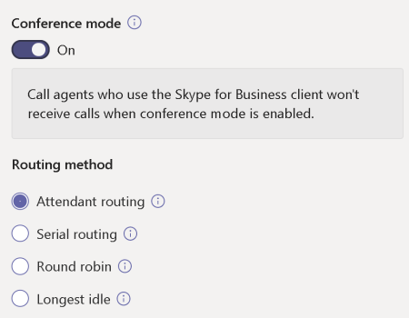
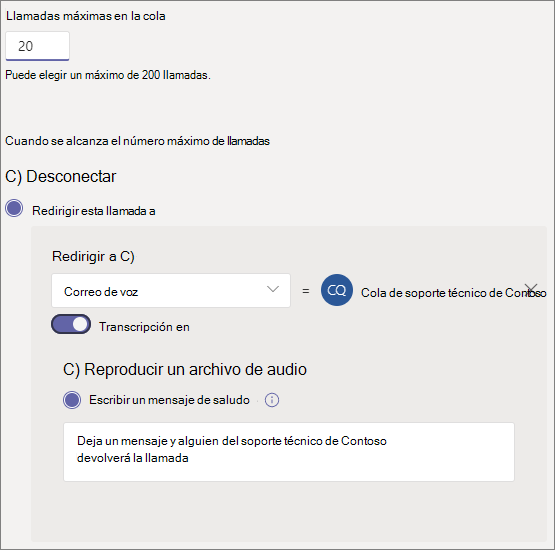
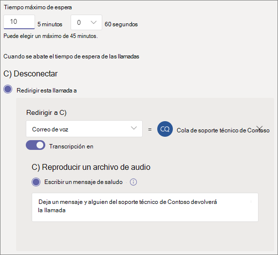

# Crear una cola de llamadas: tutorial para pequeñas empresas

Las colas de llamadas proporcionan un método para enrutar llamadas a personas de su organización que pueden ayudarles con un problema o pregunta en particular. Las llamadas se distribuyen de una en una a las personas que están en la cola (que se denominan *agentes*). 

Las colas de llamadas proporcionan:

- Un mensaje de saludo.

- Música que se reproduce mientras los usuarios se mantienen a la espera.

- Enrutamiento de llamadas *Primera en llegar, primera en salir* (FIFO),en la orden para los agentes.

- Opciones de gestión del desbordamiento de la cola y del tiempo de espera.

#### Antes de empezar

Obtener algunas [licencias del sistema telefónico: licencias](../teams-add-on-licensing/virtual-user.md) de usuario virtual si aún no las tiene. Obtenga una por cada cola de llamadas y operador automático que tiene previsto configurar. Estas licencias son gratuitas, por lo que le recomendamos obtener algunas adicionales en caso de que decida realizar cambios en su configuración en el futuro.

Puesto que los agentes de una cola de llamadas pueden llamar para devolver una llamada de cliente, considere la posibilidad de establecer el identificador de llamada de los agentes de llamada en su número de teléfono principal o el número de un operador automático adecuado. Consulte [administrar las directivas de identificador de llamada en Microsoft Teams](../caller-id-policies.md) obtener más información.

#### Siga estos pasos para configurar la cola de llamadas

# [Paso 1   Crear un equipo](#tab/create-team)

Al crear una cola de llamadas, puede agregar usuarios individuales a la cola o puede usar un grupo de seguridad existente, un grupo de Microsoft 365 o un equipo de Microsoft Teams. Se recomienda [usar un canal de grupo.](https://support.microsoft.com/office/9f07dabe-91c6-4a9b-a545-8ffdddd2504e) Esto permite a los miembros de la cola chatear entre sí, compartir ideas y crear documentos u otros recursos para ayudarles a ayudar a sus clientes. Un equipo también proporciona un buzón de voz para que los autores de llamadas dejen un mensaje fuera del horario laboral o si la cola alcanza su capacidad máxima.

Para crear un equipo

1. En primer lugar, haga clic en **Teams** en el lado izquierdo de la aplicación y, a continuación, haga clic en Unirse **o crear un** equipo en la parte inferior de la lista de equipos.

2. A **continuación, haga** clic en Crear equipo (primera tarjeta, esquina superior izquierda).

3. Elija **Crear un equipo desde cero.**

4. A continuación, elija si desea un equipo público o privado. Recomendamos **Privado para** la cola de llamadas para evitar que los usuarios se conviertan involuntaramente en parte de la cola uniéndose al equipo.

5. Asigne un nombre al equipo y agregue una descripción opcional.

6. Cuando haya terminado, haga clic en **Crear**.

8. Escriba los nombres de las personas que desea tener en la cola de llamadas y, a continuación, haga clic en **Agregar.**

9. Haga clic en **Cerrar**. Las personas que agregue a un equipo recibirán un correo electrónico para que sepan que ahora son miembros de su equipo y que el equipo aparecerá en su lista de equipos.

A continuación, agregaremos un canal para usarlo con la cola de llamadas.

Para agregar un canal

1. En Teams, busque el equipo que acaba de crear, haga clic en **Más opciones** (...)y, a continuación, haga clic en **Agregar canal.**

2. Escriba un nombre y una descripción para el canal y, a continuación, haga clic en **Agregar**.

> [!div class="nextstepaction"]
> [Paso 2: Cuentas de recursos >](/microsoftteams/business-voice/create-a-phone-system-call-queue-smb?tabs=resource-account#steps)

# [Paso 2   Cuentas de recursos](#tab/resource-account)

Cada cola de llamadas que cree requiere una cuenta de recursos. Esto es similar a una cuenta de usuario, excepto que la cuenta está asociada con un operador automático o una cola de llamadas en lugar de una persona. En este paso, crearemos la cuenta, le asignaremos una licencia de *Microsoft 365 Phone System - Virtual User* y, a continuación, la usaremos para empezar a crear la cola de llamadas.

### Crear una cuenta de recursos

Puede crear una cuenta de recursos en el Centro de administración de Teams.

1. En el Centro de administración de Teams, expanda **Configuración de toda la organización** y, a continuación, haga clic en Cuentas de **recursos.**

2. Haga clic en **Agregar**.

3. En el **panel Agregar cuenta de** recursos, rellene **Nombre** para mostrar, **Nombre** de usuario y elija Cola **de llamadas** para el tipo de **cuenta Recurso.** Los agentes verán el nombre para mostrar cuando reciban una llamada entrante desde la cola.

    

4. Haga clic en **Guardar**.

La nueva cuenta aparecerá en la lista de cuentas.

### Asignar una licencia

Debe asignar una licencia de Usuario virtual de *Microsoft 365 Phone System* a la cuenta de recursos.

1. En el Centro de administración de  Microsoft 365, en la lista Usuarios activos, haga clic en la cuenta de recursos a la que desea asignar una licencia.

2. En la **pestaña Licencias y aplicaciones,** en **Licencias,** seleccione **Microsoft 365 Phone System - Usuario virtual.**

3. Haga clic **en Guardar cambios.**

    

### Crear una cola de llamada

A continuación, empezaremos a crear una nueva cola de llamadas y asignaremos la cuenta de recursos.

1. En el Centro de administración de Teams, expanda **Voz,** haga clic en **Colas de** llamadas y, a continuación, haga clic **en Agregar.**

1. Escriba un nombre descriptivo para la cola.

2. Haga clic en **Agregar cuentas**, busque la cuenta de recursos que desea usar con esta cola de llamadas, haga clic en **Agregar** y, después, haga clic en **Agregar**.

3. Elegir un idioma Este idioma se usará para los mensajes de voz generados por el sistema y la transcripción de correo de voz (si las habilita).

    

4. Especifique si quiere reproducir un saludo a los autores de llamadas cuando lleguen a la cola. Debe cargar un archivo MP3, WAV o WMA que contenga el saludo que desea reproducir.

5. Los equipos proporcionan música predeterminada a los autores de llamadas mientras están en espera en una cola. Si desea reproducir un archivo de audio específico, elija **Reproducir un archivo de audio en** y cargar un archivo MP3, WAV o WMA.

> [!NOTE]
> La grabación cargada no puede ser superior a 5 MB.
> La música predeterminada que se proporciona en las colas de llamadas de Teams no tiene que pagar ningún pago de la organización. 

> [!div class="nextstepaction"]
> [Paso 3: llamar a agentes >](/microsoftteams/business-voice/create-a-phone-system-call-queue-smb?tabs=call-agents#steps)

# [Paso 3   Llamar a agentes](#tab/call-agents)

Para agregar agentes a la cola de llamadas, los agregaremos al equipo y al canal que creamos anteriormente.

1. Seleccione la **opción Elegir un equipo** y haga clic en Agregar un **canal.**
2. Escriba el nombre del equipo que creó, selecciónelo y haga clic en **Agregar**.
3. Seleccione el canal que creó para la cola.
3. Haga clic en **Aplicar**.

    

> [!NOTE]
> Cuando se agregan nuevos usuarios al equipo, la primera llamada puede tardar hasta ocho horas en llegar.

> [!div class="nextstepaction"]
> [Paso 4: Cuentas de recursos >](/microsoftteams/business-voice/create-a-phone-system-call-queue-smb?tabs=call-routing#steps)

# [Paso 4   Enrutamiento de llamadas](#tab/call-routing)

Elija el método de enrutamiento de llamadas que desea usar.

1. Establecer **el modo de conferencia** en **Auto**.

2. Elija el **método de enrutamiento** que desea usar. Esto determina el orden en que los agentes reciben llamadas de la cola. Se recomienda **Enrutamiento en serie** o **Redondear.** Elija una de estas opciones:

    - **El enrutamiento de operador** hace una llamada a todos los agentes en la cola al mismo tiempo. El primer agente de llamada que tome la llamada la recibe.

    - **El enrutamiento en** serie llama a todos los agentes de llamada uno por uno. Si un agente desestima o no contesta una llamada, se realizará una llamada al siguiente agente y se intentará con todos los agentes hasta que la llamada sea contestada o se agote el tiempo de espera.

    - **Distribución equilibrada** equilibra el enrutamiento de llamadas entrantes para que cada agente de llamadas reciba el mismo número de llamadas de la cola. Esto puede ser deseable en un entorno de ventas de entrada para asegurar la misma oportunidad entre todos los agentes de llamada.

    - **Inactividad mayor** dirige cada llamada al agente que ha estado inactivo por más tiempo. (No se incluyen agentes cuyo estado de presencia ha estado fuera durante más de 10 minutos).

    

3. Active **el enrutamiento basado en presencia.** Esto enruta las llamadas a agentes cuyo estado de presencia es **Disponible.**

4. Elija si desea permitir que los agentes no puedan realizar llamadas.

5. Establezca una **hora de alerta del agente** para especificar cuánto tiempo sonará el teléfono de un agente antes de que la cola redirija la llamada al siguiente agente.

    

> [!div class="nextstepaction"]
> [Paso 5: desbordamiento de llamadas >](/microsoftteams/business-voice/create-a-phone-system-call-queue-smb?tabs=call-overflow#steps)

# [Paso 5   Desbordamiento de llamadas](#tab/call-overflow)

Elija cómo desea controlar las llamadas que superan el máximo de la cola.

1. Establezca el **valor Máximo de llamadas en la cola.**

2. Elija lo que desea hacer cuando se alcance el número máximo de llamadas. Puede desconectar la llamada o redirigirla. Se recomienda redirigir la llamada a uno de los siguientes destinos:
    - **Persona de la organización:** una persona de su organización que puede recibir llamadas de voz
    - **Aplicación de voz:** un operador automático u otra cola de llamadas. (Elija la cuenta de recursos asociada con el operador automático o la cola de llamadas al elegir este destino).
    - **Número de teléfono externo:** cualquier número de teléfono. Use este formato: +[código de país][código de área][número de teléfono]
    - **Correo** de voz: puede usar el buzón de voz del equipo que ha creado.

    

> [!div class="nextstepaction"]
> [Paso 6: tiempo de espera de la llamada >](/microsoftteams/business-voice/create-a-phone-system-call-queue-smb?tabs=call-timeout#steps)

# [Paso 6   Tiempo de espera de llamada](#tab/call-timeout)

Elija lo que desea que suceda cuando las llamadas hayan estado esperando en la cola durante demasiado tiempo.

1. Establecer el **tiempo de espera máximo**.

2. Elija lo que desea hacer cuando se resalte el tiempo de espera de una llamada. Puede desconectar la llamada o redirigirla. Se recomienda redirigir la llamada a uno de los siguientes destinos:
    - **Persona de la organización:** una persona de su organización que puede recibir llamadas de voz
    - **Aplicación de voz:** un operador automático u otra cola de llamadas. (Elija la cuenta de recursos asociada con el operador automático o la cola de llamadas al elegir este destino).
    - **Número de teléfono externo:** cualquier número de teléfono. Use este formato: +[código de país][código de área][número de teléfono]
    - **Correo** de voz: puede usar el buzón de voz del equipo que ha creado.

    

3. Haga clic en **Guardar**.

Esto completa la configuración de la cola de llamadas. A continuación, es posible que desee [configurar un operador automático.](create-a-phone-system-auto-attendant-smb.md)

---

