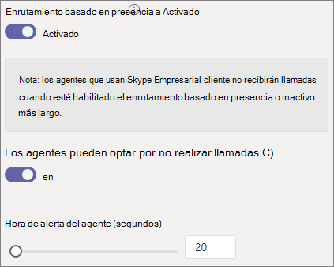

# Crear una cola de llamadas: tutorial para pequeñas empresas

Las colas de llamadas proporcionan un método para enrutar a los autores de llamadas a personas de su organización que pueden ayudarle con un problema o pregunta en particular. Las llamadas se distribuyen de una en una a las personas de la cola (que se conocen como *agentes).* 

Las colas de llamadas proporcionan:

- Un mensaje de saludo.

- Música mientras los usuarios están en espera en una cola.

- Enrutamiento de llamadas, *en orden de primero en entrada,* orden first out (FIFO), a agentes.

- Opciones de control para el desbordamiento de la cola y el tiempo de espera.

#### Antes de comenzar

Obtener algunas [licencias de Sistema telefónico: Usuario](../teams-add-on-licensing/virtual-user.md) virtual si aún no las tiene. Obtenga una para cada cola de llamadas y operador automático que planee configurar. Estas licencias son gratuitas, por lo que le recomendamos que le ofrecemos unas cuantas adicionales en caso de que decida realizar cambios en su configuración en el futuro.

Como los agentes de una cola de llamadas pueden llamar para devolver una llamada del cliente, considere la posibilidad de establecer el identificador de llamada de los agentes de llamadas en el número de teléfono principal o en el número de un operador automático adecuado. Vea [Administrar directivas de identificador de llamada en Microsoft Teams](../caller-id-policies.md) para obtener más información.

#### Siga estos pasos para configurar la cola de llamadas

# [Paso   1: Crear un equipo](#tab/create-team)

Al crear una cola de llamadas, puede agregar usuarios individuales a la cola o puede usar un grupo de seguridad existente, un grupo de Microsoft 365 o un equipo de Microsoft Teams. Se recomienda usar un equipo. Esto permite a los miembros de la cola chatear entre sí, compartir ideas y crear documentos u otros recursos para ayudarles a ayudar a sus clientes. Un equipo también proporciona un buzón de voz para que los autores de llamadas dejen un mensaje fuera del horario laboral o si la cola alcanza su capacidad máxima.

Para crear un equipo

1. En primer lugar, haga clic en **Teams** en el lado izquierdo de la aplicación y, a continuación, haga clic en Unirse o crear **un** equipo en la parte inferior de la lista de equipos.

2. A **continuación, haga clic en Crear** equipo (primera tarjeta, esquina superior izquierda).

3. Elija **Crear un equipo desde cero.**

4. A continuación, elija si desea un equipo público o privado. Se recomienda **Privado para** la cola de llamadas para evitar que los usuarios se conviertan en parte de la cola involuntaramente uniéndose al equipo.

5. Asigne un nombre a su equipo y agregue una descripción opcional.

6. Cuando haya terminado, haga clic en **Crear.**

8. Escriba los nombres de las personas que desea que tengan en la cola de llamadas y, a continuación, haga clic en **Agregar.**

9. Haga clic en **Cerrar**. Las personas que agregue a un equipo recibirán un correo electrónico para hacerles saber que ahora son miembros del equipo y el equipo aparecerá en su lista de equipos.

> [!div class="nextstepaction"]
> [Paso 2: Las cuentas de recursos >](https://review.docs.microsoft.com/microsoftteams/business-voice/create-a-phone-system-call-queue-smb?branch=mikeplum-smb-voice&tabs=resource-account#steps)

# [Paso   2: Cuentas de recursos](#tab/resource-account)

Cada cola de llamadas que cree necesita una cuenta de recurso. Esto es similar a una cuenta de usuario, excepto que la cuenta está asociada a un operador automático o a una cola de llamadas en lugar de a una persona. En este paso, crearemos la cuenta, le asignaremos una licencia de Sistema telefónico de *Microsoft 365:* usuario virtual y, a continuación, la usaremos para empezar a crear la cola de llamadas.

### Crear una cuenta de recurso

Puede crear una cuenta de recurso en el Centro de administración de Teams.

1. En el Centro de administración de Teams, expanda **la configuración de toda la** organización y, a continuación, haga clic en Cuentas de **recursos.**

2. Haga clic en **Agregar**.

3. En el **panel Agregar cuenta de** recurso, rellene **Nombre** para **mostrar,** Nombre de usuario y elija Cola de **llamadas** para el tipo de cuenta **de recursos.**

    

4. Haga clic en **Guardar**.

La nueva cuenta aparecerá en la lista de cuentas.

### Asignar una licencia

Debe asignar una licencia *de Microsoft 365 Phone System - Virtual User* a la cuenta de recursos.

1. En el Centro de administración de Microsoft 365, haga clic en la cuenta de recursos a la que desea asignar una licencia.

2. En la **pestaña Licencias y aplicaciones,** en **Licencias,** seleccione Sistema telefónico de **Microsoft 365 - Usuario virtual.**

3. Haga clic **en Guardar cambios.**

    

### Crear una cola de llamada

A continuación, empezaremos a crear una cola de llamadas y asignaremos la cuenta de recursos.

1. En el Centro de administración de Teams, expanda **Voz,** haga clic en **Colas de** llamadas y, a continuación, haga clic **en Agregar.**

1. Escriba un nombre para la cola de llamadas. Los agentes verán este nombre cuando reciban una llamada entrante de la cola.

2. Haga **clic en Agregar** cuentas, busque la cuenta de recursos que desea usar con esta cola de llamadas, haga clic en Agregar y, a continuación, haga clic en **Agregar.** 

3. Elige un idioma. Este idioma se usará para los mensajes de voz generados por el sistema y la transcripción del correo de voz (si los habilita).

    

4. Especifique si quiere reproducir un saludo a los autores de llamadas cuando lleguen a la cola. Debe cargar un archivo MP3, WAV o WMA que contenga el saludo que quiere reproducir.

5. Teams proporciona música predeterminada a los autores de llamadas mientras están en espera en una cola. Si desea reproducir un archivo de audio específico, elija Reproducir un archivo de **audio** y cargue un archivo MP3, WAV o WMA.

> [!NOTE]
> La grabación cargada no puede tener un tamaño superior a 5 MB.
> La música predeterminada que se proporciona en las colas de llamadas de Teams no tiene que pagar regalías por su organización. 

> [!div class="nextstepaction"]
> [Paso 3: Llamar a agentes >](https://review.docs.microsoft.com/microsoftteams/business-voice/create-a-phone-system-call-queue-smb?branch=mikeplum-smb-voice&tabs=call-agents#steps)

# [Paso 3:   agentes de llamadas](#tab/call-agents)

Para agregar agentes a la cola de llamadas, agregaremos el equipo que hemos creado anteriormente.

1. Haga clic **en Agregar grupos.**
2. Escriba el nombre del equipo que creó.
3. Haga **clic en Agregar** y, a continuación, en **Agregar.**

    

Puede agregar hasta 20 agentes de forma individual y hasta 200 agentes a través de grupos o equipos.

> [!NOTE]
> Cuando se agregan nuevos usuarios al equipo, la primera llamada puede tardar hasta ocho horas en llegar.

> [!div class="nextstepaction"]
> [Paso 4: Las cuentas de recursos >](https://review.docs.microsoft.com/microsoftteams/business-voice/create-a-phone-system-call-queue-smb?branch=mikeplum-smb-voice&tabs=call-routing#steps)

# [Paso 4:   Enrutamiento de llamadas](#tab/call-routing)

Elija el método de enrutamiento de llamadas que quiera usar.

1. Establecer **el modo de conferencia** en **Automático.**

2. Elija el **método de enrutamiento** que desea usar. Esto determina el orden en que los agentes reciben llamadas de la cola. Se recomienda enrutamiento **en serie o** round **robin.** Elija una de estas opciones:

    - **El enrutamiento del operador** suena a todos los agentes de la cola al mismo tiempo. El primer agente de llamada que recibe la llamada recibe la llamada.

    - **El enrutamiento en** serie suena a todos los agentes de llamadas uno por uno. Si un agente descarta o no acepta una llamada, la llamada llamará al siguiente agente y probará con todos los agentes hasta que se le llame o se le atende el tiempo de espera.

    - **Redondear robin** equilibra el enrutamiento de las llamadas entrantes para que cada agente de llamadas reciba el mismo número de llamadas de la cola. Esto puede ser deseable en un entorno de ventas entrantes para garantizar la misma oportunidad entre todos los agentes de llamadas.

    - **La inactividad más** larga enruta cada llamada al agente que haya estado inactivo más tiempo. (No se incluyen agentes cuyo estado de presencia haya estado durante más de 10 minutos).

    

3. Active **el enrutamiento basado en** presencia. De esta forma se enruta las llamadas a agentes cuyo estado de presencia sea **Disponible.**

4. Elija si desea permitir que los agentes no puedan participar en las llamadas.

5. Establezca una **hora de alerta de agente** para especificar cuánto tiempo sonará el teléfono de un agente antes de que la cola redirija la llamada al siguiente agente.

    

> [!div class="nextstepaction"]
> [Paso 5: desbordamiento de llamadas >](https://review.docs.microsoft.com/microsoftteams/business-voice/create-a-phone-system-call-queue-smb?branch=mikeplum-smb-voice&tabs=call-overflow#steps)

# [Paso   5: desbordamiento de llamadas](#tab/call-overflow)

Elija cómo quiere administrar las llamadas que superan el máximo de la cola.

1. Establezca el **número máximo de llamadas en la cola.**

2. Elija qué desea hacer cuando se alcanza el número máximo de llamadas. Puede desconectar la llamada o redirigirla. Le recomendamos redirigir la llamada a uno de los siguientes destinos:
    - **Persona de la organización:** una persona de la organización que puede recibir llamadas de voz
    - **Aplicación de voz:** un operador automático u otra cola de llamadas. (Elija la cuenta de recurso asociada al operador automático o la cola de llamadas al elegir este destino).
    - **Número de teléfono externo:** cualquier número de teléfono. Use este formato: +[código de país][código de área][número de teléfono]
    - **Correo** de voz: puede usar el buzón de voz del equipo que creó.

    

> [!div class="nextstepaction"]
> [Paso 6: tiempo de espera de llamada >](https://review.docs.microsoft.com/microsoftteams/business-voice/create-a-phone-system-call-queue-smb?branch=mikeplum-smb-voice&tabs=call-timeout#steps)

# [Tiempo de espera de la llamada del paso 6  ](#tab/call-timeout)

Elija lo que quiere que suceda cuando las llamadas hayan estado en la cola demasiado tiempo.

1. Establezca el tiempo **de espera de la llamada: tiempo de espera máximo.**

2. Elija lo que desea hacer cuando se resalte el tiempo de espera de una llamada. Puede desconectar la llamada o redirigirla. Le recomendamos redirigir la llamada a uno de los siguientes destinos:
    - **Persona de la organización:** una persona de la organización que puede recibir llamadas de voz
    - **Aplicación de voz:** un operador automático u otra cola de llamadas. (Elija la cuenta de recursos asociada con el operador automático o la cola de llamadas al elegir este destino).
    - **Número de teléfono externo:** cualquier número de teléfono. Use este formato: +[código de país][código de área][número de teléfono]
    - **Correo** de voz: puede usar el buzón de voz del equipo que creó.

    

3. Haga clic en **Guardar**.

Con esto se completará la configuración de la cola de llamadas. A continuación, es posible que desee [configurar un operador automático.](create-a-phone-system-auto-attendant-smb.md)

---

