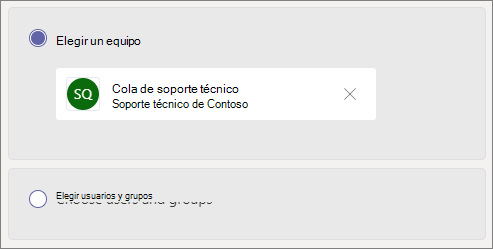

# Crear una cola de llamadas: tutorial para pequeñas empresasCreate a call queue - small business tutorial

Las colas de llamadas proporcionan un método para enrutamiento de autores de llamadas a personas de la organización que pueden ayudarle con un problema o pregunta en particular.Call queues provide a method of routing callers to people in your organization who can help with a particular issue or question. Las llamadas se distribuyen de una en una a las personas que están en la cola (que se denominan *agentes*).Calls are distributed one at a time to the people in the queue (who are known as *agents*). 

Las colas de llamadas proporcionan:Call queues provide:

- Un mensaje de saludo.A greeting message.

- Música que se reproduce mientras los usuarios se mantienen a la espera.Music while people are waiting on hold in a queue.

- Enrutamiento de llamadas *Primera en llegar, primera en salir* (FIFO),en la orden para los agentes.Call routing - in *First In, First Out* (FIFO) order - to agents.

- Opciones de gestión del desbordamiento de la cola y del tiempo de espera.Handling options for queue overflow and timeout.

#### Antes de empezarBefore you begin

Obtener algunas [licencias del sistema telefónico: licencias](../teams-add-on-licensing/virtual-user.md) de usuario virtual si aún no las tiene.Get some [Phone System - Virtual User licenses](../teams-add-on-licensing/virtual-user.md) if you don't already have them. Obtenga una por cada cola de llamadas y operador automático que tiene previsto configurar.Get one for each call queue and auto attendant that you plan to set up. Estas licencias son gratuitas, por lo que le recomendamos obtener algunas adicionales en caso de que decida realizar cambios en su configuración en el futuro.These licenses are free, so we suggest getting a few extra in case you decide to make changes to your setup in the future.

Puesto que los agentes de una cola de llamadas pueden llamar para devolver una llamada de cliente, considere la posibilidad de establecer el identificador de llamada de los agentes de llamada en su número de teléfono principal o el número de un operador automático adecuado.Since agents in a call queue may dial out to return a customer call, consider setting the caller ID for your call agents to your main phone number or the number of an appropriate auto attendant. Consulte [administrar las directivas de identificador de llamada en Microsoft Teams](../caller-id-policies.md) obtener más información.See [Manage caller ID policies in Microsoft Teams](../caller-id-policies.md) for more information.

#### Siga estos pasos para configurar la cola de llamadasFollow these steps to set up your call queue

# [Paso 1   Crear un equipoStep 1 Create a team](#tab/create-team)

Al crear una cola de llamadas, puede agregar usuarios individuales a la cola o puede usar un grupo de seguridad existente, un grupo de Microsoft 365 o un equipo de Microsoft Teams.When creating a call queue, you can add individual users to the queue, or you can use an existing security group, Microsoft 365 group, or Microsoft Teams team. Se recomienda [usar un canal de grupo.](https://support.microsoft.com/office/9f07dabe-91c6-4a9b-a545-8ffdddd2504e)We recommend [using a team channel](https://support.microsoft.com/office/9f07dabe-91c6-4a9b-a545-8ffdddd2504e). Esto permite a los miembros de la cola chatear entre sí, compartir ideas y crear documentos u otros recursos para ayudarles a ayudar a sus clientes.This allows members of the queue to chat with each other, share ideas, and create documents or other resources to help them help your customers. Un equipo también proporciona un buzón de voz para que los autores de llamadas dejen un mensaje fuera del horario laboral o si la cola alcanza su capacidad máxima.A team also provides a voice mailbox for callers to leave a message after hours or if the queue reaches its maximum capacity.

Para crear un equipoTo create a team

1. En primer lugar, haga clic en **Teams** en el lado izquierdo de la aplicación y, a continuación, haga clic en Unirse **o crear un** equipo en la parte inferior de la lista de equipos.First, click **Teams** on the left side of the app, then click **Join or create a team** at the bottom of your teams list.

2. A **continuación, haga** clic en Crear equipo (primera tarjeta, esquina superior izquierda).Then click **Create team** (first card, top left corner).

3. Elija **Crear un equipo desde cero.**Choose **Build a team from scratch**.

4. A continuación, elija si desea un equipo público o privado.Next, choose whether you want a public or private team. Recomendamos **Privado para** la cola de llamadas para evitar que los usuarios se conviertan involuntaramente en parte de la cola uniéndose al equipo.We recommend **Private** for your call queue to avoid people unintentionally becoming part of the queue by joining the team.

5. Asigne un nombre al equipo y agregue una descripción opcional.Name your team and add an optional description.

6. Cuando haya terminado, haga clic en **Crear**.When you're done, click **Create**.

8. Escriba los nombres de las personas que desea tener en la cola de llamadas y, a continuación, haga clic en **Agregar.**Type the names of the people that you want to have in your call queue, and then click **Add**.

9. Haga clic en **Cerrar**.Click **Close**. Las personas que agregue a un equipo recibirán un correo electrónico para que sepan que ahora son miembros de su equipo y que el equipo aparecerá en su lista de equipos.People you add to a team will receive an email letting them know they are now a member of your team and the team will show up in their teams list.

A continuación, agregaremos un canal para usarlo con la cola de llamadas.Next, we'll add a channel to use with the call queue.

Para agregar un canalTo add a channel

1. En Teams, busque el equipo que acaba de crear, haga clic en **Más opciones** (...)y, a continuación, haga clic en **Agregar canal.**In Teams, find the team you just created, click **More options** (...), and then click **Add channel**.

2. Escriba un nombre y una descripción para el canal y, a continuación, haga clic en **Agregar**.Type a name and description for the channel, and then click **Add**.

> [!div class="nextstepaction"]
> [Paso 2: Cuentas de recursos >Step 2 - Resource accounts >](/microsoftteams/business-voice/create-a-phone-system-call-queue-smb?tabs=resource-account#steps)

# [Paso 2   Cuentas de recursosStep 2 Resource accounts](#tab/resource-account)

Cada cola de llamadas que cree requiere una cuenta de recursos.Each call queue that you create requires a resource account. Esto es similar a una cuenta de usuario, excepto que la cuenta está asociada con un operador automático o una cola de llamadas en lugar de una persona.This is similar to a user account, except the account is associated with an auto attendant or call queue instead of a person. En este paso, crearemos la cuenta, le asignaremos una licencia de *Microsoft 365 Phone System - Virtual User* y, a continuación, la usaremos para empezar a crear la cola de llamadas.In this step, we'll create the account, assign it a *Microsoft 365 Phone System - Virtual User* license, and then use it to start creating the call queue.

### Crear una cuenta de recursosCreate a resource account

Puede crear una cuenta de recursos en el Centro de administración de Teams.You can create a resource account in the Teams admin center.

1. En el Centro de administración de Teams, expanda **Configuración de toda la organización** y, a continuación, haga clic en Cuentas de **recursos.**In the Teams admin center, expand **Org-wide settings**, and then click **Resource accounts**.

2. Haga clic en **Agregar**.Click **Add**.

3. En el **panel Agregar cuenta de** recursos, rellene **Nombre** para mostrar, **Nombre** de usuario y elija Cola **de llamadas** para el tipo de **cuenta Recurso.**In the **Add resource account** pane, fill out **Display name**, **Username**, and choose **Call queue** for the **Resource account type**. Los agentes verán el nombre para mostrar cuando reciban una llamada entrante desde la cola.Agents will see the display name when they receive an incoming call from the queue.

    

4. Haga clic en **Guardar**.Click **Save**.

   La nueva cuenta aparecerá en la lista de cuentas.The new account will appear in the list of accounts.

   

### Asignar una licenciaAssign a license

Debe asignar una licencia de Usuario virtual de *Microsoft 365 Phone System* a la cuenta de recursos.You must assign a *Microsoft 365 Phone System - Virtual User* license to the resource account.

1. En el Centro de administración de  Microsoft 365, en la lista Usuarios activos, haga clic en la cuenta de recursos a la que desea asignar una licencia.In the Microsoft 365 admin center, in the **Active users** list, click the resource account to which you want to assign a license.

2. En la **pestaña Licencias y aplicaciones,** en **Licencias,** seleccione **Microsoft 365 Phone System - Usuario virtual.**On the **Licenses and Apps** tab, under **Licenses**, select **Microsoft 365 Phone System - Virtual User**.

3. Haga clic **en Guardar cambios.**Click **Save changes**.

    

### Crear una cola de llamadaCreate a call queue

A continuación, empezaremos a crear una nueva cola de llamadas y asignaremos la cuenta de recursos.Next, we'll start creating a new call queue and assign the resource account.

1. En el Centro de administración de Teams, expanda **Voz,** haga clic en **Colas de** llamadas y, a continuación, haga clic **en Agregar.**In the Teams admin center, expand **Voice**, click **Call queues**, and then click **Add**.

1. Escriba un nombre descriptivo para la cola.Type a name for the call queue.

2. Haga clic en **Agregar cuentas**, busque la cuenta de recursos que desea usar con esta cola de llamadas, haga clic en **Agregar** y, después, haga clic en **Agregar**.Click **Add accounts**, search for the resource account that you want to use with this call queue, click **Add**, and then click **Add**.

3. Elegir un idiomaChoose a language. Este idioma se usará para los mensajes de voz generados por el sistema y la transcripción de correo de voz (si las habilita).This language will be used for system-generated voice prompts and voicemail transcription (if you enable them).

    

4. Especifique si quiere reproducir un saludo a los autores de llamadas cuando lleguen a la cola.Specify if you want to play a greeting to callers when they arrive in the queue. Debe cargar un archivo MP3, WAV o WMA que contenga el saludo que desea reproducir.You must upload an MP3, WAV, or WMA file containing the greeting that you want to play.

5. Los equipos proporcionan música predeterminada a los autores de llamadas mientras están en espera en una cola.Teams provides default music to callers while they are on hold in a queue. Si desea reproducir un archivo de audio específico, elija **Reproducir un archivo de audio en** y cargar un archivo MP3, WAV o WMA.If you want to play a specific audio file, choose **Play an audio file** and upload an MP3, WAV, or WMA file.

   > [!NOTE]
   > La grabación cargada no puede ser superior a 5 MB.The uploaded recording can be no larger than 5 MB.
   > La música predeterminada que se proporciona en las colas de llamadas de Teams no tiene que pagar ningún pago de la organización.The default music supplied in Teams call queues is free of any royalties payable by your organization. 

> [!div class="nextstepaction"]
> [Paso 3: llamar a agentes >Step 3 - Call agents >](/microsoftteams/business-voice/create-a-phone-system-call-queue-smb?tabs=call-agents#steps)

# [Paso 3   Llamar a agentesStep 3 Call agents](#tab/call-agents)

Para agregar agentes a la cola de llamadas, los agregaremos al equipo y al canal que creamos anteriormente.To add agents to the call queue, we'll add them to the team and channel that we created earlier.

1. Seleccione la **opción Elegir un equipo** y haga clic en Agregar un **canal.**Select the **Choose a team** option and click **Add a channel**.
2. Escriba el nombre del equipo que creó, selecciónelo y haga clic en **Agregar**.Type the name of the team that you created, select it, and click **Add**.
3. Seleccione el canal que creó para la cola.Select the channel that you created for the queue.
3. Haga clic en **Aplicar**.Click **Apply**.

    

> [!NOTE]
> Cuando se agregan nuevos usuarios al equipo, la primera llamada puede tardar hasta ocho horas en llegar.When new users are added to the team, it can take up to eight hours for their first call to arrive.

> [!div class="nextstepaction"]
> [Paso 4: Cuentas de recursos >Step 4 - Resource accounts >](/microsoftteams/business-voice/create-a-phone-system-call-queue-smb?tabs=call-routing#steps)

# [Paso 4   Enrutamiento de llamadasStep 4 Call routing](#tab/call-routing)

Elija el método de enrutamiento de llamadas que desea usar.Choose the call routing method that you want to use.

1. Establecer **el modo de conferencia** en **Auto**.Set **Conference mode** to **Auto**.

2. Elija el **método de enrutamiento** que desea usar.Choose the **Routing method** you want to use. Esto determina el orden en que los agentes reciben llamadas de la cola.This determines the order in which agents receive calls from the queue. Se recomienda **Enrutamiento en serie** o **Redondear.**We recommend **Serial routing** or  **Round robin**. Elija una de estas opciones:Choose from these options:

    - **El enrutamiento de operador** hace una llamada a todos los agentes en la cola al mismo tiempo.**Attendant routing** rings all agents in the queue at the same time. El primer agente de llamada que tome la llamada la recibe.The first call agent to pick up the call gets the call.

    - **El enrutamiento en** serie llama a todos los agentes de llamada uno por uno.**Serial routing** rings all call agents one by one. Si un agente desestima o no contesta una llamada, se realizará una llamada al siguiente agente y se intentará con todos los agentes hasta que la llamada sea contestada o se agote el tiempo de espera.If an agent dismisses or does not pick up a call, the call will ring the next agent and will try all agents until it is picked up or times out.

    - **Distribución equilibrada** equilibra el enrutamiento de llamadas entrantes para que cada agente de llamadas reciba el mismo número de llamadas de la cola.**Round robin** balances the routing of incoming calls so that each call agent gets the same number of calls from the queue. Esto puede ser deseable en un entorno de ventas de entrada para asegurar la misma oportunidad entre todos los agentes de llamada.This may be desirable in an inbound sales environment to assure equal opportunity among all the call agents.

    - **Inactividad mayor** dirige cada llamada al agente que ha estado inactivo por más tiempo.**Longest idle** routes each call to the agent who has been idle the longest time. (No se incluyen agentes cuyo estado de presencia ha estado fuera durante más de 10 minutos).(Agents whose presence state has been Away for more than 10 minutes are not included.)

    

3. Active **el enrutamiento basado en presencia.**Turn **Presence-based routing** on. Esto enruta las llamadas a agentes cuyo estado de presencia es **Disponible.**This routes calls to agents whose presence status is **Available**.

4. Elija si desea permitir que los agentes no puedan realizar llamadas.Choose if you want to allow agents to opt out of calls.

5. Establezca una **hora de alerta del agente** para especificar cuánto tiempo sonará el teléfono de un agente antes de que la cola redirija la llamada al siguiente agente.Set an **Agent alert time** to specify how long an agent's phone will ring before the queue redirects the call to the next agent.

    

> [!div class="nextstepaction"]
> [Paso 5: desbordamiento de llamadas >Step 5 - Call overflow >](/microsoftteams/business-voice/create-a-phone-system-call-queue-smb?tabs=call-overflow#steps)

# [Paso 5   Desbordamiento de llamadasStep 5 Call overflow](#tab/call-overflow)

Elija cómo desea controlar las llamadas que superan el máximo de la cola.Choose how you want to handle calls that exceed the maximum in the queue.

1. Establezca el **valor Máximo de llamadas en la cola.**Set the **Maximum calls in the queue**.

2. Elija lo que desea hacer cuando se alcance el número máximo de llamadas.Choose what you want to do when the maximum number of calls is reached. Puede desconectar la llamada o redirigirla.You can disconnect the call or redirect it. Se recomienda redirigir la llamada a uno de los siguientes destinos:We recommend that you redirect the call to one of the following destinations:
    - **Persona de la organización:** una persona de su organización que puede recibir llamadas de voz**Person in the organization** - a person in your organization who is able to receive voice calls
    - **Aplicación de voz:** un operador automático u otra cola de llamadas.**Voice app** - an auto attendant or another call queue. (Elija la cuenta de recursos asociada con el operador automático o la cola de llamadas al elegir este destino).(Choose the resource account associated with the auto attendant or call queue when choosing this destination.)
    - **Número de teléfono externo:** cualquier número de teléfono.**External phone number** - any phone number. Use este formato: +[código de país][código de área][número de teléfono]Use this format: +[country code][area code][phone number]
    - **Correo** de voz: puede usar el buzón de voz del equipo que ha creado.**Voicemail** - you can use the voice mailbox of the team that you created.

    

> [!div class="nextstepaction"]
> [Paso 6: tiempo de espera de la llamada >Step 6 - Call timeout >](/microsoftteams/business-voice/create-a-phone-system-call-queue-smb?tabs=call-timeout#steps)

# [Paso 6   Tiempo de espera de llamadaStep 6 Call timeout](#tab/call-timeout)

Elija lo que desea que suceda cuando las llamadas hayan estado esperando en la cola durante demasiado tiempo.Choose what you want to happen when calls have been waiting in the queue for too long.

1. Establecer el **tiempo de espera máximo**.Set the **Maximum wait time**.

2. Elija lo que desea hacer cuando se resalte el tiempo de espera de una llamada. Puede desconectar la llamada o redirigirla.Choose what you want to do when a call times out. You can disconnect the call or redirect it. Se recomienda redirigir la llamada a uno de los siguientes destinos:We recommend that you redirect the call to one of the following destinations:
    - **Persona de la organización:** una persona de su organización que puede recibir llamadas de voz**Person in the organization** - a person in your organization who is able to receive voice calls
    - **Aplicación de voz:** un operador automático u otra cola de llamadas.**Voice app** - an auto attendant or another call queue. (Elija la cuenta de recursos asociada con el operador automático o la cola de llamadas al elegir este destino).(Choose the resource account associated with the auto attendant or call queue when choosing this destination.)
    - **Número de teléfono externo:** cualquier número de teléfono.**External phone number** - any phone number. Use este formato: +[código de país][código de área][número de teléfono]Use this format: +[country code][area code][phone number]
    - **Correo** de voz: puede usar el buzón de voz del equipo que ha creado.**Voicemail** - you can use the voice mailbox of the team that you created.

    

3. Haga clic en **Guardar**.Click **Save**.

Esto completa la configuración de la cola de llamadas.This completes the setup of your call queue. A continuación, es posible que desee [configurar un operador automático.](create-a-phone-system-auto-attendant-smb.md)Next, you may want to [set up an auto attendant](create-a-phone-system-auto-attendant-smb.md).

---

