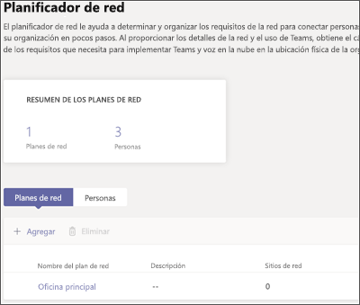
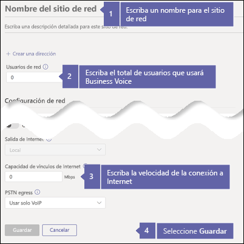
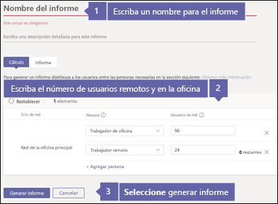
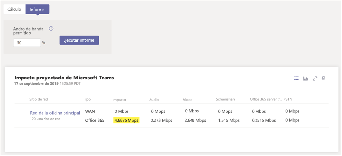
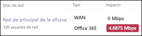

# Compruebe la conexión a Internet para Business Voice

Business Voice se encuentra en la nube con Microsoft 365. Todos los dispositivos que usan Microsoft Teams y Business Voice necesitan una conexión a Internet.

Para obtener la mejor experiencia de Business Voice, necesita una conexión a Internet de banda ancha que pueda admitir el máximo número de llamadas telefónicas que su organización podría realizar en cualquier momento. También debe asegurarse de que los equipos de la red pueden conectarse con los servidores de Microsoft 365.

Para seguir estos pasos, debe tener un espacio empresarial con una de las siguientes suscripciones:

* Microsoft 365 Empresa Básico
* Microsoft 365 Empresa Estándar
* Office 365 E1
* Office 365 E3
* Office 365 F1
* Microsoft 365 A1
* Microsoft 365 A3
* Microsoft 365 E3
* Microsoft 365 Empresa

No necesita una licencia de Business Voice para seguir estos pasos.

## Compruebe la velocidad de la conexión a Internet

Este artículo le ayudará a determinar si la conexión a Internet es lo suficientemente rápida para el número de personas que necesitan realizar llamadas telefónicas y hospedar videoconferencias. Proporcionará información sobre su organización y recibirá un informe que muestra qué cantidad de su conexión a Internet será usada por Teams y Business Voice.

### Recopila información sobre la conexión a Internet y los usuarios

Antes de empezar, necesita la siguiente información:

* La velocidad de la conexión a Internet
* El número de personas que usará Business Voice, principalmente desde su oficina
* El número de personas que usará Business Voice principalmente desde una ubicación remota, por ejemplo, una oficina en casa

### Escriba su información en el planificador de red

Siga estos pasos:

1. En un explorador, vaya a https://admin.teams.microsoft.com. Inicie sesión con una cuenta que tenga permisos de Administrador global. La cuenta que usó para conectarse a Office 365 tiene estos permisos.
2. Abra **Planificación** y seleccione **Planeamiento de red**.
3. En **Planes de red**, seleccione **Agregar**. Escriba un nombre para su plan y después, seleccione **Aplicar**. El plan de red debe tener el siguiente aspecto:

    
1. Seleccione el nombre de su plan de red. (Es la **Oficina principal** en la imagen anterior).
2. En la página siguiente, seleccione **Agregar un sitio de red** en la pestaña **Sitios de red**.
3. Rellene solo los campos que se indican en la siguiente captura de pantalla y después, seleccione **Guardar**. Deje en blanco los otros campos en esta pantalla y no active las opciones **ExpressRoute** o **Conectado a WAN**.

    
1. En la pestaña **Informe**, seleccione **Iniciar un informe**.
1. Escriba la siguiente información y después, seleccione **Generar informe** para crear un informe que muestre los requisitos de ancho de banda para Teams. En la siguiente sección se muestra cómo leer el informe.

    

### Averigüe cuál es la velocidad mínima de la conexión a Internet

Cuando selecciona **Generar informe**, Office 365 crea un informe similar a este:

El número resaltado muestra qué proporción de su conexión a Internet usarán Teams y Business Voice. Se recomienda que este número no supere el 30 por ciento de la velocidad total de conexión a Internet. Por ejemplo, si su conexión a Internet es de 60 Mbps, Teams y Business Voice no deberían usar más de 18 Mbps.

Use esta ecuación para determinar la velocidad mínima de conexión a Internet: *\<número resaltado> / 0,3*. Con el número que está resaltado en la imagen anterior, el cálculo es *4,6875 / 0,3 = 15,6*. En este caso, la velocidad de la conexión a Internet debe ser al menos de 15,6 Mbps.

Si Teams y Business Voice usarán más de un 30 por ciento de la velocidad total de conexión a Internet, el número resaltado aparecerá en rojo. En ese caso, es posible que tenga que actualizar la conexión a Internet.

## Asegúrese de que los equipos y dispositivos de su red puedan conectarse a Microsoft 365

Los equipos y dispositivos que usan Business Voice deben usar puertos de red específicos para comunicarse con los servidores de Microsoft 365. Estos puertos de red son, esencialmente, puertas a través de las que los dispositivos se comunican entre ellos a través de la red o Internet. El firewall necesita permitir que los dispositivos de la red lleguen a Microsoft 365 mediante los siguientes puertos de red de *salida*:

* **Puertos TCP** 80 y 443
* **Puertos UDP** 3478, 3479, 3480 y 3481

La forma más sencilla de comprobar si el firewall permite la comunicación en estos puertos de red es realizar una llamada de prueba en Teams:

1. Vaya a https://aka.ms/getteams en un equipo de la red e instale Teams. Asegúrese de que el equipo tiene altavoces y un micrófono.
2. Abra Teams e inicie sesión con una cuenta de Microsoft 365.
3. En Teams, seleccione su imagen de perfil y después, vaya a **Configuración** > **Dispositivos**.
4. En **Dispositivos de audio**, seleccione **Hacer una llamada de prueba**.
5. Siga los pasos para dejar un mensaje y reproducirlo.

   * Si la llamada se conecta y escucha su mensaje, significa que el firewall está configurado correctamente.
   * Si la llamada se conecta pero no puede escuchar las instrucciones o su mensaje, asegúrese de que los altavoces y el micrófono estén configurados correctamente y vuelva a intentarlo.
   * Si la llamada no se conecta o si lo hace pero no escucha su mensaje, es posible que necesite actualizar el firewall para permitir el acceso a los puertos de red necesarios. Consulte la documentación del firewall o póngase en contacto con un especialista de TI para obtener ayuda.

 Si es un profesional de TI y desea obtener más información sobre cómo preparar redes más grandes o más complejas para que sean compatibles con Business Voice, consulte [Evaluar mi entorno](../3-envision-evaluate-my-environment.md). Este artículo proporciona información sobre los requisitos de ancho de banda, proxy y firewall, y sobre cómo usar la [Herramienta de evaluación de red](../3-envision-evaluate-my-environment.md#test-the-network) para probar la red.

