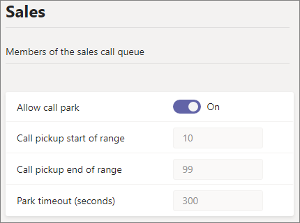

# Estacionamiento y recuperación de llamadas en Microsoft Teams

Parque de llamadas y recuperación es una característica que permite a un usuario realizar una llamada en espera. Cuando una llamada está estacionada, el servicio genera un código único para la recuperación de llamadas. El usuario que estacionó la llamada u otra persona puede usar ese código con una aplicación o dispositivo compatible para recuperar la llamada. (Vea [Estacionar una llamada en Teams](https://support.office.com/article/park-a-call-in-teams-8538c063-d676-4e9a-8045-fc3b7299bb2f) para obtener más información).

Algunos de los escenarios comunes para usar el parque de llamadas son:

- Un recepcionista aparca una llamada para alguien que trabaja en una fábrica. A continuación, el recepcionista anunciará la llamada y el número de código a través del sistema de direcciones públicas. A continuación, el usuario para el que se llama puede recoger un teléfono Teams en el piso de fábrica y escribir el código para recuperar la llamada.
- Un usuario aparca una llamada en un dispositivo móvil porque la batería del dispositivo se está quedando sin energía. A continuación, el usuario puede escribir el código para recuperar la llamada desde un Teams de escritorio.
- Un representante de soporte técnico aparca una llamada de cliente y envía un anuncio en un canal de Teams para que un experto recupere la llamada y ayude al cliente. Un experto escribe el código en Teams clientes para recuperar la llamada

Para estacionar y recuperar llamadas, un usuario debe ser Telefonía IP empresarial usuario y debe incluirse en una directiva de parque de llamadas.

> [!NOTE]
> El parque de llamadas y la recuperación solo [está disponible Teams](teams-and-skypeforbusiness-coexistence-and-interoperability.md) modo de implementación y no se admite en Skype Empresarial teléfonos IP.

## Configurar el parque de llamadas y recuperar

Debe ser un administrador Teams configurar el parque de llamadas y recuperarlo. Está deshabilitado de forma predeterminada. Puede habilitarlo para los usuarios y crear grupos de usuarios con la directiva de parque de llamadas. Al aplicar la misma directiva a un conjunto de usuarios, pueden estacionar y recuperar llamadas entre ellos.

El rango de números de recogida de llamadas está predefinido entre 10 y 99 y no se puede modificar. La primera llamada estacionada se representará con un código de recogida de 10, la siguiente llamada estacionada se representará con un código de recogida de 11, etc. hasta que 99 se represente como un código de recogida. Después de lo cual, los códigos de recogida representados comienzan de nuevo a partir de las 10.  Si hay más de 89 llamadas activas aparcados, los códigos de recogida representados seguirán incrementándose más allá de 99, de modo que la 90.ª llamada activa estacionada se representaría en 100 para un código de recogida, la llamada activa 91 se representaría en un código de recogida de 101.

Para habilitar una directiva de parque de llamadas

1. En el panel de navegación izquierdo del Microsoft Teams de administración, vaya a Directivas de **parque**  >  **de llamadas de voz.**
2. En la **pestaña Administrar directivas,** haga clic en **Agregar.**
3. Asigne un nombre a la directiva y, a continuación, cambie **Permitir parque de llamadas** a **Activar**. (El intervalo de recogida de llamadas y el tiempo de espera no se pueden personalizar).

    

4. Seleccione **Guardar**.

Para editar la directiva, selecciónelo en la lista y haga clic en **Editar.**

Para que la directiva funcione, debe asignarse a los usuarios. Puede asignar [la directiva a los usuarios individualmente](assign-policies.md) o asignarla a un grupo.

Para asignar una directiva de parque de llamadas a un grupo

1. En la página **Directivas de parque de** llamadas, en la pestaña **Asignación de** directivas de grupo, haga clic en Agregar **grupo.**
2. Busque el grupo que desea usar y, a continuación, haga clic en **Agregar**.
3. Elija una clasificación en comparación con otras asignaciones de grupo.
4. En **Seleccionar una directiva,** elija la directiva a la que desea asignar este grupo.

    

5. Seleccione **Aplicar**.

## Temas relacionados

[Estacione una llamada en Teams](https://support.office.com/article/park-a-call-in-teams-8538c063-d676-4e9a-8045-fc3b7299bb2f)

[Asignar directivas a los usuarios en Teams](assign-policies.md)

[New-CsTeamsCallParkPolicy](/powershell/module/skype/new-csteamscallparkpolicy?view=skype-ps)

[Set-CsTeamsCallParkPolicy](/powershell/module/skype/set-csteamscallparkpolicy?view=skype-ps)

[Grant-CsTeamsCallParkPolicy](/powershell/module/skype/grant-csteamscallparkpolicy?view=skype-ps)
