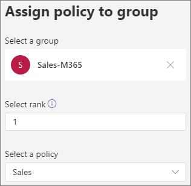

# Estacionamiento y recuperación de llamadas en Microsoft TeamsCall park and retrieve in Microsoft Teams

La característica de estacionar y recuperar llamadas es una característica que permite a un usuario poner una llamada en espera.Call park and retrieve is a feature that lets a user place a call on hold. Cuando una llamada está estacionada, el servicio genera un código único para la recuperación de la llamada.When a call is parked, the service generates a unique code for call retrieval. El usuario que estacionó la llamada o cualquier otra persona puede usar ese código con una aplicación o dispositivo compatible para recuperar la llamada.The user who parked the call or someone else can then use that code with a supported app or device to retrieve the call. (Consulte [Estacione una llamada en Teams para](https://support.office.com/article/park-a-call-in-teams-8538c063-d676-4e9a-8045-fc3b7299bb2f) obtener más información).(See see [Park a call in Teams](https://support.office.com/article/park-a-call-in-teams-8538c063-d676-4e9a-8045-fc3b7299bb2f) for details.)

Algunos de los escenarios comunes para usar el parque de llamadas son:Some of the common scenarios for using call park are:

- Un parque de recepciones es una llamada para alguien que trabaja en una fábrica.A receptionist parks a call for someone working in a factory. El recepcionista anunciará entonces la llamada y el número de código en el sistema de direcciones públicas.The receptionist then announces the call and the code number over the public address system. El usuario para el que se llama puede elegir un teléfono de Teams en la planta de fábrica y escribir el código para recuperar la llamada.The user who the call is for can then pick up a Teams phone on the factory floor and enter the code to retrieve the call.
- Un parque de usuarios es una llamada en un dispositivo móvil porque la batería del dispositivo se está quedando sin energía.A user parks a call on a mobile device because the device battery is running out of power. Después, el usuario puede escribir el código para recuperar la llamada desde un teléfono de escritorio de Teams.The user can then enter the code to retrieve the call from a Teams desk phone.
- Un representante de soporte técnico llama a un cliente y envía un anuncio en un canal de Teams para que un experto recupere la llamada y ayude al cliente.A support representative parks a customer call and sends an announcement on a Teams channel for an expert to retrieve the call and help the customer. Un experto escribe el código en los clientes de Teams para recuperar la llamadaAn expert enters the code in Teams clients to retrieve the call

Para estacionar y recuperar llamadas, un usuario debe ser Telefonía IP empresarial usuario y debe incluirse en una directiva de parque de llamadas.To park and retrieve calls, a user must be an Enterprise Voice user and and must be included in a call park policy.

> [!NOTE]
> El parque de llamadas y la recuperación solo está disponible en el modo de implementación [de Teams](teams-and-skypeforbusiness-coexistence-and-interoperability.md) y no es compatible con los teléfonos IP de Skype Empresarial.Call park and retrieve is only available in [Teams Only deployment mode](teams-and-skypeforbusiness-coexistence-and-interoperability.md) and is not supported on Skype for Business IP phones.

## Configurar el parque de llamadas y recuperarConfigure call park and retrieve

Debe ser administrador de Teams para configurar el parque de llamadas y recuperarlo.You must be a Teams admin to configure call park and retrieve. Está deshabilitada de forma predeterminada.It is disabled by default. Puede habilitarlo para los usuarios y crear grupos de usuarios con la directiva de parque de llamadas.You can enable it for users and create user groups using the call park policy. Cuando aplica la misma directiva a un conjunto de usuarios, estos pueden estacionar y recuperar llamadas entre ellos.When you apply the same policy to a set of users, they can park and retrieve calls among themselves.

Para habilitar una directiva de parque de llamadasTo enable a call park policy

1. En el panel de navegación izquierdo del Centro de administración de Microsoft Teams, vaya a las directivas **del parque de** llamadas de  >  **voz.**In the left navigation of the Microsoft Teams admin center, go to **Voice** > **Call park policies**.
2. En la pestaña **Administrar directivas,** haga clic **en Agregar.**On the **Manage policies** tab, click **Add**.
3. Asigne un nombre a la directiva y, a continuación, cambie Permitir el **parque de llamadas** a **Activar.**Give the policy a name, and then switch **Allow call park** to **On**.

    

4. Seleccione **Guardar**.Select **Save**.

Puede editar la directiva seleccionándosela en la lista y haciendo clic en **Editar.**You can edit the policy by selecting it in the list and clicking **Edit**.

Para que la directiva funcione, debe asignarse a los usuarios.In order for the policy to work, it must be assigned to users. Puede asignar [la directiva a los usuarios individualmente](assign-policies.md) o asignarlos a un grupo.You can [assign the policy to users individually](assign-policies.md) or assign them to a group.

Para asignar una directiva de elemento de llamada a un grupoTo assign a call part policy to a group

1. En la página **Directivas de parque de** llamadas, en la pestaña **Asignación de** directivas de grupo, haga clic en Agregar **grupo.**On the **Call park policies** page, on the **Group policy assignment** tab, click **Add group**.
2. Busque el grupo que desea usar y, a continuación, haga clic en **Agregar.**Search for the group that you want to use, and then click **Add**.
3. Elija una clasificación en comparación con otras tareas de grupo.Choose a rank compared to other group assignments.
4. En **Seleccionar una directiva,** elija la directiva a la que desea asignar este grupo.Under **Select a policy**, choose the policy that you want to assign this group to.

    

5. Haga clic en **Aplicar**.Click **Apply**.

## Temas relacionadosRelated topics

[Estacionar una llamada en TeamsPark a call in Teams](https://support.office.com/article/park-a-call-in-teams-8538c063-d676-4e9a-8045-fc3b7299bb2f)

[Asignar directivas a los usuarios en TeamsAssign policies to your users in Teams](assign-policies.md)

[New-CsTeamsCallParkPolicyNew-CsTeamsCallParkPolicy](https://docs.microsoft.com/powershell/module/skype/new-csteamscallparkpolicy?view=skype-ps)

[Set-CsTeamsCallParkPolicySet-CsTeamsCallParkPolicy](https://docs.microsoft.com/powershell/module/skype/set-csteamscallparkpolicy?view=skype-ps)

[Grant-CsTeamsCallParkPolicyGrant-CsTeamsCallParkPolicy](https://docs.microsoft.com/powershell/module/skype/grant-csteamscallparkpolicy?view=skype-ps)