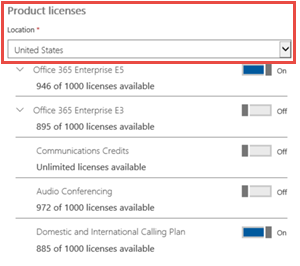

# Planes de llamadas para Microsoft 365

Las llamadas a otros usuarios de Skype Empresarial y Microsoft Teams son gratuitas, pero si quiere que los usuarios puedan llamar a teléfonos normales y aún no tiene un proveedor de servicios para realizar llamadas de voz, debe comprar un plan de llamadas. Para obtener más información, [vea Sistema telefónico y Planes de llamadas.](calling-plan-landing-page.md)
  
Estas son las opciones planes de llamadas:
  
- **Plan de llamadas** nacionales: los usuarios con licencia pueden llamar a números ubicados en el país o región donde están asignados en Microsoft 365 o Office 365.
    
- Plan de llamadas nacionales e **internacionales:** los usuarios con licencia pueden llamar a números ubicados en el país o región donde se asigna su licencia de Microsoft 365 o Office 365 al usuario en función de la ubicación del usuario y a números internacionales en [196 países o regiones.](country-and-region-availability-for-audio-conferencing-and-calling-plans/users-can-make-outbound-calls-to-these-countries-and-regions.md)

Todos los usuarios del mismo país o región (esta es la ubicación de país de usuario definida en el área de licencias del centro de administración de Microsoft 365) con el mismo plan de llamadas comparten un grupo de minutos. Por ejemplo, si tiene 100 usuarios ubicados en el mismo país o región con un plan de llamadas nacionales de 120 minutos asignado, compartirán un grupo de 12 000 minutos. Todas las llamadas que superen estos minutos se facturan por minuto.
    
Visite [Disponibilidad de país y región](country-and-region-availability-for-audio-conferencing-and-calling-plans/country-and-region-availability-for-audio-conferencing-and-calling-plans.md) para obtener información sobre los minutos mensuales disponibles para cada organización en cada país o región.
  
> [!IMPORTANT]
> El país o región se basa en la ubicación de la licencia del usuario en el Centro de administración de **Microsoft 365** Usuarios activos y NO en la dirección de facturación que aparece en el perfil de la organización en el centro de administración  >   de **Microsoft 365.**     

  
Para obtener información detallada sobre los límites de uso y los términos de uso, vea Período de acceso telefónico gratuito de [audioconferencia.](complimentary-dial-out-period.md)
  
## Cómo comprar un plan de llamadas

1. <strong>Primero debe comprar una licencia de Sistema telefónico</strong> complemento <strong>. Para ello, [inicie sesión en](https://portal.office.com/adminportal/home?add=sub&amp;adminportal=1#/catalog)</strong>el centro de administración Microsoft 365 y elija **Suscripciones de complementos de servicios de compra de facturación  >    >    >  **Comprar ahora.**
    
    
  
    > [!NOTE]
    > Según tu plan, es posible que deba comprar más complementos antes de poder comprar Sistema telefónico licencias. Para obtener más información, [vea Microsoft Teams de complementos.](./teams-add-on-licensing/microsoft-teams-add-on-licensing.md)
  
2. Después de comprar Sistema telefónico licencias, puede comprar el Plan de llamadas iniciando sesión en el Centro de administración de Microsoft 365, elija Suscripciones de complemento de servicios de compra de facturación **y, a** continuación, haga clic en Comprar  >    >   **ahora.** Verá los Planes de llamadas allí.
    
    
  
Puede comprar y asignar planes de llamadas diferentes a diferentes usuarios, según las necesidades de su organización. Después de seleccionar el plan de llamadas que necesita, continúe con la desprotección. Asigne un plan a cada usuario en el centro Microsoft 365 administración. Para obtener más información, [vea Asignar Microsoft Teams de complementos.](./teams-add-on-licensing/microsoft-teams-add-on-licensing.md)
  
## ¿Tiene un proveedor de servicios que proporciona conectividad RTC local para usuarios híbridos?

Si es así, no es necesario comprar un plan de llamadas. Office 365 Enterprise E5 incluye **Sistema telefónico** complemento, por lo que puede continuar con la desprotección.
  
A continuación, asigne Enterprise licencias  de Sistema telefónico o E5 a los usuarios del centro Microsoft 365 administración. Para obtener más información, [vea Asignar Microsoft Teams de complementos.](./teams-add-on-licensing/microsoft-teams-add-on-licensing.md)
  
## Información sobre precios

- [Precios para planes de llamadas y Sistema telefónico](https://www.microsoft.com/microsoft-365/microsoft-teams/voice-calling)
    
- [Precios de Audio Conferencia](https://www.microsoft.com/microsoft-365/microsoft-teams/online-meetings)
    
## Más información

Estos son más artículos que explican cómo configurar los planes de llamadas:
  
- [Configurar planes de llamadas](set-up-calling-plans.md)
    
- [Licencias complementarias de Microsoft Teams](./teams-add-on-licensing/microsoft-teams-add-on-licensing.md)
    
- [Esto es lo que obtiene con Sistema telefónico en Microsoft 365 o Office 365](./here-s-what-you-get-with-phone-system.md)
    
   
## Temas relacionados

- [Configurar Skype Empresarial Online](/SkypeForBusiness/set-up-skype-for-business-online/set-up-skype-for-business-online)
    
- [Configurar el Correo de voz en la nube. Ayuda para el administrador](set-up-phone-system-voicemail.md)
    
- [Configurar planes de llamadas](set-up-calling-plans.md)
    
- [Agregar fondos y administrar los créditos de comunicaciones](add-funds-and-manage-communications-credits.md)
