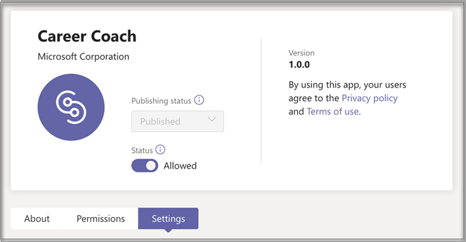
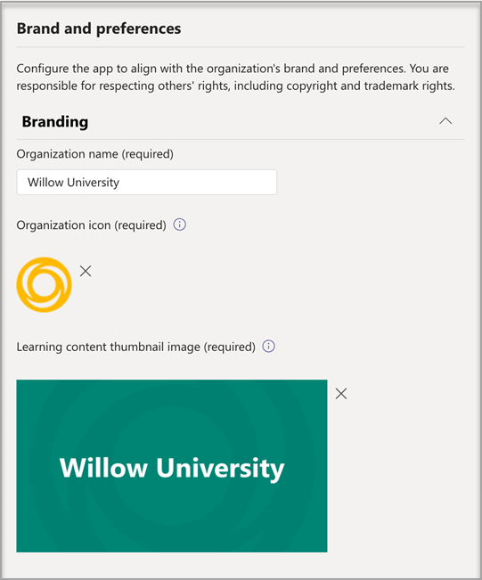
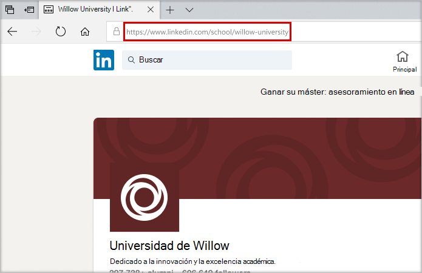
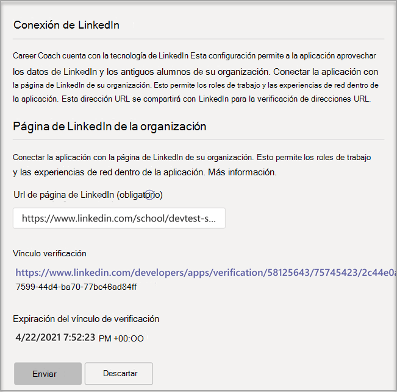

# Comprar, configurar y habilitar Asesor de carrera para Microsoft Teams

Asesor de carrera es una aplicación Microsoft Teams para Educación con tecnología de LinkedIn que proporciona orientación personalizada para que los estudiantes de educación superior puedan navegar por su trayectoria profesional. Asesor de carrera ofrece a las instituciones educativas una solución profesional unificada para que los alumnos descubran su trayectoria profesional, aumenten las aptitudes del mundo real y construyan su red en un solo lugar.

## Idiomas admitidos

Asesor de carrera se localiza en los siguientes idiomas:

- Chino (simplificado, China continental)
- Chino (tradicional, Taiwán)
- Inglés (Estados Unidos)
- Inglés (Reino Unido)
- Francés (Canadá)
- Francés (Francia)
- Alemán (Alemania)
- Japonés (Japón)
- Portugués (Brasil)
- Español (España)
- Español (México)

Obtenga más información [sobre Asesor de carrera](https://aka.ms/career-coach).

> [!NOTE]
> Use los procedimientos recomendados y sugerencias útiles de esta guía para habilitar las capacidades de Asesor de carrera para estudiantes, profesores y personal. Vea el [artículo Guía de planeación](https://support.microsoft.com/office/c5d0b934-bfcf-4fe7-8a85-ba7bbb1b6ad4) rápida.

## Revisar los requisitos

Para habilitar Asesor de carrera para su institución educativa, revise lo que necesita para que la aplicación esté en funcionamiento.

**Requisitos técnicos**

- Office 365 inquilino con Azure Active Directory

- Microsoft Teams

- Conexiones de cuentas de LinkedIn en Azure Active Directory

**Licencias**

- Profesores

- Estudiantes

> [!NOTE]
> Una Asesor de carrera licencia del profesorado debe asignarse al administrador de TI que complete la configuración.

**Datos y archivos de su institución educativa**

- Datos del catálogo de cursos

- Campos de estudio ofrecidos

- Página de LinkedIn de la institución educativa

- LinkedIn Learning plantel (preferido)

## Comprar las Asesor de carrera licencias

Asesor de carrera está disponible en todo el mundo (excepto China y Rusia) para instituciones de educación superior calificadas como una licencia de complemento a través de Enrollment for Education Solutions (EES), Proveedores de servicios en la nube (CSP) y Centro de administración de Microsoft 365 (web direct). Como aplicación Microsoft Teams, los clientes deben tener Microsoft 365 A3/A5 o Office 365 A1/A3/A5 para poder comprar el complemento Asesor de carrera licencia.

### Asignar licencias de aplicaciones a usuarios

Para obtener instrucciones paso a paso, vea [Asignar licencias a usuarios.](/microsoft-365/admin/manage/assign-licenses-to-users)

### Activar las conexiones de cuentas de LinkedIn

Asesor de carrera **requiere** que los usuarios de la institución educativa tengan la capacidad de conectar su cuenta de Microsoft 365 a su cuenta de LinkedIn que se facilita dentro de Asesor de carrera

1. Inicie sesión en el [Centro de administración de Azure AD](https://aad.portal.azure.com/) con una cuenta que sea administrador global de la organización de Azure AD.

2. Seleccione **Usuarios**.

3. En la **página Usuarios,** seleccione **Configuración de usuario.**

4. En **Conexiones de cuentas de LinkedIn,** permite a los usuarios conectar sus cuentas para acceder a sus conexiones de LinkedIn dentro de algunas aplicaciones de Microsoft. No se comparte ningún dato hasta que los usuarios consienten conectar sus cuentas.

   - Seleccione **Sí** para habilitar el servicio para todos los usuarios de su institución educativa

   - Seleccione **Grupo seleccionado para** habilitar el servicio solo para un grupo de usuarios seleccionados en su institución educativa

   - Seleccione **No** para retirar el consentimiento de todos los usuarios de su institución educativa

Obtenga información sobre cómo [integrar conexiones de cuenta de LinkedIn en Azure Active Directory](/azure/active-directory/enterprise-users/linkedin-integration)

## Configurar Asesor de carrera en el centro Teams administración

Con la configuración de administración del centro Microsoft Teams administración, puede configurar Asesor de carrera para su institución educativa y habilitarla para los usuarios.

**Cosas a tener en cuenta**

- Es necesario que se completen las siguientes secciones antes de Asesor de carrera se pueden usar: Marca y preferencias, LinkedIn
- Los CSV para el catálogo de cursos y el campo de estudio tienen formatos necesarios y un tamaño máximo de 18 MB

- Si ve "Asesor de carrera se está configurando para que lo use pronto" en la aplicación Asesor de carrera las secciones necesarias no se han completado.

- En las páginas de configuración con campos obligatorios, si los campos no se completan, la página no se envía
  - Los usuarios no verán un mensaje de advertencia, la página simplemente no se envía

## Acceder a la Asesor de carrera de la aplicación

Use la [página Administrar aplicaciones](/microsoftteams/manage-apps) para ver Teams aplicaciones en el catálogo de aplicaciones de su institución educativa.

1. Inicie sesión en el **Teams de administración**.

2. En el panel de navegación izquierdo, **selecciona Teams aplicaciones Administrar**  >  **aplicaciones.**  

    > [!NOTE]
    > Debe ser administrador global o administrador Teams de servicio para acceder a la página.

3. Busque o busque **Asesor de carrera**.  

4. Seleccione **Asesor de carrera** y, a **continuación, seleccione Configuración.**  

    

### Configurar la configuración Asesor de carrera aplicación

Asesor de carrera tiene cinco categorías de configuración:

- [Marca y preferencias](#brand-and-preferences)

- [Conexión de LinkedIn](#linkedin-connection)

- [Catálogo de cursos](#course-catalog)

- [Campos de estudio](#fields-of-study)

- [Personalización](#customization)

> [!NOTE]
> La marca y las preferencias, la configuración  de LinkedIn, el catálogo de cursos y los campos de estudio son necesarios para habilitar de forma eficaz la aplicación para estudiantes, profesores y personal.

#### Marca y preferencias

Establezca el nombre, el logotipo y el idioma predeterminado de la institución educativa en la página de configuración de marca y preferencias.

> [!NOTE]
> Esta es una sección obligatoria: Asesor de carrera no se puede habilitar sin la marca y las preferencias enviadas.

##### Icono de institución educativa

El icono de institución educativa se usa en Asesor de carrera para identificar contenido exclusivo de su institución educativa, recursos del catálogo de cursos en toda la aplicación y en la sección experiencias del mundo real del panel. El icono tiene el formato más adecuado:

- Un PNG transparente
- Relación de aspecto de 1:1
- Tamaño máximo de 64 px x 64 px.

##### Miniatura de institución educativa

El icono de institución educativa se usará para los recursos del catálogo del curso en toda la aplicación cuando una imagen específica no esté disponible para un curso. El icono tiene el formato más adecuado:

- UN PNG
- Relación de aspecto de 16:9
- Tamaño máximo de 360 px x 200 px.

#### Conexión de LinkedIn

La configuración de LinkedIn conecta Asesor de carrera datos de antiguos alumnos públicos de LinkedIn.

> [!NOTE]
> Esta es una sección obligatoria: Asesor de carrera no se puede habilitar sin la conexión de página de LinkedIn verificada.

##### Agregar y confirmar la página de LinkedIn

Determine la página de LinkedIn de la institución educativa. Busque la página de LinkedIn buscando en LinkedIn o conectándose con un miembro del personal de los servicios profesionales para determinar la página correcta para usar.  
  
1. Inicie sesión en el **Teams de administración**.

1. Selecciona **Teams aplicaciones Administrar** aplicaciones  >    >  **Asesor de carrera** conexión  >  **de LinkedIn**.

2. Busque la página de LinkedIn buscando en LinkedIn y seleccionando Filtro escolar. O conéctate con un miembro del personal de servicios profesionales para determinar la página educativa de LinkedIn correcta para usar. [Cómo identificar páginas de LinkedIn](https://www.linkedin.com/help/linkedin/answer/40133/differences-between-a-linkedin-page-for-a-school-and-company?lang=en)

    

3. Agregue la dirección URL de la página educativa de LinkedIn. La dirección URL debe ser una página educativa y no una página de la empresa y normalmente tiene el formato de `https://www.linkedin.com/school/willow-university/` .

   

4. Seleccione **Enviar**.

5. Si se envía correctamente, la página se actualizará para mostrar el vínculo Verificación **y** la expiración **del vínculo Verificación.** El vínculo de verificación expira después de 30 días.

     

6. Copie el vínculo de verificación y compártello con el superadministrador de la página de LinkedIn de su institución educativa. Obtenga más información sobre el rol de superadministrador de la página de LinkedIn en la [documentación de administrador de la página de LinkedIn.](https://www.linkedin.com/help/linkedin/answer/102672)

7. El superadministrador de la página de LinkedIn usará el vínculo de verificación único para asociar Asesor de carrera la página de su escuela. [Documentación adicional sobre la verificación de página de LinkedIn](https://www.linkedin.com/help/linkedin/answer/102672).

> [!NOTE]
> La verificación del superadministrador de la página de LinkedIn es necesaria para completar la conexión de LinkedIn Asesor de carrera.

   

#### Catálogo de cursos

El catálogo de cursos representa los cursos y clases ofrecidos a los alumnos por su institución educativa.

> [!NOTE]
> Esta es una sección obligatoria: Asesor de carrera no se puede habilitar sin un catálogo de cursos.

Estos cursos se usan dentro de la aplicación en dos áreas:

- Los cursos se devuelven como parte de los recursos de aprendizaje.  

- Los metadatos de cursos y cursos, como las descripciones, se usan para ayudar a los alumnos a identificar sus aptitudes al cargar una transcripción.  

Para crear el catálogo de cursos, cree una lista de todos los cursos que se imparten en su institución educativa y cargúenlo como un archivo CSV. La aplicación se basa en el catálogo de cursos para identificar las aptitudes de un alumno de su transcripción y sugerir cursos para realizar.

##### Formato y esquema de documentos del catálogo de cursos

El documento debe estar en formato CSV con un tamaño máximo de 18 MB. El documento debe contener el título del curso de campos **obligatorios,** **el id. del** curso y la dirección URL del **curso.** Incluir los campos recomendados mejora la experiencia de los alumnos al devolver mejores resultados de búsqueda e identificación de aptitudes.

> [!NOTE]
> Empiece con el documento [del catálogo de cursos]( https://aka.ms/career-coach/docs/it-admins/sample-catalog) de ejemplo para empezar.

En la tabla siguiente se muestran los elementos que se incluirán en el catálogo de cursos:

| Nombre             | Estado      | Tipo   | Descripción                                                                    |
|------------------|-------------|--------|--------------------------------------------------------------------------------|
| courseId         | Obligatorio    | cadena | Normalmente, el id. del curso (normalmente se asigna a lo que se genera en la transcripción). |
| título            | Obligatorio    | cadena | Normalmente, el título del curso.                                                      |
| sourceLink       | Obligatorio    | Dirección URL    | Vínculo del sitio web a la página del curso.                                               |
| descripción      | Recomendado | cadena | Texto de introducción para el curso.                                              |
| language         | Recomendado | cadena | Idioma del curso. Use códigos de idioma estándar.                           |
| formato           | Recomendado | cadena | Modo de enseñanza (en línea, vídeo, en persona).                              |
| thumbnailLink    | Recomendado | Dirección URL    | Vínculo de miniaturas a la imagen del curso.                                            |
| thumbnailAltText | Recomendado | cadena | Texto alternativo de accesibilidad para la imagen                                           |
| educationLevel   | Recomendado | cadena | Nivel de estudio, por ejemplo. Graduación/graduación.                                       |
| temas           | Recomendado | cadena | Temas o etiquetas que están asociadas a las aptitudes que imparten los cursos.          |

##### Agregar el catálogo de cursos

1. Inicie sesión en el **Teams de administración**.

1. Selecciona **Teams aplicaciones Administrar** &gt; **aplicaciones** &gt; **Asesor de carrera** &gt; **Configuración** catálogo del &gt; **curso.**  

2. Upload cursos en formato CSV con las columnas necesarias: courseId, title, sourceLink. Cada fila debe incluir datos para cada una de las columnas necesarias.

Incluir los campos recomendados mejora la experiencia de los alumnos al devolver mejores resultados de búsqueda e identificación de aptitudes.

4. Seleccione **Enviar**.

   

#### Campos de estudio

Los campos de estudio son sinónimos de áreas principales de interés, grado académico y grado. Los alumnos hacen referencia a estos títulos cuando empiezan a usar la aplicación y empiezan a configurar su perfil personalizado.

> [!NOTE]
> Esta es una sección obligatoria: Asesor de carrera no se puede habilitar sin una lista de campos de estudio.

Agregue todos los campos de estudio disponibles para los alumnos, como Ingeniería, Inglés, Empresa, entre otros. La lista de campos permite a los alumnos descubrir campos de estudio que puedan interesarlos y agregar su área de enfoque a su perfil.

> [!NOTE]
> Empiece con el [campo de ejemplo del documento de](https://aka.ms/career-coach/docs/it-admins/sample-fieldsofstudy) estudio.

En la tabla siguiente se muestran los elementos que se incluirán en los campos de estudio:

| Nombre          | Estado   | Tipo   | Descripción                    |
|---------------|----------|--------|--------------------------------|
| fieldsOfStudy | Obligatorio | cadena | El nombre del campo de estudio |

##### Agregar los campos de estudio

1. Inicie sesión en el **Teams de administración**.
1. Selecciona **Teams aplicaciones Administrar** &gt; **aplicaciones** &gt; **Asesor de carrera** &gt; **Configuración** campos de &gt; **estudio.**  

2. Upload campo de estudio en formato CSV.

3. Seleccione **Enviar**.

#### Personalización

Asesor de carrera puede personalizarse para que sea única para su institución educativa. La personalización permite agregar experiencias al panel. Se recomienda agregar vínculos a paneles de trabajo, eventos, oficina de servicios profesionales, eventos profesionales, clubes de estudiantes y cualquier otro recurso que ayude a los estudiantes a obtener experiencia en el mundo real.

##### Agregar experiencias personalizadas

1. Inicie sesión en el **Teams de administración**.

1. Selecciona **Teams aplicaciones Administrar** &gt; **aplicaciones** &gt; **Asesor de carrera**  >  **Configuración** &gt; **personalización.**

2. Agregue cada dirección URL, un título y una descripción breve.  
  
3. Seleccione **Enviar**.

## Hacer que Asesor de carrera disponible para su organización

Ahora que Asesor de carrera se ha configurado para su organización. Siga estos pasos para asegurarse de que Asesor de carrera está disponible para la organización en Microsoft Teams.

### Habilitar la aplicación

Después de completar la configuración, habilite la aplicación para alumnos y usuarios con licencia para que tengan acceso a Asesor de carrera.  
  
> [!NOTE]
> Debe tener permisos de rol de administrador Teams global o de administrador.

1. Inicie sesión en el **Teams de administración**.

1. Selecciona **Teams aplicaciones Administrar** aplicaciones &gt;  &gt; **Asesor de carrera**.

2. Mueva el botón de alternancia Estado a **Permitido.**  

  > [!NOTE]
  > Permitido significa que la aplicación está disponible para los usuarios de su institución educativa. Bloqueado significa que la aplicación no está disponible para los alumnos.

### Agregar Asesor de carrera como una aplicación instalada

> [!NOTE]
> Este paso garantiza 1) que Asesor de carrera está configurado correctamente para su organización 2) que los alumnos encuentren Asesor de carrera.

1. Inicie sesión en el **Teams de administración**.

2. Seleccione **Teams directivas de configuración** de &gt; **aplicaciones** Su &gt; *directiva*.

3. En Aplicaciones instaladas, seleccione Agregar aplicaciones.

4. En el panel Agregar aplicaciones instaladas, busque las aplicaciones que desea instalar automáticamente para los usuarios cuando inicien Teams. También puede filtrar aplicaciones por directiva de permisos de aplicación. Cuando haya elegido la lista de aplicaciones, seleccione Agregar.

### Anclar la aplicación

Anclar Asesor de carrera hará que la aplicación sea más accesible y visible para los alumnos.

1. Inicie sesión en el **Teams de administración**.

2. Seleccione **Teams directivas de configuración** de &gt; **aplicaciones** Su &gt; *directiva*.

3. En **Aplicaciones ancladas,** elija **Agregar aplicaciones.**

4. Busque **Asesor de carrera** y, a continuación, **seleccione Agregar**.

5. Elija el orden para que aparezca la aplicación y seleccione **Guardar.**

> [!NOTE]
> Se notificará a los alumnos en Microsoft Teams que Asesor de carrera se ha anclado.

Para obtener más información, haga referencia a Administrar directivas de configuración de [aplicaciones en Microsoft.](/microsoftteams/teams-app-setup-policies)

## Recursos

Los siguientes recursos le ayudarán a planear su Asesor de carrera aplicación.

- [Bienvenido a Microsoft Teams](Teams-overview.md)

- [Cómo implementar Teams](get-started-with-teams-resources-for-org-wide-rollout.md?tabs=SmallBusiness)

- [Información general de los equipos y canales en Microsoft Teams](teams-channels-overview.md)

- [Administrar aplicaciones en el Microsoft Teams de administración](manage-apps.md)

- [Kit de orientación virtual en línea](https://www.microsoft.com/education/remote-learning/virtual-orientation)

- [Límites y especificación de Teams canales](limits-specifications-teams.md)

- [Introducción a la formación de administradores para Microsoft Teams](ITAdmin-readiness.md)

- [Solución de problemas de Teams](/microsoftteams/troubleshoot/teams-welcome)

- [Administrar directivas de permisos de aplicación en Microsoft Teams](teams-app-permission-policies.md)
