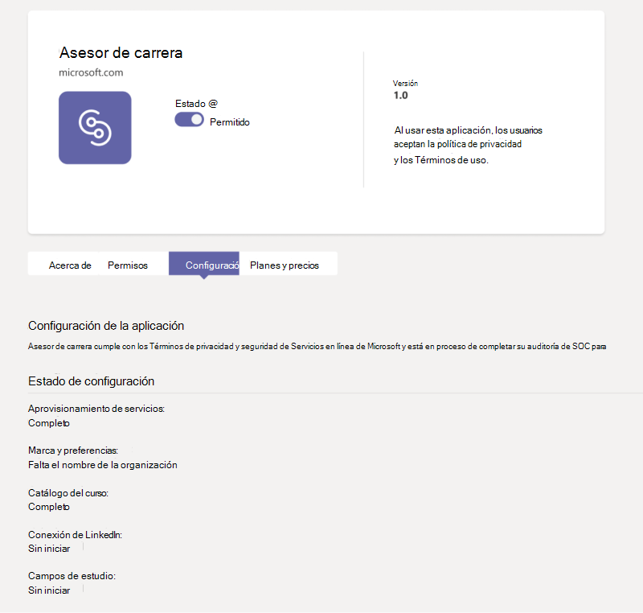

# Comprar, configurar y habilitar Asesor de carrera para Microsoft Teams

Asesor de carrera es una aplicación Microsoft Teams para Educación con tecnología de LinkedIn que proporciona orientación personalizada para que los estudiantes de educación superior puedan navegar por su trayectoria profesional. Asesor de carrera ofrece a las instituciones educativas una solución profesional unificada para que los alumnos descubran su trayectoria profesional, aumenten las aptitudes del mundo real y construyan su red en un solo lugar.

## Idiomas admitidos

Asesor de carrera se localiza en los siguientes idiomas:

- Chino (simplificado, China continental)
- Chino (tradicional, Taiwán)
- Inglés (Estados Unidos)
- Inglés (Reino Unido)
- Francés (Canadá)
- Francés (Francia)
- Alemán (Alemania)
- Japonés (Japón)
- Portugués (Brasil)
- Español (España)
- Español (México)

Obtenga más información [sobre Asesor de carrera](https://aka.ms/career-coach).

> [!TIP]
> Use los procedimientos recomendados y sugerencias útiles de esta guía para habilitar las capacidades de Asesor de carrera para estudiantes, profesores y personal. Vea el [artículo Guía de planeación](https://support.microsoft.com/office/c5d0b934-bfcf-4fe7-8a85-ba7bbb1b6ad4) rápida.

## Revisar los requisitos

Para habilitar Asesor de carrera para su institución educativa, revise lo que necesita para que la aplicación esté en funcionamiento.

**Requisitos técnicos**

- Office 365 inquilino con Azure Active Directory.

- Microsoft Teams.

- Conexiones de cuentas de LinkedIn en Azure Active Directory.

**Licencias**

- Profesores

- Estudiantes

> [!IMPORTANT]
> Una Asesor de carrera licencia del profesorado debe asignarse al administrador de TI que complete la configuración.

**Datos y archivos de su institución educativa**

- Logotipo y activos gráficos de la institución educativa en el formato necesario.

- Datos del catálogo de cursos.

- Lista de campos de estudio ofrecidos.

- Página de [LinkedIn](https://www.linkedin.com/help/linkedin/answer/40133/differences-between-a-linkedin-page-for-a-school-and-company?lang=en)de la institución educativa.

- Dirección URL de la directiva de privacidad de la institución educativa.

- Los vínculos de instituciones educativas a recursos relacionados con la profesión, como los servicios profesionales y las publicaciones de puestos de estudiantes (opcionales).

- LinkedIn Learning plantel (preferido).

## Comprar las Asesor de carrera licencias

Asesor de carrera está disponible en todo el mundo (excepto China y Rusia) para instituciones de educación superior calificadas como una licencia de complemento a través de Enrollment for Education Solutions (EES), Proveedores de servicios en la nube (CSP) y Centro de administración de Microsoft 365 (web direct). Como aplicación Microsoft Teams, el inquilino debe tener Microsoft 365 A3/A5 o Office 365 A1/A3/A5 para poder comprar el complemento Asesor de carrera licencia. Se ofrecen licencias independientes para estudiantes y usuarios de profesores y docentes.

Hay disponible una prueba gratuita estándar de 90 días para 25 estudiantes y 25 licencias de profesores y docentes. Las licencias de prueba se pueden activar Centro de administración de Microsoft 365 los inquilinos que están cualificados para comprar Asesor de carrera.

### Asignar licencias de aplicaciones a usuarios

Para obtener instrucciones paso a paso, vea [Asignar licencias a usuarios.](/microsoft-365/admin/manage/assign-licenses-to-users)

### Activar las conexiones de cuentas de LinkedIn

Asesor de carrera **requiere que** los usuarios de la institución educativa tengan la capacidad de conectar su cuenta de Microsoft 365 a su cuenta de LinkedIn que se facilita en Asesor de carrera.

1. Inicie sesión en el [Azure AD de](https://aad.portal.azure.com/) administración con una cuenta que sea administrador global de la Azure AD organización.

2. Seleccione **Usuarios**.

3. En la **página Usuarios,** seleccione **Configuración de usuario.**

4. **Las conexiones de cuenta de LinkedIn** deben establecerse en **Sí** o **Grupo** seleccionado Asesor de carrera que se configuren correctamente.

   

   > [!NOTE]
   > No se comparte ningún dato hasta que los usuarios consienten conectar sus cuentas.

   - Seleccione **Sí** para habilitar el servicio para todos los usuarios de su institución educativa.

   - Seleccione **Grupo seleccionado para** habilitar el servicio solo para un grupo de usuarios seleccionados en su institución educativa.

Para obtener más información, vea Conexiones de cuentas [de LinkedIn en Azure Active Directory](/azure/active-directory/enterprise-users/linkedin-integration).

## Acceder a la Asesor de carrera de la aplicación

Use Microsoft Teams de administración para configurar Asesor de carrera para su institución educativa y habilitarlo para los usuarios.

> [!IMPORTANT]
> Debe ser administrador global o administrador Teams de servicio para acceder a la página.

1. Inicie sesión en el **[Teams de administración](https://admin.teams.microsoft.com)**.

2. En el panel de navegación izquierdo, **selecciona Teams aplicaciones Administrar**  >  **[aplicaciones.](https://admin.teams.microsoft.com/policies/manage-apps)**  

3. Busque o busque **Asesor de carrera**.  

4. Seleccione **Asesor de carrera** y, a **continuación, seleccione Configuración**.  

    

## Configurar la configuración Asesor de carrera aplicación

Asesor de carrera tiene cinco categorías de configuración:

- [Marca y preferencias:](#brand-and-preferences) obligatorio

- [Conexión de LinkedIn:](#linkedin-connection) obligatorio

- [Catálogo de cursos:](#course-catalog) obligatorio

- [Campos de estudio:](#fields-of-study) obligatorio

- [Personalización](#customization)

> [!IMPORTANT]
> La marca y las preferencias, la configuración  de LinkedIn, el catálogo de cursos y los campos de estudio son necesarios para habilitar de forma eficaz la aplicación para estudiantes, profesores y personal.

### Marca y preferencias

Personalice Asesor de carrera para que coincida con la marca de su institución educativa. Usted es responsable de respetar los derechos de otras personas, incluidos los derechos de propiedad intelectual y de marca comercial.

> [!IMPORTANT]
> Esta es una sección obligatoria: Asesor de carrera no se puede habilitar sin la marca y las preferencias enviadas.

1. Inicie sesión en el **[Teams de administración](https://admin.teams.microsoft.com)**.

2. Selecciona **Teams aplicaciones Administrar** aplicaciones  >  ****  >  **Asesor de carrera** marca  >  **y preferencias.**

3. Upload el **icono de institución educativa**. El icono se usa en Asesor de carrera para identificar contenido exclusivo de su institución educativa, recursos del catálogo de cursos en toda la aplicación y en la sección experiencias del mundo real del panel. El icono tiene el formato más adecuado:

    - Un PNG transparente
    - Relación de aspecto de 1:1
    - Tamaño máximo de 64 px x 64 px

4. Upload miniatura **de la institución educativa.** La miniatura se usará para los recursos del catálogo del curso en toda la aplicación cuando una imagen específica no esté disponible para un curso. La miniatura tiene el formato más adecuado:

    - UN PNG
    - Relación de aspecto de 16:9
    - Tamaño máximo de 360 px x 200 px

5. Agregue la **dirección URL de la directiva de privacidad de la institución educativa.** Si se agrega, la directiva de privacidad de la institución estará disponible para que los alumnos puedan revisarla en Asesor de carrera aplicación.

6. Seleccione **Enviar**.

### Conexión de LinkedIn

La configuración de LinkedIn conecta Asesor de carrera datos de antiguos alumnos públicos de LinkedIn.

> [!IMPORTANT]
> Esta es una sección obligatoria: Asesor de carrera no se puede habilitar sin la conexión de página de LinkedIn verificada.

#### Agregar la página de LinkedIn
  
1. Inicie sesión en el **[Teams de administración](https://admin.teams.microsoft.com)**.

2. Selecciona **Teams aplicaciones Administrar** aplicaciones  >  ****  >  **Asesor de carrera** conexión  >  **de LinkedIn**.

3. Busque la página de LinkedIn buscando en LinkedIn y seleccionando el **filtro Escuela.** O conéctate con un miembro del personal de servicios profesionales para determinar la página educativa de LinkedIn correcta para usar. Para obtener más información, vea [Cómo identificar páginas de LinkedIn.](https://www.linkedin.com/help/linkedin/answer/40133/differences-between-a-linkedin-page-for-a-school-and-company?lang=en)

    

4. Agregue la dirección URL de la página educativa de LinkedIn. La dirección URL debe ser una página educativa y no una página de la empresa y normalmente tiene el formato de `https://www.linkedin.com/school/willow-university/` .

   

5. Seleccione **Enviar**.
#### Comprobar la página de LinkedIn 

> [!IMPORTANT]
> La verificación debe ser completada por el superadministrador de la página de LinkedIn de su institución educativa.

1. Si se envía correctamente, la página se actualizará para mostrar el vínculo Verificación **y** la expiración **del vínculo Verificación.** El vínculo de verificación expira después de 30 días.

     

2. Copie el vínculo de verificación y compártello con el superadministrador de la página de LinkedIn de su institución educativa. Obtenga más información sobre el rol de superadministrador de la página de LinkedIn en la [documentación de administrador de la página de LinkedIn.](https://www.linkedin.com/help/linkedin/answer/102672)

3. El superadministrador de la página de LinkedIn usará el vínculo de verificación único para asociar Asesor de carrera a la página de su escuela. Consulte [Documentación adicional sobre la verificación de página de LinkedIn](https://www.linkedin.com/help/linkedin/answer/102672) para obtener más información.

   

### Catálogo de cursos

El catálogo de cursos representa los cursos y clases ofrecidos a los alumnos por su institución educativa.

> [!IMPORTANT]
> Esta es una sección obligatoria: Asesor de carrera no se puede habilitar sin un catálogo de cursos.

Estos cursos se usan dentro de la aplicación en dos áreas:

- Los cursos se devuelven como parte de los recursos de aprendizaje.  

- Los metadatos de cursos y cursos, como las descripciones, se usan para ayudar a los alumnos a identificar sus aptitudes al cargar una transcripción.  

Para crear el catálogo de cursos, cree una lista de todos los cursos que se imparten en su institución educativa y cargúenlo como un archivo CSV. La aplicación se basa en el catálogo de cursos para identificar las aptitudes de un alumno de su transcripción y sugerir cursos para realizar.

#### Agregar el catálogo de cursos

1. Inicie sesión en el **[Teams de administración](https://admin.teams.microsoft.com)**.

1. Selecciona **Teams aplicaciones Administrar** &gt; **[aplicaciones](https://admin.teams.microsoft.com/policies/manage-apps)** &gt; **Asesor de carrera** &gt; **Configuración** catálogo del &gt; **curso.**  

2. Upload cursos en formato CSV con las columnas necesarias: courseId, title y sourceLink. Cada fila debe incluir datos para cada una de las columnas necesarias. _Incluir los campos recomendados mejora la experiencia de los alumnos al devolver mejores resultados de búsqueda e identificación de aptitudes._

4. Seleccione **Enviar**.

   

#### Esquema y formato de documento del catálogo de cursos

El documento debe estar en formato CSV con un tamaño máximo de 18 MB. El documento debe contener el título del curso de campos **obligatorios,** **el id. del** curso y la dirección URL del **curso.** 

> [!TIP]
> Empiece con el documento [del catálogo de cursos de]( https://aka.ms/career-coach/docs/it-admins/sample-catalog) ejemplo para garantizar el formato correcto. _Incluir los campos recomendados mejora la experiencia de los alumnos al devolver mejores resultados de búsqueda e identificación de aptitudes._

En la tabla siguiente se muestran los elementos que se incluirán en el catálogo de cursos:

| Nombre             | Estado      | Tipo   | Descripción                                                                    |
|------------------|-------------|--------|--------------------------------------------------------------------------------|
| courseId         | Obligatorio    | cadena | Normalmente, el id. del curso (normalmente se asigna a lo que se genera en la transcripción). |
| título            | Obligatorio    | cadena | Normalmente, el título del curso.                                                      |
| sourceLink       | Obligatorio    | Dirección URL    | Vínculo del sitio web a la página del curso.                                               |
| descripción      | Recomendado | cadena | Texto de introducción para el curso.                                              |
| language         | Recomendado | cadena | Idioma del curso. Use códigos de idioma estándar.                           |
| formato           | Recomendado | cadena | Modo de enseñanza (en línea, vídeo, en persona).                                   |
| thumbnailLink    | Recomendado | Dirección URL    | Vínculo de miniaturas a la imagen del curso.                                            |
| thumbnailAltText | Recomendado | cadena | Texto alternativo de accesibilidad para la imagen                                           |
| educationLevel   | Recomendado | cadena | Nivel de estudio, por ejemplo. Graduación/graduación.                                       |
| temas           | Recomendado | cadena | Temas o etiquetas que están asociadas a las aptitudes que imparten los cursos.          |

### Campos de estudio

Los campos de estudio son sinónimos de áreas principales de interés, grado académico y grado. Los alumnos hacen referencia a estos títulos cuando empiezan a usar la aplicación y empiezan a configurar su perfil personalizado.

> [!IMPORTANT]
> Esta es una sección obligatoria: Asesor de carrera no se puede habilitar sin una lista de campos de estudio.

#### Agregar los campos de estudio

1. Inicie sesión en el **[Teams de administración](https://admin.teams.microsoft.com)**.
1. Selecciona **Teams aplicaciones Administrar** &gt; **[aplicaciones](https://admin.teams.microsoft.com/policies/manage-apps)** &gt; **Asesor de carrera** &gt; **Configuración** campos de &gt; **estudio.**  

2. Upload campo de estudio en formato CSV.

3. Seleccione **Enviar**.

#### Formato y esquema de los campos de documento de estudio

Agregue todos los campos de estudio disponibles para los alumnos, como Ingeniería, Inglés, Empresa, entre otros. La lista de campos permite a los alumnos descubrir campos de estudio que puedan interesarlos y agregar su área de enfoque a su perfil.

> [!TIP]
> Empiece con el [campo de ejemplo del documento de](https://aka.ms/career-coach/docs/it-admins/sample-fieldsofstudy) estudio para garantizar el formato adecuado.

En la tabla siguiente se muestran los elementos que se incluirán en los campos de estudio:

| Nombre          | Estado   | Tipo   | Descripción                    |
|---------------|----------|--------|--------------------------------|
| fieldsOfStudy | Obligatorio | cadena | El nombre del campo de estudio |

### Personalización

Asesor de carrera puede personalizarse para que sea única para su institución educativa. La personalización permite agregar experiencias al panel. Se recomienda agregar vínculos a paneles de trabajo, eventos, oficina de servicios profesionales, eventos profesionales, clubes de estudiantes y cualquier otro recurso que ayude a los estudiantes a obtener experiencia en el mundo real.

#### Agregar experiencias personalizadas

1. Inicie sesión en el **[Teams de administración](https://admin.teams.microsoft.com)**.

1. Selecciona **Teams aplicaciones Administrar** &gt; **[aplicaciones](https://admin.teams.microsoft.com/policies/manage-apps)** &gt; **Asesor de carrera**  >  **Configuración** &gt; **personalización.**

2. Agregue cada título, dirección URL y descripción breve.  
  
3. Seleccione **Enviar**.

## Hacer que Asesor de carrera disponible para su organización

Ahora que Asesor de carrera se ha configurado para su organización. Siga estos pasos para asegurarse de que Asesor de carrera está disponible para la organización en Microsoft Teams.

### Habilitar la aplicación

Después de completar la configuración, habilite la aplicación para alumnos y usuarios con licencia para que tengan acceso a Asesor de carrera.  
  
> [!IMPORTANT]
> Debe tener permisos de rol de administrador Teams global o de administrador.

1. Inicie sesión en el **[Teams de administración](https://admin.teams.microsoft.com)**.

1. Selecciona **Teams aplicaciones Administrar** aplicaciones &gt; **** &gt; **Asesor de carrera**.

2. Mueva el botón de alternancia Estado a **Permitido.**  

   > [!NOTE]
   > **Permitido** significa que la aplicación está disponible para los usuarios de su institución educativa. Bloqueado significa que la aplicación no está disponible para los alumnos.

### Agregar Asesor de carrera como una aplicación instalada

> [!IMPORTANT]
> Este paso garantiza que Asesor de carrera esté configurado correctamente para su organización y que los alumnos encuentren Asesor de carrera.

1. Inicie sesión en el **[Teams de administración](https://admin.teams.microsoft.com)**.

2. Seleccione **Teams de configuración** de aplicaciones &gt; **y** seleccione su directiva preferida.
Si no está seguro de qué directiva usar, puede hacer referencia a  la documentación de administración de directivas de [Microsoft Teams](/microsoftteams/policy-packages-edu) o usar el Asistente para directivas educativas para configurar una directiva para Microsoft Teams.

3. En Aplicaciones instaladas, seleccione **Agregar aplicaciones.**

4. En el panel Agregar aplicaciones instaladas, busque las aplicaciones que desea instalar automáticamente para los usuarios cuando inicien Teams. También puede filtrar aplicaciones por directiva de permisos de aplicación. Cuando haya elegido la lista de aplicaciones, seleccione **Agregar**.

5. Seleccione **Guardar**.

> [!NOTE]
> Editar o asignar una directiva puede tardar unas horas en que los cambios suenen. La Asesor de carrera aplicación no estará disponible en Microsoft Teams hasta que se completen los cambios.

### Anclar la aplicación

Anclar Asesor de carrera hará que la aplicación sea más accesible y visible para los alumnos.

1. Inicie sesión en el **[Teams de administración](https://admin.teams.microsoft.com)**.

2. Seleccione **Teams de configuración** de aplicaciones &gt; **y** seleccione su directiva preferida.
Si no está seguro de qué directiva usar, puede hacer referencia a  la documentación de administración de directivas de [Microsoft Teams](/microsoftteams/policy-packages-edu) o usar el Asistente para directivas educativas para configurar una directiva para Microsoft Teams.

3. En **Aplicaciones ancladas,** elija **Agregar aplicaciones.**

4. Busque **Asesor de carrera** y, a continuación, **seleccione Agregar**.

5. Elija el orden para que aparezca la aplicación y seleccione **Guardar.**

> [!NOTE]
> Se notificará a los alumnos en Microsoft Teams que Asesor de carrera se ha anclado.

Para obtener más información, haga referencia a Administrar directivas de configuración de [aplicaciones en Microsoft.](/microsoftteams/teams-app-setup-policies)

## Asesor de carrera de configuración

La página Asesor de carrera configuración del centro de administración de Teams proporciona un informe de estado de pasos incompletos, pendientes, completados y con errores para configurar la aplicación. Estos estados pueden ayudarle a determinar si Asesor de carrera está configurado correctamente y listo para su lanzamiento al inquilino.

### Estado de configuración

La sección estado de configuración de la página de configuración de la aplicación mostrará el estado actual.

| Categoría              | Estado                    | Descripción                                                 |
| --------------------- | ------------------------- | ----------------------------------------------------------- |
| Aprovisionamiento de servicios  | Pending                   | La aplicación se está agregando al inquilino. No se necesitan más acciones. |
| Aprovisionamiento de servicios  | Completado                  | Listo para que el administrador de TI envíe la configuración.                      |
| Marca y preferencias | No iniciado               | Configuración debe enviarse.                              |
| Marca y preferencias | Faltan _campos obligatorios_ | El administrador de TI debe agregar o cargar los campos que faltan.         |
| Marca y preferencias | Completado                  | No se necesitan más acciones.                                   |
| Catálogo de cursos        | No iniciado               | El catálogo debe enviarse.                              |
| Catálogo de cursos        | Incompleto                | Compruebe el estado de la ingestión para obtener más información sobre cómo resolverlo.   |
| Catálogo de cursos        | Completado                  | No se necesitan más acciones.                                   |
| Conexión de LinkedIn   | No iniciado               | La dirección URL de la página educativa de LinkedIn debe enviarse.             |
| Conexión de LinkedIn   | Pending                   | Esperando la aprobación del administrador de la página educativa de LinkedIn.               |
| Conexión de LinkedIn   | Completado                  | No se necesitan más acciones.                                   |
| Campos de estudio       | No iniciado               | Es necesario enviar el documento.                             |
| Campos de estudio       | Completado                  | No se necesitan más acciones.                                   |

> [!NOTE]
> Una vez que todos los pasos se marquen como completados, la aplicación se puede publicar correctamente en el inquilino y asignar Asesor de carrera licencias. Para obtener instrucciones paso a paso, vea [Asignar licencias a usuarios.](/microsoft-365/admin/manage/assign-licenses-to-users?view=o365-worldwide)

### Estado del catálogo del curso

El estado del catálogo del curso se muestra en la página Configuración del catálogo de cursos una vez que se ha cargado un documento, proporcionando detalles de la carga y procesamiento del documento.

| Columna           | Valor     | Descripción                                                                                        |
| ---------------- | --------- | -------------------------------------------------------------------------------------------------- |
| Hora cargada    | Marca de tiempo | Fecha y hora en que un administrador de TI ha cargado un documento.                                                     |
| Tiempo completado   | Marca de tiempo | Fecha y hora en que el documento se procesó por completo.                                               |
| Cursos cargados | Entero   | Número de cursos que se encuentran en el documento.                                                           |
| Estado de ingestión | Pending   | Documento en cola para su procesamiento.                                                                  |
| Estado de ingestión | Ejecución   | El documento se está procesando actualmente. Este proceso puede tardar hasta 60 minutos.                        |
| Estado de ingestión | Correcto   | El proceso de ingestión se completa y los cursos y estarán disponibles en la aplicación una vez que esté completamente configurado. |
| Estado de ingestión | Error    | Compruebe el formato del documento y vuelva a cargarlo.                                                            |
| Duplicados       | Entero   | Número de cursos duplicados que se encuentran en el documento.                                                 |

> [!NOTE]
> Si una columna está en blanco, el documento se está procesando actualmente y esos valores no están disponibles. Una vez que se haya procesado el documento, los valores se rellenarán. Puede actualizar la página para buscar actualizaciones.

## Solución de problemas

- Si ve "Asesor de carrera está configurado para que lo use pronto" en la aplicación Asesor de carrera, no se han completado las secciones __necesarias.__ Es necesario completar las siguientes secciones antes de que Asesor de carrera se puedan [usar:](#brand-and-preferences)Marca y __preferencias,__ Conexión [de LinkedIn,](#linkedin-connection)Catálogo del curso y [Campos de estudio.](#fields-of-study) 

- Los CSV para el catálogo del curso y el campo de estudio tienen formatos necesarios y un tamaño máximo de 18 MB. Haga referencia al Asesor de carrera [del](#course-catalog-document-format-and-schema) catálogo de cursos y Asesor de carrera [campos de esquema](#fields-of-study-document-format-and-schema) de documento de estudio para garantizar una configuración adecuada.

- En las páginas de configuración con campos obligatorios, si los campos no se completan, la página no se envía. No verá un mensaje de advertencia; la página simplemente no se envía.

- Al configurar por primera Asesor de carrera, puede aparecer un banner de error que indica "No se puede actualizar la configuración de la aplicación. Inténtalo de nuevo". Esto se debe probablemente al aprovisionamiento del espacio empresarial Asesor de carrera aplicación, que puede tardar hasta 15 minutos. Si esto sucede, espere 15 minutos antes de volver a enviar.

- Si la Asesor de carrera aplicación no se muestra en Microsoft Teams, es posible que los cambios de directiva no tengan efecto. Los cambios de directiva pueden tardar unas horas en actualizarse. La Asesor de carrera aplicación no estará disponible en Microsoft Teams hasta que se completen los cambios.

## Quitar los datos del inquilino

Los datos del inquilino incluyen información que se carga o se genera como parte de la configuración de la aplicación. Para eliminar todos los datos de un inquilino Asesor de carrera,  haga que el administrador global del inquilino abra un vale de soporte técnico solicitando que los datos del inquilino se eliminen permanentemente. Tenga en cuenta que este proceso no es reversible. Una vez completada la eliminación de datos, la aplicación Asesor de carrera volverá Asesor de carrera su estado preconfigurado no personalizado para todos los usuarios y un administrador de Teams tendrá que configurar la aplicación de nuevo para seguir usla.

A continuación se explica el proceso de eliminación:

- Un vale de soporte técnico debe ser presentado por un administrador global de inquilinos que indique claramente la solicitud de eliminación permanente de los datos del inquilino. No se puede limitar el conjunto de datos **ni la ventana de tiempo de la eliminación.**

- Una vez que se haya presentado, el vale de soporte técnico se abordará después de una semana para cumplir con la directiva de retención mínima del cumplimiento. Puede cancelar la operación durante este tiempo.

- Después de una semana, Asesor de carrera equipo garantiza que se eliminen todos los datos relacionados con el espacio empresarial. El soporte técnico de Microsoft supervisa el vale y le notificará una vez completado el proceso de eliminación, en **un no más de 30 días.**

## Recursos

Los siguientes recursos le ayudarán a planear su Asesor de carrera aplicación.

- [Bienvenido a Microsoft Teams](Teams-overview.md)

- [Cómo implementar Teams](get-started-with-teams-resources-for-org-wide-rollout.md?tabs=SmallBusiness)

- [Información general de los equipos y canales en Microsoft Teams](teams-channels-overview.md)

- [Administrar aplicaciones en el Microsoft Teams de administración](manage-apps.md)

- [Kit de orientación virtual en línea](https://www.microsoft.com/education/remote-learning/virtual-orientation)

- [Límites y especificación de Teams canales](limits-specifications-teams.md)

- [Introducción a la formación de administradores para Microsoft Teams](ITAdmin-readiness.md)

- [Solución de problemas de Teams](/microsoftteams/troubleshoot/teams-welcome)

- [Administrar directivas de permisos de aplicación en Microsoft Teams](teams-app-permission-policies.md)
