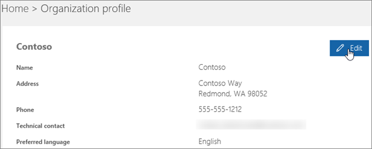

# Cambiar el idioma predeterminado en los saludos y los correos electrónicos

Si es [administrador global de Office 365](https://support.office.com/en-us/article/da585eea-f576-4f55-a1e0-87090b6aaa9d), puede configurar Skype Empresarial para que reproduzca el saludo predeterminado del correo de voz en otro idioma. El saludo predeterminado del sistema es similar a: "Deje un mensaje para John Smith. Grabe su mensaje después del tono. Cuando termine la grabación, cuelgue o presione la tecla almohadilla para tener acceso a otras opciones". 
  
 **Primero, lea esta información importante:**
  
- **Los idiomas disponibles dependen de la ubicación de su organización**. Por ejemplo, si su organización está en Estados Unidos, puede definir su idioma predeterminado como inglés o español. Si su organización está ubicada en Canadá, puede elegir entre inglés y francés. Para obtener una lista de los idiomas admitidos, consulte [Idiomas de los saludos y mensajes del correo de voz de Skype Empresarial](languages-for-voicemail-greetings-and-messages.md).
    
- **No hay forma de cambiar el idioma del sistema para solo una persona de su organización.** Solo puede cambiar el idioma del saludo para todos los usuarios de la organización.
    
    > [!NOTE]
    > Los usuarios pueden cambiar el idioma del saludo mediante su configuración después de iniciar sesión. 
  
- **¿Desea grabar el mensaje del correo de voz saliente?** Consulte [Comprobar el correo de voz y las opciones de Skype Empresarial](https://support.office.com/en-us/article/2deea7f8-831f-4e85-a0d4-b34da55945a8).

- **¿Desea cambiar el idioma de símbolo del sistema de correo de voz?** Vaya a [https://mysettings.lync.com/voicemail](https://mysettings.lync.com/voicemail) y elija un nuevo idioma en **Idioma del símbolo del sistema**.
    
## Cambiar el idioma del sistema para todos los usuarios de la organización

1. Iniciar sesión con su cuenta de [administrador global de Office 365](https://support.office.com/en-us/article/da585eea-f576-4f55-a1e0-87090b6aaa9d) en[https://portal.office.com/adminportal/home](https://portal.office.com/adminportal/home). 
    
2. En el Centro de administración, elija **Configuración** > **Perfil de organización**. 
    
     
  
3. Elija **Edit**.
    
    
  
4. Seleccione un idioma en la lista **Idioma preferido** para todos los usuarios de la organización.
    
5. Elija **Guardar**.
    
## Artículos relacionados para el administrador

- [¿Qué son los Planes de llamada en Office 365?](what-are-calling-plans-in-office-365.md)
    
- [Configurar Planes de llamada](set-up-calling-plans.md)
    
- [Planificar el Sistema telefónico de Office 365 con conectividad RTC local en Skype Empresarial Server 2015 o Lync Server 2013](https://go.microsoft.com/fwlink/?LinkId=717947)
    
## Temas relacionados

- [Cambiar el idioma y la zona horaria de la interfaz de usuario en Office 365 para empresas](https://support.office.com/en-us/article/Change-your-display-language-and-time-zone-in-Office-365-for-Business-6f238bff-5252-441e-b32b-655d5d85d15b)
    
- [Agregar un idioma o establecer preferencias de idioma en Office 2010 y versiones posteriores](https://support.office.com/en-us/article/Add-a-language-or-set-language-preferences-in-Office-663d9d94-ca99-4a0d-973e-7c4a6b8a827d)
    
- [Habilitar o cambiar el idioma de distribución del teclado](https://support.office.com/en-us/article/Enable-or-change-a-keyboard-layout-language-1c2242c0-fe15-4bc3-99bc-535de6f4f258)
    
  
 
