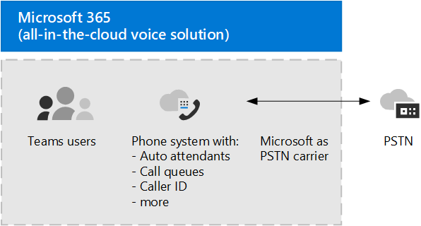

# Planear la solución de voz de TeamsPlan your Teams voice solution 

Este artículo le ayudará a decidir qué solución de voz de Microsoft es la adecuada para su organización.This article helps you decide which Microsoft voice solution is right for your organization. Una vez que haya decidido, el artículo le proporciona una guía básica para el contenido que le permitirá implementar la solución elegida.After you've decided, the article provides a roadmap to content that will enable you to implement your chosen solution. 

Es posible que desee el sistema telefónico de la solución más simple &mdash; con plan de llamadas.You might want the simplest solution&mdash;Phone System with Calling Plan. Esta es la solución todo en la nube de Microsoft que proporciona la funcionalidad de la conmutación de sucursales privadas (PBX) y las llamadas a la red de telefonía pública conmutada (RTC), como se muestra en el siguiente diagrama.This is Microsoft's all-in-the-cloud solution that provides Private Branch Exchange (PBX) functionality and calls to the Public Switched Telephone Network (PSTN), as shown in the following diagram. Con esta solución, Microsoft es tu operador PSTN.With this solution, Microsoft is your PSTN carrier.

Si responde afirmativamente a lo siguiente, el sistema telefónico con el plan de llamadas es la solución adecuada para usted:If you answer yes to the following, then Phone System with Calling Plan is the right solution for you:

- El plan de llamadas está disponible en tu región.Calling Plan is available in your region.
- No es necesario que conserve su operador PSTN actual.You do not need to retain your current PSTN carrier.
- Desea usar el acceso administrado por Microsoft a la RTC.You want to use Microsoft-managed access to the PSTN.

Sin embargo, es posible que su situación sea más compleja.However, your situation might be more complex. Por ejemplo, puede que tenga oficinas en ubicaciones en las que el plan de llamadas no está disponible.For example, you might have offices in locations where Calling Plan isn't available. O puede que necesite una solución combinada que admita una implementación compleja multinacional, con diferentes requisitos para diferentes ubicaciones geográficas.Or you might need a combination solution that supports a complex, multi-national deployment, with different requirements for different geographic locations. Microsoft admite una combinación de soluciones:Microsoft supports a combination of solutions: 

- Sistema telefónico con plan de llamadasPhone System with Calling Plan
- Sistema telefónico con su propio operador de RTC con enrutamiento directoPhone System with your own PSTN carrier with Direct Routing
- Una solución combinada que usa el sistema telefónico con un plan de llamadas y un sistema telefónico con enrutamiento directoA combination solution that uses both Phone System with Calling Plan and Phone System with Direct Routing

## ¿Qué necesita leer?What do you need to read?

**Necesario para todos.****Required for all.** Algunas de las secciones de este artículo pertenecen a todas las organizaciones.Some of the sections in this article pertain to all organizations. Por ejemplo, todo el mundo debe leer acerca del sistema telefónico y comprender las opciones para conectarse a la red de telefonía pública conmutada (RTC).For example, everyone should read about Phone System and understand the options for connecting to the Public Switched Telephone Network (PSTN). 

| Necesario para todos losRequired for all | DescripciónDescription |
| :------------|:-------|
| [**Sistema telefónico****Phone System**](#phone-system) | La tecnología de Microsoft para habilitar el control de llamadas y las capacidades de central de conmutación (PBX) en la nube de Microsoft 365 con Microsoft Teams.Microsoft's technology for enabling call control and Private Branch Exchange (PBX) capabilities in the Microsoft 365 cloud with Microsoft Teams. |
| [**Opciones de conectividad de la red de telefonía pública conmutada (RTC)****Public Switched Telephone Network (PSTN) connectivity options**](#public-switched-telephone-network-connectivity-options) | Elegir entre usar Microsoft como su operador de telefonía o conectar su propio operador de telefonía a Microsoft Teams mediante enrutamiento directo.A choice between using Microsoft as your telephony carrier or connecting your own telephony carrier to Microsoft Teams by using Direct Routing. En combinación con el sistema telefónico, las opciones de conectividad RTC permiten a los usuarios hacer llamadas telefónicas en todo el mundo.Combined with Phone System, PSTN connectivity options enable your users to make phone calls all over the world.|

**En función de sus necesidades.****Depending on your requirements.** Algunas de las secciones de este artículo son pertinentes en función de la implementación y los requisitos existentes.Some of the sections in this article are pertinent depending on your existing deployment and requirements. Por ejemplo, Location-Based enrutamiento solo es necesario para los clientes de enrutamiento directo en ubicaciones geográficas que no permiten omisión de pago.For example, Location-Based Routing is only required for Direct Routing customers in geographic locations that do not allow toll bypass.

Considere cuál de estas configuraciones adicionales puede necesitar:Consider which of these additional configurations you might need:

| En función de sus necesidadesDepending on your requirements | DescripciónDescription |
| :------------|:-------|
| [**Números de teléfono de Microsoft****Phone numbers from Microsoft**](#phone-numbers-from-microsoft) | Cómo obtener y administrar números de teléfono de Microsoft y cómo transferir números existentes a Microsoft.How to get and manage phone numbers from Microsoft, and how to transfer existing numbers to Microsoft. Lea esto si necesita obtener números de teléfono para el plan de llamadas de Microsoft, transferir números existentes, obtener números de servicio, etc.Read this if you need to obtain phone numbers for Microsoft Calling Plan, transfer existing numbers, obtain service numbers, and so on. |
| [**Planes de marcado y enrutamiento de llamadas****Dial plans and call routing**](#dial-plans-and-call-routing) | Cómo configurar y administrar planes de marcado que traducen números de teléfono marcados a un formato alternativo (por lo general, formato E. 164) para la autorización de llamadas y el enrutamiento de llamadas.How to configure and manage dial plans that translate dialed phone numbers into an alternate format (typically E.164 format) for call authorization and call routing. Lea esto si necesita comprender qué son los planes de marcado y si necesita especificar planes de marcado para su organización.Read this if you need to understand what dial plans are and  whether you need to specify dial plans for your organization.|
| [**Llamadas de emergencia****Emergency calling**](#emergency-calling) | Cómo administrar y configurar &mdash; las llamadas de emergencia según su opción de conectividad RTC.How to manage and configure emergency calling&mdash;depending on your PSTN connectivity option. Lea esta sección si está usando el plan de llamadas de Microsoft o el enrutamiento directo y necesita comprender cómo administrar las llamadas de emergencia para su organización.Read this section if you are using Microsoft Calling Plan or Direct Routing and need to understand how to manage emergency calling for your organization. |
| [**Enrutamiento basado en la ubicación para el enrutamiento directo****Location-Based Routing for Direct Routing**](#location-based-routing-for-direct-routing) |Cómo usar Location-Based Routing (LBR) para restringir el omisión de pago para los usuarios de Microsoft Teams en función de su ubicación geográfica.How to use Location-Based Routing (LBR) to restrict toll bypass for Microsoft Teams users based on their geographic location. Lea esta sección si su organización usa el enrutamiento directo en un lugar que no permite la omisión de pago.Read this section if your organization is using Direct Routing at a location that does not allow toll bypass.
| [**Topología de red para características de voz en la nube****Network topology for cloud voice features**](#network-topology-for-voice-features) | Si su organización está implementando Location-Based enrutamiento (LBR) para el enrutamiento directo o las llamadas de emergencia dinámicas, debe configurar las opciones de red para su uso con estas características de Microsoft Teams.If your organization is deploying Location-Based Routing (LBR) for Direct Routing or dynamic emergency calling, you must configure network settings for use with these features in Microsoft Teams. Lea esta sección si va a implementar LBR para el enrutamiento directo o si está implementando llamadas de emergencia dinámicas con un plan de llamadas o un enrutamiento directo.Read this section if you are implementing LBR for Direct Routing, or if you are implementing dynamic emergency calling with Calling Plan or Direct Routing. |
| [**Migrar la solución de voz existente****Migrate your existing voice solution**](#migrate-your-existing-voice-solution-to-teams) | Qué tiene que pensar al migrar su solución de voz a teams.What you need to think about when migrating your voice solution to Teams.  Lea esta sección si va a migrar desde una solución de voz existente a teams.Read this section if you are migrating from an existing voice solution to Teams. 

> [!Important]
> Este artículo se centra en las soluciones de voz con Microsoft Teams.This article focuses on voice solutions with Microsoft Teams. Aunque las soluciones con Skype empresarial online siguen estando disponibles (según se describe en [soluciones de telefonía de Microsoft](https://docs.microsoft.com/SkypeForBusiness/hybrid/msft-telephony-solutions)), es importante comprender que Skype empresarial online se retirará el 31 de julio de 2021.While solutions with Skype for Business Online are still available (as described in [Microsoft telephony solutions](https://docs.microsoft.com/SkypeForBusiness/hybrid/msft-telephony-solutions)), it's important to understand that Skype for Business Online will be retired on July 31, 2021.  Después de esa fecha, el servicio de Skype empresarial online ya no será accesible.After that date, the Skype for Business Online service will no longer be accessible. Además, ya no se admite la conectividad RTC entre el entorno local, ya &mdash; sea a través de Skype empresarial Server o Cloud Connector Edition, &mdash; y Skype empresarial online.In addition, PSTN connectivity between your on-premises environment&mdash;whether through Skype for Business Server or Cloud Connector Edition&mdash;and Skype for Business Online will no longer be supported. En este artículo se presentan las soluciones de voz de Teams y cómo puede conectar su red de telefonía local, si es necesario, a los equipos con enrutamiento directo.This article introduces Teams voice solutions and how you can connect your on-premises telephony network, if necessary, to Teams by using Direct Routing.

## Sistema telefónicoPhone System

Sistema telefónico es la tecnología de Microsoft para habilitar el control de llamadas y las capacidades de PBX (Private Branch Exchange) en la nube de Microsoft 365 o de Office 365 con Microsoft Teams.Phone System is Microsoft's technology for enabling call control and Private Branch Exchange (PBX) capabilities in the Microsoft 365 or Office 365 cloud with Microsoft Teams.

El sistema telefónico funciona con equipos o con clientes y dispositivos certificados de Skype empresarial.Phone System works with Teams or Skype for Business clients and certified devices. El sistema telefónico le permite reemplazar el sistema PBX existente por un conjunto de características que se proporcionan directamente desde Microsoft 365 u Office 365.Phone System allows you to replace your existing PBX system with a set of features directly delivered from Microsoft 365 or Office 365. 

Las llamadas entre usuarios de su organización se controlan internamente en el sistema telefónico y nunca van a la red de telefonía pública conmutada (RTC).Calls between users in your organization are handled internally within Phone System, and never go to the Public Switched Telephone Network (PSTN). Esto se aplica a las llamadas entre usuarios de la organización que se encuentran en áreas geográficas diferentes, eliminando los costos de larga distancia de estas llamadas internas.This applies to calls between users in your organization located in different geographical areas, removing long-distance costs on these internal calls.

En este artículo se presentan las siguientes características y funciones de clave de sistema telefónica, así como las decisiones de implementación que debe tener en cuenta:This article introduces the following Phone System key features and functionality, and the deployment decisions you'll need to consider:

- [Operadores automáticos y las colas de llamadasAuto attendants and call queues](#auto-attendants-and-call-queues)
- [Correo de voz en la nubeCloud Voicemail](#cloud-voicemail)
- [Identidad de llamadasCalling identity](#calling-identity)

Para obtener más información sobre todas las características del sistema telefónico y cómo configurar el sistema telefónico, consulte los artículos siguientes:For information about all Phone System features, and how to set up Phone System, see the following articles:

- [Esto es lo obtiene con el Sistema telefónicoHere's what you get with Phone System](here-s-what-you-get-with-phone-system.md)
- [Configurar el sistema telefónico de su organizaciónSet up Phone System in your organization](setting-up-your-phone-system.md) 
  Describe cómo comprar y asignar licencias de sistema telefónico, administrar números de teléfono y establecer créditos de comunicación para números gratuitos.Describes how to buy and assign Phone System licenses, manage phone numbers, and set up communication credits for toll-free numbers. 

Para obtener información sobre la administración de dispositivos compatibles, consulte [administrar los dispositivos en Microsoft Teams](devices/device-management.md) y [Teams Marketplace](https://www.microsoft.com/microsoft-365/microsoft-teams/across-devices?ms.url=officecomteamsdevices&rtc=1).For information about managing supported devices, see [Manage your devices in Microsoft Teams](devices/device-management.md) and [Teams Marketplace](https://www.microsoft.com/microsoft-365/microsoft-teams/across-devices?ms.url=officecomteamsdevices&rtc=1).

### Operadores automáticos y colas de llamadasAuto attendants and Call queues

Los operadores automáticos permiten configurar opciones de menú para enrutar llamadas según la entrada de la persona que llama.Auto attendants allow you to set up menu options to route calls based on caller input. Las colas de llamadas son áreas de espera para las personas que llaman.Call queues are waiting areas for callers. Si se usan conjuntamente, los operadores automáticos y las colas de llamadas pueden enrutar fácilmente a las personas que llaman a la persona o al departamento correspondiente de su organización.Used together, auto attendants and call queues can easily route callers to the appropriate person or department in your organization.

Para obtener información sobre los operadores automáticos y las colas de llamadas, vea los artículos siguientes:For information about auto attendants and call queues, see the following articles:

- [Planear los operadores automáticos de Teams y las colas de llamadasPlan for Teams auto attendants and call queues](plan-auto-attendant-call-queue.md)
- [Configurar un operador automáticoSet up an auto attendant](create-a-phone-system-auto-attendant.md)
- [Crear una cola de llamadaCreate a call queue](create-a-phone-system-call-queue.md) 
- [Caso práctico de Contoso: los operadores automáticos y las colas de llamadasContoso case study: Auto attendants and call queues](voice-case-study-call-queues.md) 
  Describe cómo una corporación multinacional ficticia, Contoso, los operadores automáticos implementados y las colas de llamadas para su solución de voz.Describes how a fictional multi-national corporation, Contoso, implemented auto attendants and call queues for their voice solution.

### Correo de voz en la nubeCloud Voicemail

El buzón de voz de nube, basado en los servicios de buzón de voz de Azure, solo admite los depósitos de buzón de voz para Exchange mailboxes.Cloud Voicemail, powered by Azure Voicemail services, supports voicemail deposits to Exchange mailboxes only. No admite sistemas de correo electrónico de terceros.It doesn't support third-party email systems. 

El buzón de voz de nube incluye la transcripción del buzón de voz, que está habilitada para todos los usuarios de su organización de forma predeterminada.Cloud Voicemail includes voicemail transcription, which is enabled for all users in your organization by default. Las necesidades de su empresa pueden requerir que deshabilite la transcripción del buzón de voz para usuarios específicos o para todos los miembros de la organización.Your business needs might require that you disable voicemail transcription for specific users or everyone throughout the organization.

Para los usuarios solo en línea, el buzón de voz de nube se configura y se aprovisiona automáticamente para los usuarios después de que se les asigne una licencia de sistema telefónico.For online only users, Cloud Voicemail is automatically set up and provisioned for users after they are assigned a Phone System license. En el caso de los usuarios del sistema telefónico con un buzón de Exchange, tendrá que realizar pasos de configuración adicionales.For Phone System users with an Exchange mailbox, you will need to perform extra configuration steps. 

Para obtener más información sobre el buzón de voz de la nube y su configuración, vea los artículos siguientes:For more information about Cloud Voicemail and its configuration, see the following articles:

- [Planear el Correo de voz en la nubeSet up Cloud Voicemail](set-up-phone-system-voicemail.md)
- [Establecer directivas de buzón de voz en su organizaciónSet voicemail policies in your organization](set-up-phone-system-voicemail.md#setting-voicemail-policies-in-your-organization)

### Identidad de llamadasCalling identity

De forma predeterminada, todas las llamadas salientes usan el número de teléfono asignado como identidad de llamada (identificación de llamada).By default, all outbound calls use the assigned phone number as calling identity (caller ID). El destinatario de la llamada puede identificar rápidamente a la persona que llama y decidir si desea aceptar o rechazar la llamada.The recipient of the call can quickly identify the caller and decide whether to accept or reject the call. Para obtener información sobre cómo configurar la identificación de llamadas o para cambiar o bloquear la identificación de llamadas, vea [establecer la identificación de llamadas de un usuario](set-the-caller-id-for-a-user.md).For information about configuring caller ID or to change or block the caller ID, see [Set the caller ID for a user](set-the-caller-id-for-a-user.md). 

## Opciones de conectividad de red telefónica conmutada públicaPublic Switched Telephone Network connectivity options

El sistema telefónico proporciona capacidades completas de PBX para su organización.Phone System provides complete PBX capabilities for your organization. Sin embargo, para permitir que los usuarios puedan hacer llamadas fuera de su organización, debe conectar el sistema telefónico a la red de telefonía pública conmutada (RTC).However, to enable users to make calls outside your organization, you need to connect Phone System to the Public Switched Telephone Network (PSTN). Para conectar el sistema telefónico a la RTC, puede elegir una de las siguientes opciones:To connect Phone System to the PSTN, you can choose one of the following options:

- [**Sistema telefónico con plan de llamadas**](#phone-system-with-calling-plan).[**Phone System with Calling Plan**](#phone-system-with-calling-plan). Una solución todo en la nube con Microsoft como su operador PSTN.An all-in-the-cloud solution with Microsoft as your PSTN carrier.

- [**Sistema telefónico con su propia portadora RTC mediante el**](#phone-system-with-own-pstn-carrier-with-direct-routing) enrutamiento directo para conectar el entorno local con los equipos.[**Phone System with your own PSTN carrier**](#phone-system-with-own-pstn-carrier-with-direct-routing) by using Direct Routing to connect your on-premises environment to Teams.

También puede elegir una combinación de opciones, que le permite diseñar una solución para un entorno complejo o administrar una migración en varios pasos (más información sobre la migración más adelante).You can also choose a combination of options, which enables you to design a solution for a complex environment, or manage a multi-step migration (more about migration later).

### Sistema telefónico con plan de llamadasPhone System with Calling Plan 

Como se describió anteriormente en este artículo, el sistema telefónico con plan de llamadas es la solución de voz todo en la nube de Microsoft para los usuarios de Teams.As described earlier in this article, Phone System with Calling Plan is Microsoft's all-in-the-cloud voice solution for Teams users. Esta es la opción más sencilla que conecta el sistema telefónico de Microsoft con la red de telefonía pública conmutada (RTC) para permitir llamadas a teléfonos fijos y móviles de todo el mundo.This is the simplest option that connects Microsoft Phone System to the Public Switched Telephone Network (PSTN) to enable calls to landlines and mobile phones around the world. Con esta opción, Microsoft proporciona la funcionalidad de central de conmutación (PBX) para su organización y actúa como su operador PSTN, tal y como se muestra en el siguiente diagrama:With this option, Microsoft provides Private Branch Exchange (PBX) functionality for your organization and acts as your PSTN carrier, as shown in the following diagram:

Si responde afirmativamente a lo siguiente, el sistema telefónico con el plan de llamadas es la solución adecuada para usted:If you answer yes to the following, then Phone System with Calling Plan is the right solution for you:

- El plan de llamadas está disponible en tu región.Calling Plan is available in your region.
- No es necesario que conserve su operador PSTN actual.You do not need to retain your current PSTN carrier.
- Desea usar el acceso administrado por Microsoft a la RTC.You want to use Microsoft-managed access to the PSTN.

Con esta opción:With this option: 

- Usted recibe Microsoft Phone System con planes de llamadas nacionales e internacionales añadidos que permiten llamar a teléfonos de todo el mundo (según el nivel de servicio al que se les concede la licencia).You get Microsoft Phone System with added Domestic or International Calling Plans that enable calling to phones around the world (depending on the level of service being licensed).

- No es necesario implementar ni mantener una implementación local porque el plan de &mdash; llamadas funciona fuera de Microsoft 365 u Office 365.You do not require deployment or maintenance of an on-premises deployment&mdash;because Calling Plan operates out of Microsoft 365 or Office 365.

- Nota: si es necesario, puede elegir conectar un controlador de borde de sesión (SBC) compatible a través del enrutamiento directo para la interoperabilidad con sistemas PBX de terceros, dispositivos analógicos y otros equipos de telefonía de terceros admitidos por SBC.Note: If necessary, you can choose to connect a supported Session Border Controller (SBC) through Direct Routing for interoperability with third-party PBXs, analog devices, and other third-party telephony equipment supported by the SBC.

Esta opción requiere una conexión ininterrumpida a Microsoft 365 u Office 365.This option requires uninterrupted connection to Microsoft 365 or Office 365.

Para obtener más información sobre la planificación de llamadas, consulte los siguientes artículos:For more information about Calling Plan, see the following articles:

- [¿Qué plan de llamada es adecuado para usted?Which Calling Plan is right for you?](calling-plan-landing-page.md)
- [Cómo comprar un plan de llamadasHow to buy a Calling Plan](calling-plans-for-office-365.md)
- [Países y regiones donde el Plan de llamadas está disponibleCountry and region availability for Calling Plan](https://docs.microsoft.com/microsoftteams/country-and-region-availability-for-audio-conferencing-and-calling-plans/country-and-region-availability-for-audio-conferencing-and-calling-plans)
- [Configurar plan de llamadasSet up Calling Plan](set-up-calling-plans.md)

### Sistema telefónico con su propio operador PSTN con enrutamiento directoPhone System with own PSTN carrier with Direct Routing

Esta opción conecta Microsoft Phone System a la red de telefonía mediante enrutamiento directo, como se muestra en el siguiente diagrama:This option connects Microsoft Phone System to your telephony network by using Direct Routing, as shown in the following diagram: 

Si responde afirmativamente a las siguientes preguntas, el sistema telefónico con enrutamiento directo es la solución adecuada para usted:If you answer yes to the following questions, then Phone System with Direct Routing is the right solution for you:

- Quiere usar Teams con el sistema telefónico.You want to use Teams with Phone System.
- Debes conservar tu operador de telefonía RTC actual.You need to retain your current PSTN carrier.
- Desea combinar el enrutamiento, con algunas llamadas que pasan por un plan de llamadas, algunas a través de su transportista.You want to mix routing, with some calls going through Calling Plan, some through your carrier.
- Necesita interoperar con PBX o equipos de terceros, como localizadores de overhead de Estados Unidos, dispositivos analógicos, etc.You need to interoperate with third-party PBXs and/or equipment such us overhead pagers, analog devices, and so on.

Con esta opción:With this option:

- Puede conectar su propio SBC compatible con Microsoft Phone System sin necesidad de software local adicional.You connect your own supported SBC to Microsoft Phone System without the need for additional on-premises software.

- Puede usar prácticamente cualquier operador de telefonía con Microsoft Phone System.You can use virtually any telephony carrier with Microsoft Phone System.

- Puede elegir configurar y administrar esta opción, o bien su transportista o socio puede configurarlo y administrarlo (pregunte si su transportista o socio proporciona esta opción).You can choose to configure and manage this option, or it can be configured and managed by your carrier or partner (ask if your carrier or partner provides this option).

- Puede configurar la interoperabilidad entre su equipo de telefonía &mdash; , como un PBX de terceros, dispositivos analógicos &mdash; y un sistema telefónico de Microsoft.You can configure interoperability between your telephony equipment&mdash;such as a third-party PBX and analog devices&mdash;and Microsoft Phone System.

Esta opción requiere lo siguiente:This option requires the following:

- Conexión ininterrumpida a Microsoft 365 u Office 365.Uninterrupted connection to Microsoft 365 or Office 365.

- Implementar y mantener una SBC compatible.Deploying and maintaining a supported SBC.

- Un contrato con un proveedor de terceros.A contract with a third-party carrier.
  (A menos que se implemente como una opción para proporcionar conexión a PBX de terceros, dispositivos analógicos u otros equipos de telefonía para usuarios que están en el sistema telefónico con el plan de llamadas).(Unless deployed as an option to provide connection to third-party PBX, analog devices, or other telephony equipment for users who are on Phone System with Calling Plan.)

Para obtener más información sobre el enrutamiento directo, consulte los artículos siguientes:For more information about Direct Routing, see the following articles:

- [Enrutamiento directo del Sistema telefónicoPhone System Direct Routing](direct-routing-landing-page.md)
- [Planear el enrutamiento directoPlan Direct Routing](direct-routing-plan.md)
- [Configurar el enrutamiento directoConfigure Direct Routing](direct-routing-configure.md)
- [Administrar directivas de enrutamiento de voz para usarlas con enrutamiento directoManage voice routing policies for use with Direct Routing](manage-voice-routing-policies.md)
- [Planear enrutamiento basado en la ubicación para el enrutamiento directoPlan Location-Based Routing for Direct Routing](location-based-routing-plan.md)
- [Lista de controladores de borde de sesión certificados para el enrutamiento directoList of Session Border Controllers certified for Direct Routing](direct-routing-border-controllers.md)

## Números de teléfono de MicrosoftPhone numbers from Microsoft

Microsoft tiene dos tipos de números telefónicos disponibles: números de *suscriptor* (usuario), que se pueden asignar a los usuarios de su organización, y números de *servicio* , disponibles como números de servicio de pago y gratuitos.Microsoft has two types of telephone numbers available: *subscriber* (user) numbers, which can be assigned to users in your organization, and *service* numbers, available as toll and toll-free service numbers. Los números de servicio tienen una capacidad de llamadas simultáneas superior a la de los abonados y se pueden asignar a servicios como audioconferencias, operadores automáticos o colas de llamadas.Service numbers have higher concurrent call capacity than subscriber numbers and can be assigned to services such as Audio Conferencing, Auto Attendants, or Call Queues.

Tendrá que decidir:You will need to decide:

- ¿Qué ubicaciones de usuario necesitan números de teléfono nuevos de Microsoft?Which user locations need new phone numbers from Microsoft?
- ¿Qué tipo de número de teléfono (suscriptor o servicio) necesito?Which type of telephone number (subscriber or service) do I need? 
- ¿Cómo Porto números de teléfono existentes a teams?How do I port existing phone numbers to Teams?

Para obtener más información sobre cómo administrar números de teléfono de su organización, como obtener números nuevos o transferir números de salida, consulte los artículos siguientes:For more information about managing phone numbers in your organization, including getting new numbers or transferring exiting numbers, see the following articles:

- [Administrar los números de teléfono de la organizaciónManage phone numbers for your organization](manage-phone-numbers-for-your-organization/manage-phone-numbers-for-your-organization.md) 
- [Diferentes tipos de números de teléfono usados para el plan de llamadasDifferent kinds of phone numbers used for Calling Plan](different-kinds-of-phone-numbers-used-for-calling-plans.md)
- [Obtener números de teléfono para los usuariosGetting phone numbers for your users](getting-phone-numbers-for-your-users.md)
- [Transferir números de teléfono a Microsoft TeamsTransfer phone numbers to Microsoft Teams](phone-number-calling-plans/transfer-phone-numbers-to-teams.md)

## Planes de marcado y enrutamiento de llamadasDial plans and call routing

Un plan de marcado es un conjunto de reglas de normalización que convierten los números de teléfono marcados en un formato alternativo (por lo general, formato E. 164) para la autorización de llamadas y el enrutamiento de llamadas.A dial plan is a set of normalization rules that translate dialed phone numbers into an alternate format (typically E.164 format) for call authorization and call routing.

Tendrá que decidir lo siguiente:You will need to decide the following: 

- ¿Mi organización necesita un plan de marcado personalizado?Does my organization need a customized dial plan?
- ¿Qué usuarios requieren un plan de marcado personalizado?Which users require a customized dial plan?
- ¿Qué plan de marcado de inquilino se debe asignar a cada usuario?Which tenant dial plan should be assigned to each user?

Para obtener más información, vea los artículos siguientes:For more information, see the following articles: 

- [¿Qué son los planes de marcado?What are dial plans?](what-are-dial-plans.md)
- [Planear planes de marcado de inquilinoPlan for tenant dial plans](what-are-dial-plans.md#planning-for-tenant-dial-plans)
- [Crear y administrar planes de marcadoCreate and manage dial plans](create-and-manage-dial-plans.md)

## Llamadas de emergenciaEmergency calling

La configuración de las llamadas de emergencia difiere según la opción de conectividad RTC: Plan de llamadas de Microsoft o enrutamiento directo.How you configure emergency calling differs depending on your PSTN connectivity option: Microsoft Calling Plan or Direct Routing. Llamadas de emergencia dinámicas para el plan de llamadas de Microsoft y el enrutamiento directo de sistema telefónico proporcionan la capacidad de configurar y enrutar llamadas de emergencia y de notificar al personal de seguridad en función de la ubicación actual del cliente de Teams.Dynamic emergency calling for Microsoft Calling Plan and Phone System Direct Routing provides the capability to configure and route emergency calls and notify security personnel based on the current location of the Teams client. Para obtener más información sobre los conceptos y la terminología de las llamadas de emergencia y sobre cómo configurar las llamadas de emergencia dinámicas, consulte los artículos siguientes:For more information about emergency calling concepts and terminology, and how to configure dynamic emergency calling, see the following articles:

- [Administrar las llamadas de emergenciaManage emergency calling](what-are-emergency-locations-addresses-and-call-routing.md)
- [Planear y configurar las llamadas de emergencia dinámicasPlan and configure dynamic emergency calling](configure-dynamic-emergency-calling.md)
- [Caso práctico de Contoso: llamadas de emergenciaContoso case study: Emergency calling](voice-case-study-emergency-calling.md) 
  Describe cómo una corporación multinacional ficticia, Contoso, ha implementado llamadas de emergencia para su organización.Describes how a fictional multi-national corporation, Contoso, implemented emergency calling for their organization.

## Enrutamiento de Location-Based para enrutamiento directoLocation-Based Routing for Direct Routing

En algunos países y regiones, no es ilegal eludir el proveedor de la red telefónica conmutada (RTC) para reducir los gastos de llamadas de larga distancia.In some countries and regions, it's illegal to bypass the Public Switched Telephone Network (PSTN) provider to decrease long-distance calling costs. Location-Based enrutamiento para enrutamiento directo le permite restringir el omisión de pago para los usuarios de Microsoft Teams en función de su ubicación geográfica.Location-Based Routing for Direct Routing enables you to restrict toll bypass for Microsoft Teams users based on their geographic location. Para obtener más información sobre cómo planear y configurar Location-Based Routing (LBR), consulte los artículos siguientes:For more information about how to plan and configure Location-Based Routing (LBR), see the following articles:

- [Planear enrutamiento basado en la ubicación para el enrutamiento directoPlan Location-Based Routing for Direct Routing](location-based-routing-plan.md)
- [Configuración de red de enrutamiento basado en la ubicaciónConfigure network settings for Location-Based Routing](location-based-routing-configure-network-settings.md)
- [Habilitar enrutamiento basado en la ubicación para el enrutamiento directoEnable Location-Based Routing for Direct Routing](location-based-routing-enable.md)
- [Caso práctico de Contoso: enrutamiento de Location-BasedContoso case study: Location-Based Routing](voice-case-study-location-based-routing.md) 
  Describe cómo una corporación multinacional ficticia, Contoso, implementada Location-Based el enrutamiento de su organización.Describes how a fictional multi-national corporation, Contoso, implemented Location-Based Routing for their organization.

## Topología de red para características de vozNetwork topology for voice features

Si va a implementar las llamadas de emergencia dinámicas o el enrutamiento de Location-Based para el enrutamiento directo, debe configurar las opciones de red para su uso con estas características en Microsoft Teams.If you are deploying dynamic emergency calling or Location-Based Routing for Direct Routing, you must configure network settings for use with these features in Microsoft Teams. Para obtener información sobre cómo configurar las opciones de red para regiones de red, sitios de red, subredes de red y direcciones IP de confianza, consulte los artículos siguientes:To learn how to configure network settings for network regions, network sites, network subnets, and trusted IP addresses, see the following articles:

- [Configuración de red de las características de voz en la nube en Microsoft Teams: conceptos y terminologíaNetwork settings for cloud voice features in Microsoft Teams - Concepts and terminology](cloud-voice-network-settings.md)
- [Administrar la topología de red para las características de voz en la nube en Microsoft TeamsManage your network topology for cloud voice features in Microsoft Teams](manage-your-network-topology.md)

## Migrar su solución de voz existente a teamsMigrate your existing voice solution to Teams

En el caso de una organización que está actualizando a Teams, el último objetivo es mover todos los usuarios al modo TeamsOnly.For an organization that is upgrading to Teams, the ultimate goal is to move all users to TeamsOnly mode. El uso del sistema telefónico con Teams solo se admite cuando el usuario está en modo TeamsOnly.Using Phone System with Teams is only supported when the user is in TeamsOnly mode. Si necesita información básica sobre la actualización a Teams, empiece aquí:If you need basic information about upgrading to Teams, start here:

- [Introducción a su actualización de Microsoft TeamsGetting started with your Microsoft Teams upgrade](upgrade-start-here.md)
- [Acerca del marco de actualizaciónAbout the upgrade framework](upgrade-framework.md)
- [Actualizar de Skype empresarial a teams: para administradores de tiUpgrade from Skype for Business to Teams — for IT administrators](upgrade-to-teams-on-prem-overview.md)

Al migrar la solución de voz, hay cuatro escenarios posibles de llamadas al pasar al modo TeamsOnly:When migrating your voice solution, there are four possible calling scenarios when moving to TeamsOnly mode:

- [**Un usuario de Skype empresarial online con un plan de llamadas de Microsoft**](upgrade-to-teams-on-prem-pstn-considerations.md#from-skype-for-business-online-with-microsoft-calling-plans).[**A user in Skype for Business Online, with a Microsoft Calling Plan**](upgrade-to-teams-on-prem-pstn-considerations.md#from-skype-for-business-online-with-microsoft-calling-plans). Después de la actualización, este usuario seguirá teniendo un plan de llamadas de Microsoft.Upon upgrade, this user will continue to have a Microsoft Calling Plan.

- **[Un usuario de Skype empresarial online con funcionalidad de voz local](upgrade-to-teams-on-prem-pstn-considerations.md#from-skype-for-business-online-with-on-premises-voice) a través de Skype empresarial local o Cloud Connector Edition**.**[A user in Skype for Business Online, with on-premises voice functionality](upgrade-to-teams-on-prem-pstn-considerations.md#from-skype-for-business-online-with-on-premises-voice) through Skype for Business on-premises or Cloud Connector Edition**. La actualización del usuario a teams debe coordinarse con la migración del usuario al enrutamiento directo para garantizar que el usuario de TeamsOnly tiene la funcionalidad de RTC.The user’s upgrade to Teams needs to be coordinated with migration of the user to Direct Routing to ensure the TeamsOnly user has PSTN functionality.

- **[Un usuario de Skype empresarial local con telefonía IP empresarial](upgrade-to-teams-on-prem-pstn-considerations.md#from-skype-for-business-server-on-premises-with-enterprise-voice-to-direct-routing), que se va a migrar a en línea y mantener la conectividad RTC local**.**[A user in Skype for Business on-premises with Enterprise Voice](upgrade-to-teams-on-prem-pstn-considerations.md#from-skype-for-business-server-on-premises-with-enterprise-voice-to-direct-routing), who will be moving to online and keeping on-premises PSTN connectivity**. Migrar este usuario a teams requiere mover la cuenta de Skype empresarial local del usuario a la nube y coordinar ese movimiento con la migración del usuario al enrutamiento directo.Migrating this user to Teams requires moving the user’s on-premises Skype for Business account to the cloud, and coordinating that move with migration of the user to Direct Routing. 

- **[Un usuario de Skype empresarial local con telefonía IP empresarial](upgrade-to-teams-on-prem-pstn-considerations.md#from-skype-for-business-server-on-premises-with-enterprise-voice-to-microsoft-calling-plan), que se va a migrar a en línea y usar un plan de llamadas de Microsoft**.**[A user in Skype for Business on-premises with Enterprise Voice](upgrade-to-teams-on-prem-pstn-considerations.md#from-skype-for-business-server-on-premises-with-enterprise-voice-to-microsoft-calling-plan), who will be moving to online and using a Microsoft Calling plan**.  Migrar este usuario a teams requiere mover la cuenta de Skype empresarial local del usuario a la nube y coordinar el movimiento con una o A una) el puerto del número de ese usuario a un plan de llamadas de Microsoft o B asignar un nuevo número de suscriptor de las regiones disponibles.Migrating this user to Teams requires moving the user’s on-premises Skype for Business account to the cloud, and coordinating that move with either A) the port of that user’s phone number to a Microsoft Calling Plan or B) assigning a new subscriber number from available regions.

Para obtener más información sobre cómo implementar la migración de voz para cada uno de estos escenarios &mdash; , incluida información sobre Cuándo es necesario configurar la conectividad híbrida y cómo migrar usuarios con funcionalidad de voz local para el enrutamiento directo, &mdash; consulte los artículos siguientes:For more information about how to implement your voice migration for each of these scenarios&mdash;including information about when you need to set up hybrid connectivity and how to migrate users with on-premises voice functionality to Direct Routing&mdash;see the following articles:

- [Consideraciones sobre RTC al actualizar a teams: para administradores de tiPSTN considerations when upgrading to Teams — for IT administrators](upgrade-to-teams-on-prem-pstn-considerations.md)

- [Caso práctico de migración de voz de ContosoContoso voice migration case study](voice-case-study-overview.md) 
  El caso práctico describe cómo una corporación multinacional ficticia, Contoso, ha implementado una solución de voz de Teams para su organización.The case study describes how a fictional multi-national corporation, Contoso, implemented a Teams voice solution for their organization. Contiene los artículos siguientes:It contains the following articles:

  - [Plan de actualización de TeamsTeams upgrade plan](voice-case-study-migration-plan.md)
  - [Opciones de conectividad RTC y sistema telefónicoPhone System and PSTN connectivity options](voice-case-study-phone-system.md)
  - [Implementación de enrutamiento basada en la ubicaciónLocation-Based Routing implementation](voice-case-study-location-based-routing.md)
  - [Llamadas de emergenciaEmergency calling](voice-case-study-emergency-calling.md)
  - [Operadores automáticos y las colas de llamadasAuto attendants and call queues](voice-case-study-call-queues.md)
  - [AudioconferenciaAudio Conferencing](voice-case-study-audio-conferencing.md)

