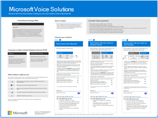

# Planear la solución de voz de Teams

Este artículo le ayudará a decidir qué solución de voz de Microsoft es la adecuada para su organización. Una vez que lo haya decidido, el artículo proporciona una hoja de ruta al contenido que le permitirá implementar la solución elegida.

Es posible que desee la solución&mdash;más sencilla Sistema telefónico con plan de llamadas. Esta opción es la solución todo en la nube de Microsoft que proporciona funcionalidad de central de conmutación (PBX) y llamadas a la red telefónica conmutada (RTC), como se muestra en el siguiente diagrama. Con esta solución, Microsoft es su operador de RTC.

Si responde sí a lo siguiente, sistema telefónico con plan de llamadas es la solución adecuada para usted:

- Plan de llamadas está disponible en su región.
- No es necesario que conserve su operador DE RTC actual.
- Desea usar el acceso administrado por Microsoft a la RTC.

Sin embargo, su situación puede ser más compleja. Por ejemplo, es posible que tenga oficinas en ubicaciones donde plan de llamadas no está disponible. O tal vez necesite una solución combinada que admita una implementación compleja y multinacional, con diferentes requisitos para diferentes ubicaciones geográficas. Microsoft admite una combinación de soluciones:

- Sistema telefónico con plan de llamadas
- Sistema telefónico con tu propio operador RTC con Operador Connect
- Sistema telefónico con su propio operador móvil RTC con Teams Phone Mobile 
- Sistema telefónico con su propio operador RTC con enrutamiento directo
- Una solución combinada que usa sistema telefónico con plan de llamadas, sistema telefónico con conexión de operador y/o sistema telefónico con enrutamiento directo

Para obtener un resumen visual de todas las opciones de solución de voz, consulte el póster de soluciones de voz.

   [PDF](https://download.microsoft.com/download/4/3/5/435cd4e9-ca56-4fd1-acb6-d1fda7952320/microsoft-voice-solutions.pdf)  [Visio](https://download.microsoft.com/download/7/5/c/75c13012-e20c-48bd-a6dd-ea49d1a3420d/microsoft-voice-solutions.vsdx) 
 

>[!NOTE]
>Si es una empresa pequeña o mediana (300 personas o menos), Microsoft ahora incluye Phone System con un plan de llamadas nacionales. Para obtener más información, consulte [Guía del sistema telefónico para pequeñas y medianas empresas](/microsoftteams/business-voice/whats-business-voice) para ayudarle a planear, configurar y administrar su solución de voz.

## ¿Qué necesita leer?

**Necesario para todos.** Algunas de las secciones de este artículo pertenecen a todas las organizaciones. Por ejemplo, todos deben leer sobre Sistema telefónico y comprender las opciones para conectarse a la red telefónica conmutada (RTC).

| Necesario para todos | Descripción |
| :------------|:-------|
| [**Sistema telefónico**](#phone-system) | La tecnología de Microsoft para habilitar el control de llamadas y las funcionalidades de central de centrales (PBX) en la nube de Microsoft 365 con Microsoft Teams. |
| [**Opciones de conectividad de red telefónica conmutada (RTC)**](#public-switched-telephone-network-connectivity-options) | Elija Microsoft como su operador de telefonía o conecte su propio operador de telefonía a Microsoft Teams mediante La conexión del operador o enrutamiento directo. En combinación con El sistema telefónico, las opciones de conectividad con RTC permiten a los usuarios realizar llamadas telefónicas en todo el mundo.|

**Dependiendo de sus requisitos.** Algunas de las secciones de este artículo y los artículos relacionados son pertinentes en función de la implementación y los requisitos existentes. Por ejemplo, Location-Based Enrutamiento solo es necesario para los clientes de enrutamiento directo en ubicaciones geográficas que no permiten la omisión de peaje.

Considere cuál de estas otras configuraciones podría necesitar:

| Según sus requisitos | Descripción |
| :------------|:-------|
| [**Administración de números de teléfono**](pstn-connectivity.md#phone-number-management) | La forma de obtener y administrar números de teléfono varía según la opción de conectividad con RTC. Lea esta sección si necesita obtener números de teléfono, transferir números existentes, obtener números de servicio, etc. |
| [**Enrutamiento de llamadas y planes de marcado**](pstn-connectivity.md#call-routing-and-dial-plans) | Cómo configurar y administrar los planes de marcado que traducen los números de teléfono marcados a un formato alternativo (normalmente formato E.164) para la autorización y el enrutamiento de llamadas. Lea esta sección si necesita comprender qué son los planes de marcado y si necesita especificar planes de marcado para su organización.|
| [**Llamadas de emergencia**](pstn-connectivity.md#emergency-calling) | La forma de administrar y configurar las llamadas de emergencia varía según la opción de conectividad con RTC. Lea esta sección si necesita comprender cómo administrar las llamadas de emergencia para su organización. |
| [**Enrutamiento basado en ubicación para enrutamiento directo**](pstn-connectivity.md#location-based-routing-for-direct-routing) |Cómo usar Location-Based Routing (LBR) para restringir la omisión de pago para los usuarios de Microsoft Teams en función de su ubicación geográfica. Lea esta sección si su organización usa enrutamiento directo en una ubicación que no permite la omisión de peaje.
| [**Topología de red para las características de voz en la nube**](pstn-connectivity.md#network-topology-for-voice-features) | Si su organización está implementando Location-Based Routing (LBR) para enrutamiento directo o llamadas de emergencia dinámicas, debe configurar las opciones de red para estas características en Microsoft Teams. Lea esta sección si está implementando LBR para enrutamiento directo o si está implementando llamadas de emergencia dinámicas con plan de llamadas o enrutamiento directo. |
| [**Migrar la solución de voz existente**](#migrate-your-existing-voice-solution-to-teams) | Lo que debe pensar al migrar su solución de voz a Teams.  Lea esta sección si va a migrar desde una solución de voz existente a Teams. 

> [!Important]
> Este artículo se centra en las soluciones de voz con Microsoft Teams. Debido a la retirada de Skype Empresarial Online el 31 de julio de 2021, ya no se admite la conectividad con RTC entre su entorno&mdash;local, ya sea a través de Skype Empresarial Server o Cloud Connector Edition&mdash;y Skype Empresarial Online. En este artículo se presentan las soluciones de voz de Teams y cómo puede conectar su red de telefonía local, si es necesario, a Teams mediante Conexión del operador o Enrutamiento directo.

## Sistema telefónico

Phone System es la tecnología de Microsoft para habilitar el control de llamadas y las funcionalidades de la central de centrales (PBX) en la nube de Microsoft 365 con Microsoft Teams.

Phone System funciona con clientes de Teams y dispositivos certificados. Sistema telefónico le permite reemplazar su sistema PBX existente por un conjunto de características entregadas directamente desde Microsoft 365. 

Las llamadas entre usuarios de su organización, independientemente del área geográfica, se gestionan internamente dentro del sistema telefónico. Estas llamadas internas nunca van a la red telefónica conmutada (RTC), por lo que su empresa evita los cargos de larga distancia.

En este artículo se presentan las siguientes características y funciones clave del sistema telefónico y las decisiones de implementación que debe tener en cuenta:

- [Operadores automáticos y las colas de llamadas](#auto-attendants-and-call-queues)
- [Correo de voz en la nube](#cloud-voicemail)
- [Identidad de llamada](#calling-identity)

Para obtener información sobre todas las características del sistema telefónico y cómo configurar el sistema telefónico, consulte los artículos siguientes:

- [Esto es lo obtiene con el Sistema telefónico](here-s-what-you-get-with-phone-system.md)
- [Configurar Sistema telefónico en su organización](setting-up-your-phone-system.md) 
  Describe cómo comprar y asignar licencias de Sistema telefónico, administrar números de teléfono y configurar créditos de comunicación para números gratuitos. 

Para obtener información sobre la administración de dispositivos compatibles, consulte [Administrar los dispositivos en Microsoft Teams](devices/device-management.md) y [Teams Marketplace](https://www.microsoft.com/microsoft-365/microsoft-teams/across-devices?ms.url=officecomteamsdevices&rtc=1).

### Operadores automáticos y colas de llamadas

Los operadores automáticos le permiten configurar opciones de menú para enrutar llamadas en función de la entrada del autor de la llamada. Las colas de llamadas son áreas de espera para los autores de llamadas. Si se usan de forma conjunta, los operadores automáticos y las colas de llamadas pueden redirigir fácilmente los autores de llamadas a la persona o el departamento adecuados de su organización.

Para obtener información sobre operadores automáticos y colas de llamadas, consulte los artículos siguientes:

- [Planear operadores automáticos y colas de llamadas de Teams](plan-auto-attendant-call-queue.md)
- [Configurar un operador automático](create-a-phone-system-auto-attendant.md)
- [Crear una cola de llamada](create-a-phone-system-call-queue.md) 
- [Caso práctico de Contoso: Operadores automáticos y colas de llamadas](voice-case-study-call-queues.md) 
  Describe cómo una corporación multinacional ficticia, Contoso, implementó operadores automáticos y colas de llamadas para su solución de voz.

### Correo de voz en la nube

Correo de voz en la nube, con tecnología de los servicios de correo de voz de Azure, solo admite depósitos de correo de voz en buzones de Exchange. No admite sistemas de correo electrónico de terceros. 

El correo de voz en la nube cuenta con la opción de transcripción del correo de voz, la cual está activada de forma predeterminada para todos los usuarios de la organización. Es posible que las necesidades de su empresa requieran que deshabilite la transcripción del correo de voz para usuarios específicos o para todos los usuarios de la organización.

Correo de voz en la nube se configura y aprovisiona automáticamente para los usuarios de Teams.  

Para obtener más información sobre Correo de voz en la nube y su configuración, vea los artículos siguientes:

- [Configurar el Correo de voz en la nube](set-up-phone-system-voicemail.md)
- [Establecer directivas de correo de voz en su organización](manage-voicemail-policies.md)

### Identidad de llamada

De forma predeterminada, todas las llamadas salientes usan el número de teléfono asignado como identidad de llamada (identificador de llamada). El destinatario de la llamada puede identificar rápidamente a la persona que llama y decidir si desea aceptar o rechazar la llamada. Para obtener información sobre cómo configurar el identificador de llamada o para cambiar o bloquear el identificador de llamada, vea [Establecer el identificador de llamada de un usuario](set-the-caller-id-for-a-user.md). 

## Opciones de conectividad de red telefónica conmutada pública

Sistema telefónico proporciona funcionalidades PBX completas para su organización. Sin embargo, para permitir que los usuarios realicen llamadas fuera de su organización, debe conectar el sistema telefónico a la red telefónica conmutada (RTC). Para conectar El sistema telefónico a la RTC, puede elegir una de las siguientes opciones:

- [**Sistema telefónico con plan de llamadas**](pstn-connectivity.md#phone-system-with-calling-plan). Una solución todo en la nube con Microsoft como su operador de RTC.

- [**Sistema telefónico con su propio operador RTC mediante operador Connect**](operator-connect-plan.md). Con Operador Connect, si su operador existente participa en el programa Microsoft Operator Connect, podrá administrar el servicio para llevar las llamadas RTC a Teams. 

- [**Sistema telefónico con su propio operador de telefonía móvil RTC con Teams Phone Mobile**](operator-connect-mobile-plan.md). Con Teams Phone Mobile, si su operador actual participa en el programa Teléfono Microsoft Teams Mobile, puede administrar el servicio para usar números de teléfono móviles habilitados para SIM con Teams. 

- [**Sistema telefónico con su propio operador de RTC mediante el enrutamiento directo**](pstn-connectivity.md#phone-system-with-direct-routing) para conectar su entorno local a Teams.

Puede elegir una combinación de opciones que le permite diseñar una solución para un entorno complejo o administrar una migración en varios pasos. Más información sobre la migración más adelante.

La mayoría de las características del sistema telefónico son las mismas independientemente de la opción de conectividad con RTC que elija. Sin embargo, hay algunas diferencias en la funcionalidad que afectan a la forma en que configura determinadas características del sistema telefónico, como el enrutamiento de llamadas y las llamadas de emergencia. Para obtener más información sobre las opciones de conectividad y las consideraciones de configuración de RTC, vea [Opciones de conectividad de RTC](pstn-connectivity.md).

## Migrar la solución de voz existente a Teams

> [!NOTE]
> Para obtener instrucciones sobre cómo planear una solución de voz de Teams como parte de su plan general para actualizar a Teams desde Skype Empresarial Server, consulte [Consideraciones de RTC para actualizar a Teams desde Skype Empresarial local](upgrade-to-teams-on-prem-pstn-considerations.md).

Para una organización que está actualizando a Teams, el objetivo final es mover todos los usuarios al modo TeamsOnly. El uso del sistema telefónico solo se admite cuando el usuario se encuentra en el modo TeamsOnly. Si necesita información básica sobre la actualización a Teams, empiece aquí:

- [Introducción a su actualización de Microsoft Teams](upgrade-start-here.md)
- [Acerca del marco de actualización](upgrade-framework.md)
- [Estrategias de actualización para administradores de TI](upgrade-to-teams-on-prem-implement.md)

Al migrar la solución de voz, hay cuatro escenarios de llamada posibles al pasar al modo TeamsOnly:

- [**Un usuario de Skype Empresarial Online, con un plan de llamadas de Microsoft**](upgrade-to-teams-on-prem-pstn-considerations.md#from-skype-for-business-online-with-microsoft-calling-plans). Tras la actualización, este usuario seguirá teniendo un plan de llamadas de Microsoft.

- **[Un usuario de Skype Empresarial Online, con funcionalidad de voz local](upgrade-to-teams-on-prem-pstn-considerations.md#from-skype-for-business-online-with-on-premises-voice) a través de Skype Empresarial local o Cloud Connector Edition**. La actualización del usuario a Teams debe coordinarse con la migración del usuario a Enrutamiento directo para asegurarse de que el usuario de TeamsOnly tiene funcionalidad RTC.

- **[Un usuario de Skype Empresarial local con Telefonía IP empresarial](upgrade-to-teams-on-prem-pstn-considerations.md#from-skype-for-business-server-on-premises-with-enterprise-voice-to-direct-routing), que se moverá a en línea y mantendrá la conectividad con RTC local**. Migrar este usuario a Teams requiere mover la cuenta de Skype Empresarial local del usuario a la nube y coordinarlo con la migración del usuario a Enrutamiento directo. 

- **[Un usuario de Skype Empresarial local con Telefonía IP empresarial](upgrade-to-teams-on-prem-pstn-considerations.md#from-skype-for-business-server-on-premises-with-enterprise-voice-to-microsoft-calling-plan), que pasará a estar conectado y usando un plan de llamadas de Microsoft**.  Migrar este usuario a Teams requiere mover la cuenta de Skype Empresarial local del usuario a la nube y coordinar que mueva con A) el puerto del número de teléfono de ese usuario a un plan de llamadas de Microsoft o B) asignando un nuevo número de suscriptor de las regiones disponibles.

Para obtener más información sobre cómo implementar la migración de voz para cada uno de estos escenarios, vea los siguientes artículos:

- [Consideraciones de RTC al actualizar a Teams: para administradores de TI](upgrade-to-teams-on-prem-pstn-considerations.md)

- [Caso práctico de migración de voz de Contoso](voice-case-study-overview.md) 
  El caso práctico describe cómo una corporación multinacional ficticia, Contoso, implementó una solución de voz de Teams para su organización. Contiene los siguientes artículos:

  - [Plan de actualización de Teams](voice-case-study-migration-plan.md)
  - [Sistema telefónico y opciones de conectividad con RTC](voice-case-study-phone-system.md)
  - [Implementación de enrutamiento basado en ubicación](voice-case-study-location-based-routing.md)
  - [Llamadas de emergencia](voice-case-study-emergency-calling.md)
  - [Operadores automáticos y las colas de llamadas](voice-case-study-call-queues.md)
  - [Audioconferencia](voice-case-study-audio-conferencing.md)
