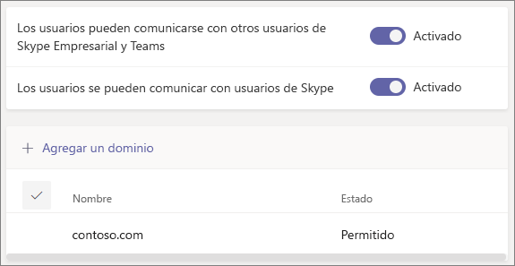

# Usar el acceso de invitados y el acceso externo para colaborar con personas fuera de su organización

Cuando necesite comunicarse y colaborar con otras personas fuera de su organización, Microsoft Teams le ofrece dos opciones:

- **Acceso externo**: un tipo de federación que permite a los usuarios buscar usuarios de otras organizaciones, así como llamarlos y chatear con ellos. Estas personas no se pueden agregar a los equipos a menos que se les invite.
- **Acceso de invitado**: el acceso de invitado le permite invitar a personas de fuera de la organización a unirse a un equipo. Las personas invitadas obtienen una cuenta de invitado en Azure Active Directory.

Tenga en cuenta que Teams le permite invitar a personas de fuera de su organización a reuniones. Esto no requiere que se configure el acceso externo ni de invitado.

## Acceso externo (federación)

Configure el acceso externo si necesita buscar personas de fuera de su organización que usen Teams, Skype Empresarial (en línea o local) o Skype, así como llamarlas o chatear y organizar reuniones con ellas. 

De forma predeterminada, el acceso externo está habilitado para todos los dominios. Puede permitir o bloquear dominios específicos, o desactivar el acceso externo, para restringirlo.

Para configurar el acceso externo, vea [Administrar el acceso externo](manage-external-access.md). 

## Acceso de invitado

Use el acceso de invitado para agregar a una persona de fuera de su organización a un equipo, donde puede chatear, llamar, reunirse y colaborar en archivos. A un invitado se le pueden dar casi todos los mismos permisos de Teams que a un miembro nativo de un equipo.

Los invitados se agregan al directorio de Azure Active Directory de la organización como usuarios B2B y deben iniciar sesión en Teams con su cuenta de invitado. Esto significa que es posible que un invitado tenga que cerrar sesión en su propia organización para iniciar sesión en la suya.

Para configurar el acceso de invitado para Teams, vea [Colaborar con invitados en un equipo](https://docs.microsoft.com/microsoft-365/solutions/collaborate-as-team).

## Comparación entre el acceso de invitado y el acceso externo

En las tablas siguientes se muestran las diferencias entre usar el acceso externo (federación) y los invitados. En ambos casos, se identifica a usuarios de fuera de la organización como externos.

### Cosas que pueden hacer los usuarios

| Los usuarios pueden | Usuarios de acceso externo | Invitados |
|---------|-----------------------|--------------------|
| Chatear con personas de otra organización | Sí | Sí |
| Llamar a alguien de otra organización | Sí | Sí |
| Ver si una persona de otra organización está disponible para una llamada o chat | Sí | Sí1 |
| Buscar personas de otras organizaciones | Sí2 | No |
| Compartir archivos | No | Sí |
| Ver el mensaje de fuera de la oficina | No | Sí |
| Bloquear a alguien en otra organización | No | Sí |
| Usar las @menciones | Sí3 | Sí |

### Cosas que pueden hacer las personas de fuera de la organización

| Las personas de fuera de la organización pueden | Usuarios de acceso externo | Invitados |
|---------|-----------------------|--------------------|
| Acceder a los recursos de Teams | No | Sí |
| Agregarse a un chat grupal | No | Sí |
| Invitarse a una reunión | Sí | Sí |
| Realizar llamadas privadas | Sí | Sí5 |
| Ver el número de teléfono de los participantes de la reunión por acceso telefónico | No4 | Sí |
| Usar vídeo IP | Sí | Sí5 |
| Uso compartido de la pantalla | Sí3 | Sí5 |
| Usar Reunirse ahora | No | Sí5 |
| Editar los mensajes enviados | Sí3 | Sí5 |
| Eliminar mensajes enviados | Sí3 | Sí5 |
| Usar Giphy en las conversaciones | Sí3 | Sí5 |
| Usar memes en las conversaciones | Sí3 | Sí5 |
| Usar adhesivos en las conversaciones | Sí3 | Sí5 |
| Se muestra la presencia | Sí | Sí |
| Usar las @menciones | Sí3 | Sí |

 

1 Si el usuario se ha agregado como invitado y ha iniciado sesión con la cuenta de invitado. 
2 Solo mediante la dirección de correo o el Protocolo de inicio de sesión (SIP). 
3 Compatible con chat individual entre dos usuarios de Teams solo de dos organizaciones diferentes.  
4 Por defecto, los participantes externos no pueden ver los números de teléfono de los participantes mediante teléfono. Si desea mantener la privacidad de estos números de teléfono, seleccione **Tonos** de **entrada/salida tipo de anuncio** (esto evita que los Teams lean los números). Para obtener más información, consulte [Activar o desactivar los anuncios de entrada y salida de las reuniones en Microsoft Teams.](turn-on-or-off-entry-and-exit-announcements-for-meetings-in-teams.md).  
5 Está permitido de forma predeterminada, pero el administrador de Teams puede desactivarlo.

## Temas relacionados

[Acceso externo a Teams](manage-external-access.md)

[Acceso de invitado a Teams](guest-access.md)

