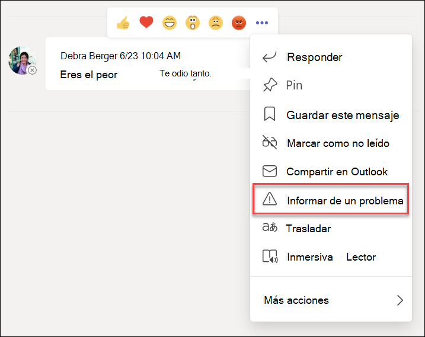

# Cumplimiento de la comunicación con Microsoft Teams

Microsoft Purview Communication Compliance es una solución de riesgo para participantes de Insider en Microsoft 365 que ayuda a minimizar los riesgos de comunicación al ayudarle a detectar, capturar y actuar en mensajes inadecuados de su organización.

Por Microsoft Teams, el cumplimiento de las comunicaciones ayuda a identificar los [siguientes tipos](/microsoft-365/compliance/communication-compliance-feature-reference) de contenido inapropiado en canales de Teams, canales de Teams privados o en chats individuales y grupales:

- Lenguaje ofensivo, profano y acosador
- Imágenes para adultos, racy y gory
- Uso compartido de información confidencial

Para obtener más información sobre el cumplimiento de comunicaciones y cómo configurar directivas para su organización, vea [Obtener información sobre el cumplimiento de las comunicaciones](/microsoft-365/compliance/communication-compliance).

## Cómo usar el cumplimiento de las comunicaciones en Microsoft Teams

El cumplimiento de las comunicaciones y los Microsoft Teams están estrechamente integrados y pueden ayudar a minimizar los riesgos de comunicación en su organización. Después de configurar las primeras directivas de cumplimiento de comunicaciones, puede administrar activamente mensajes de Microsoft Teams inadecuados y contenido marcados automáticamente en alertas.

### Introducción

La introducción al cumplimiento de las comunicaciones en Microsoft Teams comienza con [la planificación](/microsoft-365/compliance/communication-compliance-plan) y creación de directivas predefinidas o personalizadas para identificar actividades de usuario inadecuadas en Teams canales o en 1:1 y grupos. Tenga en cuenta que tendrá que [configurar](/microsoft-365/compliance/communication-compliance-configure) algunos permisos y requisitos previos básicos como parte del proceso de configuración.

Teams los administradores pueden configurar directivas de cumplimiento de comunicaciones en los siguientes niveles:

- **Nivel de usuario**: las directivas de este nivel se aplican a una Teams usuario individual o se pueden aplicar a todos los usuarios Teams de su organización. Estas directivas cubren los mensajes que estos usuarios pueden enviar en chats individuales o grupales. Las comunicaciones de chat para los usuarios se supervisan automáticamente en todas las Microsoft Teams en las que los usuarios son miembros.
- **nivel de Teams**: las directivas de este nivel se aplican a un canal de Microsoft Teams, incluido un canal privado. Estas directivas cubren los mensajes enviados solo en el canal Teams.

### Informar de un problema en Microsoft Teams

>[!NOTE]
>Los mensajes notificados por el usuario empezarán a estar disponibles para las organizaciones con licencia para [cumplimiento de comunicaciones](/microsoft-365/compliance/communication-compliance-configure#subscriptions-and-licensing) y Microsoft Teams a partir de mayo de 2022. Esta característica debería estar disponible para todas las organizaciones con licencia antes del 31 de agosto de 2022.

La opción *Informar de un problema* en Teams mensajes está habilitada de forma predeterminada y se puede controlar mediante las directivas de mensajería de Teams del [centro de administración de Teams](/microsoftteams/manage-teams-in-modern-portal). Esto permite a los usuarios de su organización enviar mensajes inadecuados para su revisión por parte de los revisores de cumplimiento de la comunicación para la directiva. Para obtener más información sobre los mensajes notificados por el usuario en cumplimiento de comunicaciones, vea [Directivas de cumplimiento de comunicaciones](/microsoft-365/compliance/communication-compliance-policies#user-reported-messages-policy).

Después de enviar el mensaje para su revisión, el usuario recibe una confirmación del envío en Microsoft Teams. Los demás participantes en el chat no ven esta notificación.

Los usuarios de su organización obtienen automáticamente la directiva global a menos que cree y asigne una directiva personalizada. Edite la configuración de la directiva global o cree y asigne una o más directivas personalizadas para activar o desactivar esta característica. Para obtener más información, vea [Administrar directivas de mensajería en Teams](/microsoftteams/messaging-policies-in-teams).

### Actuar sobre mensajes inadecuados en Microsoft Teams

Una vez que haya configurado las directivas y haya recibido alertas de cumplimiento de comunicaciones para mensajes de Microsoft Teams, es el momento de que los revisores de cumplimiento de su organización actúen en estos mensajes. Esto también incluirá mensajes notificados por el usuario si está habilitado para su organización. Los revisores pueden ayudar a proteger su organización revisando las alertas de cumplimiento de comunicaciones y quitando los mensajes marcados de la vista en Microsoft Teams.

Los mensajes y el contenido eliminados se reemplazan por notificaciones para los visores que explican que el mensaje o el contenido se ha quitado y qué directiva se aplica a la eliminación. El remitente del mensaje o contenido eliminado también recibe una notificación del estado de eliminación y se proporciona con el contenido del mensaje original para contextualizar su eliminación. El remitente también puede ver la condición de directiva específica que se aplica a la eliminación del mensaje.

Ejemplo de sugerencia de directiva que ha visto el remitente:

Ejemplo de notificación de directiva que ha visto el remitente:

Ejemplo de sugerencia de directiva que ha visto el destinatario:

