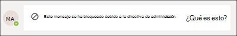

# Cumplimiento de comunicaciones con Microsoft TeamsCommunication compliance with Microsoft Teams

El cumplimiento de las comunicaciones es una solución de riesgo de Insider en Microsoft 365 que ayuda a minimizar los riesgos de comunicación al ayudarle a detectar, capturar y actuar en mensajes inadecuados en su organización.Communication compliance is an insider risk solution in Microsoft 365 that helps minimize communication risks by helping you detect, capture, and act on inappropriate messages in your organization.

Para Microsoft Teams, el  cumplimiento de las comunicaciones ayuda a identificar los siguientes tipos de contenido inadecuado en los canales de Teams o en chats grupales y 1:1:For Microsoft Teams, communication compliance helps identify the [following types](/microsoft-365/compliance/communication-compliance-feature-reference) of inappropriate content in Teams channels or in 1:1 and group chats:

- Lenguaje ofensivo, profano y acosanteOffensive, profane, and harassing language
- Imágenes de adultos, radas y peludosAdult, racy, and gory images
- Uso compartido de información confidencialSharing of sensitive information

Para obtener más información sobre el cumplimiento de las comunicaciones y cómo configurar directivas para su organización, vea Cumplimiento de comunicaciones [en Microsoft 365.](/microsoft-365/compliance/communication-compliance)For more information on communication compliance and how to configure policies for your organization, see [Communication compliance in Microsoft 365](/microsoft-365/compliance/communication-compliance).

## Cómo usar el cumplimiento de comunicaciones en Microsoft TeamsHow to use communication compliance in Microsoft Teams

El cumplimiento de las comunicaciones y Microsoft Teams están estrechamente integrados y pueden ayudar a minimizar los riesgos de comunicación en su organización.Communication compliance and Microsoft Teams are tightly integrated and can help minimize communication risks in your organization. Después de configurar las primeras directivas de cumplimiento de comunicaciones, puede administrar activamente los mensajes y el contenido inadecuados de Microsoft Teams que se marcan automáticamente en las alertas.After you've configured your first communication compliance policies, you can actively manage inappropriate Microsoft Teams messages and content that is automatically flagged in alerts.

### IntroducciónGetting started

Introducción al cumplimiento de comunicaciones  en Microsoft Teams comienza con la planificación y creación de directivas predefinidas o personalizadas para identificar actividades de usuario inadecuadas en los canales de Teams o en 1:1 y grupos.Getting started with communication compliance in Microsoft Teams begins with [planning](/microsoft-365/compliance/communication-compliance-plan) and creating pre-defined or custom policies to identify inappropriate user activities in Teams channels or in 1:1 and groups. Tenga en cuenta que necesitará  configurar algunos permisos y requisitos previos básicos como parte del proceso de configuración.Keep in mind that you'll need to [configure](/microsoft-365/compliance/communication-compliance-configure) some permissions and basic prerequisites as part of the configuration process.

Los administradores de Teams pueden configurar directivas de cumplimiento de comunicaciones en los siguientes niveles:Teams administrators can configure communication compliance policies at the following levels:

- **Nivel de usuario:** las directivas de este nivel se aplican a un usuario individual de Teams o se pueden aplicar a todos los usuarios de Teams de su organización.**User level**: Policies at this level apply to an individual Teams user or may be applied to all Teams users in your organization. Estas directivas cubren los mensajes que estos usuarios pueden enviar en chats grupales o 1:1.These policies cover messages that these users may send in 1:1 or group chats. Las comunicaciones de chat para los usuarios se supervisan automáticamente en todos los Microsoft Teams en los que los usuarios son miembros.Chat communications for the users are automatically monitored across all Microsoft Teams where the users are a member.
- **Nivel de Teams:** las directivas de este nivel se aplican a un canal de Microsoft Team.**Teams level**: Policies at this level apply to a Microsoft Team channel. Estas directivas abarcan solo los mensajes enviados en el canal de Teams.These policies cover messages sent in the Teams channel only.

### Actuar sobre mensajes inadecuados en Microsoft TeamsAct on inappropriate messages in Microsoft Teams

Después de configurar las directivas y haber recibido alertas de cumplimiento de comunicaciones para los mensajes de Microsoft Teams, es el momento de que los revisores de cumplimiento de su organización tomen medidas en estos mensajes.After you have configured your policies and have received communication compliance alerts for Microsoft Teams messages, it's time for compliance reviewers in your organization to take action on these messages. Los revisores pueden ayudar a proteger su organización revisando las alertas de cumplimiento de comunicaciones y quitando los mensajes marcados de la vista en Microsoft Teams.Reviewers can help safeguard your organization by reviewing communication compliance alerts and removing flagged messages from view in Microsoft Teams.

Los mensajes y el contenido eliminados se reemplazan por notificaciones para los visores que explican que el mensaje o el contenido se ha quitado y qué directiva se aplica a la eliminación.Removed messages and content are replaced with notifications for viewers explaining that the message or content has been removed and what policy is applicable to the removal. Al remitente del mensaje o contenido quitado también se le notifica el estado de eliminación y se le proporciona el contenido original del mensaje para el contexto relacionado con su eliminación.The sender of the removed message or content is also notified of the removal status and provided with original message content for context relating to its removal. El remitente también puede ver la condición de directiva específica que se aplica a la eliminación del mensaje.The sender can also view the specific policy condition that applies to the message removal.

Ejemplo de sugerencia de directiva que ve el remitente:Example of policy tip seen by sender:

Ejemplo de notificación de condición de directiva que ha visto el remitente:Example of policy condition notification seen by the sender:

Ejemplo de sugerencia de directiva que ve el destinatario:Example of policy tip seen by recipient:

