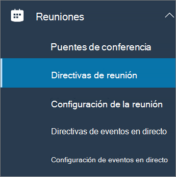
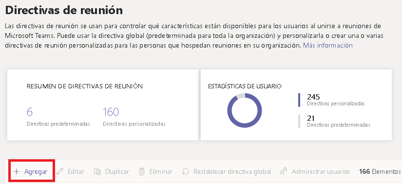
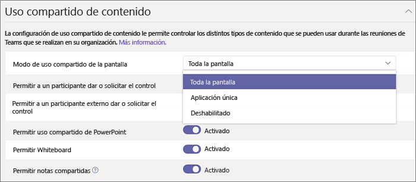

Configure el uso compartido del escritorio en Microsoft TeamsConfigure desktop sharing in Microsoft Teams
============================================

Al compartir el escritorio, los usuarios pueden presentar una pantalla o aplicación durante una reunión o un chat.Desktop sharing lets users present a screen or app during a meeting or chat. Los administradores pueden configurar la pantalla compartiendo en Microsoft Teams para que los usuarios puedan compartir una pantalla completa, una aplicación o un archivo.Admins can configure screen sharing in Microsoft Teams to let users share an entire screen, an app, or a file. Puede permitir que los usuarios puedan dar control, permitir el uso compartido de PowerPoint, agregar una pizarra y permitir notas compartidas.You can let users give or request control, allow PowerPoint sharing, add a whiteboard, and allow shared notes. Asimismo, puede configurar si los usuarios anónimos o externos pueden solicitar el control de la pantalla compartida.You can also configure whether anonymous or external users can request control of the shared screen. Los participantes externos en reuniones de Teams se pueden categorizar de la siguiente forma:External participants in Teams meetings can be categorized as follows:

- Usuario anónimoAnonymous user
- Usuarios invitadosGuest users
- Usuario B2BB2B user
- Usuario federadoFederated user

Para configurar el uso compartido de la pantalla, debe crear una nueva Directiva de reuniones y, a continuación, asignarla a los usuarios que quiera administrar.To configure screen sharing, you create a new meetings policy and then assign it to the users you want to manage.

**En el [centro de administración de Microsoft Teams](https://admin.teams.microsoft.com/)****In the [Microsoft Teams admin center](https://admin.teams.microsoft.com/)**

1. Seleccione **Reuniones** > **Directivas de reunión**.Select **Meetings** > **Meeting policies**.

    

2. En la página **Directivas de reunión**, seleccione **Agregar**.On the **Meeting policies** page, select **Add**.

    

3. Asigne un título único a la directiva y escriba una breve descripción.Give your policy a unique title and enter a brief description.

4. En **de uso compartido de contenido**, elija **un modo de uso compartido de** Pantalla de la lista desplegable:Under **Content sharing**, choose a **Screen sharing mode** from the drop-down list:

   - **Toda la pantalla**: le permite a los usuarios compartir todo el escritorio.**Entire screen** – lets users share their entire desktop.
   - **Una sola aplicación**: esto permite a los usuarios limitar el uso compartido de la pantalla a una única aplicación activa.**Single application** – lets users limit screen sharing to a single active application.
   - **Deshabilitada**: desactiva el uso compartido de la pantalla.**Disabled** – Turns off screen sharing.

    

  > [!Note]
  > No tiene que habilitar la directiva de llamada para que los usuarios puedan usar el recurso compartido de pantalla desde el chat.You don't have to enable the calling policy in order for users to use screen share from chat. Sin embargo, su audio se desactivará hasta lo activen ellos mismos.However, their audio is turned off until they unmute themselves. Además, el usuario que comparte la pantalla puede hacer clic en **Agregar audio** para habilitar el audio.In addition, the user sharing the screen can click **Add Audio** to enable audio. Si la directiva de llamada está deshabilitada, los usuarios no podrán agregar audio a la pantalla compartida desde una sesión de chat.If the calling policy is disabled, users won't be able to add audio to the screen share from a chat session.

5. Activar o desactivar la siguiente configuración:Turn the following settings on or off:

    - **Permitir que un participante ceda o solicite control**: permite a los miembros del equipo ceder o dar el control de la aplicación o el escritorio del presentador.**Allow a participant to give or request control** – lets members of the team give or request control of the presenter's desktop or application.
    - **Permitir a un participante externo ceder o solicitar el control**: esta es una directiva por usuario.**Allow an external participant to give or request control** – This is a per-user policy. Que una organización haya definido esto para un usuario no controla lo que puedan hacer los participantes externos, independientemente de lo que haya configurado el organizador de la reunión.Whether an organization has this set for a user doesn't control what external participants can do, regardless of what the meeting organizer has set. Lo que controla este parámetro es si los participantes externos pueden recibir o solicitar el control de la pantalla que comparten, en función de lo que la persona que comparte haya establecido en las directivas de reuniones de su organización.This parameter controls whether external participants can be given control or request control of the sharer's screen, depending on what the sharer has set within their organization's meeting policies.
    - **Permitir el uso compartido de PowerPoint**: permite a los usuarios crear reuniones que permiten cargar y compartir presentaciones de PowerPoint.**Allow PowerPoint sharing** - lets users create meetings that allow PowerPoint presentations to be uploaded and shared.
    - **Permitir pizarra**: permite a los usuarios compartir una pizarra.**Allow whiteboard** – lets users share a whiteboard.
    - **Permitir notas compartidas**: permite a los usuarios tomar notas compartidas.**Allow shared notes** – lets users take shared notes.

6. Haga clic en **Guardar**.Click **Save**.

## Use PowerShell para configurar el escritorio compartidoUse PowerShell to configure shared desktop

También puede usar [Set-CsTeamsMeetingPolicy](https://docs.microsoft.com/powershell/module/skype/set-csteamsmeetingpolicy?view=skype-ps) para controlar el uso compartido del escritorio.You can also use the [Set-CsTeamsMeetingPolicy](https://docs.microsoft.com/powershell/module/skype/set-csteamsmeetingpolicy?view=skype-ps) cmdlet to control desktop sharing. Ajuste los siguientes parámetros:Set the following parameters:

- DescripciónDescription
- ScreenSharingModeScreenSharingMode
- AllowPrivateCallingAllowPrivateCalling
- AllowParticipantGiveRequestControlAllowParticipantGiveRequestControl
- AllowExternalParticipantGiveRequestControlAllowExternalParticipantGiveRequestControl
- AllowPowerPointSharingAllowPowerPointSharing
- AllowWhiteboardAllowWhiteboard
- AllowSharedNotesAllowSharedNotes

[Obtenga más información sobre el uso del cmdlet csTeamsMeetingPolicy](https://docs.microsoft.com/powershell/module/skype/set-csteamsmeetingpolicy?view=skype-ps).[Learn more about using the csTeamsMeetingPolicy cmdlet](https://docs.microsoft.com/powershell/module/skype/set-csteamsmeetingpolicy?view=skype-ps).
