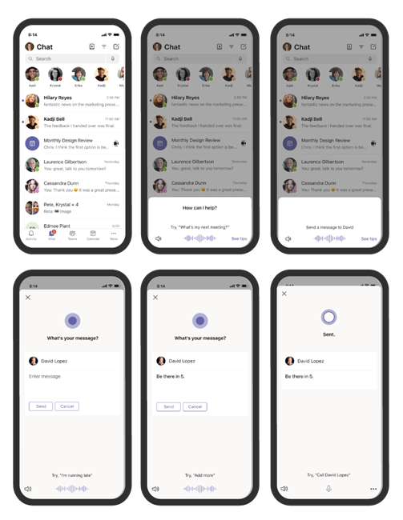

# <a name="cortana-voice-assistance-in-teams"></a>Asistencia por voz de Cortana en Teams

> [!NOTE]
> La asistencia por voz de Cortana se admite en las aplicaciones móviles de Microsoft Teams para iOS y Android, pantallas de Microsoft Teams y Salas de Microsoft Teams en Windows para los usuarios de Estados Unidos, Reino Unido, Canadá, India y Australia. La asistencia por voz de Cortana en la aplicación móvil de Teams ya está disponible para los clientes educativos en en-US. La expansión a idiomas y regiones adicionales se producirá como parte de futuras versiones. La asistencia de voz de Cortana no está disponible actualmente para los inquilinos de GCC, GCC-High, DoD y no US EDU.

La asistencia por voz de Cortana en la aplicación móvil de Teams, en Salas de Microsoft Teams en Windows y en los dispositivos de visualización de Microsoft Teams permite a los usuarios de Microsoft 365 Enterprise simplificar la comunicación, la colaboración y las tareas relacionadas con las reuniones mediante el lenguaje natural hablado. Los usuarios pueden hablar con Cortana seleccionando el botón del micrófono situado en la esquina superior derecha de la aplicación móvil de Teams, o diciendo "Cortana" en la sala de Microsoft Teams o al usar una pantalla de Microsoft Teams. Para conectar rápidamente con el equipo sin manos y mientras se desplaza, los usuarios pueden decir consultas como "llamar a Megan" o "enviar un mensaje a mi próxima reunión". Los usuarios también pueden unirse a reuniones diciendo "unirse a mi próxima reunión" y usar la asistencia de voz para compartir archivos, comprobar su calendario y mucho más. Estas experiencias de asistencia por voz se entregan con [servicios de nivel empresarial de Cortana](/microsoft-365/admin/misc/cortana-integration) que cumplen plenamente con las promesas de privacidad, seguridad y cumplimiento de Office 365, como se refleja en los [Términos de servicios en línea (OST)](https://www.microsoft.com/licensing/product-licensing/products?rtc=1&preserve-view=true).

## <a name="admin-control-and-limitations"></a>Administración control y limitaciones

La asistencia por voz de Cortana en Teams se entrega con servicios que cumplen plenamente con los Office 365 promesas de privacidad, seguridad y cumplimiento a nivel empresarial, como se refleja en los Términos de servicios en línea (OST). La característica se habilitará de forma predeterminada para los inquilinos.

Los administradores de inquilinos pueden controlar quién en su inquilino puede usar la asistencia por voz de Cortana en Teams mediante una directiva (TeamsCortanaPolicy). Esta directiva se establece en un nivel de cuenta de usuario o nivel de inquilino. Los administradores pueden usar el campo CortanaVoiceInvocationMode de este control de directiva para determinar si Cortana está deshabilitada, habilitada solo con invocaciones de botones de pulsar o con invocación de reactivación de palabras (aplicable a dispositivos que lo admiten, como la pantalla de Microsoft Teams).

Los administradores pueden usar los siguientes cmdlets de PowerShell para administrar esta directiva (la directiva no está disponible actualmente en el Centro de administración de Microsoft Teams).

- [New-CsTeamsCortanaPolicy](/powershell/module/skype/New-CsTeamsCortanaPolicy)

- [Get-CsTeamsCortanaPolicy](/powershell/module/skype/Get-CsTeamsCortanaPolicy)

- [Grant-CsTeamsCortanaPolicy](/powershell/module/skype/Grant-CsTeamsCortanaPolicy)

- [Set-CsTeamsCortanaPolicy](/powershell/module/skype/Set-CsTeamsCortanaPolicy)

- [Remove-CsTeamsCortanaPolicy](/powershell/module/skype/Remove-CsTeamsCortanaPolicy)

Por ejemplo, el siguiente comando crea una nueva directiva con el nombre "EmployeeCortanaPolicy" donde la asistencia de voz de Cortana en Microsoft Teams está deshabilitada.

```PowerShell
PS C:\> New-CsTeamsCortanaPolicy -Identity EmployeeCortanaPolicy -CortanaVoiceInvocationMode Disabled
```

En este ejemplo se muestra la actualización de una directiva existente con el nombre "EmployeeCortanaPolicy" y la habilitación de la asistencia de voz de Cortana en Microsoft Teams solo con invocación de botones de inserción. Los usuarios podrán invocar a Cortana seleccionando el botón del micrófono de Cortana en Teams. La invocación de Palabra de activación ("Hola Cortana" o "Cortana") se deshabilitará.

```PowerShell
PS C:\> Set-CsTeamsCortanaPolicy -Identity EmployeeCortanaPolicy -CortanaVoiceInvocationMode PushToTalkUserOverride
```

En este ejemplo se muestra la actualización de la directiva y la habilitación de la asistencia por voz de Cortana con pulsar y activar la invocación de palabra. (La activación de Activar palabra se admite para los usuarios de Microsoft 365 Enterprise en Estados Unidos para la aplicación móvil de Teams, Salas de Microsoft Teams en Windows y Pantalla de Microsoft Teams que tienen su idioma establecido en inglés).

```PowerShell
PS C:\> Set-CsTeamsCortanaPolicy -Identity EmployeeCortanaPolicy -CortanaVoiceInvocationMode WakeWordPushToTalkUserOverride
```

## <a name="user-control"></a>Control de usuario

Los usuarios individuales pueden probar la asistencia por voz de Cortana en diferentes dispositivos:

- Seleccione el botón del micrófono en la aplicación móvil de Teams.

- Selecciona el botón del micrófono o di "Cortana" en Salas de Microsoft Teams.

- Di "Cortana" en Microsoft Teams muestra dispositivos.

Puede controlar si Cortana en Teams está habilitada para su dispositivo mediante una configuración en el dispositivo.



### <a name="microsoft-teams-rooms-on-windows"></a>Salas de Microsoft Teams en Windows

Realizar cambios en el nivel de dispositivo solo está disponible si Cortana está habilitada en el nivel de inquilino.

En el nivel de dispositivo, puedes configurar Cortana para que se use de dos maneras diferentes. Puede habilitar cualquiera de las dos opciones o ambas al mismo tiempo:

- Pulsando en un micrófono, que se denomina _Pulsar en Cortana para hablar_
- Diciendo "Hola Cortana", que se denomina Activación por _voz de Cortana_

_Pulsar para hablar_ de Cortana está habilitado de manera predeterminada si su sala está configurada con cualquiera de los siguientes idiomas: en-au (Australia), en-ca (Canadá), en-gb (Reino Unido), en-in (India), en-us (Estados Unidos). [Aprende más.](/MicrosoftTeams/rooms/console#to-apply-your-desired-language) El icono de Cortana desplazará el botón _Presentar_ en el menú _Más..._ de la consola de la sala de Teams. Para deshabilitar _Pulsar para hablar de_ Cortana, usa PowerShell. [Aprende más.](/powershell/module/skype/new-csteamscortanapolicy?view=skype-ps#example-1&preserve-view=true)

Para habilitar la _activación por voz_ de Cortana, deben cumplirse estas condiciones:

- un dispositivo certificado de Cortana debe estar conectado a su sala de Teams. Puede encontrar una lista de dispositivos certificados al final de este artículo.
- la sala de Teams debe configurarse con cualquiera de los siguientes idiomas: en-au (Australia), en-ca (Canadá), en-gb (Reino Unido), en-in (India), en-us (Estados Unidos). Más idiomas estarán disponibles en una fecha posterior.
- debe realizarse uno de los siguientes cambios de configuración:
  - active la característica en el Centro de administración de Teams [Más información.](/microsoftteams/rooms/rooms-manage)
  - agregue el siguiente atributo XML al archivo XML de SkypeSettings:

    ```xml
    <SkypeSettings>
        <CortanaWakewordEnabled>true</CortanaWakewordEnabled>
    </SkypeSettings>
    ```

En el nivel de reunión, realizar cambios solo está disponible si se habilita la _activación por voz_ de Cortana en el nivel de dispositivo.  Para habilitar la _activación por voz de_ Cortana durante una reunión, mueva el botón de alternancia **a Activado** o **Desactivado** para deshabilitar. Una vez finalizada la reunión, Cortana vuelve a la configuración de nivel de dispositivo establecida.

Realizar cambios en el nivel de reunión está disponible si Cortana está habilitada en el nivel de dispositivo.

Para habilitar la _activación por voz_ de Cortana durante una reunión, mueva el botón de alternancia **a Activado** o **Desactivado**. Una vez finalizada la reunión, Cortana vuelve a la configuración de nivel de dispositivo establecida.

## <a name="cortana-certified-devices-for-teams-rooms"></a>Dispositivos certificados para Cortana para Salas de Teams

La _activación por voz_ de Cortana se puede habilitar si usa un Lenovo Hub 500 o si tiene alguno de estos dispositivos conectados a su habitación:

- Jabra Panacast 50
- Sistema de conferencias Logi Rally Plus
- Barra de vídeo Bose VB1
- EPOS EXPAND Capture 5
- Yealink MSpeech
