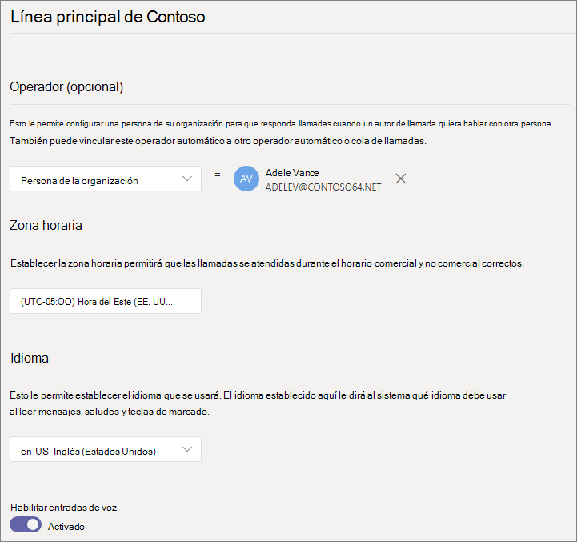
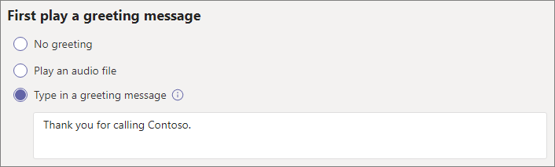
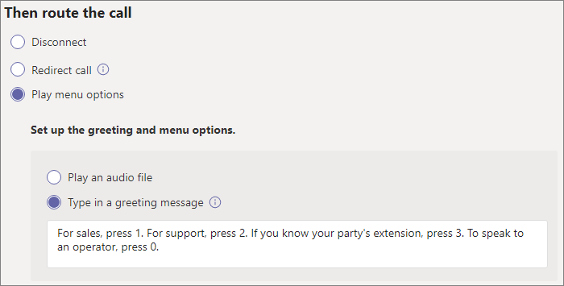
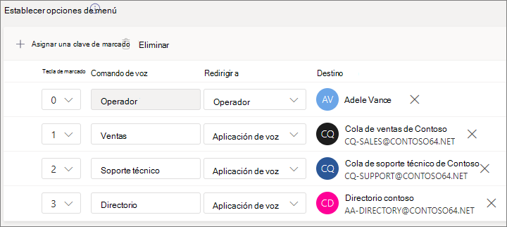
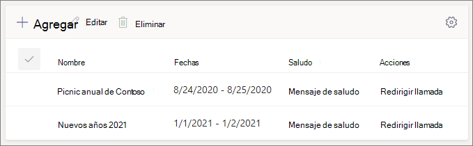
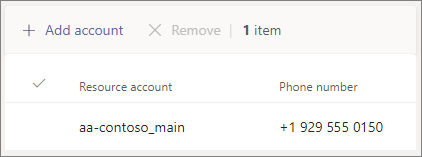

# Configurar un operador automático

Los operadores automáticos permiten a los usuarios llamar a su organización y navegar por un sistema de menús para hablar con el departamento, la cola de llamadas, la persona o un operador adecuados. Puede crear operadores automáticos para su organización con el Centro de administración de Microsoft Teams o con PowerShell.

Asegúrese de haber leído plan para operadores [automáticos](plan-auto-attendant-call-queue.md) y  colas de llamadas de Teams y de haber seguido los pasos de introducción antes de seguir los procedimientos de este artículo.

Los operadores automáticos pueden dirigir las llamadas, en función de la entrada de los autores de llamadas, a uno de los siguientes destinos: 

- **Persona de la organización:** una persona de la organización que puede recibir llamadas de voz. Puede ser un usuario en línea o un usuario alojado en local con Skype Empresarial Server.
- **Aplicación de voz:** otro operador automático o una cola de llamadas. (Elija la cuenta de recurso asociada al operador automático o la cola de llamadas al elegir este destino).
- **Número de teléfono externo:** cualquier número de teléfono. (Consulte [los detalles técnicos de la transferencia externa).](create-a-phone-system-auto-attendant.md#external-phone-number-transfers---technical-details)
- **Correo** de voz: el buzón de voz asociado a un grupo de Microsoft 365 que especifique.
- **Operador** ( operador definido para el operador automático). La definición de un operador es opcional. El operador se puede definir como cualquiera de los otros destinos de esta lista.

Se le pedirá que elija una de estas opciones en varias fases a medida que configura un operador automático.

Para configurar un operador automático, en el centro de administración de Teams, expanda **Voz,** haga clic en **Operadores automáticos** y, a continuación, haga clic en **Agregar.**

## Información general

1. Escriba un nombre para el operador automático en el cuadro de la parte superior.

2. Si desea designar un operador, especifique el destino de las llamadas al operador. Esto es opcional (pero recomendado). Puede establecer la opción **Operador para** permitir que los autores de llamadas salgan de los menús y hablen con la persona designada.

3. Especifique la zona horaria de este operador automático. La zona horaria se usa para calcular el horario laboral si crea un flujo de llamadas separado para horas [fuera del horario laboral.](#call-flow-for-after-hours)

4. Especifique un idioma para este operador automático. Este es el idioma que se usará para los mensajes de voz generados por el sistema.

5. Elija si desea habilitar las entradas de voz. Cuando está habilitada, el nombre de todas las opciones de menú se convierte en una palabra clave de reconocimiento de voz. Por ejemplo, las personas que llaman pueden decir "Uno" para seleccionar la opción de menú asignada a la tecla 1, o pueden decir "Ventas" para seleccionar la opción de menú denominada "Ventas".

6. Haga clic en **Siguiente**.

## Flujo de llamadas

Elija si desea reproducir un saludo cuando el operador automático responda una llamada.

Si selecciona Reproducir un archivo de  **audio,** puede usar el botón Cargar archivo para cargar un mensaje de saludo grabado guardado como audio en. WAV, . MP3 o . Formato WMA. La grabación no puede ser superior a 5 MB.

Si selecciona **Escribir** un mensaje de saludo, el sistema leerá el texto que escriba (hasta 1000 caracteres) cuando el operador automático responda una llamada.

Elige cómo quieres enrutar la llamada.

Si selecciona **Desconectar,** el operador automático colgará la llamada.

Si selecciona Redirigir **llamada, puede** elegir uno de los destinos de enrutamiento de llamadas.

Si selecciona las **opciones del** menú Reproducir, puede  elegir reproducir un archivo de **audio** o escribir un mensaje de saludo y elegir entre las opciones de menú y la búsqueda en directorios.

### Opciones de menú

Para las opciones de marcación, puede asignar las teclas de 0 a 9 del teclado telefónico a uno de los destinos de enrutamiento de llamadas. (Las teclas \* (Repetir) \# y (Volver) están reservados por el sistema y no se pueden reasignar).

Las asignaciones de teclas no tienen por qué ser continuas. Es posible, por ejemplo, crear un menú con las teclas 0, 1 y 3 asignadas a opciones, mientras que la tecla 2 no se usa.

Se recomienda asignar la clave 0 al operador si ha configurado una. Si el operador no está establecido en ninguna tecla, el comando de voz "Operador" también está deshabilitado.

Para cada opción de menú, especifique lo siguiente:

- **Tecla de marcado:** la tecla del teclado del teléfono para acceder a esta opción. Si las entradas de voz están disponibles, las personas que llaman también pueden decir este número para acceder a la opción.

- **Comando de** voz: define el comando de voz que puede dar un autor de llamada para obtener acceso a esta opción, si las entradas de voz están habilitadas. Puede contener varias palabras como "Atención al cliente" u "Operaciones y campos". Por ejemplo, el autor de la llamada puede presionar 2, decir "dos" o decir "Ventas" para seleccionar la opción asignada a la tecla 2. Este texto también se representa de texto a voz para la confirmación del servicio, que puede ser algo parecido a "Transferir la llamada a ventas".

- **Redirigir a:** el destino de enrutamiento de llamada que se usa cuando los autores de llamadas eligen esta opción. Si redirige a un operador automático o a una cola de llamadas, elija la cuenta de recursos asociada con él.

### Búsqueda en directorios

Si asigna teclas de marcado a destinos, le recomendamos que elija Ninguno **para** búsqueda **en el directorio.** Si el autor de la llamada intenta marcar un nombre o una extensión con claves asignadas a destinos específicos, es posible que se enruten inesperadamente a un destino antes de terminar de escribir el nombre o la extensión. Le recomendamos que cree un operador automático independiente para realizar búsquedas en el directorio y que tenga un vínculo al operador automático principal mediante una tecla de marcado.

Si no ha asignado las teclas de marcado, elija una opción para la **búsqueda en el directorio.**

**Marcado por nombre:** si habilita esta opción, los autores de llamadas pueden decir el nombre del usuario o escribirlo en el teclado del teléfono. Cualquier usuario en línea o cualquier usuario local que utilice Skype Empresarial Server es un usuario apto y se puede encontrar con Marcado por nombre. (Puede establecer quién está incluido en el directorio y quién no en la [página Ámbito de](#dial-scope) marcado).

**Marcado por extensión:** si habilita esta opción, los autores de llamadas pueden conectarse con los usuarios de su organización marcando su extensión de teléfono. Cualquier usuario en línea o cualquier usuario local que utilice Skype Empresarial Server es un usuario apto y se puede encontrar **con Marcado por extensión.** (Puede establecer quién está incluido en el directorio y quién no en la [página Ámbito de](#dial-scope) marcado).

Los usuarios que quiera que estén disponibles para marcado por extensión deben tener una extensión especificada como parte de  uno de los siguientes atributos de teléfono definidos en Active Directory o Azure Active Directory (vea Agregar usuarios individualmente o en bloque para obtener más información).

- OfficePhone
- HomePhone
- Móvil/MobilePhone
- TelephoneNumber/PhoneNumber
- OtherTelephone

El formato necesario para introducir la extensión en el campo de número de teléfono de usuario es:

- *+\<phone number>;ext=\<extension>*
- *+\<phone number>x\<extension>*
- *x\<extension>*

- Ejemplo 1: Set-MsolUser -UserPrincipalName usern@domain.com -Phonenumber "+1555555678;ext=5678"
- Ejemplo 2: Set-MsolUser -UserPrincipalName usern@domain.com -Phonenumber "+1555555678x5678"
- Ejemplo 3: Set-MsolUser -UserPrincipalName usern@domain.com -Phonenumber "x5678"

Puede establecer la extensión en el Centro de administración de [Microsoft 365](https://admin.microsoft.com/) o en el [Centro de administración de Azure Active Directory.](https://aad.portal.azure.com) Los cambios pueden tardar hasta 12 horas en estar disponibles para los operadores automáticos y las colas de llamadas.

> [!NOTE]
> Si desea usar las  características Marcado  por nombre y Marcado por extensión, puede asignar una tecla de marcado al operador automático principal para que llegue a un operador automático habilitado para Marcado por **nombre.** Dentro de ese operador automático, puede asignar la tecla 1 (que no tiene letras asociadas) para alcanzar el operador automático **de** Marcado por extensión.

Una vez que haya seleccionado una opción **de búsqueda de** directorio, haga clic en **Siguiente.**

## Flujo de llamadas para horas no laborales

El horario laboral se puede establecer para cada operador automático. Si no se establecen los horarios laborales, todos los días y todas las horas del día se considerarán laborables, ya que se establece una programación las 24 horas. El horario laboral se puede establecer con saltos en el tiempo durante el día y todas las horas que no se establecen como horas de trabajo se tienen en cuenta fuera del horario laboral. Puede establecer diferentes opciones de administración de llamadas entrantes y saludos para después del horario laboral.

Según cómo haya configurado los operadores automáticos y las colas de llamadas, es posible que solo tenga que especificar el enrutamiento de llamadas no laborales para los operadores automáticos con números de teléfono directos.

Si desea enrutamiento de llamada independiente para los autores de llamadas fuera del horario laboral, especifique su horario laboral para cada día. Haga **clic en Agregar nueva** hora para especificar varios conjuntos de horas para un día determinado, por ejemplo, para especificar una hora de almuerzo.

Una vez que haya especificado su horario laboral, elija las opciones de enrutamiento de llamada para horas adicionales. Están disponibles las mismas opciones que para el enrutamiento de llamadas en horario laboral que especificó anteriormente.

Haga **clic en** Siguiente cuando haya terminado.

## Flujos de llamadas durante los días festivos

El operador automático puede tener un flujo de llamadas para cada día festivo [que haya configurado.](set-up-holidays-in-teams.md) Puede agregar un máximo de 20 días festivos programados a cada operador automático.

1. En la página configuración de la llamada navideña, haga clic **en Agregar.**

2. Escriba un nombre para esta configuración navideña.

3. En el **menú** desplegable Vacaciones, elija las vacaciones que desea usar.

4. Elija el tipo de saludo que quiere usar.

    

5. Elija si desea desconectar **o** **redirigir** la llamada.

6. Si decide redirigir, elija el destino de enrutamiento de llamada para la llamada.

7. Haga clic en **Guardar**.

Repita el procedimiento según sea necesario para cada día festivo adicional.

Cuando haya agregado todos los días festivos, haga clic en **Siguiente.**

## Ámbito de marcado

El *ámbito de marcado* define qué usuarios están disponibles en el directorio cuando un autor de llamada usa marcado por nombre o marcado por extensión. El valor predeterminado de **Todos los** usuarios en línea incluye todos los usuarios de su organización que son usuarios en línea o que están hospedados en local con Skype Empresarial Server.

Puede incluir o excluir usuarios  específicos seleccionando  Grupo de usuarios personalizados en Incluir o Excluir y eligiendo uno o varios grupos de Microsoft 365, listas de distribución o grupos de seguridad.  Por ejemplo, es posible que desee excluir ejecutivos de su organización del directorio de marcación. (Si un usuario está en ambas listas, se excluirá del directorio).

> [!NOTE]
> Los nombres de los nuevos usuarios pueden tardar hasta 36 horas en aparecer en el directorio.

Cuando haya terminado de configurar el ámbito de marcado, haga clic en **Siguiente.**

## Cuentas de recursos

Todos los operadores automáticos deben tener una cuenta de recursos asociada.  Los operadores automáticos de primer nivel necesitarán al menos una cuenta de recurso que tenga un número de servicio asociado. Si lo desea, puede asignar varias cuentas de recursos a un operador automático, cada una con un número de servicio independiente.

Para agregar una cuenta de recurso, haga clic **en Agregar cuenta** y busque la cuenta que desea agregar. Haga **clic en** Agregar y, a continuación, en **Agregar.**

Cuando haya terminado de agregar cuentas de servicio, haga clic en **Enviar.** Esto completa la configuración del operador automático.

## Transferencias de números de teléfono externos : detalles técnicos

Consulte los [requisitos previos](plan-auto-attendant-call-queue.md#prerequisites) para permitir que los operadores automáticos transfieran llamadas externamente.  Además:

- Para una cuenta de recurso con un número [de plan](calling-plans-for-office-365.md) de llamadas, el número de teléfono de transferencia externa debe introducirse en formato E.164 (+[código de país][código de área][número de teléfono]).

- Para una cuenta de recurso con un número de enrutamiento directo, el formato de número de teléfono de transferencia externa depende de la configuración del controlador de borde de sesión [(SBC).](direct-routing-connect-the-sbc.md)

El número de teléfono saliente que se muestra se determina de la siguiente manera:

  - Para los números del plan de llamadas, se muestra el número de teléfono del autor de la llamada original.
  - Para los números de enrutamiento directo, el número enviado se basa en la configuración de la identidad ip (PAI) en el SBC, como se muestra a continuación:
    - Si se establece en Deshabilitada, se muestra el número de teléfono del autor de la llamada original. Esta es la configuración predeterminada y recomendada.
    - Si se establece en Habilitado, se muestra el número de teléfono de la cuenta de recurso.

En un entorno híbrido de Skype Empresarial, para transferir una llamada de operador automático a la RTC, cree un nuevo usuario local con el reenvío de llamadas establecido en el número de RTC. El usuario debe estar habilitado para Telefonía IP empresarial y tener asignada una directiva de voz. Para obtener más información, consulte [Transferencia de llamadas del operador automático a RTC.](https://docs.microsoft.com/SkypeForBusiness/plan/exchange-unified-messaging-online-migration-support#auto-attendant-call-transfer-to-pstn)

### Crear un operador automático con PowerShell

También puede usar PowerShell para crear y configurar operadores automáticos. Estos son los cmdlets que necesita para administrar un operador automático:

- [New-CsAutoAttendant](https://docs.microsoft.com/powershell/module/skype/new-csautoattendant)  
- [Set-CsAutoAttendant](https://docs.microsoft.com/powershell/module/skype/set-csautoattendant)
- [Get-CsAutoAttendant](https://docs.microsoft.com/powershell/module/skype/get-csautoattendant)
- [Get-CsAutoAttendantHolidays](https://docs.microsoft.com/powershell/module/skype/get-csautoattendantholidays)
- [Remove-CsAutoAttendant](https://docs.microsoft.com/powershell/module/skype/remove-csautoattendant)
- [New-CsAutoAttendantMenu](https://docs.microsoft.com/powershell/module/skype/new-csautoattendantmenu)
- [New-CsOnlineAudioFile](https://docs.microsoft.com/powershell/module/skype/new-CsOnlineAudioFile)
- [New-CsAutoAttendantCallFlow](https://docs.microsoft.com/powershell/module/skype/New-CsAutoAttendantCallFlow)
- [Export-CsAutoAttendantHolidays](https://docs.microsoft.com/powershell/module/skype/export-csorganizationalautoattendantholidays)
- [New-CsOnlineTimeRange](https://docs.microsoft.com/powershell/module/skype/new-csonlinetimerange)
- [New-CsOnlineDateTimeRange](https://docs.microsoft.com/powershell/module/skype/new-csonlinedatetimerange)
- [New-CsOnlineSchedule](https://docs.microsoft.com/powershell/module/skype/New-CsOnlineSchedule)
- [Get-CsAutoAttendantSupportedTimeZone](https://docs.microsoft.com/powershell/module/skype/Get-CsAutoAttendantSupportedTimeZone)
- [New-CsAutoAttendantCallHandlingAssociation](https://docs.microsoft.com/powershell/module/skype/New-CsAutoAttendantCallHandlingAssociation)
- [Get-CsAutoAttendantSupportedLanguage](https://docs.microsoft.com/powershell/module/skype/Get-CsAutoAttendantSupportedLanguage)
- [Import-CsAutoAttendantHolidays](https://docs.microsoft.com/powershell/module/skype/import-csautoattendantholidays)
- [New-CsAutoAttendantCallableEntity](https://docs.microsoft.com/powershell/module/skype/New-CsAutoAttendantCallableEntity)

## Temas relacionados

[Esto es lo obtiene con el Sistema telefónico](/MicrosoftTeams/here-s-what-you-get-with-phone-system)

[Obtener números de teléfono de servicio](/microsoftteams/getting-service-phone-numbers)

[Países y regiones donde Audioconferencia y Planes de llamada están disponibles](/microsoftteams/country-and-region-availability-for-audio-conferencing-and-calling-plans/country-and-region-availability-for-audio-conferencing-and-calling-plans)

[Una introducción a Windows PowerShell y Skype Empresarial Online](/SkypeForBusiness/set-up-your-computer-for-windows-powershell/set-up-your-computer-for-windows-powershell)
