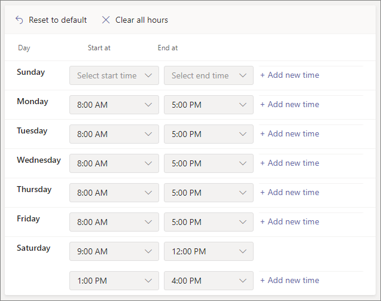

# Configurar un operador automáticoSet up an auto attendant

Los operadores automáticos permiten a los usuarios llamar a su organización y navegar por un sistema de menús para hablar con el departamento adecuado, la cola de llamadas, una persona o un operador.Auto attendants let people call your organization and navigate a menu system to speak to the right department, call queue, person, or an operator. Puede crear operadores automáticos para su organización con el Microsoft Teams de administración o con PowerShell.You can create auto attendants for your organization with the Microsoft Teams admin center, or with PowerShell.

Asegúrese de que ha leído Planear Teams operadores [automáticos](plan-auto-attendant-call-queue.md) y  colas de llamadas y ha seguido los pasos de introducción antes de seguir los procedimientos de este artículo.Be sure you have read [Plan for Teams auto attendants and call queues](plan-auto-attendant-call-queue.md) and followed the [getting started steps](plan-auto-attendant-call-queue.md#getting-started) before you follow the procedures in this article.

Los operadores automáticos pueden dirigir las llamadas, según la entrada de los autores de llamadas, a uno de los siguientes destinos: Auto attendants can direct calls, based on callers' input, to one of the following destinations: 

- **Operador:** el operador definido para el operador automático.**Operator** - the operator defined for the auto attendant. Definir un operador es opcional.Defining an operator is optional. El operador se puede definir como cualquiera de los otros destinos de esta lista.The operator can be defined as any of the other destinations in this list.
- **Persona de la organización:** una persona de su organización que puede recibir llamadas de voz.**Person in the organization** - a person in your organization who can receive voice calls. Esta persona puede ser un usuario en línea o un usuario hospedado localmente mediante Skype Empresarial Server.This person can be an online user or a user hosted on-premises using Skype for Business Server.
- **Aplicación de voz:** otro operador automático o una cola de llamadas.**Voice app** - another auto attendant or a call queue. (Elija la cuenta de recursos asociada con el operador automático o la cola de llamadas al elegir este destino).(Choose the resource account associated with the auto attendant or call queue when choosing this destination.)
- **Correo de** voz: el buzón de voz asociado a Microsoft 365 grupo que especifique.**Voicemail** - the voice mailbox associated with a Microsoft 365 group that you specify.
- **Número de teléfono externo:** cualquier número de teléfono.**External phone number** - any phone number. (Vea [detalles técnicos de transferencia externa).](create-a-phone-system-auto-attendant.md#external-phone-number-transfers---technical-details)(See [external transfer technical details](create-a-phone-system-auto-attendant.md#external-phone-number-transfers---technical-details)).
- **Anuncio (archivo de audio):** reproducir un archivo de audio.**Announcement (Audio file)** - Play an audio file. Un mensaje de anuncio grabado que carga que se guarda como audio en . WAV, .MP3 o . Formato WMA.A recorded announcement message you upload that's saved as audio in .WAV, .MP3, or .WMA format. La grabación no puede ser superior a 5 MB.The recording can be no larger than 5 MB. El sistema reproduce el anuncio y, a continuación, vuelve al menú operador automático.The system plays the announcement, and then returns to the auto attendant menu.
- **Anuncio (con tipo):** escriba un mensaje.**Announcement (Typed)** - Type in a message. Texto que desea que lea el sistema.Text you want the system to read. Puede escribir hasta 1000 caracteres.You can enter up to 1000 characters. El sistema reproduce el anuncio y, a continuación, vuelve al menú operador automático.The system plays the announcement, and then returns to the auto attendant menu.

Se le pedirá que elija una de estas opciones en varias fases mientras configura un operador automático.You'll be prompted to choose one of these options at various stages as you set up an auto attendant.

> [!NOTE]
> Al elegir correo de voz como destino, hay dos opciones adicionales disponibles:When choosing Voicemail as a destination, two additional options are available:
> - **Transcripción** (Predeterminada: Desactivado): cuando esté habilitado, el mensaje de correo de voz se transcribirá e incluirá como parte del correo electrónico.**Transcription** (Default: Off) - when enabled, the voicemail message will be transcribed and included as part of the email.
> - **Suprimir saludo** (predeterminado: desactivado): cuando está habilitado, el mensaje estándar del sistema "Deje un mensaje después del tono.**Suppress Greeting** (Default: Off) - when enabled, the standard system message "Please leave a message after the tone. Cuando haya terminado, cuelgue o presione la tecla hash para obtener más opciones".When you have finished please hang up or press the hash key for more options." se suprimirá.will be suppressed.

Para configurar un operador automático, en el centro de administración de Teams, expanda Voz **,** seleccione **Operadores automáticos** y, a continuación, **seleccione Agregar**.To set up an auto attendant, in the Teams admin center, expand **Voice**, select **Auto attendants**, and then select **Add**.

## Demostración de vídeoVideo demonstration

En este vídeo se muestra un ejemplo básico de cómo crear un operador automático en Teams.This video shows a basic example of how to create an auto attendant in Teams.

> [!VIDEO https://www.microsoft.com/videoplayer/embed/RWEnCG?autoplay=false]

## Información generalGeneral info

1. Escriba un nombre para el operador automático en el cuadro de la parte superior.Type a name for the auto attendant in the box at the top.

2. Para designar un operador, especifique el destino de las llamadas al operador.To designate an operator, specify the destination for calls to the operator. Esta designación es opcional (pero recomendada).This designation is optional (but recommended). Establezca la **opción Operador** para permitir a los autores de llamadas salir de los menús y hablar con una persona designada.Set the **Operator** option to allow callers to break out of the menus and speak to a designated person.

3. Especifique la zona horaria para este operador automático.Specify the time zone for this auto attendant. La zona horaria se usa para calcular el horario laboral si crea un flujo de [llamada independiente para horas 2010.](#call-flow-for-after-hours)The time zone is used for calculating business hours if you [create a separate call flow for after hours](#call-flow-for-after-hours).

4. Especifique un [idioma compatible](create-a-phone-system-auto-attendant-languages.md) para este operador automático.Specify a [supported language](create-a-phone-system-auto-attendant-languages.md) for this auto attendant. Este es el idioma que se usará para las solicitudes de voz generadas por el sistema.This is the language that will be used for system-generated voice prompts.

5. Elija si desea habilitar las entradas de voz.Choose if you want to enable voice inputs. Cuando se habilita, el nombre de cada opción de menú se convierte en una palabra clave de reconocimiento de voz.When enabled, the name of every menu option becomes a speech-recognition keyword. Por ejemplo, los autores de llamadas pueden decir "Uno" para seleccionar la opción de menú asignada a la tecla 1, o pueden decir "Ventas" para seleccionar la opción de menú denominada "Ventas".For example, callers can say "One" to select the menu option mapped to key 1, or they can say "Sales" to select the menu option named "Sales."

> [!NOTE]
> Si elige un idioma en el paso 4 que no admite entradas de voz, esta opción se deshabilitará.If you choose a language in Step 4 that doesn't support voice inputs this option will be disabled.

6. Seleccione **Siguiente**.Select **Next**.

## Flujo de llamadasCall flow

Elija si desea reproducir un saludo cuando el operador automático responda a una llamada.Choose if you want to play a greeting when the auto attendant answers a call.

Si selecciona **Reproducir un archivo de audio,** puede usar el botón **Upload** archivo para cargar un mensaje de saludo grabado guardado como audio en . WAV, .MP3 o . Formato WMA.If you select **Play an audio file** you can use the **Upload file** button to upload a recorded greeting message saved as audio in .WAV, .MP3, or .WMA format. La grabación no puede ser superior a 5 MB.The recording can be no larger than 5 MB.

Si selecciona **Escribir un mensaje de** saludo, el sistema leerá el texto que escriba (hasta 1000 caracteres) cuando el operador automático responda a una llamada.If you select **Type a greeting message** the system will read the text that you type (up to 1000 characters) when the auto attendant answers a call.

Elija cómo desea enrutar la llamada.Choose how you want to route the call.

Si selecciona **Desconectar,** el operador automático colgará la llamada.If you select **Disconnect**, the auto attendant will hang up the call.

Si selecciona **Redirigir llamada,** puede elegir uno de los destinos de enrutamiento de llamadas.If you select **Redirect call**, you can choose one of the call routing destinations.

Si selecciona Opciones **de menú** Reproducir, puede elegir Reproducir un archivo de **audio** o Escribir en un mensaje de saludo y, **a** continuación, elegir entre las opciones de menú y la búsqueda de directorio.If you select **Play menu options**, you can choose to **Play an audio file** or **Type in a greeting message** and then choose between menu options and directory search.

### Opciones de menúMenu options

Para las opciones de marcado, asigne las teclas 0-9 del teclado del teléfono a uno de los destinos de enrutamiento de llamadas.For dialing options, assign the 0-9 keys on the telephone keypad to one of the call routing destinations. (Las teclas \* (Repetir) y \# (Atrás) están reservados por el sistema y no se pueden reasignar).(The keys \* (Repeat) and \# (Back) are reserved by the system and can't be reassigned.)

Las asignaciones de claves no tienen que ser continuas.Key mappings don't have to be continuous. Es posible crear un menú con las teclas 0, 1 y 3 asignadas a opciones, mientras que la tecla número 2 no se usa.It's possible to create a menu with keys 0, 1, and 3 mapped to options, while the number 2 key isn't used.

Se recomienda asignar la clave cero al operador si ha configurado una.We recommend mapping the zero key to the operator if you've configured one. Si el operador no está establecido en ninguna tecla, el comando de voz "Operador" también está deshabilitado.If the operator isn't set to any key, the voice command "Operator" is also disabled.

Para cada opción de menú, especifique la siguiente configuración:For each menu option, specify the following settings:

- **Tecla de marcado:** la tecla del teclado del teléfono para acceder a esta opción.**Dial key** - the key on the telephone keypad to access this option. Si hay entradas de voz disponibles, los autores de llamadas también pueden decir este número para acceder a la opción.If voice inputs are available, callers can also say this number to access the option.

- **Comando de voz:** define el comando de voz que un autor de la llamada puede dar para obtener acceso a esta opción, si las entradas de voz están habilitadas.**Voice command** - defines the voice command that a caller can give to access this option, if voice inputs are enabled. Puede contener varias palabras como "Servicio al cliente" o "Operaciones y motivos".It can contain multiple words like "Customer Service" or "Operations and Grounds." Por ejemplo, el autor de la llamada puede presionar 2, decir "dos" o decir "Ventas" para seleccionar la opción asignada a las dos teclas.For example, the caller can press 2, say "two," or say "Sales" to select the option mapped to the two keys. Este texto también se representa de texto a voz para el mensaje de confirmación del servicio, que puede ser algo así como "Transferir la llamada a las ventas".This text is also rendered by text to speech for the service confirmation prompt, which might be something like "Transferring your call to sales."

- **Redirigir a:** el destino de enrutamiento de llamadas que se usa cuando los autores de llamadas eligen esta opción.**Redirect to** - the call routing destination used when callers choose this option. Si va a redirigir a un operador automático o a una cola de llamadas, elija la cuenta de recursos asociada.If you are redirecting to an auto attendant or call queue, choose the resource account associated with it.

### Búsqueda de directoriosDirectory search

Si asigna teclas de marcado a destinos, le recomendamos que elija **Ninguna para** búsqueda **de directorio.**If you assign dial keys to destinations, we recommend that you choose **None** for **Directory search**. Si un autor de la llamada intenta marcar un nombre o una extensión con claves asignadas a destinos específicos, es posible que se enruten inesperadamente a un destino antes de que terminen de escribir el nombre o la extensión.If a caller attempts to dial a name or extension using keys that are assigned to specific destinations, they might be unexpectedly routed to a destination before they finish entering the name or extension. Le recomendamos que cree un operador automático independiente para la búsqueda de directorios y que tenga el vínculo del operador automático principal con una tecla de marcado.We recommend that you create a separate auto attendant for directory search and have your main auto attendant link to it with a dial key.

Si no ha asignado las teclas de marcado, elija una opción para búsqueda **de directorios.**If you didn't assign dial keys, then choose an option for **Directory search**.

**Marcar por nombre:** si habilita esta opción, los autores de llamadas pueden decir el nombre del usuario o escribirlo en el teclado del teléfono.**Dial by name** - If you enable this option, callers can say the user's name or type it on the telephone keypad. Cualquier usuario en línea o cualquier usuario hospedado local que use Skype Empresarial Server, es un usuario apto y se puede encontrar con Marcado por nombre.Any online user or any user hosted on-premises using Skype for Business Server, is an eligible user and can be found with Dial by name. (Puede establecer quién es y quién no se incluye en el directorio en la [página Ámbito de](#dial-scope) marcado).(You can set who is and isn't included in the directory on the [Dial scope](#dial-scope) page.)

**Marcar por extensión:** si habilita esta opción, los autores de llamadas pueden conectarse con los usuarios de su organización marcando su extensión de teléfono.**Dial by extension** - If you enable this option, callers can connect with users in your organization by dialing their phone extension. Cualquier usuario en línea o cualquier usuario hospedado local que use Skype Empresarial Server, es un usuario apto y se puede encontrar **con Marcar por extensión.**Any online user or any user hosted on-premises using Skype for Business Server, is an eligible user and can be found with **Dial by extension**. (Puede establecer quién es y quién no se incluye en el directorio en la [página Ámbito de](#dial-scope) marcado).(You can set who is and isn't included in the directory on the [Dial scope](#dial-scope) page.)

Los usuarios que desea que estén disponibles para Marcar por extensión deben tener una extensión especificada como parte de  uno de los siguientes atributos de teléfono definidos en Active Directory o Azure Active Directory (vea Agregar usuarios individualmente o en masa para obtener más información).Users you want to make available for Dial By Extension need to have an extension specified as part of one of the following phones attributes defined in Active Directory or Azure Active Directory (See [Add users individually or in bulk](/microsoft-365/admin/add-users/add-users) for more information.)

- OfficePhoneOfficePhone
- HomePhoneHomePhone
- Móvil/MobilePhoneMobile/MobilePhone
- TelephoneNumber/PhoneNumberTelephoneNumber/PhoneNumber
- OtherTelephoneOtherTelephone

El formato necesario para introducir la extensión en el campo de número de teléfono de usuario puede ser uno de los siguientes formatos:The required format to enter the extension in the user phone number field can be one of the following formats:

- *+\<phone number>;ext=\<extension>**+\<phone number>;ext=\<extension>*
- *+\<phone number>x\<extension>**+\<phone number>x\<extension>*
- *x\<extension>**x\<extension>*

- Ejemplo 1: Set-MsolUser -UserPrincipalName usern@domain.com -Phonenumber "+1555555678;ext=5678"Example 1: Set-MsolUser -UserPrincipalName usern@domain.com -Phonenumber "+15555555678;ext=5678"
- Ejemplo 2: Set-MsolUser -UserPrincipalName usern@domain.com -Phonenumber "+1555555678x5678"Example 2: Set-MsolUser -UserPrincipalName usern@domain.com -Phonenumber "+15555555678x5678"
- Ejemplo 3: Set-MsolUser -UserPrincipalName usern@domain.com -Phonenumber "x5678"Example 3: Set-MsolUser -UserPrincipalName usern@domain.com -Phonenumber "x5678"

Puede establecer la extensión en el centro [Microsoft 365 de administración](https://admin.microsoft.com/) o en el Azure Active Directory de [administración.](https://aad.portal.azure.com)You can set the extension in the [Microsoft 365 admin center](https://admin.microsoft.com/) or the [Azure Active Directory admin center](https://aad.portal.azure.com). Los operadores automáticos y las colas de llamadas pueden tardar hasta 12 horas en estar disponibles para los cambios.It can take up to 12 hours before changes are available to auto attendants and call queues.

> [!NOTE]
> Si desea usar las  características Marcar  por nombre y Marcar por extensión, puede asignar una clave de marcado al operador automático principal para que llegue a un operador automático habilitado para Marcar **por nombre.**If you want to use both the **Dial by name** and **Dial by extension** features, you can assign a dial key on your main auto attendant to reach an auto attendant enabled for **Dial by name**. Dentro de ese operador automático, puede asignar la tecla 1 (que no tiene letras asociadas) para que llegue al operador automático Marcar por **extensión.**Within that auto attendant, you can assign the 1 key (which has no letters associated with it) to reach the **Dial by extension** auto attendant.

Una vez que haya seleccionado una **opción de búsqueda de** directorio, seleccione **Siguiente.**Once you have selected a **Directory search** option, select **Next**.

## Flujo de llamadas para horas pasadasCall flow for after hours

El horario laboral se puede establecer para cada operador automático.Business hours can be set for each auto attendant. Si el horario laboral no está establecido, todos los días y todas las horas del día se consideran horario laboral porque una programación 24/7 está establecida de forma predeterminada.If business hours aren't set, all days and all hours in the day are considered business hours because a 24/7 schedule is set by default. El horario laboral se puede establecer con descansos en el tiempo durante el día y todas las horas que no se establecen como horas laborables se consideran fuera del horario laboral.Business hours can be set with breaks in time during the day, and all of the hours that are not set as business hours are considered after-hours. Puede establecer diferentes opciones de administración de llamadas entrantes y saludos para las horas adicionales.You can set different incoming call-handling options and greetings for after-hours.

Según cómo haya configurado los operadores automáticos y las colas de llamadas, es posible que solo tenga que especificar el enrutamiento de llamadas adicionales para los operadores automáticos con números de teléfono directos.Depending on how you have configured your auto attendants and call queues, you may only need to specify after-hours call routing for auto attendants with direct phone numbers.

Si quiere un enrutamiento de llamadas independiente para las personas que llaman fuera del horario laboral, especifique su horario laboral para cada día.If you want separate call routing for after-hours callers, then specify your business hours for each day. Seleccione **Agregar nueva hora para** especificar varios conjuntos de horas para un día determinado, por ejemplo, para especificar un descanso para comer.Select **Add new time** to specify multiple sets of hours for a given day, for example, to specify a lunch break.

Una vez que haya especificado el horario laboral, elija las opciones de enrutamiento de llamadas para horas adicionales.Once you've specified your business hours, then choose your call routing options for after hours. Las mismas opciones están disponibles que para el enrutamiento de llamadas en horario laboral que especificó anteriormente.The same options are available as for the business hours call routing that you specified above.

Seleccione **Siguiente** cuando haya terminado.Select **Next** when you're done.

## Flujos de llamadas durante los días festivosCall flows during holidays

El operador automático puede tener un flujo de llamadas para cada [vacaciones que haya configurado.](set-up-holidays-in-teams.md)Your auto attendant can have a call flow for each [Holiday you've set up](set-up-holidays-in-teams.md). Puede agregar un máximo de 20 días festivos programados a cada operador automático.You can add up to 20 scheduled holidays to each auto attendant.

1. En la página Configuración de la llamada navideña, seleccione **Agregar**.On the Holiday call settings page, select **Add**.

2. Escriba un nombre para esta configuración navideña.Type a name for this holiday setting.

3. En la **lista desplegable** Vacaciones, elija los días festivos que quiera usar.From the **Holiday** dropdown, choose the holiday that you want to use.

4. Elija el tipo de saludo que desea usar.Choose the type of greeting that you want to use.

    

5. Elija si desea desconectar **o** **redirigir** la llamada.Choose if you want to **Disconnect** or **Redirect** the call.

6. Si elige redirigir, elija el destino de enrutamiento de llamadas para la llamada.If you chose to redirect, choose the call routing destination for the call.

7. Seleccione **Guardar**.Select **Save**.

Repita el procedimiento según sea necesario para cada vacaciones adicionales.Repeat the procedure as needed for each additional holiday.

Cuando haya agregado todos los días festivos, seleccione **Siguiente.**When you've added all your holidays, select **Next**.

## Ámbito de marcadoDial scope

El *ámbito de marcado* define qué usuarios están disponibles en el directorio cuando un autor de la llamada usa marcado por nombre o marcado por extensión.The *dial scope* defines which users are available in the directory when a caller uses dial-by-name or dial-by-extension. El valor predeterminado de **Todos los usuarios en** línea incluye todos los usuarios de su organización que son usuarios en línea o hospedados localmente mediante Skype Empresarial Server.The default of **All online users** includes all users in your organization that are Online users or hosted on-premises using Skype for Business Server.

Puede incluir o excluir usuarios  específicos seleccionando  Grupo de usuarios personalizados en Incluir o Excluir y eligiendo uno o varios grupos de Microsoft 365, listas de distribución o grupos de seguridad. You can include or exclude specific users by selecting **Custom user group** under **Include** or **Exclude** and choosing one or more Microsoft 365 groups, distribution lists, or security groups. Por ejemplo, es posible que desee excluir ejecutivos de su organización del directorio de marcado.For example, you might want to exclude executives in your organization from the dialing directory. (Si un usuario está en ambas listas, se excluirá del directorio).(If a user is in both lists, they will be excluded from the directory.)

> [!NOTE]
> Un nuevo usuario puede tardar hasta 36 horas en aparecer en el directorio.It might take up to 36 hours for a new user to have their name listed in the directory.

Cuando haya terminado de configurar el ámbito de marcado, seleccione **Siguiente.**When you're done setting the dial scope, select **Next**.

## Cuentas de recursosResource accounts

Todos los operadores automáticos deben tener una cuenta de recursos asociada.All auto attendants must have an associated resource account.  Los operadores automáticos de primer nivel necesitarán al menos una cuenta de recursos que tenga un número de servicio asociado.First-level auto attendants will need at least one resource account that has an associated service number. Si lo desea, puede asignar varias cuentas de recursos a un operador automático, cada una con un número de servicio independiente.If you wish, you can assign several resource accounts to an auto attendant, each with a separate service number.

Para agregar una cuenta de recurso, seleccione **Agregar cuenta** y busque la cuenta que desea agregar.To add a resource account, select **Add account** and search for the account that you want to add. Seleccione **Agregar** y, a continuación, **seleccione Agregar**.Select **Add**, and then select **Add**.

Cuando haya terminado de agregar cuentas de servicio, seleccione **Enviar** para completar la configuración de operador automático.When you have finished adding service accounts, select **Submit** to complete auto attendant configuration.

## Transferencias de números de teléfono externos: detalles técnicosExternal phone number transfers - technical details

Consulte Los [requisitos previos](plan-auto-attendant-call-queue.md#prerequisites) para permitir que los operadores automáticos transfieran llamadas externamente.Refer to the [Prerequisites](plan-auto-attendant-call-queue.md#prerequisites) in order to allow auto attendants to transfer calls externally.  Además:In addition:

- Para una cuenta de recurso con una licencia de [Plan](calling-plans-for-office-365.md)de llamadas, el número de teléfono de transferencia externa debe especificarse en formato E.164 (+[código de país][código de área][número de teléfono]).For a resource account with a [Calling Plan license](calling-plans-for-office-365.md), the external transfer phone number must be entered in E.164 format (+[country code][area code][phone number]).

- Para una cuenta de recursos con una directiva de enrutamiento de voz Sistema telefónico licencia y enrutamiento directo en línea, el formato de número de teléfono de transferencia externa depende de la configuración del Controlador de borde de sesión [(SBC).](direct-routing-connect-the-sbc.md)For a resource account with a Phone System License and Direct Routing online voice routing policy, the external transfer phone number format is dependant on the [Session Border Controller (SBC)](direct-routing-connect-the-sbc.md) settings.

El número de teléfono saliente que se muestra se determina de la siguiente manera:The outbound phone number that's displayed is determined as follows:

  - Para los números de plan de llamadas, se muestra el número de teléfono del autor de la llamada original.For Calling Plan numbers, the original caller's phone number is displayed.
  - Para los números de enrutamiento directo, el número enviado se basa en la configuración P-Asserted-Identity (PAI) en el SBC, como se muestra a continuación:For Direct Routing numbers, the number sent is based on the P-Asserted-Identity (PAI) setting on the SBC, as follows:
    - Si se establece en Deshabilitado, se muestra el número de teléfono del autor de la llamada original.If set to Disabled, the original caller's phone number is displayed. Esta es la configuración predeterminada y recomendada.This is the default and recommended setting.
    - Si se establece en Habilitado, se muestra el número de teléfono de la cuenta de recurso.If set to Enabled, the resource account phone number is displayed.

En un Skype Empresarial híbrido, para transferir una llamada de operador automático a la RTC, cree un nuevo usuario local con el reenvío de llamadas establecido en el número RTC.In a Skype for Business hybrid environment, to transfer an auto attendant call to the PSTN, create a new on-premises user with call forwarding set to the PSTN number. El usuario debe estar habilitado para Telefonía IP empresarial y tener asignada una directiva de voz.The user must be enabled for Enterprise Voice and have a voice policy assigned. Para obtener más información, vea [Transferencia automática de llamadas a RTC.](/SkypeForBusiness/plan/exchange-unified-messaging-online-migration-support#auto-attendant-call-transfer-to-pstn)To learn more, see [Auto attendant call transfer to PSTN](/SkypeForBusiness/plan/exchange-unified-messaging-online-migration-support#auto-attendant-call-transfer-to-pstn).

### Crear un operador automático con PowerShellCreate an auto attendant with PowerShell

También puede usar PowerShell para crear y configurar operadores automáticos.You can also use PowerShell to create and set up auto attendants. Estos son los cmdlets que necesita para administrar un operador automático:Here are the cmdlets that you need to manage an auto attendant:

- [New-CsAutoAttendantNew-CsAutoAttendant](/powershell/module/skype/new-csautoattendant)  
- [Set-CsAutoAttendantSet-CsAutoAttendant](/powershell/module/skype/set-csautoattendant)
- [Get-CsAutoAttendantGet-CsAutoAttendant](/powershell/module/skype/get-csautoattendant)
- [Get-CsAutoAttendantHolidaysGet-CsAutoAttendantHolidays](/powershell/module/skype/get-csautoattendantholidays)
- [Remove-CsAutoAttendantRemove-CsAutoAttendant](/powershell/module/skype/remove-csautoattendant)
- [New-CsAutoAttendantMenuNew-CsAutoAttendantMenu](/powershell/module/skype/new-csautoattendantmenu)
- [New-CsOnlineAudioFileNew-CsOnlineAudioFile](/powershell/module/skype/new-CsOnlineAudioFile)
- [New-CsAutoAttendantCallFlowNew-CsAutoAttendantCallFlow](/powershell/module/skype/New-CsAutoAttendantCallFlow)
- [Export-CsAutoAttendantHolidaysExport-CsAutoAttendantHolidays](/powershell/module/skype/export-csorganizationalautoattendantholidays)
- [New-CsOnlineTimeRangeNew-CsOnlineTimeRange](/powershell/module/skype/new-csonlinetimerange)
- [New-CsOnlineDateTimeRangeNew-CsOnlineDateTimeRange](/powershell/module/skype/new-csonlinedatetimerange)
- [New-CsOnlineScheduleNew-CsOnlineSchedule](/powershell/module/skype/New-CsOnlineSchedule)
- [Get-CsAutoAttendantSupportedTimeZoneGet-CsAutoAttendantSupportedTimeZone](/powershell/module/skype/Get-CsAutoAttendantSupportedTimeZone)
- [New-CsAutoAttendantCallHandlingAssociationNew-CsAutoAttendantCallHandlingAssociation](/powershell/module/skype/New-CsAutoAttendantCallHandlingAssociation)
- [Get-CsAutoAttendantSupportedLanguageGet-CsAutoAttendantSupportedLanguage](/powershell/module/skype/Get-CsAutoAttendantSupportedLanguage)
- [Import-CsAutoAttendantHolidaysImport-CsAutoAttendantHolidays](/powershell/module/skype/import-csautoattendantholidays)
- [New-CsAutoAttendantCallableEntityNew-CsAutoAttendantCallableEntity](/powershell/module/skype/New-CsAutoAttendantCallableEntity)

## Temas relacionadosRelated topics

[Esto es lo obtiene con el Sistema telefónicoHere's what you get with Phone System](./here-s-what-you-get-with-phone-system.md)

[Obtener números de teléfono de servicioGetting service phone numbers](./getting-service-phone-numbers.md)

[Países y regiones donde Audioconferencia y Planes de llamada están disponiblesCountry and region availability for Audio Conferencing and Calling Plans](./country-and-region-availability-for-audio-conferencing-and-calling-plans/country-and-region-availability-for-audio-conferencing-and-calling-plans.md)

[Una introducción a Windows PowerShell y Skype Empresarial OnlineAn introduction to Windows PowerShell and Skype for Business Online](/SkypeForBusiness/set-up-your-computer-for-windows-powershell/set-up-your-computer-for-windows-powershell)
