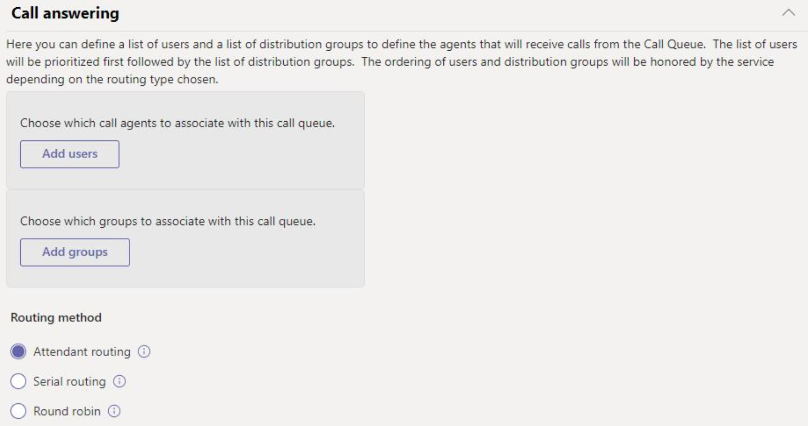

# <a name="create-a-cloud-call-queue"></a>Crear una cola de llamadas en la nube

Las colas de llamadas en nube pueden proporcionar:

- Un mensaje de bienvenida.
- Música que se reproduce mientras los usuarios se mantienen a la espera.
- Redireccionamiento de llamadas a agentes de llamadas en listas de distribución habilitadas para correo electrónico y grupos de seguridad.
- Establecer distintos parámetros, como el tamaño máximo de la cola, el tiempo de espera y las opciones de administración de llamadas.

Asociaría un número de teléfono a una cola de llamadas con una [cuenta de recursos](manage-resource-accounts.md). Una cola de llamadas puede marcarse directamente o tener acceso a la misma mediante una selección en un operador automático.

La persona que llama escucha la música mientras está en espera y la llamada se conecta a los agentes de llamadas con el orden FIFO ( *primero en salir* ).

Todas las llamadas de la cola se envían a los agentes mediante uno de los siguientes métodos:

- Con el enrutamiento del operador, la primera llamada de la cola suena a todos los agentes al mismo tiempo.
- Con el enrutamiento en serie, la primera llamada de la cola suena una por una por todos los agentes de llamadas.
- Con la operación por turnos, el enrutamiento de las llamadas entrantes está equilibrado, de modo que cada agente de llamadas obtiene el mismo número de llamadas de la cola.

    > [!NOTE]
    > Los agentes de llamadas **** que estén desconectados, que hayan establecido su presencia en **no molestar,** o que hayan decidido no recibir llamadas.

- Solo una notificación de llamada entrante (para la llamada al principio de la cola) a la vez va a los agentes de llamadas.
- Después de que un agente de llamadas acepte la llamada, la siguiente llamada entrante de la cola se enviará a los demás agentes de llamadas.

> [!NOTE]
> Este artículo se aplica a Microsoft Teams y a Skype empresarial online.

## <a name="step-1--get-started"></a>Paso 1: introducción

Para comenzar a utilizar colas de llamadas, es importante recordar algunas cosas:

- Se necesita una cola de llamadas para tener una cuenta de recursos asociada. Para obtener más información sobre las cuentas de recursos, consulte [administrar cuentas de recursos en Teams](manage-resource-accounts.md) .
- Cuando asigne un número de teléfono a una cuenta de recursos, ahora puede usar la [licencia de usuario virtual](teams-add-on-licensing/virtual-user.md)del sistema telefónico para el coste. El sistema telefónico permite números de teléfono en el nivel de la organización para su uso con los servicios de cola de llamadas y los operadores automáticos de bajo costo.

> [!NOTE]
> Los números del servicio de enrutamiento directo para colas de llamadas solo se admiten para usuarios y agentes de Microsoft Teams.

> [!NOTE]
> Para redirigir las llamadas a las personas de su organización que están conectadas, deben tener una licencia de **sistema telefónico** y estar habilitadas para telefonía IP empresarial o tener planes de llamadas de Office 365. Consulte [asignar licencias de Skype empresarial](/SkypeForBusiness/skype-for-business-and-microsoft-teams-add-on-licensing/assign-skype-for-business-and-microsoft-teams-licenses) o [asignar licencias de Microsoft Teams](assign-teams-licenses.md). Para habilitar la Telefonía IP empresarial para sus usuarios, use Windows PowerShell. Por ejemplo, ejecute:`Set-CsUser -identity "Amos Marble" -EnterpriseVoiceEnabled $true`

- Para obtener más información sobre los planes de llamadas de Office 365, consulte planes de llamadas y [sistemas telefónicos](calling-plan-landing-page.md) y [planes de llamadas para Office 365](calling-plans-for-office-365.md).

- Solo puede asignar colas de llamadas en la nube números de teléfono de pago y gratuitos que recibió en el **centro de administración de Microsoft Teams** o transferidos desde otro proveedor de servicios. Para los números de servicio gratuitos se requieren créditos de comunicaciones.

    > [!NOTE]
    > Los números de teléfono de usuario (suscriptor) no se pueden asignar a las colas de llamadas; solo se pueden usar números de teléfono de servicio de pago y gratuitos.

- Los siguientes clientes son compatibles con los agentes de llamadas asociados a una cola de llamadas en la nube:

  - Cliente de escritorio de Skype empresarial 2016 (versiones de 32 y 64 bits)

  - Cliente de escritorio de Lync 2013 (versiones de 32 y 64 bits)

  - Todos los modelos de teléfono IP compatibles con Microsoft Teams. Consulte [Obtener teléfonos con Skype Empresarial Online](/skypeforbusiness/what-is-phone-system-in-office-365/getting-phones-for-skype-for-business-online/getting-phones-for-skype-for-business-online).

  - Cliente de Skype for Business para Mac (versión 16.8.196 y posteriores)

  - Cliente de Skype para Business para Android (versión 6.16.0.9 y posteriores)

  - Cliente de Skype for Business para iPhone (versión 6.16.0 y posteriores)

  - Cliente de Skype for Business para iPad (versión 6.16.0 y posteriores)

  - Cliente de Windows de Microsoft Teams (versiones de 32 y 64 bits)

  - Cliente de Microsoft Teams para Mac

  - Aplicación Microsoft Teams para iPhone

  - Aplicación Microsoft Teams para Android

## <a name="step-2--getting-or-transferring-toll-or-toll-free-service-phone-numbers"></a>Paso 2: obtener o transferir números de teléfono de pago o gratuitos

Antes de crear y configurar las colas de llamadas, debes obtener o transferir tus números de teléfono de pago o gratuitos existentes. Una vez que obtenga los números de teléfono de pago o gratuitos, aparecerán en el **Centro** > de administración de Microsoft Teams**números de teléfono**de**voz** > del**portal** > heredados, y el **tipo de número** aparecerá como **Servicio:** gratuito. Para obtener tus números de servicio, consulta [obtener números de teléfono de servicio](getting-service-phone-numbers.md) o, si deseas transferir un número de servicio existente, consulta [transferir números de teléfono a Office 365](transfer-phone-numbers-to-office-365.md).

> [!NOTE]
> Si está fuera de los Estados Unidos, no puede usar el centro de administración de Microsoft Teams para obtener los números de servicio. En su lugar, vaya a [administrar números de teléfono de su organización](manage-phone-numbers-for-your-organization/manage-phone-numbers-for-your-organization.md) para ver cómo hacerlo desde fuera de los Estados Unidos.

Al configurar varios operadores automáticos, solo puede asignar un número de teléfono a la cuenta de recursos del operador automático principal, que puede dirigir a las personas que llaman a las colas de llamadas o a los operadores automáticos anidados. En esos casos, creará todos los operadores automáticos y las colas de llamadas en el sistema sin asignar opciones de marcado y, después, podrá editar la configuración más adelante. Esto es necesario porque no tienes permiso para crear una opción de vinculación a una cola de llamadas o a un operador automático que aún no exista.

## <a name="step-3--create-a-new-call-queue"></a>Paso 3: crear una nueva cola de llamadas

[!INCLUDE [updating-admin-interfaces](includes/updating-admin-interfaces.md)]

> [!IMPORTANT]
> Cada cola de llamadas debe tener una cuenta de [recursos](manage-resource-accounts.md)asociada. Debe crear primero la cuenta de recursos y, a continuación, asociarla a la cola de llamadas.

### <a name="using-the-microsoft-teams-admin-center"></a>Usar el centro de administración de Microsoft Teams

En el **centro de administración de Microsoft Teams**,**colas de llamadas**de **voz** > y, a continuación, haga clic en **+ Agregar nuevo**:

### <a name="set-the-call-queue-display-name-and-resource-account"></a>Establecer el nombre para mostrar de la cola de llamadas y la cuenta de recursos


* * *


**nombre** de captura de pantalla anterior escriba un nombre descriptivo para la cola de llamadas. Este nombre es obligatorio y puede contener hasta 64 caracteres, incluidos los espacios.

 Este nombre se muestra en la notificación de la llamada entrante.

* * *


**Agregar cuentas** Seleccione una cuenta de recursos. La cuenta de recursos puede estar asociada o no a un número de teléfono gratuito de servicio o a un número de teléfono gratuito para la cola de llamadas, pero cada cola de llamadas requiere una cuenta de recursos asociada.

Si no hay ninguna lista, debe obtener números de servicio y asignarlos a una cuenta de recursos antes de poder crear esta cola de llamadas, como se describió anteriormente. Para obtener tus números de servicio, consulta [obtener números de teléfono de servicio](getting-service-phone-numbers.md). Puede crear una cuenta de recursos como se describe en [administrar cuentas de recursos en Teams](manage-resource-accounts.md) si desea que la cola de llamadas tenga un número de teléfono asociado.

> [!NOTE]
> Si quiere o necesita asignar un **dominio** , lo puede asignar a la cuenta de recursos de la cola de llamadas.

### <a name="set-the-greeting-and-music-played-while-on-hold"></a>Establecer el mensaje de saludo y la música que se debe reproducir durante el tiempo en espera


* * *


**Saludo**: este campo es opcional. Este es el saludo que se reproduce para las personas que llaman al número de la cola de llamadas.

Puede cargar un archivo de audio (en formato. wav,. mp3 o. WMA).


**Música en espera** Puede usar la música predeterminada en espera proporcionada con la cola de llamadas, o bien puede cargar un archivo de audio en formato. wav, MP3 o. WMA para usarlo como música personalizada en espera.

* * *

### <a name="select-the-call-answering-options"></a>Selecciona las opciones de contestador automático




Puede seleccionar hasta 200 agentes de llamadas que pertenecen a cualquiera de las siguientes listas o grupos de correo:

- Grupo de Office 365
- Grupo de seguridad
- Lista de distribución

Los agentes de llamadas seleccionados deben ser uno de los siguientes: 

- Usuarios en línea con una licencia de sistema telefónico y la telefonía IP empresarial habilitada 
- Usuarios en línea con un plan de llamadas
- Usuarios locales de Skype empresarial Server

  > [!NOTE]
  > Esto también se aplica si desea redirigir las llamadas a las personas de su organización que están conectadas. Estas personas deben tener una licencia de **sistema telefónico** y la telefonía IP empresarial habilitada **o** tener un plan de llamadas. Para obtener más información, vea [asignar licencias de Skype empresarial](/Skype/SfbOnline/skype-for-business-and-microsoft-teams-add-on-licensing/assign-skype-for-business-and-microsoft-teams-licenses.md), [asignar licencias de Microsoft Teams](https://docs.microsoft.com/microsoftteams/assign-teams-licenses)o [el plan de llamadas es adecuado para usted](https://docs.microsoft.com/microsoftteams/calling-plan-landing-page) .

 Para habilitar un agente para telefonía IP empresarial, puede usar Windows PowerShell. Por ejemplo, ejecute:`Set-CsUser -identity "Amos Marble" -EnterpriseVoiceEnabled $true`

- Usuarios con una licencia de **sistema telefónico** o un plan de llamadas que se agregan a un grupo de Office 365. una lista de distribución habilitada para correo electrónico. o un grupo de seguridad. Puede demorar hasta tres horas en un agente recién agregado de una lista de distribución o un grupo de seguridad para empezar a recibir llamadas de una cola de llamadas. Una lista de distribución o un grupo de seguridad recién creados puede demorar 48 horas en estar disponible para usarse con las colas de llamadas. Los grupos de Office 365 que se acaban de crear están disponibles casi de forma inmediata.

- Si los agentes usan la aplicación Microsoft Teams para realizar llamadas en la cola de llamadas, deben estar en modo TeamsOnly.


**Método de enrutamiento** Puede elegir entre **operador**, **serie**o **Round Robin** para el método de distribución de la cola de llamadas. De manera predeterminada, todas las colas de llamadas nuevas y existentes tienen un enrutamiento a operador seleccionado. Cuando se usa el enrutamiento del operador, la primera llamada en la cola llama a todos los agentes de llamadas al mismo tiempo. El primer agente de llamadas que atiende la llamada recibe la llamada.

- El **enrutamiento del operador** hace que la primera llamada de la cola suene a todos los agentes de llamadas al mismo tiempo. El primer agente de llamadas que atiende la llamada recibe la llamada.
- Las llamadas entrantes de **enrutamiento en serie** son agentes de llamadas de timbre uno por uno, empezando desde el principio de la lista de agentes de llamadas. Los agentes no se pueden pedir dentro de la lista de agentes de llamadas. Si un agente omite o no contesta una llamada, se realizará una llamada al siguiente agente de la lista y se probará con todos los agentes, de uno a uno, hasta que se responda la llamada o se agote el tiempo de espera en la cola.
  > [!NOTE]
  > El enrutamiento en serie omitirá a los agentes que están **Sin conexión**, han establecido su presencia en **No molestar**o han **optado por no participar** en la recepción de llamadas de esta cola.
- El enrutamiento **Round Robin** de equilibra las llamadas entrantes para que cada agente de llamadas obtenga el mismo número de llamadas de la cola. Esto puede ser conveniente en un entorno de ventas entrante para asegurar la igualdad de oportunidades entre todos los agentes de llamadas.

### <a name="select-an-agent-opt-out-option"></a>Seleccionar una opción de cancelación de la suscripción


* * *


El **agente puede dejar de recibir llamadas** Habilita esta opción para permitir que los agentes de la cola de llamadas no puedan tomar llamadas de una cola en particular.

Al habilitar esta opción, todos los agentes de esta cola iniciarán o dejarán de recibir llamadas de esta cola de llamadas. Puede revocar en cualquier momento el privilegio de no participación de agente desactivando la casilla de verificación, lo que hace que los agentes participen automáticamente de nuevo en esta cola (el valor predeterminado de todos los agentes).

Para obtener acceso a la opción de no participación, los agentes pueden hacer lo siguiente:

 1. Abra **Opciones** en el cliente de Skype for Business de su escritorio.
 2. En la pestaña **Desvío de llamadas**, haga clic en el vínculo **Editar la configuración de en línea**.
 3. En la página Configuración de usuario, haga clic en **colas de llamadas**y, a continuación, desactive las casillas de las colas para las que desee optar.

    > [!NOTE]
    > Los agentes que usen aplicaciones o extremos que no sean de Skype empresarial pueden acceder a la opción de cancelación de la suscripción en [https://aka.ms/cqsettings](https://aka.ms/cqsettings)el portal de configuración de usuario.


**configuración de alerta del agente** de captura de pantalla anterior

Esto define la duración de un agente de notificación de una llamada antes de que los métodos de enrutamiento de serie o de turnos pasen al siguiente agente.

La configuración predeterminada es de 30 segundos, pero se puede establecer hasta 3 minutos.

* * *

### <a name="set-the-call-overflow-and-timeout-handling-options"></a>Establecer las opciones de desbordamiento de llamadas y administración de tiempo de espera


* * *


**Número máximo de llamadas en la cola**: use esta opción para establecer el número máximo de llamadas que pueden esperar en la cola al mismo tiempo. El valor predeterminado es 50, pero puede estar comprendido entre 0 y 200. Cuando se alcanza este límite, la llamada se maneja de la forma que estableces en la configuración **cuando se alcanza el número máximo de llamadas** , a continuación.

* * *


**Cuando se alcanza el número máximo de llamadas** Cuando la cola de llamadas alcanza su tamaño máximo (establecido mediante las **llamadas máximas en la configuración de la cola** ), puede elegir qué sucede con las llamadas entrantes nuevas.

- **Desconectar** La llamada se desconectará.
- **Redirigir a** Si elige esta opción, seleccione una de las siguientes opciones:

  - **Persona de su empresa** Un usuario en línea con una licencia de **sistema telefónico** y estar habilitado para telefonía IP empresarial o tener un plan de llamadas. Puedes configurarlo para que la persona que llama pueda enviarse al buzón de voz. Para ello, seleccione una **persona de su empresa** y configure esta persona para que sus llamadas se desvíen directamente al buzón de voz.

  Para obtener información sobre las licencias necesarias para el buzón de voz, consulte [configurar el buzón de voz en la nube](set-up-phone-system-voicemail.md).

  - **Aplicación de voz** Seleccione el nombre de una cuenta de recursos asociada a una cola de llamadas o a un operador automático que ya se ha creado.

* * *


**Tiempo de espera de llamada: tiempo de espera máximo** También puede decidir cuánto tiempo puede estar en espera una llamada en la cola antes de que se agote el tiempo de espera y deba redirigirse o desconectarse. El lugar donde se redirige se basa en el modo en que se establece la configuración **cuando la llamada supera el tiempo de espera** . Puede establecer un intervalo de entre 0 y 45 minutos.

El valor de tiempo de espera se puede establecer en segundos, en intervalos de 15 segundos. Esto permite manipular el flujo de llamadas con una granularidad más fina. Por ejemplo, puede especificar que las llamadas no contestadas por un agente en un plazo de 30 segundos vayan a un operador automático de búsqueda de directorios.


**Cuando la llamada supera el tiempo de salida** Cuando la llamada alcanza el límite establecido en el valor de **tiempo que puede esperar una llamada en la cola** , puede elegir lo que le sucede a esta llamada:

- **Desconectar** La llamada se desconectará.
- **Redirigir esta llamada a** Si elige esta opción, tiene estas opciones:
  - **Persona de su empresa** Un usuario en línea con una licencia de **sistema telefónico** y estar habilitado para telefonía IP empresarial o para tener planes de llamadas. Puede configurarlo para que se pueda enviar un correo de voz a la persona que llama. Para ello, seleccione una **persona de su empresa** y configure esta persona para que sus llamadas se desvíen directamente al buzón de voz.

  Para obtener información sobre las licencias necesarias para el buzón de voz, consulte [configurar el buzón de voz en la nube](set-up-phone-system-voicemail.md).

  - **Aplicación de voz** Seleccione el nombre de una cuenta de recursos asociada a una cola de llamadas o a un operador automático que ya se ha creado.

## <a name="change-a-users-caller-id-for-outbound-calls"></a>Cambiar la identificación de llamadas de un usuario para las llamadas salientes

Puede proteger la identidad de un usuario si cambia su identificador de llamada para llamadas salientes a una cola de llamadas, operador automático o cualquier número de servicio en su lugar con el cmdlet **New-CsCallingLineIdentity** .

Para ello, ejecute:

``` Powershell
New-CsCallingLineIdentity -Identity "UKSalesQueue" -CallingIdSubstitute "Service" -ServiceNumber 14258828080 -EnableUserOverride $False -Verbose
```

A continuación, aplique la directiva al usuario mediante el cmdlet **Grant-CallingLineIdentity**. Para ello, ejecute:

``` Powershell
Grant-CsCallingLineIdentity -PolicyName UKSalesQueue -Identity "AmosMarble@contoso.com"
```

Puede obtener más información sobre cómo establecer la configuración de identificación de llamadas de su organización en el artículo [cómo se puede usar la identificación de llamadas de su organización](/microsoftteams/how-can-caller-id-be-used-in-your-organization).

## <a name="call-queue-cmdlets"></a>Cmdlets de colas de llamadas

También puede usar Windows PowerShell para crear y configurar colas de llamadas. Estos son los cmdlets que usas para administrar una cola de llamadas.

- [Nuevo: CsCallQueue](https://docs.microsoft.com/powershell/module/skype/new-CsCallQueue?view=skype-ps)

- [Set-CsCallQueue](https://docs.microsoft.com/powershell/module/skype/set-CsCallQueue?view=skype-ps)

- [Get-CsCallQueue](https://docs.microsoft.com/powershell/module/skype/get-CsCallQueue?view=skype-ps)

- [Remove-CsCallQueue](https://docs.microsoft.com/powershell/module/skype/remove-CsCallQueue?view=skype-ps)

### <a name="more-about-windows-powershell"></a>Más información sobre Windows PowerShell

- Windows PowerShell se centra en la administración de usuarios y en las acciones que se les está permitido o no realizar. Con Windows PowerShell, puede administrar Office 365 y Microsoft Teams con un único punto de administración que puede simplificar su trabajo diario, cuando tenga que hacer varias tareas. Para empezar con Windows PowerShell, vea estos temas:

  - [Una introducción a Windows PowerShell y Skype Empresarial Online](/SkypeForBusiness/set-up-your-computer-for-windows-powershell/set-up-your-computer-for-windows-powershell)

  - [Seis motivos por los que posiblemente quiera usar Windows PowerShell para administrar Office 365](https://docs.microsoft.com/en-us/office365/enterprise/powershell/why-you-need-to-use-office-365-powershell)

- Windows PowerShell tiene muchas ventajas en cuanto a velocidad, simplicidad y productividad en el centro de administración de Microsoft Teams, como cuando se hacen los cambios de configuración para muchos usuarios a la vez. Más información sobre estas ventajas en los siguientes temas:

  - [Administrar Office 365 con Windows PowerShell](https://docs.microsoft.com/en-us/office365/enterprise/powershell/manage-office-365-with-office-365-powershell)

  - [Configurar el equipo para Windows PowerShell](https://docs.microsoft.com/en-us/SkypeForBusiness/set-up-your-computer-for-windows-powershell/set-up-your-computer-for-windows-powershell)

## <a name="related-topics"></a>Temas relacionados

[Esto es lo obtiene con el Sistema telefónico de Office 365](here-s-what-you-get-with-phone-system.md)

[Obtener números de teléfono de servicio](getting-service-phone-numbers.md)

[Países y regiones donde Audioconferencia y Planes de llamada están disponibles](country-and-region-availability-for-audio-conferencing-and-calling-plans/country-and-region-availability-for-audio-conferencing-and-calling-plans.md)

[Nuevo: CsOnlineApplicationInstance](https://docs.microsoft.com/powershell/module/skype/new-csonlineapplicationinstance?view=skype-ps)
