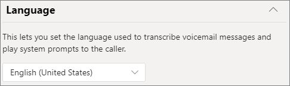

# Crear una cola de llamadaCreate a call queue

Las colas de llamadas proporcionan un método para enrutamiento de autores de llamadas a personas de la organización que pueden ayudarle con un problema o pregunta en particular.Call queues provide a method of routing callers to people in your organization who can help with a particular issue or question. Las llamadas se distribuyen de una en una a las personas que están en la cola (que se denominan *agentes*).Calls are distributed one at a time to the people in the queue (who are known as *agents*). 

> [!TIP]
> Este artículo es para organizaciones grandes.This article is for large organizations. Si su organización es una pequeña empresa, lea Crear una cola [de llamadas: tutorial de pequeña empresa](/microsoftteams/business-voice/create-a-phone-system-call-queue-smb) en su lugar.If your organization is a small business, read [Create a call queue - small business tutorial](/microsoftteams/business-voice/create-a-phone-system-call-queue-smb) instead.

Las colas de llamadas proporcionan:Call queues provide:

- Un mensaje de saludo.A greeting message.

- Música que se reproduce mientras los usuarios se mantienen a la espera.Music while people are waiting on hold in a queue.

- Enrutamiento de llamadas *Primera en llegar, primera en salir* (FIFO),en la orden para los agentes.Call routing - in *First In, First Out* (FIFO) order - to agents.

- Opciones de gestión del desbordamiento de la cola y del tiempo de espera.Handling options for queue overflow and timeout.

Asegúrese de que ha leído Planear Teams operadores [automáticos](plan-auto-attendant-call-queue.md) y  colas de llamadas y ha seguido los pasos de introducción antes de seguir los procedimientos de este artículo.Be sure you have read [Plan for Teams auto attendants and call queues](plan-auto-attendant-call-queue.md) and followed the [getting started steps](plan-auto-attendant-call-queue.md#getting-started) before you follow the procedures in this article.

## Demostración de vídeoVideo demonstration

Este vídeo muestra un ejemplo básico de cómo crear una cola de llamadas en Teams.This video shows a basic example of how to create a call queue in Teams.

> [!VIDEO https://www.microsoft.com/videoplayer/embed/RWCF23?autoplay=false]

## Crear la cola de llamadasCreate the call queue

Para configurar una cola de llamadas, en el centro de administración de Teams, expanda **Voz**, haga clic en **Llamar** y, después, haga clic en **Agregar**.To set up a call queue, in the Teams admin center, expand **Voice**, click **Call queues**, and then click **Add**.

Escriba un nombre descriptivo para la cola.Type a name for the call queue.

### Cuentas de recursosResource accounts

Haga clic en **Agregar cuentas**, busque la cuenta de recursos que desea usar con esta cola de llamadas, haga clic en **Agregar** y, después, haga clic en **Agregar**.Click **Add accounts**, search for the resource account that you want to use with this call queue, click **Add**, and then click **Add**. (Los agentes verán el nombre de la cuenta de recurso cuando reciban una llamada entrante).(Agents will see the resource account name when they receive an incoming call.)

### Asignar id. de llamadaAssign calling ID

Si tiene previsto usar un canal Teams para los agentes de llamada, puede asignar un número de identificación de llamada saliente para los agentes especificando una o más cuentas de recursos con un número de teléfono.If you plan to use a Teams channel for your call agents, you can assign an outbound caller ID number for the agents by specifying one or more resource accounts with a phone number.

Haga **clic en** Agregar , busque las cuentas de recursos a las que desea permitir que los agentes llamen con fines de identificación al realizar llamadas salientes, haga clic en Agregar y, a continuación, haga clic en **Agregar.** Click **Add**, search for the resource accounts that you want to allow agents to for calling ID purposes when making outbound calls, click **Add**, and then click **Add**.

Si no usa un canal Teams para controlar la pertenencia al agente, considere la posibilidad de establecer directamente el identificador de llamada de los miembros de la cola de llamadas en el número de servicio de la cola de llamadas o en el operador automático adecuado.If you are not using a Teams channel to control agent membership, consider directly setting the caller ID for members of the call queue to the service number of the call queue or appropriate auto attendant. Consulte [administrar las directivas de identificador de llamada en Microsoft Teams](caller-id-policies.md) obtener más información.See [Manage caller ID policies in Microsoft Teams](caller-id-policies.md) for more information.

### IdiomaLanguage

Elija un [idioma compatible.](create-a-phone-system-call-queue-languages.md)Choose a [supported language](create-a-phone-system-call-queue-languages.md). Este idioma se usará para los mensajes de voz generados por el sistema y la transcripción de correo de voz (si las habilita).This language will be used for system-generated voice prompts and voicemail transcription (if you enable them).

### Saludos y música en espera en colaGreetings and music on hold in queue

Especifique si quiere reproducir un saludo a los autores de llamadas cuando lleguen a la cola.Specify if you want to play a greeting to callers when they arrive in the queue. Debe cargar un archivo MP3, WAV o WMA que contenga el saludo que desea reproducir.You must upload an MP3, WAV, or WMA file containing the greeting that you want to play.

Los equipos proporcionan música predeterminada a los autores de llamadas mientras están en espera en una cola.Teams provides default music to callers while they are on hold in a queue. Si desea reproducir un archivo de audio específico, elija **Reproducir un archivo de audio en** y cargar un archivo MP3, WAV o WMA.If you want to play a specific audio file, choose **Play an audio file** and upload an MP3, WAV, or WMA file.

> [!NOTE]
> La grabación cargada no puede ser superior a 5 MB.The uploaded recording can be no larger than 5 MB.
> La música predeterminada que se proporciona en las colas de llamadas de Teams no tiene que pagar ningún pago de la organización.The default music supplied in Teams call queues is free of any royalties payable by your organization. 

### Llamar a agentesCall agents

Revise los [requisitos previos para agregar agentes a una cola de llamadas.](plan-auto-attendant-call-queue.md#prerequisites)Review the [prerequisites for adding agents to a call queue](plan-auto-attendant-call-queue.md#prerequisites).

##### Teams canalTeams channel

Puede agregar hasta 200 agentes a través de un Teams.You can add up to 200 agents via a Teams channel.

Si desea usar un [canal Teams](https://support.microsoft.com/office/9f07dabe-91c6-4a9b-a545-8ffdddd2504e)para administrar la  cola, seleccione la opción Elegir un equipo y haga clic **en Agregar un canal.**If you want to [use a Teams channel to manage the queue](https://support.microsoft.com/office/9f07dabe-91c6-4a9b-a545-8ffdddd2504e), select the **Choose a team** option and click **Add a channel**. Busque el equipo que desea usar, selecciónelo y haga clic en **Agregar**.Search for the team that you want to use, select it, and click **Add**. Seleccione el canal que desea usar y haga clic en **Aplicar.**Select the channel that you want to use and click **Apply**.

Los clientes siguientes son compatibles al usar un canal Teams para las colas de llamadas:The following clients are supported when using a Teams channel for call queues: 

  - Microsoft Teams Windows clienteMicrosoft Teams Windows client
  - Cliente de Microsoft Teams para MacMicrosoft Teams Mac client

##### Usuarios y gruposUsers and groups

Puede agregar hasta 20 agentes individualmente y hasta 200 agentes a través de grupos.You can add up to 20 agents individually and up to 200 agents via groups.

Si desea agregar usuarios o grupos individuales a la cola, seleccione la **opción Elegir usuarios y** grupos.If you want to add individual users or groups to the queue, select the **Choose users and groups** option. 

Para agregar un usuario a la cola, haga clic en **Agregar usuarios**, busque el usuario, haga clic en **Agregar** y, después, haga clic en **Agregar**.To add a user to the queue, click **Add users**, search for the user, click **Add**, and then click **Add**.

Para agregar un grupo a la cola, haga clic en **Agregar grupos**, busque el grupo, haga clic en **Agregar** y, después, haga clic en **Agregar**.To add a group to the queue, click **Add groups**, search for the group, click **Add**, and then click **Add**. Puede usar listas de distribución, grupos de seguridad, grupos de seguridad, grupos de Microsoft 365 o equipos de Microsoft Teams.You can use distribution lists, security groups, and Microsoft 365 groups or Microsoft Teams teams.

> [!NOTE]
> Los nuevos usuarios agregados a un grupo pueden tardar hasta ocho horas en llegar a su primera llamada.New users added to a group can take up to eight hours for their first call to arrive.

### Enrutamiento de llamadaCall routing

**El modo de conferencia** reduce de forma significativa la cantidad de tiempo que tarda un autor de llamada en estar conectado con un agente, después de que el agente acepte la llamada.**Conference mode** significantly reduces the amount of time it takes for a caller to be connected to an agent, after the agent accepts the call. Para que el modo de conferencia funcione, los agentes en la cola de llamadas deben usar uno de los siguientes clientes:For conference mode to work, agents in the call queue must use one of the following clients:

  - Última versión del cliente de escritorio de Microsoft Teams, la aplicación de Android o la aplicación de iOSThe latest version of the Microsoft Teams desktop client, Android app, or iOS app
  - Versión de teléfono 1449/1.0.94.2020051601 o posterior de Microsoft TeamsMicrosoft Teams phone version 1449/1.0.94.2020051601 or later
  
Las cuentas de Teams de los agentes deben establecerse en modo solo Teams.Agents' Teams accounts need to be set to Teams-only mode. Los agentes que no cumplan los requisitos no se incluyen en la lista de enrutamiento de llamadas.Agents who don't meet the requirements aren't included in the call routing list. Se recomienda habilitar el modo de conferencia para las colas de llamadas si los agentes usan clientes compatibles.We recommend enabling conference mode for your call queues if your agents are all using compatible clients.

> [!NOTE]
> El modo de conferencia no es compatible si las llamadas telefónicas se enruta a la cola desde una puerta de enlace de enrutamiento directo habilitada para enrutamiento basado en ubicación.Conference mode is not supported if phone calls are routed to the queue from a Direct Routing gateway that is enabled for Location Based Routing.

**El método de enrutamiento** determina el orden en que los agentes reciben llamadas de la cola.**Routing method** determines the order in which agents receive calls from the queue. Elija una de estas opciones:Choose from these options:

- **El enrutamiento de operador** hace una llamada a todos los agentes en la cola al mismo tiempo.**Attendant routing** rings all agents in the queue at the same time. El primer agente de llamada que tome la llamada la recibe.The first call agent to pick up the call gets the call.

- **El enrutamiento de serie** a todos los agentes de llamada uno por uno en el orden especificado en la **Llamar a** lista.**Serial routing** rings all call agents one by one in the order specified in the **Call agents** list. Si un agente desestima o no contesta una llamada, se realizará una llamada al siguiente agente y se intentará con todos los agentes hasta que la llamada sea contestada o se agote el tiempo de espera.If an agent dismisses or does not pick up a call, the call will ring the next agent and will try all agents until it is picked up or times out.

- **Distribución equilibrada** equilibra el enrutamiento de llamadas entrantes para que cada agente de llamadas reciba el mismo número de llamadas de la cola.**Round robin** balances the routing of incoming calls so that each call agent gets the same number of calls from the queue. Esto puede ser deseable en un entorno de ventas de entrada para asegurar la misma oportunidad entre todos los agentes de llamada.This may be desirable in an inbound sales environment to assure equal opportunity among all the call agents.

- **Inactividad mayor** dirige cada llamada al agente que ha estado inactivo por más tiempo.**Longest idle** routes each call to the agent who has been idle the longest time. Un agente se considera inactivo si su estado de presencia está disponible o si su estado de presencia ha estado inactivo durante menos de 10 minutos.An agent is considered idle if their presence state is Available or if their presence state has been Away for less than 10 minutes. Los agentes cuyo estado de presencia ha estado inactivo durante más de 10 minutos no se consideran inactivos y no podrán recibir llamadas hasta que cambien su presencia a Disponible.Agents whose presence state has been Away for more than 10 minutes are not considered idle and will not be eligible to receive calls until they change their presence to Available. 

**La red de enrutamiento basada en** usa el estado de disponibilidad de los agentes de llamada para determinar si un agente debe incluirse en la lista de enrutamiento de llamadas para el método de enrutamiento seleccionado.**Presence-based routing** uses the availability status of call agents to determine whether an agent should be included in the call routing list for the selected routing method. Los agentes de llamadas cuyo estado de disponibilidad está establecido en **Disponible** se incluyen en la lista de enrutamiento de llamadas y pueden recibir llamadas.Call agents whose availability status is set to **Available** are included in the call routing list and can receive calls. Los agentes cuyo estado de disponibilidad se establezca en cualquier otro estado se excluyen de la lista de enrutamiento de llamadas y no recibirán llamadas hasta que el estado de disponibilidad vuelva a cambiar a **Disponible**.Agents whose availability status is set to any other status are excluded from the call routing list and won't receive calls until their availability status changes back to **Available**. 

Puede habilitar el enrutamiento de llamadas basado en presencia con cualquiera de los métodos de enrutamiento.You can enable presence-based call routing with any of the routing methods.

> [!NOTE]
> Cuando **el** modo inactivo más largo está seleccionado como método de enrutamiento, el enrutamiento basado  en presencia se requiere y se habilita automáticamente aunque el botón de alternancia de enrutamiento basado en presencia estará desactivado y atenuado.When **Longest idle** is selected as the routing method, presence-based routing is required and automatically enabled even though the Presence-based routing toggle will be **Off** and grayed out.

Si un agente opta por no recibir llamadas, no se incluirán en la lista de enrutamiento de llamadas independientemente de cómo esté configurado su estado de disponibilidad.If an agent opts out of getting calls, they won't be included in the call routing list regardless of what their availability status is set to. 

> [!NOTE]
> Los agentes que usan el cliente de Skype Empresarial no se incluyen en la lista de enrutamiento de llamadas cuando está habilitado el enrutamiento basado en presencia.Agents who use the Skype for Business client aren't included in the call routing list when presence-based routing is enabled. Si tiene agentes que usan Skype Empresarial, no habilite el enrutamiento de llamadas basado en presencia.If you have agents who use Skype for Business, don't enable presence-based call routing.

**Tiempo de alerta de agente** especifica qué tanto tiempo sonará el teléfono de un agente antes de que la cola redirija la llamada al siguiente agente.**Agent alert time** specifies how long an agent's phone will ring before the queue redirects the call to the next agent.

Se recomienda la siguiente configuración:The following settings are recommended:

- **Modo de conferencia** a **automático****Conference mode** to **Auto**
- **Método de enrutamiento** a **distribución equilibrada** o **inactividad mayor****Routing method** to **Round robin** or **Longest idle**
- **Enrutamiento basado en presencia** a **Activado****Presence-based routing** to **On**
- **Hora de alerta de agente:** a **20 segundos****Agent alert time:** to **20 seconds**

> [!NOTE]
> Si el enrutamiento basado en presencia no está habilitado y hay varias llamadas en la cola, el sistema presentará estas llamadas simultáneamente a los agentes, independientemente de su estado de presencia.If presence-based routing is not enabled and there are multiple calls in the queue, the system will present these calls simultaneously to the agents regardless of their presence status. Esto provocará varias notificaciones de llamada a los agentes, especialmente si algunos agentes no responden a la llamada inicial que se les ha presentado.This will result in multiple call notifications to agents, particularly if some agents don’t answer the initial call presented to them.

### Gestión de desbordamiento de llamadasCall overflow handling

**Número máximo de llamadas en la cola**: use esta opción para establecer el número máximo de llamadas que pueden esperar en la cola al mismo tiempo.**Maximum calls in the queue** specifies the maximum number of calls that can wait in the queue at any given time. El valor predeterminado es 50, pero puede elegir un valor entre 0 y 200.The default is 50, but it can range from 0 to 200. Una vez alcanzado el límite, la llamada se administrará del modo que establezca en el ajuste **Cuando se alcanza el número máximo de llamadas**, que se describe a continuación.When this limit is reached, the call is handled as specified by the **When the maximum number of calls is reached** setting.

Puede elegir desconectar la llamada o redirigirla a cualquiera de los destinos de enrutamiento de llamadas.You can choose to disconnect the call or redirect it to any of the call routing destinations. Por ejemplo, puede que el autor de llamada deje un correo de voz para los agentes en la cola.For example, you might have the caller leave a voicemail for the agents in the queue. Para las transferencias externas, consulte los [requisitos previos](plan-auto-attendant-call-queue.md#prerequisites) [las transferencias de números de teléfono externos (los detalles técnicos](create-a-phone-system-auto-attendant.md#external-phone-number-transfers---technical-details) el formato de los números).For external transfers, please refer to [Prerequisites](plan-auto-attendant-call-queue.md#prerequisites) and the [external phone number transfers - technical details](create-a-phone-system-auto-attendant.md#external-phone-number-transfers---technical-details) for number formatting.

> [!NOTE]
> Si el número máximo de llamadas se establece en 0, no se reproducirá el mensaje de saludo.If the maximum number of calls is set to 0 then the greeting message will not play.

### Gestión de la caducidad de la llamadaCall timeout handling

**Tiempo de espera de la llamada: tiempo máximo** especifica el tiempo máximo en que una llamada puede estar en espera en la cola antes de que se redirija o se desconecta.**Call Timeout: maximum wait time** specifies the maximum time a call can be on hold in the queue before it is redirected or disconnected. Puede establecer un intervalo de entre 0 y 45 minutos.You can specify a value from 0 seconds to 45 minutes.

Puede elegir desconectar la llamada o redirigirla a uno de los destinos de enrutamiento de llamadas.You can choose to disconnect the call or redirect it to one of the call routing destinations. Por ejemplo, puede que el autor de llamada deje un correo de voz para los agentes en la cola.For example, you might have the caller leave a voicemail for the agents in the queue. Para las transferencias externas, consulte los [requisitos previos](plan-auto-attendant-call-queue.md#prerequisites) [las transferencias de números de teléfono externos (los detalles técnicos](create-a-phone-system-auto-attendant.md#external-phone-number-transfers---technical-details) el formato de los números).For external transfers, please refer to [Prerequisites](plan-auto-attendant-call-queue.md#prerequisites) and the [external phone number transfers - technical details](create-a-phone-system-auto-attendant.md#external-phone-number-transfers---technical-details) for number formatting.

Cuando haya seleccionado las opciones del tiempo de espera de la llamada, haga clic **Guardar**.When you have selected your call timeout options, click **Save**.

## Clientes compatiblesSupported clients

Los siguientes clientes son compatibles con agentes de llamada en una cola de llamadas:The following clients are supported for call agents in a call queue:

  - Cliente de escritorio de Skype Empresarial 2016 (versiones de 32 y 64 bits)Skype for Business desktop client 2016 (32-bit and 64-bit versions)
  - Cliente de escritorio de Lync 2013 (versiones de 32 y 64 bits)Lync desktop client 2013 (32-bit and 64-bit versions)
  - Todos los modelos de teléfonos IP compatibles con Microsoft Teams.All IP phone models supported for Microsoft Teams. Consulte [Obtener teléfonos con Skype Empresarial Online](/skypeforbusiness/what-is-phone-system-in-office-365/getting-phones-for-skype-for-business-online/getting-phones-for-skype-for-business-online).See [Getting phones for Skype for Business Online](/skypeforbusiness/what-is-phone-system-in-office-365/getting-phones-for-skype-for-business-online/getting-phones-for-skype-for-business-online).
  - Cliente de Skype for Business para Mac (versión 16.8.196 y posteriores)Mac Skype for Business Client (version 16.8.196 and later)
  - Cliente de Skype para Business para Android (versión 6.16.0.9 y posteriores)Android Skype for Business Client (version 6.16.0.9 and later)
  - Cliente de Skype for Business para iPhone (versión 6.16.0 y posteriores)iPhone Skype for Business Client (version 6.16.0 and later)
  - Cliente de Skype for Business para iPad (versión 6.16.0 y posteriores)iPad Skype for Business Client (version 6.16.0 and later)
  - Cliente de Microsoft Teams para Windows (versiones de 32 y 64 bits)Microsoft Teams Windows client (32-bit and 64-bit versions)
  - Cliente de Microsoft Teams para MacMicrosoft Teams Mac client
  - Microsoft Teams infraestructura [de escritorio virtualizada](/microsoftteams/teams-for-vdi) (Windows escritorio virtual, Citrix y VMware)Microsoft Teams on [Virtualized Desktop Infrastructure](/microsoftteams/teams-for-vdi) (Windows Virtual Desktop, Citrix, and VMware)
  - Aplicación Microsoft Teams para iPhoneMicrosoft Teams iPhone app
  - Aplicación Microsoft Teams para AndroidMicrosoft Teams Android app

    > [!NOTE]
    > Las colas de llamadas a las que se les asigna un número de enrutamiento directo no admiten clientes de Skype Empresarial, clientes Lync o teléfonos IP de Skype Empresarial como agentes.Call queues that are assigned a direct routing number don't support Skype for Business clients, Lync clients, or Skype for Business IP Phones as agents.

## Cmdlets de colas de llamadasCall queue cmdlets

También puede usar Windows PowerShell para crear y configurar colas de llamadas.You can also use Windows PowerShell to create and set up call queues. Estos son los cmdlets que necesita para administrar una cola de llamadas.Here are the cmdlets that you use to manage a call queue.

- [New-CsCallQueueNew-CsCallQueue](/powershell/module/skype/new-CsCallQueue)

- [Set-CsCallQueueSet-CsCallQueue](/powershell/module/skype/set-CsCallQueue)

- [Get-CsCallQueueGet-CsCallQueue](/powershell/module/skype/get-CsCallQueue)

- [Remove-CsCallQueueRemove-CsCallQueue](/powershell/module/skype/remove-CsCallQueue)

## Temas relacionadosRelated topics

[Esto es lo obtiene con el Sistema telefónicoHere's what you get with Phone System](here-s-what-you-get-with-phone-system.md)

[Obtener números de teléfono de servicioGetting service phone numbers](getting-service-phone-numbers.md)

[Países y regiones donde Audioconferencia y Planes de llamada están disponiblesCountry and region availability for Audio Conferencing and Calling Plans](country-and-region-availability-for-audio-conferencing-and-calling-plans/country-and-region-availability-for-audio-conferencing-and-calling-plans.md)

[New-CsOnlineApplicationInstanceNew-CsOnlineApplicationInstance](/powershell/module/skype/new-csonlineapplicationinstance)

[Una introducción a Windows PowerShell y Skype Empresarial OnlineAn introduction to Windows PowerShell and Skype for Business Online](/SkypeForBusiness/set-up-your-computer-for-windows-powershell/set-up-your-computer-for-windows-powershell)
