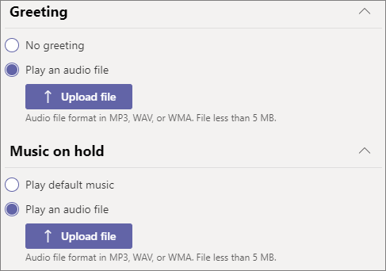
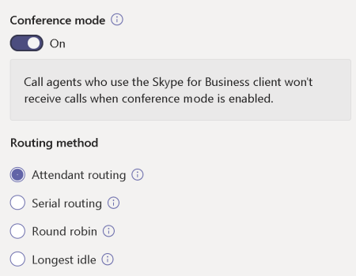
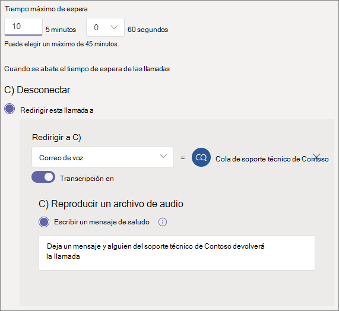

# Crear una cola de llamada

Las colas de llamadas proporcionan un método para enrutamiento de autores de llamadas a personas de la organización que pueden ayudarle con un problema o pregunta en particular. Las llamadas se distribuyen de una en una a las personas que están en la cola (que se denominan *agentes*). 

> [!TIP]
> Este artículo está destinado a grandes organizaciones. Si su organización es una pequeña empresa, lea [el tutorial Crear una cola de llamadas: pequeña empresa](/microsoftteams/business-voice/create-a-phone-system-call-queue-smb) en su lugar.

Las colas de llamadas proporcionan:

- Un mensaje de saludo

- Música mientras la gente está en espera en una cola

- Enrutamiento de llamadas ( en *orden Primero en entrar, Primero en salir* (FIFO) - a agentes

- Opciones de control para el desbordamiento de la cola y el tiempo de espera

Antes de seguir los procedimientos de este artículo, asegúrese de que ha leído [Planear Teams operadores automáticos y colas de llamadas](plan-auto-attendant-call-queue.md) y ha seguido los [pasos de introducción](plan-auto-attendant-call-queue.md#getting-started).

**Consulte la matriz [de compatibilidad de características de la cola de llamadas](#call-queue-feature-compatibility) a continuación para obtener más información.**

## Crear la cola de llamadas

Para configurar una cola de llamadas, en el centro de administración de Teams, expanda **Voz**, haga clic en **Llamar** y, después, haga clic en **Agregar**.

Escriba un nombre descriptivo para la cola.

## Cuentas de recursos

Haga clic en **Agregar cuentas**, busque la cuenta de recursos que desea usar con esta cola de llamadas, haga clic en **Agregar** y, después, haga clic en **Agregar**. (Los agentes verán el nombre de la cuenta del recurso cuando reciban una llamada entrante).

Para obtener más información, vea [Administrar cuentas de recursos de Teams](manage-resource-accounts.md).

## Identificador dinámico de llamadas

**Disponible para usuarios de escritorio de llamadas de canal o de colaboración de Teams y usuarios de Teams cliente móvil con colas de llamadas estándar**

Puede asignar números de identificación de llamadas salientes a los agentes especificando una o más cuentas de recursos con un número de teléfono. Los agentes pueden seleccionar el número de identificación de llamada saliente que se usará con cada llamada saliente que realicen. En la aplicación Llamadas, los agentes pueden usar su número de cola de llamadas o operador automático (AA) o su propio dial directo entrante (DID) personal.

Haga clic en **Agregar**, busque las cuentas de recursos que desea permitir que los agentes usen con fines de identificador de llamadas al realizar llamadas salientes, haga clic en **Agregar** y, a continuación, haga clic en **Agregar**.

**Colas de llamadas estándar**

Para Teams usuarios de escritorio y colas de llamadas estándar, considere la posibilidad de establecer el identificador de llamada de los miembros de la cola de llamadas en el número de servicio de la cola de llamadas o en el operador automático adecuado. Para obtener más información, vea [Administrar directivas de identificador de llamada en Microsoft Teams](caller-id-policies.md).

> [!NOTE]
> La cuenta de recursos usada para fines de identificador de llamada debe tener asignada una licencia de usuario virtual de Teléfono Microsoft Teams System y una de las siguientes opciones:
>
> - Una licencia del plan de llamadas y un número de teléfono asignados
> - Un número de teléfono Conexión con operador asignado
> - Una directiva de enrutamiento de voz en línea (la asignación de números de teléfono es opcional al usar enrutamiento directo)

## Idioma

Elige un [idioma admitido](create-a-phone-system-call-queue-languages.md). Este idioma se usará para los mensajes de voz generados por el sistema y la transcripción de correo de voz (si las habilita).

## Saludos y música en espera en cola

Especifique si quiere reproducir un saludo a los autores de llamadas cuando lleguen a la cola. Debe cargar un archivo MP3, WAV o WMA que contenga el saludo que desea reproducir. La grabación cargada no puede ser superior a 5 MB.

Los equipos proporcionan música predeterminada a los autores de llamadas mientras están en espera en una cola. La música predeterminada que se proporciona en las colas de llamadas de Teams no tiene que pagar ningún pago de la organización. Si desea reproducir un archivo de audio específico, elija **Reproducir un archivo de audio en** y cargar un archivo MP3, WAV o WMA.

> [!NOTE]
> Usted es responsable de borrar y asegurar de forma independiente todos los derechos y permisos necesarios para usar cualquier archivo de música o audio con su servicio de Microsoft Teams, que puede incluir la propiedad intelectual y otros derechos de cualquier música, efectos de sonido, audio, marcas, nombres y otro contenido en el archivo de audio de todos los titulares de derechos pertinentes, que pueden incluir artistas, actores,  artistas intérpretes o ejecutantes, músicos, compositores, compositores, sellos discográficos, editores musicales, sindicatos, sindicatos, sociedades de derechos, organizaciones de gestión colectiva y cualquier otra parte que posea, controle o licencia los derechos de autor de música, efectos sonoros, audio y otros derechos de propiedad intelectual.

## Llamar a agentes

Revise los [requisitos previos para agregar agentes a una cola de llamadas](plan-auto-attendant-call-queue.md#prerequisites).

##### canal Teams

Puede agregar hasta 200 agentes a través de un canal de Teams. Debe ser miembro del equipo o el creador o propietario del canal para agregar un canal a la cola.

Si desea [usar un canal de Teams para administrar la cola](https://support.microsoft.com/office/9f07dabe-91c6-4a9b-a545-8ffdddd2504e), seleccione la opción **Elegir un equipo** y haga clic en **Agregar un canal**. Busque el equipo que desea usar, selecciónelo y haga clic en **Agregar**. Seleccione el canal que desea usar (solo se admiten canales estándar) y haga clic en **Aplicar**. 

Los siguientes clientes son compatibles al usar un canal de Teams para colas de llamadas: 

  - Microsoft Teams Windows cliente
  - Cliente de Microsoft Teams para Mac

> [!NOTE]
> Si utiliza esta opción, la cola de llamadas puede tardar hasta 24 horas en funcionar por completo.
>
> Si hay más de 200 miembros en el equipo, solo se agregarán los primeros 200 miembros, en orden alfabético, como agentes a la cola de llamadas.

##### Usuarios y grupos

Puede agregar hasta 20 agentes individualmente y hasta 200 agentes a través de grupos.

Si desea agregar usuarios o grupos individuales a la cola, seleccione **Elegir usuarios y grupos**. 

Para agregar un usuario a la cola, haga clic en **Agregar usuarios**, busque el usuario, haga clic en **Agregar** y, después, haga clic en **Agregar**.

Para agregar un grupo a la cola, haga clic en **Agregar grupos**, busque el grupo, haga clic en **Agregar** y, después, haga clic en **Agregar**. Puede usar listas de distribución, grupos de seguridad, grupos de seguridad, grupos de Microsoft 365 o equipos de Microsoft Teams.

> [!NOTE]
> Los nuevos usuarios agregados a un grupo pueden tardar hasta ocho horas en llegar a su primera llamada.
>
> Si hay más de 200 miembros en el grupo, solo se agregarán los primeros 200 miembros, en orden alfabético, como agentes a la cola de llamadas.

## Enrutamiento de llamada

**El modo de conferencia** reduce la cantidad de tiempo que tarda el autor de la llamada en conectarse a un agente después de que el agente acepte la llamada. Para que el modo de conferencia funcione, los agentes en la cola de llamadas deben usar uno de los siguientes clientes:

  - Última versión del cliente de escritorio de Microsoft Teams, la aplicación de Android o la aplicación de iOS
  - Teléfono Microsoft Teams versión 1449/1.0.94.2020051601 o posterior
  
Las cuentas de Teams de los agentes deben estar configuradas en modo TeamsOnly. Los agentes que no cumplan los requisitos no se incluyen en la lista de enrutamiento de llamadas. Se recomienda habilitar el modo de conferencia para las colas de llamadas si los agentes usan clientes compatibles.

> [!NOTE]
> El modo de conferencia no es compatible si las llamadas de teléfono se redirigen a la cola desde una puerta de enlace de enrutamiento directo habilitada para el enrutamiento basado en ubicación.
>
> El modo de conferencia es necesario si Teams los usuarios necesitan consultar/transferir llamadas con colas de llamadas.

> [!TIP]
> Establecer **el modo de conferencia** **en Activado** es la opción recomendada.

**El método de enrutamiento** determina el orden en que los agentes reciben llamadas de la cola. Elija una de estas opciones:

- **El enrutamiento de operador** hace una llamada a todos los agentes en la cola al mismo tiempo. El primer agente de llamada que tome la llamada la recibe.

- **El enrutamiento de serie** a todos los agentes de llamada uno por uno en el orden especificado en la **Llamar a** lista. Si un agente descarta o no realiza una llamada, la llamada llamará al siguiente agente. Esto se repetirá hasta que se recoja la llamada o se agota el tiempo de espera.

- **Distribución equilibrada** equilibra el enrutamiento de llamadas entrantes para que cada agente de llamadas reciba el mismo número de llamadas de la cola. Este método de enrutamiento puede ser deseable en un entorno de ventas de entrada para garantizar la igualdad de oportunidades entre todos los agentes de llamadas.

- **Inactividad mayor** dirige cada llamada al agente que ha estado inactivo por más tiempo. Un agente se considera inactivo si su estado de presencia es Disponible. Los agentes cuyo estado de presencia no es Disponible no podrán recibir llamadas hasta que cambien su presencia a Disponible. 

> [!TIP]
> Establecer **Método de enrutamiento en** **Round robin** o **Longest Idle** es la opción recomendada.

> [!NOTE]
> Si la [grabación de cumplimiento](teams-recording-policy.md) está habilitada en los agentes, no se admite la combinación del **modo de conferencia** y el **enrutamiento de Attendant** . Si necesita usar el **modo conferencia**, seleccione **Enrutamiento en serie**, **Round robin** o **Longest idle** como **método de enrutamiento**. Si necesita usar el **enrutamiento de Attendant**, establezca **el modo de conferencia** en **Desactivado**.
> 
> Cuando se usa La **más larga inactiva** y cuando hay menos llamadas en cola que los agentes disponibles, solo se presentan las llamadas de la cola a los dos primeros agentes inactivos más largos.
> 
> Cuando se usa La **más larga inactiva**, puede haber ocasiones en que un agente recibe una llamada de la cola poco después de dejar de estar disponible, o un breve retraso en la recepción de una llamada de la cola después de estar disponible.
> 
> La presentación de llamadas de la cola de llamadas a agentes puede entrar en conflicto con las restricciones de enrutamiento basado en ubicación. En este caso, el agente recibirá una llamada del sistema, pero no podrá responder a la llamada. Esta condición continuará hasta que otro agente esté disponible para responder a la llamada, el autor de la llamada cuelgue o se produzca la condición de tiempo de espera de la cola de llamadas.  

**La red de enrutamiento basada en** usa el estado de disponibilidad de los agentes de llamada para determinar si un agente debe incluirse en la lista de enrutamiento de llamadas para el método de enrutamiento seleccionado. Los agentes de llamadas cuyo estado de disponibilidad está establecido en **Disponible** se incluyen en la lista de enrutamiento de llamadas y pueden recibir llamadas. Los agentes cuyo estado de disponibilidad se establezca en cualquier otro estado se excluyen de la lista de enrutamiento de llamadas y no recibirán llamadas hasta que el estado de disponibilidad vuelva a cambiar a **Disponible**. 

Puede habilitar el enrutamiento de llamadas basado en presencia con cualquiera de los métodos de enrutamiento.

Si un agente opta por no recibir llamadas, no se incluirán en la lista de enrutamiento de llamadas independientemente de cómo esté configurado su estado de disponibilidad. 

> [!NOTE]
> Cuando se selecciona **La inactividad más larga** como método de enrutamiento, se requiere un enrutamiento basado en presencia y se habilita automáticamente aunque el botón de alternancia de enrutamiento basado en presencia esté **Desactivado** y atenuado.
>
> Si el enrutamiento basado en presencia no está habilitado y hay varias llamadas en la cola, el sistema presentará estas llamadas simultáneamente a los agentes independientemente de su estado de presencia. Esta acción dará como resultado varias notificaciones de llamada a los agentes, especialmente si algunos agentes no responden a la llamada inicial que se les ha presentado.
>
> Al usar **el enrutamiento basado en** presencia, puede haber ocasiones en que un agente recibe una llamada de la cola poco después de dejar de estar disponible o un breve retraso en la recepción de una llamada de la cola después de estar disponible.
> 
> Los agentes que usan el cliente de Skype Empresarial no se incluyen en la lista de enrutamiento de llamadas cuando está habilitado el enrutamiento basado en presencia. Si tiene agentes que usan Skype Empresarial, no habilite el enrutamiento de llamadas basado en presencia.

> [!TIP]
> La configuración recomendada es establecer **el enrutamiento basado en** presencia **en Activado** .

**Tiempo de alerta de agente** especifica qué tanto tiempo sonará el teléfono de un agente antes de que la cola redirija la llamada al siguiente agente.

> [!TIP]
> La configuración recomendada es establecer la **hora de alerta del agente** en **20 segundos** .

> [!NOTE]
> La configuración [administración del tiempo de espera de llamadas](#call-timeout-handling) tiene prioridad sobre el tiempo de alerta del agente. Si se ha alcanzado el tiempo en cola máximo configurado para la administración del tiempo de espera de llamada, la llamada se recuperará de los agentes incluso si no se ha alcanzado el límite de tiempo de alerta del agente.

## Gestión de desbordamiento de llamadas

**Número máximo de llamadas en la cola**: use esta opción para establecer el número máximo de llamadas que pueden esperar en la cola al mismo tiempo. El valor predeterminado es 50, pero puede elegir un valor entre 0 y 200. Una vez alcanzado el límite, la llamada se administrará del modo que establezca en el ajuste **Cuando se alcanza el número máximo de llamadas**, que se describe a continuación.

Puede elegir desconectar la llamada o redirigirla a cualquiera de los destinos de enrutamiento de llamadas. Por ejemplo, puede que el autor de llamada deje un correo de voz para los agentes en la cola. Para las transferencias externas, consulte [Requisitos previos](plan-auto-attendant-call-queue.md#prerequisites) y [las transferencias de números de teléfono externos: detalles técnicos](create-a-phone-system-auto-attendant.md#external-phone-number-transfers---technical-details) para el formato de números.

> [!NOTE]
> Si el número máximo de llamadas se establece en 0, el mensaje de saludo no se reproducirá.
>
> Al redirigir al correo de voz compartido, asegúrese de que **Permitir que personas que no pertenezcan a la organización envíe correos electrónicos a este equipo** esté habilitado para el equipo o grupo en el Centro de Administración de Microsoft 365.

## Gestión de la caducidad de la llamada

**Tiempo de espera de la llamada: tiempo máximo** especifica el tiempo máximo en que una llamada puede estar en espera en la cola antes de que se redirija o se desconecta. Puede establecer un intervalo de entre 0 y 45 minutos.

Puede elegir desconectar la llamada o redirigirla a uno de los destinos de enrutamiento de llamadas. Por ejemplo, puede que el autor de llamada deje un correo de voz para los agentes en la cola. Para las transferencias externas, consulte [Requisitos previos](plan-auto-attendant-call-queue.md#prerequisites) y las [transferencias de números de teléfono externos: detalles técnicos](create-a-phone-system-auto-attendant.md#external-phone-number-transfers---technical-details) para el formato de números.

> [!NOTE]
> Al redirigir al correo de voz compartido, asegúrese de que **Permitir que personas que no pertenezcan a la organización envíe correos electrónicos a este equipo** esté habilitado para el equipo o grupo en el Centro de Administración de Microsoft 365.

Cuando haya seleccionado las opciones del tiempo de espera de la llamada, haga clic **Guardar**.

## Resumen de la configuración recomendada de la cola de llamadas

Se recomienda la siguiente configuración:

- **Modo de conferencia** a **Activado**
- **Método de enrutamiento** a **distribución equilibrada** o **inactividad mayor**
- **Enrutamiento basado en presencia** a **Activado**
- **Hora de alerta de agente:** a **20 segundos**

## Compatibilidad de características de la cola de llamadas

|Característica                          |Teams Escritorio1 |Teams Web | Teams Mobile2 |Lync |Teléfonos IP | Colas de llamadas estándar |Colas de llamadas basadas en canales | Comentario |
|:--------------------------------|:------------------------:|:--------:|:--------------:|:---:|:--------:|:--------------------:|:------------------------:|:--------|
|**Métodos de enrutamiento de agente**        |                          |          |                |     |          |                      |                          |   |
|`Attendant Routing`              |v                         |v         |v               |v    |v         |v                     |v                         |*Predeterminado*     |
|`Longest Idle`3       |v                         |v         |v               |N    |v         |v                     |v                         |*Recomendado* |
|`Round Robin`                    |v                         |v         |v               |v    |v         |v                     |v                         |*Recomendado* |
|`Serial`                         |v                         |v         |v               |v    |v         |Y4         |Y4             |   |
|**Opciones de enrutamiento de agente**        |                          |          |                |     |          |                      |                          |   |
|`Presence Based Routing`3|v                      |v         |v               |N    |v         |v                     |v                         |*Recomendado* |
|`Agents can Opt-out`               |v                       |v         |v               |Y7|Y7|v          |v                         |*Predeterminado*     |
|**Modos de transferencia**               |                          |          |                |     |          |                      |                          |   |
|`Conference Mode`5    |v                         |v         |v               |N    |Y6|v                  |v                         |*Recomendado* |
|`Transfer Mode`                  |v                         |v         |v               |v    |v         |v                     |v                         |*Predeterminado*              |
|**Llamadas colaborativas**        |                          |          |                |     |          |                      |                          |   |
|`Channel Based Queues`             |v                       |N         |N               |N    |N         |n/a                   |Y8             |   |
|**Identificador dinámico de llamadas**            |                          |          |                |     |          |                      |                          |   |
|`Standard call queue`            |N                         |N         |v               |N    |N         |Y                     |n/a                       |   |
|`Channel based call queue`       |v                         |n/a       |n/a             |n/a  |n/a       |n/a                   |v                         |   |
|**Métodos de conectividad RTC**    |                          |          |                |     |          |                      |                          |Vea la Nota 9   |
|`Calling Plans`                  |v                         |v         |v               |v    |v         |v                     |v                         |   |
|`Direct Routing`                 |v                         |v         |v               |N    |N         |v                     |v                         |   |
|`Operator Connect`               |v                         |v         |v               |     |          |v                     |v                         |   |
|**Misceláneos**                |                          |          |                |     |          |                      |                          |   |
|`Call toast shows Resource Account Name` |v                 |N         |v               |v    |          |v                     |v                         |              |

Notas:
1. Microsoft Teams Windows cliente, Microsoft Teams mac client, Microsoft Teams en infraestructura de escritorio virtualizada.
2. aplicación Microsoft Teams iPhone, aplicación Microsoft Teams Android.
3. Si selecciona Longest Idle para el método de enrutamiento del agente, se habilitará automáticamente el enrutamiento basado en presencia.
4. Solo puede establecer el orden al agregar usuarios individuales como parte de las colas de llamadas estándar. Cuando se usa una lista de distribución o un canal de Teams el orden será alfabético.
5. El modo de conferencia no es compatible si las llamadas de teléfono se redirigen a la cola desde una puerta de enlace de enrutamiento directo habilitada para el enrutamiento basado en ubicación.
6. solo Teléfono Microsoft Teams.
7. A través de la página del Portal de Configuración de usuarios en https://aka.ms/vmsettings.
8. Solo se admiten canales públicos.
9. Los operadores automáticos y las colas de llamadas no pueden transferir llamadas entre métodos de conectividad RTC.

## Clientes compatibles

Los siguientes clientes son compatibles con agentes de llamada en una cola de llamadas:

  - Cliente de escritorio de Skype Empresarial 2016 (versiones de 32 y 64 bits)
  - Cliente de escritorio de Lync 2013 (versiones de 32 y 64 bits)
  - Todos los modelos de teléfonos IP compatibles con Microsoft Teams. Consulte [Obtener teléfonos con Skype Empresarial Online](/skypeforbusiness/what-is-phone-system-in-office-365/getting-phones-for-skype-for-business-online/getting-phones-for-skype-for-business-online).
  - Cliente de Skype for Business para Mac (versión 16.8.196 y posteriores)
  - Cliente de Skype para Business para Android (versión 6.16.0.9 y posteriores)
  - Cliente de Skype for Business para iPhone (versión 6.16.0 y posteriores)
  - Cliente de Skype for Business para iPad (versión 6.16.0 y posteriores)
  - Cliente de Microsoft Teams para Windows (versiones de 32 y 64 bits)
  - Cliente de Microsoft Teams para Mac
  - Microsoft Teams sobre [infraestructura de escritorio virtualizada](/microsoftteams/teams-for-vdi) (Windows Virtual Desktop, Citrix y VMware)
  - Aplicación Microsoft Teams para iPhone
  - Aplicación Microsoft Teams para Android

    > [!NOTE]
    > Las colas de llamadas a las que se les ha asignado un número de enrutamiento directo no admiten Skype Empresarial clientes, clientes de Lync ni teléfonos IP Skype Empresarial como agentes. El cliente de Teams solo es compatible con un [modo de existencia conjunto de TeamsOnly](/microsoftteams/setting-your-coexistence-and-upgrade-settings).

## Cmdlets de colas de llamadas

Windows PowerShell le permite crear y administrar colas de llamadas a través de la línea de comandos de forma por lotes o mediante programación.

Los siguientes cmdlets le permiten administrar una cola de llamadas:

- [New-CsCallQueue](/powershell/module/skype/New-CsCallQueue)
- [Get-CsCallQueue](/powershell/module/skype/Get-CsCallQueue)
- [Set-CsCallQueue](/powershell/module/skype/Set-CsCallQueue)
- [Remove-CsCallQueue](/powershell/module/skype/Remove-CsCallQueue)

Los siguientes cmdlets adicionales también son necesarios para administrar los usuarios, cuentas de recursos, licencias de Teléfono Microsoft Teams, números de teléfono, archivos de audio e idioma admitido que se usará con las colas de llamadas:

Usuarios/Teams

- Usuarios
- - [Get-CsOnlineUser](/powershell/module/skype/Get-CsOnlineUser)

- Teams: 
- - [Obtener equipo](/powershell/module/teams/Get-Team)
- - [Get-TeamChannel](/powershell/module/teams/Get-TeamChannel)

Cuentas de recursos:

- [New-CsOnlineApplicationInstance](/powershell/module/skype/New-CsOnlineApplicationInstance)
- [Find-CsOnlineApplicationInstance](/powershell/module/skype/Find-CsOnlineApplicationInstance)
- [Get-CsOnlineApplicationInstance](/powershell/module/skype/Get-CsOnlineApplicationInstance)
- [Set-CsOnlineApplicationInstance](/powershell/module/skype/Set-CsOnlineApplicationInstance)
- [New-CsOnlineApplicationInstanceAssociation](/powershell/module/skype/New-CsOnlineApplicationInstanceAssociation)
- [Get-CsOnlineApplicationInstanceAssociation](/powershell/module/skype/Get-CsOnlineApplicationInstanceAssociation)
- [Remove-CsOnlineApplicationInstanceAssociation](/powershell/module/skype/Remove-CsOnlineApplicationInstanceAssociation)
- [Get-CsOnlineApplicationInstanceAssociationStatus](/powershell/module/skype/Get-CsOnlineApplicationInstanceAssociationStatus)

Licencias de Teams Teléfono virtuales:

- [Get-MsolAccountSku](/powershell/module/msonline/get-msolaccountsku)
- [Set-MsolUserLicense](/powershell/module/msonline/set-msoluserlicense)

Teléfono asignación numérica:

- [Get-CsOnlineTelephoneNumber](/powershell/module/skype/Get-CsOnlineTelephoneNumber)
- [Set-CsPhoneNumberAssignment](/powershell/module/teams/Set-csphonenumberassignment)

Archivos de audio

- [Get-CsOnlineAudioFile](/powershell/module/skype/Get-CsOnlineAudioFile)
- [Import-CsOnlineAudioFile](/powershell/module/skype/Import-CsOnlineAudioFile)
- [Export-CsOnlineAudioFile](/powershell/module/skype/Export-CsOnlineAudioFile)
- [Remove-CsOnlineAudioFile](/powershell/module/skype/Remove-CsOnlineAudioFile)

Listas de idiomas de soporte técnico

- [Get-CsAutoAttendantSupportedLanguage](/powershell/module/skype/Get-CsAutoAttendantSupportedLanguage)

Para obtener una guía paso a paso para crear colas de llamadas con PowerShell, consulte [Creación de colas de llamadas con cmdlets de PowerShell](create-a-phone-system-call-queue-via-cmdlets.md)

## Herramienta de diagnóstico de cola de llamadas

Si es administrador, puede usar la siguiente herramienta de diagnóstico para validar que una cola de llamadas pueda recibir llamadas:

1. Seleccione **Ejecutar pruebas** a continuación, lo cual rellenará el diagnóstico en el Centro de administración de Microsoft 365. 

   > [!div class="nextstepaction"]
   > [Ejecutar pruebas: Teams cola de llamadas](https://aka.ms/TeamsCallQueueDiag)

2. En el panel Ejecutar diagnóstico, escriba la Cuenta de recursos en el campo **Nombre de usuario o Correo electrónico** y, después, seleccione **Ejecutar pruebas**.

3. Las pruebas devolverán los mejores pasos siguientes para abordar cualquier inquilino, directiva y configuración de cuenta de recursos para validar que la cola de llamadas pueda recibir llamadas.

## Temas relacionados

[Esto es lo que obtienes con Teléfono Microsoft Teams](here-s-what-you-get-with-phone-system.md)

[Obtener números de teléfono de servicio](getting-service-phone-numbers.md)

[Países y regiones donde Audioconferencia y Planes de llamada están disponibles](country-and-region-availability-for-audio-conferencing-and-calling-plans/country-and-region-availability-for-audio-conferencing-and-calling-plans.md)
