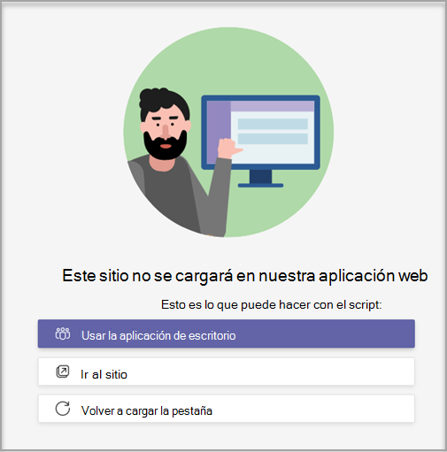

# Crear una plantilla de equipo personalizada en Microsoft TeamsCreate a custom team template in Microsoft Teams

**Las plantillas personalizadas aún no son compatibles con los clientes de EDU.****Custom templates are not yet supported for EDU customers.**

Una plantilla de equipo personalizada es una estructura de equipo predefinida con un conjunto de canales, pestañas y aplicaciones.A custom team template is a predefined team structure with a set of channels, tabs, and apps. Puede desarrollar una plantilla que le ayude a crear rápidamente el espacio de colaboración adecuado.You can develop a template that helps you create the right collaboration space quickly. La plantilla de equipo personalizada usa la configuración que prefiera.Your custom team template uses your preferred settings.  

Para empezar:To get started:

1. Inicie la sesión en el Centro de administración de TeamsSign in to the Teams admin center.

2. En el panel de navegación izquierdo, expanda **Plantillas de equipo** de  >  **Teams.**In the left navigation, expand **Teams** > **Team templates**.

3. Seleccione **Agregar**.Select **Add**.

    

4. En la **sección Plantillas de** equipo, seleccione Crear una plantilla **nueva.**In the **Team templates** section, select **Create a brand new template**.

5. En la **sección Configuración de** plantilla, complete los siguientes campos y, a continuación, seleccione **Siguiente:**In the **Template settings** section, complete the following fields and then select **Next**:
    - Nombre de plantillaTemplate name
    - Descripciones cortas y largas de la plantillaTemplate short and long descriptions
    - Visibilidad de configuración regionalLocale visibility  

    

6. En la **sección canales, pestañas** y aplicaciones, agregue los canales y aplicaciones que necesite su equipo.In the **channels, tabs, and apps** section, add any channels and apps that your team needs.

    1. En la **sección Canales,** seleccione **Agregar**.In the **Channels** section, select **Add**.
    2. En el **cuadro de** diálogo Agregar, asigne un nombre al canal.In the **Add** dialog, name the channel.
    3. Agregue una descripción.Add a description.
    4. Decida si el canal debe mostrarse de forma predeterminada.Decide if the channel should be shown by default.
    5. Busque el nombre de la aplicación que quiera agregar al canal.Search for an app name that you want to add to the channel.
    6. Seleccione **Aplicar** cuando haya terminado.Select **Apply** when finished.

    

8. Seleccione **Enviar** cuando haya finalizado.Select **Submit** when completed.

La nueva plantilla se muestra en la lista **Plantillas de** equipo.Your new template is displayed in the **Team templates** list. La plantilla se puede usar para crear un equipo en Teams.The template can be used to create a team in Teams.

> [!Note]
> Los usuarios de equipos pueden tardar hasta 24 horas en ver una plantilla personalizada en la galería.It can take up to 24 hours for teams users to see a custom template in the gallery.

## Personalizar aplicaciones de pestaña Sitio webCustomizing Website Tab apps

> [!Note]
> Esta característica está en versión preliminarThis feature is in early preview

Es posible que desee especificar direcciones URL para pestañas de sitio web para canales en plantillas de equipo personalizadas.You might want to specify URLs for website tabs for channels in custom team templates. Los usuarios finales que creen equipos con plantillas tendrán pestañas de sitio web predefinidas en la dirección URL del sitio especificada.End users who create teams with templates will have website tabs that are preset to the specified site URL.

Para empezar:To get started:

1. Cree una nueva plantilla de equipo o edite una plantilla de equipo existente.Create a new team template or edit an existing team template.

2. En la sección Canales, agregue un nuevo canal o seleccione un canal existente y seleccione **Editar.**In the Channels section, add a new channel or select an existing channel and select **Edit**.

3. En la **sección Agregar una aplicación para esta plantilla,** agregue una aplicación sitio web.In the **Add an app for this template** section, add a Website app.

    

4. Seleccione el icono de edición e introduzca la dirección URL que prefiera.Select the edit icon and input the URL of your choice.

    

5. Seleccione **Guardar** para las modificaciones de la aplicación de pestaña y, a continuación, **seleccione Aplicar** para guardar los cambios.Select **Save** for your tab app edits, and then select **Apply** to save your changes.

## Problemas conocidosKnown issues

**Problema:** Si ha creado un equipo a partir de una plantilla personalizada que contenía pestañas personalizadas adicionales, es posible que vea pestañas en blanco en lugar de las aplicaciones de pestaña personalizadas.**Problem**: If you've created a team from a custom template that contained additional custom tabs, you might see blank tabs in place of your custom tab apps. Las pestañas predeterminadas (como **Publicaciones,** **Archivos** y **Wiki)** aparecerán según lo esperado.Your default tabs (such as **Posts**, **Files**, and **Wiki**) will appear as expected.

**Solución:** Para solucionar este problema, quite la pestaña personalizada y agregue una nueva pestaña con la misma aplicación.**Solution**: To fix this issue, remove the custom tab and add a new tab with the same app. Si no tiene permisos para quitar la pestaña personalizada y agregar una nueva pestaña, póngase en contacto con el propietario del equipo para obtener ayuda.If you don't have permissions to remove the custom tab and add a new tab, contact the team owner for assistance.

Actualmente estamos trabajando en una corrección para futuros equipos creados a partir de plantillas personalizadas.We're currently working on a fix for future teams created from custom templates.

**Problema:** Al usar Teams en el explorador, algunos sitios web no admiten que se represente en una pestaña de Teams.**Problem**: When using Teams in the browser, some websites don't support being rendered within a Teams tab.

**Solución:** Si tiene problemas para ver el contenido de la pestaña del sitio web, se le redirigirá a abrir la pestaña en una página web independiente o a abrir Teams en la aplicación de escritorio para ver la aplicación de pestaña del sitio web.**Solution**: If you have trouble viewing the contents of the website tab, you'll be redirected to either open the tab in a separate webpage, or open Teams in the desktop app instead to view your website tab app.

## Temas relacionadosRelated topics

- [Introducción a las plantillas de equipo en el Centro de administraciónGet started with team templates in the admin center](get-started-with-teams-templates-in-the-admin-console.md)
- [Crear una plantilla a partir de un equipo existenteCreate a template from an existing team](create-template-from-existing-team.md)
- [Crear una plantilla de equipo a partir de una plantilla de equipo existenteCreate a team template from an existing team template](create-template-from-existing-template.md)
