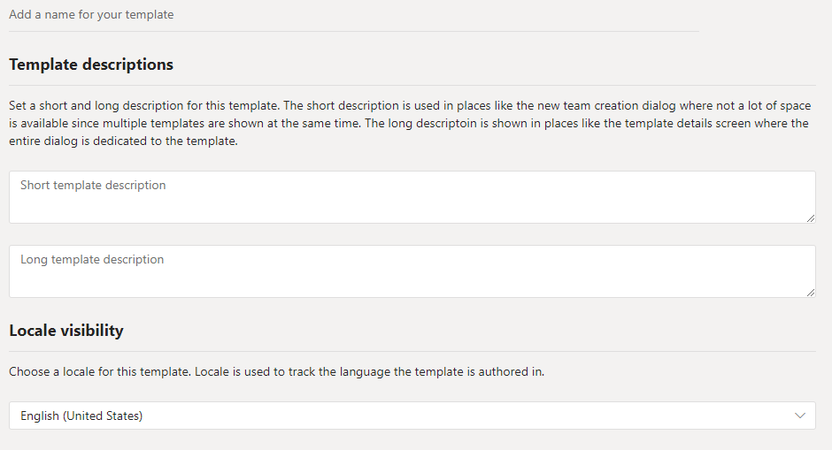

# Crear una plantilla de equipo personalizada en Microsoft TeamsCreate a custom team template in Microsoft Teams

**Las plantillas personalizadas aún no son compatibles con los clientes de EDU.****Custom templates are not yet supported for EDU customers.**

Una plantilla de equipo personalizado es una estructura de equipo predefinida con un conjunto de canales, pestañas y aplicaciones.A custom team template is a predefined team structure with a set of channels, tabs, and apps. Puede desarrollar una plantilla que le ayude a crear rápidamente el espacio de colaboración.You can develop a template that helps you create the right collaboration space quickly. La plantilla de equipo personalizada usa la configuración que prefiera.Your custom team template uses your preferred settings.  

Para comenzar:To get started:

1. Inicie sesión en el centro de administración de Teams.Log in to the Teams admin center.

2. En el navegación izquierdo, expanda plantillas de equipo **de Teams**  >  **Team templates** .In the left navigation, expand **Teams** > **Team templates** .

3. Haga clic en **Agregar** .Click **Add** .

4. En la sección **plantillas de equipo** , seleccione **crear una plantilla completamente nueva** .In the **Team templates** section, select **Create a brand new template** .

5. En la sección **configuración de plantillas** , complete los siguientes campos y, a continuación, haga clic en **siguiente** :In the **Template settings** section, complete the following fields and then click **Next** :
    - Nombre de la plantillaTemplate name
    - Descripciones breves y cortas de plantillaTemplate short and long descriptions
    - Visibilidad de la configuración regionalLocale visibility  

6. En la sección **canales, fichas y aplicaciones** , agregue los canales y las aplicaciones que necesite el equipo.In the **channels, tabs, and apps** section, add any channels and apps that your team needs.

    1. En la sección **canales** , haga clic en **Agregar** .In the **Channels** section, click **Add** .
    2. En el cuadro de diálogo **Agregar** , asigne un nombre al canal.In the **Add** dialog, name the channel.
    3. Agregue una descripción.Add a description.
    4. Decida si el canal se debe mostrar de forma predeterminada.Decide if the channel should be shown by default.
    5. Busque el nombre de una aplicación que quiera agregar al canal.Search for an app name that you want to add to the channel.
    6. Cuando haya terminado, haga clic en **aplicar** .Click **Apply** when finished.

8. Haga clic en **Enviar** cuando haya finalizado.Click **Submit** when completed.

La nueva plantilla aparecerá en la lista **plantillas de equipo** .Your new template is displayed in the **Team templates** list. La plantilla se puede usar para crear un equipo en Teams.The template can be used to create a team in Teams.

> [!Note]
> Los usuarios de equipos pueden tardar hasta 24 horas en ver una plantilla personalizada en la galería.It can take up to 24 hours for teams users to see a custom template in the gallery.

## Temas relacionadosRelated topics

- [Introducción a las plantillas de equipo en el centro de administraciónGet started with team templates in the admin center](get-started-with-teams-templates-in-the-admin-console.md)
- [Crear una plantilla a partir de un equipo existenteCreate a template from an existing team](create-template-from-existing-team.md)
- [Crear una plantilla de equipo a partir de una plantilla de equipo existenteCreate a team template from an existing team template](create-template-from-existing-template.md)
