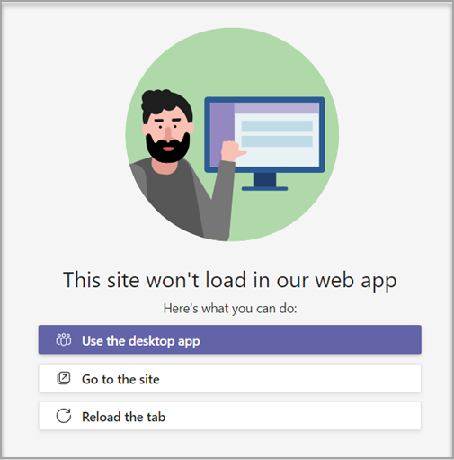

# Crear una plantilla de equipo personalizada en Microsoft Teams

**Las plantillas personalizadas aún no son compatibles con los clientes educativos.**

Una plantilla de equipo personalizada es una estructura de equipo predefinida con un conjunto de canales, pestañas y aplicaciones. Puede desarrollar una plantilla que le ayude a crear el espacio de colaboración adecuado rápidamente. La plantilla de equipo personalizada usa la configuración que prefiera.  

 

> [!VIDEO https://www.microsoft.com/en-us/videoplayer/embed/RE4P5rx]

Para empezar:

1. Inicie la sesión en el Centro de administración de Teams

2. En el panel de navegación izquierdo, expanda **Plantillas de equipo de** **Teams** > .

3. Seleccione **Agregar**.

    

4. En la sección **Plantillas de** equipo, seleccione **Crear una plantilla totalmente nueva**.

5. En la sección **Configuración de plantilla** , complete los siguientes campos y, a continuación, seleccione **Siguiente**:
    - Nombre de plantilla
    - Descripciones breves y largas de las plantillas
    - Visibilidad de configuración regional  

    

6. En la sección **canales, pestañas y aplicaciones** , agregue los canales y aplicaciones que necesite su equipo.

    1. En la sección **Canales** , seleccione **Agregar**.
    2. En el cuadro de diálogo **Agregar** , asigne un nombre al canal.
    3. Agregue una descripción.
    4. Decida si el canal debe mostrarse de forma predeterminada.
    5. Busque un nombre de aplicación que quiera agregar al canal.
    6. Cuando termine, seleccione **Aplicar** .

    

8. Selecciona **Enviar** cuando se haya completado.

La nueva plantilla se muestra en la lista **plantillas de equipo** . La plantilla se puede usar para crear un equipo en Teams.

> [!Note]
> Los usuarios de teams pueden tardar hasta 24 horas en ver un cambio de plantilla personalizada en la galería.

## Personalización de aplicaciones de la pestaña Sitio web

> [!Note]
> Esta característica está en versión preliminar anticipada

Es posible que desee especificar direcciones URL para las pestañas de sitios web de los canales en plantillas de equipo personalizadas. Los usuarios finales que creen equipos con plantillas tendrán pestañas de sitios web predefinidas en la dirección URL del sitio especificada.

Para empezar:

1. Cree una nueva plantilla de equipo o edite una plantilla de equipo existente.

2. En la sección Canales, agregue un canal nuevo o seleccione uno existente y seleccione **Editar**.

3. En la sección **Agregar una aplicación para esta plantilla** , agregue una aplicación de sitio web.

    

4. Selecciona el icono de edición y escribe la dirección URL de tu elección.

    

5. Seleccione **Guardar** para las modificaciones de la aplicación de pestaña y, a continuación, seleccione **Aplicar** para guardar los cambios.

## Problemas conocidos

**Problema**: Si ha creado un equipo a partir de una plantilla personalizada que contenía pestañas personalizadas adicionales, es posible que vea pestañas en blanco en lugar de las aplicaciones de pestañas personalizadas. Las pestañas predeterminadas (como **Publicaciones**, **Archivos** y **Wiki**) aparecerán según lo esperado.

**Solución**: para solucionar este problema, quite la pestaña personalizada y agregue una nueva pestaña con la misma aplicación. Si no tiene permisos para quitar la pestaña personalizada y agregar una pestaña nueva, póngase en contacto con el propietario del equipo para obtener ayuda.

Actualmente estamos trabajando en una corrección para futuros equipos creados a partir de plantillas personalizadas.

**Problema**: Al usar Teams en el explorador, algunos sitios web no permiten que se representen en una pestaña de Teams.

**Solución**: si tiene problemas para ver el contenido de la pestaña del sitio web, se le redirigirá para que abra la pestaña en una página web independiente o abra Teams en la aplicación de escritorio en su lugar para ver la aplicación de pestaña del sitio web.

## Temas relacionados

- [Introducción a las plantillas de equipo en el centro de administración](get-started-with-teams-templates-in-the-admin-console.md)
- [Crear una plantilla a partir de un equipo existente](create-template-from-existing-team.md)
- [Crear una plantilla de equipo a partir de una plantilla de equipo existente](create-template-from-existing-template.md)
