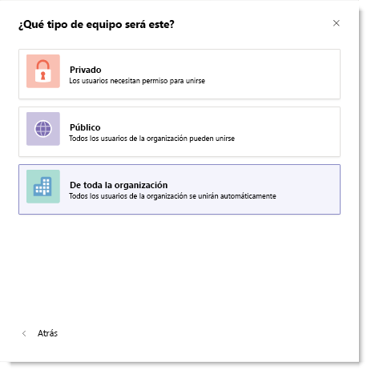

# Crear un equipo que abarque toda la organización en Microsoft TeamsCreate an org-wide team in Microsoft Teams

Los equipos de toda la organización proporcionan una forma automática para todos los usuarios en una organización pequeña a mediana forme parte de un único equipo para la colaboración.Org-wide teams provide an automatic way for everyone in a small to medium-sized organization to be a part of a single team for collaboration. 
 
Con los equipos de toda la organización, los administradores globales pueden crear fácilmente un equipo público que extrae en todos los usuarios de la organización y mantiene la pertenencia al día con Active Directory como unirse a los usuarios y salir de la organización.With org-wide teams, global administrators can easily create a public team that pulls in every user in the organization and keeps the membership up to date with Active Directory as users join and leave the organization. Sólo los administradores globales pueden crear los equipos de toda la organización y actualmente se limita a las organizaciones con no más de 5.000 usuarios un equipo de toda la organización.Only global admins can create org-wide teams and currently an org-wide team is limited to organizations with no more than 5,000 users. Si se cumplen estos requisitos, global administradores ven **toda la organización** como una opción al seleccionar **crear un equipo desde el principio** al crear un equipo.If these requirements are met, global admins will see **Org-wide** as an option when they select **Build a team from scratch** when creating a team. 

![Captura de pantalla de la opción de toda la organización para crear un equipo de toda la organización] (media/create-org-wide-team.png "Captura de pantalla de la opción de toda la organización para crear un equipo de toda la organización")

Cuando se crea un equipo de toda la organización, todos los administradores globales se agregan como propietarios de equipo y todos los usuarios activos se agregan como miembros del equipo.When an org-wide team is created, all global admins are added as team owners and all active users are added as team members. Los usuarios que están deshabilitados para los equipos, los usuarios invitados y salas mayoría no se agregan al equipo.Users who are disabled for Teams, guest users, and most rooms aren't added to the team. Como Active directory de su organización se ha actualizado para incluir nuevos usuarios activos o si los usuarios ya no funcionan en su empresa y su licencia de los equipos está deshabilitada, los cambios son automáticamente sincronizado y se agregan o se quitan del equipo de los usuarios.As your organization's directory is updated to include new active users or if users no longer work at your company and their Teams license is disabled, changes are automatically synced and the users are added or removed from the team. Los miembros del equipo no pueden dejar un equipo de toda la organización.Team members can't leave an org-wide team. Como propietario de un equipo, puede agregar manualmente o quitar los usuarios si es necesario.As a team owner, you can manually add or remove users if needed.

> [!NOTE]
> - Si no ve la opción de **toda la organización** al crear un equipo y es un administrador global, la característica aún es posible que implantar o su organización puede tener más que el límite de tamaño actual de 5.000 miembros.If you don't see the **Org-wide** option when creating a team and you're a global admin, the feature might still be rolling out or your organization might have more than the current size limit of 5,000 members. Buscamos para aumentar este límite en el futuro.We're looking to increase this limit in future.
> - Es posible que se agreguen o sincronizados con el equipo de toda la organización salones que no forman parte de un cuentas de lista, equipamiento y recursos de sala.Rooms that aren't a part of a room list, equipment, and resource accounts might be added or synced to the org-wide team. Los propietarios de equipo pueden quitar fácilmente estas cuentas desde el equipo.Team owners can easily remove these accounts from the team.

## Procedimientos recomendadosBest practices
Para obtener el máximo partido de su equipo de toda la organización, se recomienda que los propietarios de equipo haga lo siguiente.To get the most out of your org-wide team, we recommend team owners do the following.

### Permitir que sólo los propietarios de equipo registrar en el canal de GeneralAllow only team owners to post to the General channel
Reducir el ruido de canal por tener solo del equipo que los propietarios de entrada para el canal General.Reduce channel noise by having only team owners post to the General channel. Vaya al equipo y haga clic en **más opciones (…)**  >  **Administrar equipo**.Go to the team and click **More options (…)** > **Manage Team**. En la ficha **configuración** , haga clic en **permisos de miembro** > seleccionar **sólo los propietarios pueden publicar mensajes**.On the **Settings** tab, click **Member permissions** > select **Only owners can post messages**.
### Desactivar @team y @ menciones de [nombre de equipo]Turn off @team and @[team name] mentions
 Reducir @mentions para evitar la sobrecarga de toda la organización.Reduce @mentions to keep them from overloading the entire organization. Vaya al equipo y haga clic en **más opciones (…)**  >  **Administrar equipo**.Go to the team and click **More options (…)** > **Manage Team**. En la ficha **configuración** , haga clic en **@mentions** > desactivar **Mostrar (miembros de) la opción de @team o @[nombre de equipo]**.On the **Settings** tab, click **@mentions** > turn off **Show members the option to @team or @[team name]**. 
### Canales importantes automáticamente favoritosAutomatically favorite important channels
 Canales importantes favoritos para asegurarse de que todas las personas de su organización se activa en las conversaciones de específicas.Favorite important channels to ensure everyone in your organization engages in specific conversations. Para obtener más información, vea [canales automático favorito para todo el equipo](https://support.office.com/article/auto-favorite-channels-for-the-whole-team-a948272c-5aa5-429c-863c-4e1e1cd6b0f6).To learn more, see [Auto-favorite channels for the whole team](https://support.office.com/article/auto-favorite-channels-for-the-whole-team-a948272c-5aa5-429c-863c-4e1e1cd6b0f6).

### Quitar las cuentas que no es posible que pertenecenRemove accounts that might not belong
Aunque los miembros no pueden dejar un equipo de toda la organización, como propietario de un equipo, puede administrar la lista de participantes de equipo mediante la eliminación de las cuentas que no pertenecen.Even though members can’t leave an org-wide team, as a team owner, you can manage the team roster by removing accounts that don’t belong. Asegúrese de que usar los equipos para quitar los usuarios de su equipo de toda la organización.Make sure you use Teams to remove users from your org-wide team.  Si usa otra forma de quitar un usuario, como el centro de administración de Microsoft 365 o desde un grupo en Outlook, el usuario podría agregarse al equipo de toda la organización.If you use another way to remove a user, such as the Microsoft 365 admin center or from a group in Outlook, the user might be added back to the org-wide team. 

## Preguntas frecuentesFAQ

### ¿Hay alguna forma para crear un equipo de toda la organización que no sea mediante el cliente de los equipos?Is there a way to create an org-wide team other than using the Teams client? 

Los administradores globales sólo pueden crear un equipo de toda la organización mediante el cliente de los equipos.Global admins can only create an org-wide team by using the Teams client. Si su organización limita los equipos de creación para uso de PowerShell, la solución recomendada es agregar los administradores globales para el grupo de seguridad de los usuarios que puede crear un equipo.If your organization limits creating teams to using PowerShell, the recommended workaround is to add your global admins to the security group of users who can create a team. Si desea más información, consulte [Administrar quién puede crear grupos de Office 365](https://docs.microsoft.com/office365/admin/create-groups/manage-creation-of-groups).For more information, see [Manage who can create Office 365 Groups](https://docs.microsoft.com/office365/admin/create-groups/manage-creation-of-groups). 

Si esto no es una opción, puede crear un equipo público con PowerShell y agregar un administrador global como el propietario del equipo.If this isn't an option, you can create a public team using PowerShell and add a global admin as the team owner. A continuación, debe tener el administrador global haga clic en **más opciones de ˙˙˙** junto al nombre de equipo, haga clic en **Editar equipo**y, a continuación, cambie la privacidad a **toda la organización - todas las personas de su organización se agregará automáticamente**.Then, have the global admin click **˙˙˙ More options** next to the team name, click **Edit team**, and then change the privacy to **Org-wide - Everyone in your organization will be automatically added**. Tenga en cuenta que sólo los propietarios de equipo pueden tener acceso a la opción **Editar equipo** y los administradores globales sólo pueden ver la opción de **toda la organización** .Note that only team owners can access the **Edit team** option and only global admins can see the **Org-wide** option.

### ¿Hay alguna forma para convertir un equipo existente a un equipo de toda la organización?Is there a way to convert an existing team to an org-wide team?

Los administradores globales pueden convertir un equipo existente a un equipo de toda la organización edición en el cliente de los equipos.Global admins can convert an existing team to an org-wide team editing it in Teams client.
Vaya al nombre del equipo y haga clic en más opciones... equipo de edición de > (puntos suspensivos).Go to the team name and click More options ...(ellipsis) > Edit team.
