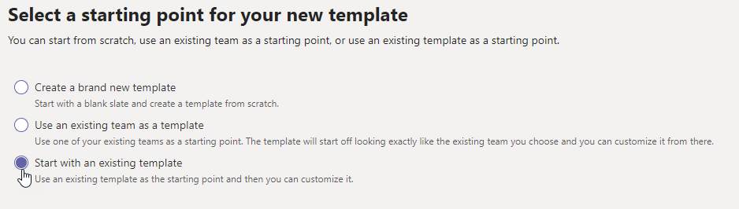

# Crear una plantilla a partir de una plantilla de equipo existente en Microsoft Teams

[!INCLUDE [preview-feature](includes/preview-feature.md)]

**Las plantillas personalizadas aún no son compatibles con los clientes educativos.**

Microsoft Teams proporciona plantillas predefinidas que se pueden guardar y modificar para satisfacer las necesidades particulares de la organización.

1. Inicie sesión en el Centro de administración de Teams.

2. En el panel de navegación izquierdo, expanda **las plantillas de Teams**  >  **Teams.**

3. En la **sección Plantillas de** equipo, seleccione junto a la plantilla que quiera duplicar para resaltarla.

4. Seleccione **Duplicar.**

(También puedes seleccionar **Agregar**  >  **Empiece con una plantilla existente** para abrir Seleccionar la plantilla que desea usar como punto de **partida).**

5. En la **pantalla Seleccionar la plantilla que se usará como punto de** inicio, seleccione **Siguiente.**

    Se abrirá la plantilla duplicada y la palabra **Copiar** se anexará al nombre.

6. Complete los siguientes campos y, después, seleccione **Siguiente:**
    - Nombre de la plantilla
    - Descripciones cortas y largas de la plantilla
    - Visibilidad de configuración regional  

7. En la **sección de canales, fichas** y aplicaciones, modifique los canales y las aplicaciones existentes que necesite el equipo.

    1. Seleccione un canal para editar y seleccione **Editar.**
    2. **Aplique** los cambios cuando haya terminado.

8. Agregue los canales o las aplicaciones que necesite su equipo.

    1. En la **sección** Canales, seleccione **Agregar.**
    2. En el **cuadro de** diálogo Agregar, asigne un nombre al canal.
    3. Agregue una descripción.
    4. Decida si el canal se mostrará de forma predeterminada.
    5. Busque el nombre de la aplicación que quiera agregar al canal.
    6. Seleccione **Aplicar** cuando haya terminado.

7. Seleccione **Enviar** cuando haya terminado de agregar canales y aplicaciones.

    La nueva plantilla se guardará en la biblioteca de plantillas.

> [!Note]
> Los usuarios de los equipos pueden tardar hasta 24 horas en ver una plantilla personalizada en la galería.

## Artículos relacionados

- [Introducción a las plantillas de equipo en el Centro de administración](get-started-with-teams-templates-in-the-admin-console.md)
- [Crear una plantilla de un equipo existente](create-template-from-existing-team.md)
- [Crear una plantilla de equipo](create-a-team-template.md)