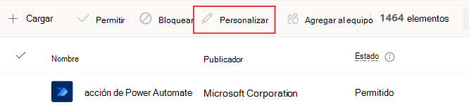
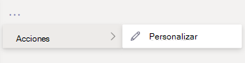
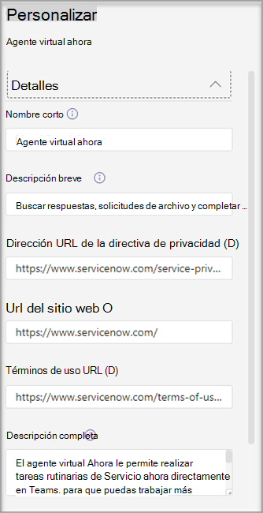
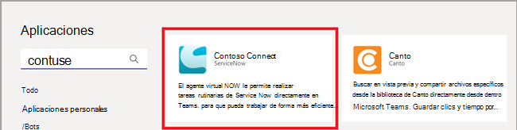
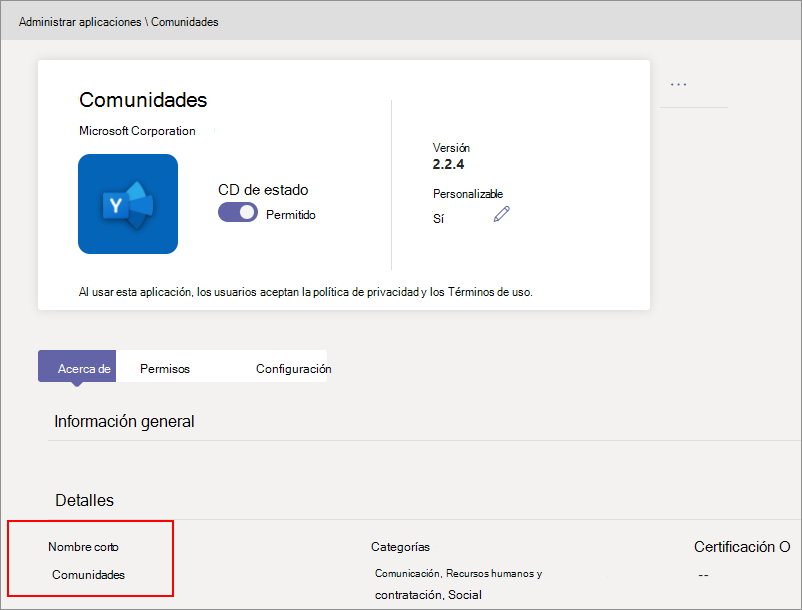
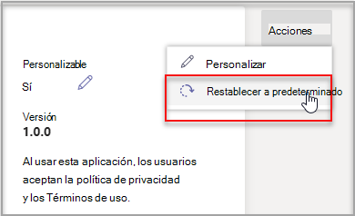

# Personalizar aplicaciones en Microsoft TeamsCustomize apps in Microsoft Teams

[!INCLUDE [preview-feature](includes/preview-feature.md)]

 Microsoft Teams proporciona personalización de aplicaciones para mejorar la experiencia de Teams.Microsoft Teams provides app customization to enhance the Teams experience. Algunos desarrolladores de aplicaciones permiten que el administrador de Teams personalizó una aplicación. El administrador puede personalizar o cambiar el nombre de las propiedades de la aplicación en función de las necesidades de la organización con la página Administrar aplicaciones del Centro de administración **de** Teams.Some app developers allow an app to be customized by the Teams admin. The admin can customize or rebrand the app properties based on the organizational needs using the Teams admin center **Manage apps** page. Los detalles que puede personalizar son:The details you can customize are:

- Nombre cortoShort name
- Descripción breveShort description
- Descripción completaFull description
- Dirección URL de la directiva de privacidadPrivacy policy URL
- Url del sitio webWebsite URL
- Url de términos de usoTerms of use URL
- Icono de colorColor icon
- Icono EsquemaOutline icon
- Color de énfeñoAccent color

Vea el [esquema Manifiesto de Teams](https://docs.microsoft.com/microsoftteams/platform/resources/schema/manifest-schema) para obtener más información sobre los campos que puede personalizar.See the [Teams Manifest schema](https://docs.microsoft.com/microsoftteams/platform/resources/schema/manifest-schema) for details about the fields that you can customize.

> [!NOTE]
> La personalización de aplicaciones no es compatible con Government Community Cloud High (GCCH) o department of defense (DoD) en este momento.Customizing apps isn't supported in Government Community Cloud High (GCCH) or Department of Defense (DoD) at this time.

## Personalizar los detalles de la aplicaciónCustomize the app's details

Para empezar a personalizar una aplicación, siga estos pasos:To start customizing an app, complete the following steps:

1. Inicie la sesión en el Centro de administración de TeamsSign in to the Teams admin center.
2. Expanda **Aplicaciones de Teams** y seleccione Administrar **aplicaciones.**Expand **Teams Apps** and select **Manage apps**.
3. Compruebe la **columna Personalizable** de la lista de aplicaciones y ordene por aplicaciones que se pueden personalizar.Check the **Customizable** column of the apps list and sort by apps that are customizable.

   

   Hay tres puntos de entrada para acceder a la característica de personalización:There are three entry points to access the customize feature:

   - Seleccione junto a la aplicación que desea personalizar y, a continuación, seleccione **Personalizar**.Select next to the app that you want to customize, and then select **Customize**.

     

   - Seleccione el nombre de la aplicación y, a continuación, **Personalizable.**Select the app name and then **Customizable**.

     

   - Seleccione el nombre de la aplicación y, a continuación, **seleccione Personalizar en** el **menú** desplegable Acciones.Select the app name, and then select **Customize** from the **Actions** dropdown.

     

4. Expanda la **sección Detalles** y personalice los campos siguientes:Expand the **Details** section and customize the following fields:

    - Nombre cortoShort name
    - Descripción breveShort description
    - Descripción completaFull description
    - Sitio webWebsite
    - Dirección URL de la directiva de privacidadPrivacy policy URL
    - Url de términos de usoTerms of use URL

   

> [!Note]
> Solo estarán visibles los campos que el desarrollador de aplicaciones haya asignado como personalizables.Only the fields that the app developer has assigned as customizable will be visible.

5. Expanda la **sección Icono.**Expand the **Icon** section.

   a.a. Cargar un icono.Upload an icon. Use un icono de color completo (192x192) píxel en formato PNG.Use one full-color icon (192x192) pixel in PNG format.

   b.b. Elija un color de contorno de icono.Choose an icon outline color. Use un píxel de contorno transparente (32x32) en formato PNG.Use one transparent outline (32x32) pixel in PNG format.

   c.c. Seleccione un color de acento de aplicación que coincida con el icono.Select an app accent color that matches the icon.

    

6. Una vez que la aplicación se haya personalizado, seleccione **Aplicar**.Once your app has been customized, select **Apply**.

7. Seleccione **Publicar** para publicar la aplicación personalizada.Select **Publish** to publish the customized app.

   La aplicación personalizada ahora aparece en la **página Administrar aplicaciones.**The customized app is now listed in your **Manage apps** page. Solo tendrá una versión de la aplicación, ya que personalizar las características de la aplicación no crea una copia de la aplicación.You'll have only one version of the app, since customizing the app features doesn't create a copy of the app.

Ahora los usuarios finales de Teams pueden abrir su cliente de Teams para ver la aplicación personalizada.Now your Teams end users can open their Teams client to see the customized app.

   

### Consideraciones especiales para personalizar una aplicaciónSpecial considerations for customizing an app

La siguiente nota incluye detalles importantes sobre cómo personalizar una aplicación.The following note includes important details about customizing an app.

> [!Note]
> - Cuando personalice las aplicaciones y cualquier descripción relacionada con una aplicación, asegúrese de que sigue las directrices de personalización si lo proporciona el editor de aplicaciones en su documentación o términos de uso.When you customize apps, and any description related to an app, ensure that you follow any customization guidelines if provided by the app publisher in their documentation or terms of use. También es responsable de respetar los derechos de otras personas con respecto a las imágenes de terceros que pueda usar.You're also responsible for respecting the rights of others regarding any third-party images you might use.
> - Los datos de personalización proporcionados por el administrador se almacenan en la región más cercana.Admin-provided customization data is stored in the nearest region.
> - Usted es responsable de garantizar que los vínculos a términos de uso o a la política de privacidad sean válidos.You are responsible for ensuring that links to terms of use or privacy policy are valid.
> - En caso de que el editor de aplicaciones ya no permita que se pueda personalizar un campo, aparecerá un mensaje en la página de detalles de la aplicación en el que se notificará al administrador sobre los campos que ya no se pueden personalizar.In case the app publisher no longer allows a field to be customizable, a message appears on the app details page notifying the admin about the fields that can't be customized any longer. Todos los cambios realizados en ese campo se revertirán a los valores originales.All the changes made to that field will be reverted to the original values.
> - Los cambios en la personal de marca pueden requerir hasta 24 horas para que los usuarios vean los cambios.Changes to branding might require up to 24 hours for the users to see the changes.

## Revisar detalles de la aplicaciónReview app details

Es posible que quiera ver los detalles de la aplicación para revisar la información.You might want to see the app details to review the information.

1. Inicie la sesión en el Centro de administración de TeamsSign in to the Teams admin center.

2. Expanda **aplicación de Teams** y seleccione **Administrar aplicaciones**.Expand **Teams apps** and select **Manage apps**.

3. Seleccione el nombre de la aplicación.Select the app name.

4. Ver los detalles de la aplicación, incluido el nombre original de la aplicación **Nombre corto del editor.**View the app details, including the original app name **Short name from publisher**.

   

   El **campo Nombre corto del editor** solo está visible si ha cambiado el nombre corto de la aplicación.The **Short name from publisher** field is only visible if you've changed the app's short name.

## Restablecer los detalles de la aplicación de forma predeterminadaReset app details to default

En cualquier momento, puede restablecer los detalles de la aplicación a la configuración original.At any time, you can reset the app details to the original settings.

1. Inicie la sesión en el Centro de administración de TeamsSign in to the Teams admin center.

2. Expanda **Aplicaciones de Teams** y seleccione Administrar **aplicaciones.**Expand **Teams Apps** and select **Manage apps**.

3. Seleccione el nombre de la aplicación.Select the app name.

4. Seleccione **Restablecer de forma predeterminada** en el menú **desplegable** Acciones.Select **Reset to default** from the **Actions** dropdown.

   

## Preguntas frecuentesFrequently asked questions

**¿Cuánto tiempo tardarán mis usuarios en ver la aplicación personalizada?****How long will it take for my users to see the customized app?**

Aunque el administrador puede ver inmediatamente los cambios en el Centro de administración de Teams, los usuarios finales pueden tardar hasta 24 horas en ver los cambios.Although the admin can immediately see the changes in Teams Admin Center, it might take up to 24 hours for the end users to see the changes.  

**¿Puede el proveedor de aplicaciones personalizar la aplicación para sus clientes?****Can the app provider customize the app for its customers?**

 No, el administrador de un inquilino debe personalizar la aplicación para su inquilino con el Centro de administración de Teams.No, the admin of a tenant needs to customize the app for their tenant using the Teams Admin Center.

**¿Se implementará automáticamente la aplicación personalizada para reemplazar mi aplicación personalizada actual en un espacio empresarial?****Will the customized app automatically get deployed to replace my current custom app in a tenant?**

No, los administradores de inquilinos tendrán que quitar manualmente cualquier aplicación personalizada y publicar la versión personalizada de la aplicación.No, the tenant admins will have to manually remove any custom app and publish the customized version of the app. Si ha personalizado una aplicación y la ha publicado como una aplicación personalizada, la nueva aplicación personalizada con la característica de personalización de la aplicación no reemplazará a la aplicación personalizada actual.If you have customized an app and published it as a custom app, the new app customized using the app customization feature won't replace the current custom app.  

**¿El informe de uso de la aplicación también mostrará los valores personalizados, como el nombre corto personalizado?****Will the app usage report also show the customized values such as customized short name?**

 No, el informe de uso de la aplicación seguirá mostrándo el nombre original de la aplicación enviada desde el editor.No, the app usage report will still show the original name of the app sent from the publisher.

**¿Qué aplicaciones puedo personalizar con la característica de personalización de aplicaciones?****Which apps can I customize using the app customization feature?**

Solo puede personalizar las aplicaciones que el editor de aplicaciones ha permitido personalizar.You can only customize apps that have been allowed to be customizable by the app publisher. El editor de aplicaciones tendrá que participar para permitir a sus clientes personalizar la aplicación.The app publisher will need to opt in to allow its customers to customize the app.

**¿Aparecerán las propiedades personalizadas en la pantalla de consentimiento de permisos de gráfico?****Will the customized properties show up on the graph permission consent screen?**

No, la pantalla de consentimiento de permisos seguirá mostrándo el valor original enviado por el editor.No, the permission consent screen will still show the original value sent by the publisher.

## Artículo relacionadoRelated article

- [Administrar aplicacionesManage apps](manage-apps.md)
- [Personalizar la tienda de aplicacionesCustomize your app store](customize-your-app-store.md)
