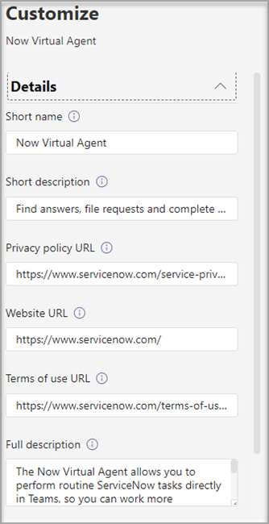

# Personalizar la apariencia de las aplicaciones en el almacén de Teams de su organización

Microsoft Teams permite a los administradores personalizar la aplicación de Teams para mejorar la experiencia del almacén y cumplir con la personalización de marca de su organización. Un desarrollador de aplicaciones puede permitir que un administrador de Teams personalice su aplicación. Después, puede actualizar las propiedades de la aplicación en función de las necesidades de la organización, en la página Administrar aplicaciones del Centro de administración de Teams. Los detalles que puede personalizar son:

* Nombre corto
* Descripción breve
* Descripción completa
* URL de la directiva de privacidad
* URL del sitio web
* Dirección URL de las condiciones de uso
* Icono de aplicación
* Color de contorno del icono
* Resaltar color

Para obtener más información sobre los distintos campos de metadatos de la aplicación, consulte el [Esquema del manifiesto de](/microsoftteams/platform/resources/schema/manifest-schema) en la documentación para desarrolladores.

> [!NOTE]
> No se han podido personalizar las aplicaciones transferidas localmente en ninguna organización. No han podido personalizar ninguna aplicación en nubes de Government Community Cloud Alta (GCCH) o del Departamento de Defensa (DoD).

## Personalizar los detalles de una aplicación

Para personalizar una aplicación, complete los pasos siguientes:

1. Inicie la sesión en el Centro de administración de Teams

1. Expanda **Aplicaciones de Teams** y seleccione **[Administrar aplicaciones](https://admin.teams.microsoft.com/policies/manage-apps)**.

1. Compruebe la columna **Personalizable** de la lista de aplicaciones y ordene por aplicaciones personalizables.

   

   Hay tres puntos de entrada para acceder a la característica de personalización:

   * Seleccione junto a la aplicación que desea personalizar y después, seleccione **Personalizar**.

     

   * Seleccione el nombre de la aplicación y después, seleccione el icono de edición en **Personalizable**.

     

   * Seleccione el nombre de la aplicación, haga clic en el **menú de desbordamiento**, mantenga el ratón sobre **Acciones** y seleccione Personalizar.

     

1. Expanda la sección **Detalles** y personalice uno o varios de los campos siguientes. Los campos asignados como personalizables por el desarrollador son visibles.

    * Nombre corto
    * Descripción breve
    * Descripción completa
    * Sitio web
    * URL de la directiva de privacidad
    * Dirección URL de las condiciones de uso

   

1. Expanda la sección **Icono**.

1. Cargue un icono. Use un icono (192 x 192) píxeles en formato PNG.

1. Elija un color de contorno de icono. Usa un píxel de contorno transparente (32 x 32) en formato PNG.

1. Seleccione un color de énfasis de la aplicación que coincida con el icono.

   

1. Después de personalizar la aplicación, seleccione **Aplicar**.

1. Seleccione **Publicar** para publicar la aplicación personalizada.

   La aplicación personalizada aparece ahora en la página **Administrar aplicaciones**. Solo tendrá una versión de la aplicación, ya que la personalización de las características de la aplicación no crea una copia de la aplicación.

Ahora los usuarios finales de Teams pueden ver la aplicación personalizada en su cliente.

   

Tenga en cuenta los siguientes detalles sobre la personalización de una aplicación:

* Al personalizar las aplicaciones y cualquier descripción relacionada con una aplicación, asegúrese de seguir las directrices de personalización que proporcione el editor de la aplicación en su documentación o sus condiciones de uso. También es responsable de respetar los derechos de otros usuarios con respecto a las imágenes de terceros que pueda usar.

* Los datos de personalización proporcionados por el administrador se almacenan en la región más cercana.

* Es responsable de asegurarse de que los vínculos a las condiciones de uso o a la política de privacidad son válidos.

* En caso de que el editor de la aplicación ya no permita que un campo sea personalizable, aparece un mensaje en la página de detalles de la aplicación que notifica al administrador sobre los campos que ya no se pueden personalizar. Todos los cambios realizados en ese campo se revertirán a los valores originales.

* Se recomienda probar los cambios de personalización de aplicaciones en un inquilino de prueba de Teams antes de realizar estos cambios en el entorno de producción.

* Los cambios en la personalización de marca pueden requerir hasta 24 horas para propagarse a todos los usuarios.

* Para que una aplicación se pueda personalizar, los desarrolladores pueden proporcionar una nueva versión de la aplicación. Cargue la nueva versión y quite la versión anterior de la aplicación. Si ha personalizado una aplicación y la ha publicado, la nueva aplicación personalizada con la característica de personalización de aplicaciones no reemplazará a la aplicación actual.

* El [informe de uso de la aplicación](teams-analytics-and-reports/app-usage-report.md) muestra el nombre original de la aplicación proporcionada por el publicador.

* El cuadro de diálogo de consentimiento de permisos de Microsoft Graph muestra el nombre original de la aplicación que proporciona el editor. Le ayuda a identificar con precisión una aplicación al mismo tiempo que le proporciona permisos.

## Revisar los detalles de la aplicación

Es posible que quiera ver los detalles de la aplicación para revisar la información.

1. Inicie la sesión en el Centro de administración de Teams

1. Expanda **Aplicaciones de Teams** y seleccione **[Administrar aplicaciones](https://admin.teams.microsoft.com/policies/manage-apps)**.

1. Seleccione el nombre de la aplicación.

1. Consulte los detalles de la aplicación, incluido el nombre original de la aplicación **Nombre corto del publicador**.

   

   El **campo Nombre corto del publicador** solo está visible si ha cambiado el nombre corto de la aplicación.

## Restablecer los detalles de la aplicación con los valores predeterminados

Puede restablecer los detalles de la aplicación a los valores originales proporcionados por el desarrollador de la aplicación. La opción solo está disponible para la aplicación que personalice.

1. En el Centro de administración de Teams, acceda a **Aplicaciones de Teams** > **[Administrar aplicaciones](https://admin.teams.microsoft.com/policies/manage-apps)**.

1. Seleccione el nombre de la aplicación.

1. Seleccione **Restablecer valores predeterminados** en el menú **Acciones**.

   

## Artículo relacionado

* [Administrar aplicaciones](manage-apps.md)
* [Personalización de la tienda de aplicaciones de su organización](customize-your-app-store.md)
* [Cambiar el nombre de las aplicaciones](https://techcommunity.microsoft.com/t5/microsoft-teams-blog/rebrand-apps-to-your-own-organization-s-branding-with-app/ba-p/2376296)
