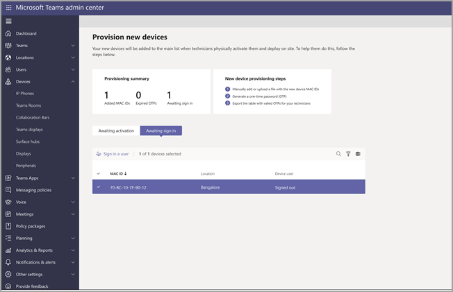
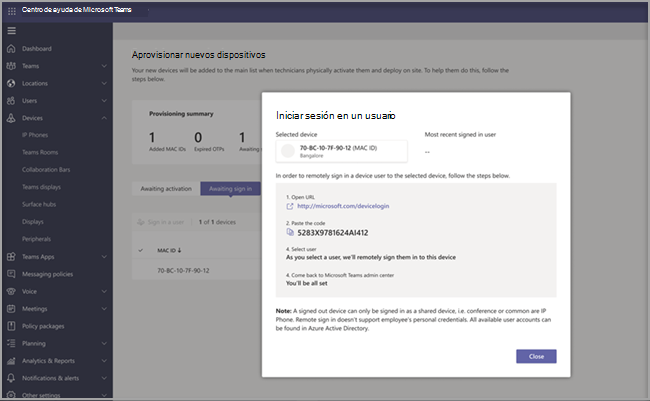

# Aprovisionamiento remoto e inicio de sesión para Teams dispositivos AndroidRemote provisioning and sign in for Teams Android devices

Los administradores de TI pueden aprovisionar e iniciar sesión de forma remota en Teams dispositivo Android.IT admins can remotely provision and sign in to a Teams Android device. Para aprovisionar un dispositivo de forma remota, el administrador debe cargar los IDs mac de los dispositivos que se aprovisionan y crear un código de verificación.To provision a device remotely, the admin needs to upload the MAC IDs of the devices being provisioned and create a verification code. Todo el proceso se puede completar de forma remota desde el Teams de administración.The entire process can be completed remotely from the Teams admin center.

## Revisar los dispositivos compatiblesReview the supported devices

En la lista siguiente se muestran los requisitos de firmware del dispositivo Android.The following list shows the Android device firmware requirements.

|Categoría de dispositivoDevice category|Modelo de dispositivoDevice model|Versión de firmwareFirmware version|
|-|-|-|
|Teams teléfonosTeams phones|Yealink T55/T56/T58Yealink T55/T56/T58|58.15.0.12458.15.0.124|
|Teams teléfonosTeams phones|Yealink VP59Yealink VP59|91.15.0.5891.15.0.58|
|Teams teléfonosTeams phones|Yealink CP960Yealink CP960|73.15.0.11773.15.0.117|
|Teams teléfonosTeams phones|Yealink MP56/MP54/MP58Yealink MP56/MP54/MP58|122.15.0.36122.15.0.36|
|Teams teléfonosTeams phones|Crestron UC-2Crestron UC-2|1.0.3.521.0.3.52|
|Teams teléfonosTeams phones|  Poly Trio C60Poly Trio C60|  7.0.2.10717.0.2.1071|
|Teams teléfonosTeams phones|  CCX400/CCX500/CCX600CCX400/CCX500/CCX600    |7.0.2.10727.0.2.1072|
|Teams teléfonosTeams phones|  Códigos de audio C448HD/C450HD/C470HDAudio Codes C448HD/C450HD/C470HD|   1.10.1201.10.120|

## Agregar una dirección MAC del dispositivoAdd a device MAC address

Complete los pasos siguientes para aprovisionar un nuevo dispositivo.Complete the following steps to provision a new device.

1. Inicie la sesión en el Centro de administración de TeamsSign in to the Teams admin center.
2. Expandir **dispositivos**.Expand **Devices**.
3. Seleccione **Aprovisionar nuevo dispositivo** en la **pestaña** Acciones.Select **Provision new device** from the **Actions** tab.

En la **ventana Aprovisionar nuevos dispositivos,** puede agregar la dirección MAC manualmente o cargar un archivo.In the **Provision new devices** window, you can either add the MAC address manually or upload a file.

### Agregar manualmente una dirección MAC del dispositivoManually add a device MAC address

1. En la **pestaña Activación en** espera, seleccione Agregar **id. de MAC.**From the **Awaiting Activation** tab, select **Add MAC ID**.

   

1. Escriba el id. de MAC.Enter the MAC ID.
1. Escriba una ubicación que ayude a los técnicos a identificar dónde instalar los dispositivos.Enter a location, which helps technicians identify where to install the devices.
1. Seleccione **Aplicar** cuando haya terminado.Select **Apply** when finished.

### Upload un archivo para agregar una dirección MAC del dispositivoUpload a file to add a device MAC address

1. En la **pestaña Activación en** espera, seleccione Upload de **MAC.**From the **Awaiting Activation** tab, select **Upload MAC IDs**.
2. Descargue la plantilla de archivo.Download the file template.
3. Escriba el id. y la ubicación de MAC y, después, guarde el archivo.Enter the MAC ID and location, and then save the file.
4. **Seleccione archivo** y, a continuación, **seleccione Upload**.**Select file**, and then select **Upload**.

## Generar un código de verificaciónGenerate a verification code

Necesita un código de verificación para los dispositivos.You need a verification code for the devices. El código de verificación se genera en masa o en el nivel del dispositivo y es válido durante 24 horas.The verification code is generated in bulk or at the device level and is valid for 24 hours.

1. En la **pestaña Activación en** espera, seleccione un id. de MAC existente.From the **Awaiting Activation** tab, select an existing MAC ID.
   Se crea una contraseña para la dirección MAC y se muestra en la **columna Código de** verificación.A password is created for the MAC address and is shown in the **Verification Code** column.

2. Proporcione la lista de los IDs MAC y los códigos de verificación a los técnicos de campo.Provide the list of MAC IDs and verification codes to the field technicians. Puede exportar los detalles directamente en un archivo y compartir el archivo con el técnico que está realizando el trabajo de instalación real.You can export the detail directly in a file and share the file with the technician who is doing the actual installation work.

## Aprovisionar el dispositivoProvision the device

Cuando el dispositivo está encendido y conectado a la red, el técnico aprovisiona el dispositivo.When the device is powered on and connected to the network, the technician provisions the device. Estos pasos se completan en Teams dispositivo.These steps are completed on the Teams device.

1. El técnico selecciona **Aprovisionar dispositivo** en **el Configuración**.The technician selects **Provision device** from the **Settings**.  

   
  
2. El técnico escribe el código de verificación específico del dispositivo en el campo de entrada proporcionado.The technician enters the device-specific verification code in the provided input field.

   

   Una vez que el dispositivo se aprovisiona correctamente, el nombre del inquilino aparece en la página de inicio de sesión.Once the device is provisioned successfully, the tenant name appears on the sign-in page.

   

## Iniciar sesión de forma remotaSign in remotely

El dispositivo aprovisionado aparece en la **pestaña Esperando inicio de sesión.** Inicie el proceso de inicio de sesión remoto seleccionando el dispositivo individual.The provisioned device appears in the **Awaiting sign in** tab. Start the remote sign-in process by selecting the individual device.

1. Seleccione un dispositivo en la **pestaña Esperando inicio de sesión.**Select a device from the **Awaiting sign in** tab.

   

2. Siga las instrucciones de **Iniciar sesión en un usuario** y, a continuación, seleccione **Cerrar**.Follow the instructions in **Sign in a user**, and then select **Close**.

   

## Artículo relacionadoRelated article

- [Administrar los dispositivos en TeamsManage your devices in Teams](device-management.md)
- [Actualizar Teams dispositivos de forma remotaUpdate Teams devices remotely](remote-update.md)
