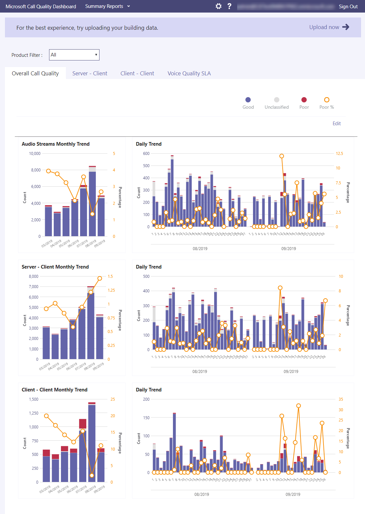

# Análisis de llamadas y Panel de calidad de llamadasCall Analytics and Call Quality Dashboard

Microsoft Teams y Skype empresarial le ofrecen dos maneras de supervisar y solucionar problemas con la calidad de la llamada: Análisis de llamadas y panel de calidad de llamadas (CQD).Microsoft Teams and Skype for Business give you two ways to monitor and troubleshoot call-quality problems: Call Analytics and Call Quality Dashboard (CQD). En este artículo se describen ambos y se indica cuándo usar cada uno de ellos.This article describes both and tells you when to use each one.

El análisis de llamadas y el CQD se ejecutan en paralelo y se pueden usar de forma independiente o conjunta.Call Analytics and CQD run in parallel and can be used independently or together. Por ejemplo, supongamos que un especialista de soporte técnico de comunicaciones determina que necesita más ayuda para solucionar un problema de llamada.For example, say that a communications support specialist determines that they need more help troubleshooting a call problem. El especialista de soporte técnico de comunicaciones pasa la llamada a un ingeniero de soporte técnico de comunicaciones, que tiene acceso a más información en el análisis de llamadas que el especialista de soporte de comunicaciones.The communications support specialist passes the call to a communications support engineer, who has access to more information in Call Analytics than the communications support specialist. A su vez, el ingeniero de soporte técnico de comunicaciones puede avisar a un ingeniero de redes sobre un problema.In turn, the communications support engineer can alert a network engineer to an issue. El ingeniero de redes puede comprobar el CQD para ver si un problema general relacionado con el sitio puede ser una causa de los problemas de llamadas.The network engineer can check CQD to see if an overall site-related issue could be a contributing cause of call problems.

## ¿Qué es el análisis de llamadas y Cuándo debo usarlo?What's Call Analytics, and when should I use it?

**El análisis de llamadas ahora está disponible en el [centro de administración de Microsoft Teams](https://admin.teams.microsoft.com).****Call Analytics is now available in the [Microsoft Teams admin center](https://admin.teams.microsoft.com).** Para ver toda la información de las llamadas y los datos de un usuario, use la pestaña **historial de llamadas** en la página de Perfil de un usuario.To see all call information and data for a user, use the **Call History** tab on a user's profile page. Para ver la pestaña, busque el usuario en el panel o busque el usuario en la pestaña **usuarios** de la barra de navegación izquierda.To see the tab, either search for the user from the dashboard or find the user from the **Users** tab in the left navigation bar.

Análisis de llamadas muestra información detallada sobre los dispositivos, las redes y la conectividad relacionada con las llamadas y las reuniones de cada usuario en una cuenta de inquilino de Microsoft Teams o de Skype empresarial.Call Analytics shows detailed information about the devices, networks, and connectivity related to the calls and meetings for each user in a Microsoft Teams or Skype for Business tenant account. ¿Por qué este usuario tiene una llamada deficiente esta tarde?Why did this user have a poor call this afternoon? Con el análisis de llamadas, un administrador de Office 365 o un agente de asistencia capacitado pueden investigar el dispositivo, la red, la conectividad y otros factores relacionados con una llamada para solucionar problemas de calidad de llamadas y de conexión en Microsoft Teams y Skype empresarial.With Call Analytics, an Office 365 admin or trained helpdesk agent can investigate the device, network, connectivity, and other factors related to a call to troubleshoot call quality and connection problems in Microsoft Teams and Skype for Business.

Para ver esta información de un usuario en el centro de administración de Microsoft Teams, haga clic en la pestaña **historial de llamadas** de ese usuario en la página Detalles del usuario para ver todas las llamadas y reuniones de ese usuario en los últimos 30 días.To see this information for a user in the Microsoft Teams admin center, click the **Call History** tab for that user in the user detail page to see all calls and meetings for that user in the last 30 days.

Para obtener información adicional sobre una sesión determinada, como estadísticas detalladas de medios y de redes, haga clic en una sesión para ver los detalles.To get additional information about a given session including detailed media and networking statistics, click a session to see the details.

Si desea que los usuarios que no sean administradores (como los agentes del Departamento de soporte técnico de un proveedor externo) usen el análisis de llamadas, puede asignar permisos para que puedan usar el análisis de llamadas, pero no pueden obtener acceso al resto del centro de administración de Microsoft Teams:If you want non-admins (such as helpdesk agents from an external vendor) to use Call Analytics, you can assign permissions so that they can use Call Analytics, but they can't access the rest of the Microsoft Teams admin center:
  
- **Agentes del servicio de asistencia con soporte técnico de comunicaciones permisos especializados: los**agentes ven un conjunto limitado de datos e información de identificación personal (PII) en el análisis de llamadas.**Helpdesk agents with communications support specialist permissions**: Agents see a limited set of data and personally identifiable information (PII) in Call Analytics. Pueden solucionar problemas de llamadas, pero pueden escalar problemas con las reuniones a un ingeniero de soporte técnico de comunicaciones.They can troubleshoot calls, but they escalate problems with meetings to a communications support engineer.
- **Agentes del servicio de asistencia con soporte técnico de comunicaciones permisos de Ingeniero**: los agentes ven todos los datos disponibles en el análisis de llamadas y solucionan problemas con las llamadas y las reuniones.**Helpdesk agents with communications support engineer permissions**: Agents see all available data in Call Analytics and troubleshoot both calls and meetings. Tienen acceso completo a los registros de llamadas y a la información de los clientes.They have full access to call logs and customer information.

> [!NOTE]
> El rol de especialista en soporte de comunicaciones es equivalente a la función de soporte técnico de nivel 1 del portal de versión preliminar y la función de Ingeniero de soporte de comunicaciones es equivalente al rol de soporte técnico de nivel 2 del portal de vista previa.The communications support specialist role is equivalent to tier 1 support role from the preview portal and the communications support engineer role is equivalent to tier 2 support role from the preview portal.

Para más información sobre los roles de Ingeniero de soporte de comunicaciones y de Ingeniero de soporte técnico de comunicaciones, consulte [usar roles de administrador de Microsoft Teams para administrar equipos](using-admin-roles.md).For more information about the communications support specialist and communications support engineer roles, see [Use Microsoft Teams admin roles to manage teams](using-admin-roles.md).

> [!IMPORTANT]
> Los permisos de agente de asistencia y la carga de topología de red están disponibles en el centro de administración de Microsoft Teams.Helpdesk agent permissions and network topology upload are available in the Microsoft Teams admin center. Los especialistas de soporte técnico de comunicaciones y comunicaciones pueden usar este portal para acceder a análisis de llamadas y al panel de calidad de llamadas.Communications Support Specialists and Communications Support Engineers can use this portal to access Call Analytics and the Call Quality Dashboard.

Para obtener más información sobre el análisis de llamadas, consulte [configurar análisis de llamadas de Skype empresarial](set-up-call-analytics.md).For details about Call Analytics, see [Set up Skype for Business Call Analytics](set-up-call-analytics.md). Para obtener más información sobre cómo pueden trabajar los agentes del servicio de asistencia con análisis de llamadas, consulte [usar análisis de llamadas para solucionar problemas de baja calidad de las llamadas](use-call-analytics-to-troubleshoot-poor-call-quality.md).For more information about how Helpdesk agents can work with Call Analytics, see [Use Call Analytics to troubleshoot poor call quality](use-call-analytics-to-troubleshoot-poor-call-quality.md).
  
## ¿Qué es el panel de calidad de las llamadas y cuándo se debe usar?What's the Call Quality Dashboard, and when should I use it?
  
El análisis de llamadas está diseñado para ayudar a los administradores y a los agentes del Departamento de soporte técnico a solucionar problemas de calidad de llamadas con *llamadas específicas*.Call Analytics is designed to help admins and helpdesk agents troubleshoot call quality problems with *specific calls*. El panel de calidad de llamadas (CQD) está diseñado para ayudar a los administradores de equipos, administradores de Skype empresarial e ingenieros de red a *optimizar una red*.Call Quality Dashboard (CQD) is designed to help Teams admins, Skype for Business admins, and network engineers *optimize a network*. El CQD pasa el foco de usuarios específicos y, en su lugar, busca información de agregado para una organización de Skype o de Skype empresarial.CQD shifts focus from specific users and instead looks at aggregate information for an entire Teams or Skype for Business organization. Para obtener más información, consulte [características del panel de calidad de llamadas para equipos y Skype empresarial online](turning-on-and-using-call-quality-dashboard.md#BKMKFeaturesOfTheCQD).For more information, see [Features of the Call Quality Dashboard for Teams and Skype for Business Online](turning-on-and-using-call-quality-dashboard.md#BKMKFeaturesOfTheCQD).
  
Supongamos que la mala calidad de las llamadas de un usuario se debe a un problema de red que también afecta a muchos otros usuarios.Suppose a user's poor call quality is due to a network issue that also affects many other users. La experiencia de llamada individual no es visible en el CQD, pero se captura la calidad general de las llamadas realizadas con Microsoft Teams o Skype empresarial.The individual call experience isn't visible in CQD, but the overall quality of calls made using Microsoft Teams or Skype for Business is captured. Con el CQD, los patrones generales pueden ser aparentes, por lo que los ingenieros de red pueden realizar evaluaciones informadas de la calidad de las llamadas.With  CQD, overall patterns may become apparent, so network engineers can make informed assessments of call quality. El CQD proporciona informes de métricas de calidad de llamadas que proporcionan una perspectiva de la calidad general de las llamadas, las secuencias de clientes de servidor, las secuencias de clientes cliente y los [SLA](https://go.microsoft.com/fwlink/p/?linkid=846252)de calidad de voz.CQD provides reports of call quality metrics that give you insight into overall call quality, server-client streams, client-client streams, and voice quality [SLA](https://go.microsoft.com/fwlink/p/?linkid=846252).
  

Ubicación del CQD: los informes mejorados hacen un aumento de la calidad de las llamadas y la fiabilidad dentro del edificio de un usuario.CQD's Location-Enhanced Reports aggregate call quality and reliability within a user's building. Los datos se pueden evaluar para determinar si el problema se aísla para un solo usuario o afecta a un segmento de usuarios más grande.The data can be assessed to determine if the problem is isolated to a single user or affects a larger segment of users.

> [!NOTE]
> Para habilitar las vistas de compilación o específicas del extremo en el CQD, un administrador debe [cargar la información de compilación o de extremo](turning-on-and-using-call-quality-dashboard.md#upload-tenant-data-information) en la página de carga de datos del inquilino de CQD.To enable building or endpoint-specific views in CQD, an admin must [upload building or endpoint information](turning-on-and-using-call-quality-dashboard.md#upload-tenant-data-information) on CQD's Tenant Data Upload page.

Si desea que los usuarios que no sean administradores (como los agentes del Departamento de soporte técnico) usen el panel de calidad de llamadas, puede asignar a esos usuarios uno de los siguientes roles, que también tienen los permisos necesarios para acceder al panel de calidad de llamadas:If you want non-admin users (such as helpdesk agents) to use Call Quality Dashboard, you can assign those users one of the following roles, which also have permissions needed to access Call Quality Dashboard:

- Administrador globalGlobal Administrator
- Lector globalGlobal Reader
- Administrador de Skype empresarialSkype for Business Administrator
- Administrador de servicios de TeamsTeams Service Administrator
- Administrador de comunicaciones de TeamsTeams Communications Administrator
- Ingeniero de soporte en comunicaciones de TeamsTeams Communications Support Engineer
- Especialista de soporte técnico de comunicaciones de TeamsTeams Communications Support Specialist
- Lector de informesReports Reader

> [!NOTE]
> El ingeniero de soporte de comunicaciones de Teams, el especialista de soporte técnico de comunicaciones de Teams y los roles lector de informes no pueden modificar archivos en la página de carga de datos del inquilino de CQD ni activar el CQD para un inquilino.The Teams Communications Support Engineer, Teams Communications Support Specialist, and Reports Reader roles cannot modify files on CQD's Tenant Data Upload page nor activate CQD for a tenant.

Para obtener más información acerca de estos roles, consulte [acerca de los roles de administrador de Office 365](/office365/admin/add-users/about-admin-roles).For more information about these roles, see [About Office 365 admin roles](/office365/admin/add-users/about-admin-roles).

Para obtener más información sobre el CQD, consulte [activar y usar el panel de calidad de llamadas para Microsoft Teams y Skype empresarial online](turning-on-and-using-call-quality-dashboard.md) , así como [las dimensiones y medidas disponibles en el panel de calidad de llamadas para Microsoft Teams y Skype empresarial online](dimensions-and-measures-available-in-call-quality-dashboard.md).For more information about CQD, see [Turning on and using Call Quality Dashboard for Microsoft Teams and Skype for Business Online](turning-on-and-using-call-quality-dashboard.md) and [Dimensions and measures available in Call Quality Dashboard for Microsoft Teams and Skype for Business Online](dimensions-and-measures-available-in-call-quality-dashboard.md).
  
## Temas relacionadosRelated topics

[Vídeo: información general sobre la calidad de las llamadasVideo: Call Quality Overview](https://aka.ms/teams-quality)

[Configurar el Análisis de llamadasSet up Call Analytics](set-up-call-analytics.md)

[Usar el Análisis de llamadas para solucionar problemas de mala calidad en las llamadasUse Call Analytics to troubleshoot poor call quality](use-call-analytics-to-troubleshoot-poor-call-quality.md)

[Activar y usar el panel de calidad de llamadas para Microsoft Teams y Skype empresarial onlineTurning on and using Call Quality Dashboard for Microsoft Teams and Skype for Business Online](turning-on-and-using-call-quality-dashboard.md)
