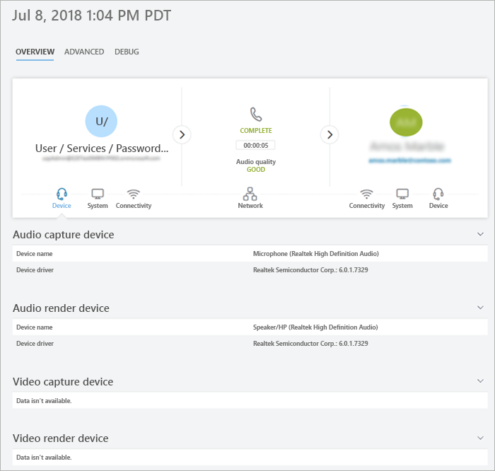

# Análisis de llamadas y Panel de calidad de llamadas

Microsoft Teams y Skype empresarial le ofrecen dos maneras de supervisar y solucionar problemas con la calidad de la llamada: Análisis de llamadas y panel de calidad de llamadas (CQD). En este artículo se describen ambos y se indica cuándo usar cada uno de ellos.

El análisis de llamadas y el CQD se ejecutan en paralelo y se pueden usar de forma independiente o conjunta. Por ejemplo, supongamos que un especialista de soporte técnico de comunicaciones determina que necesita más ayuda para solucionar un problema de llamada. El especialista de soporte técnico de comunicaciones pasa la llamada a un ingeniero de soporte técnico de comunicaciones, que tiene acceso a más información en el análisis de llamadas que el especialista de soporte de comunicaciones. A su vez, el ingeniero de soporte técnico de comunicaciones puede avisar a un ingeniero de redes sobre un problema. El ingeniero de redes podría comprobar el CQD para ver si un problema general relacionado con el sitio podría ser una causa de los problemas de llamadas.

## ¿Qué es el análisis de llamadas y Cuándo debo usarlo?

**El análisis de llamadas ahora está disponible en el [centro de administración de Microsoft Teams](https://admin.teams.microsoft.com).** Para ver toda la información de las llamadas y los datos de un usuario, use la pestaña **historial de llamadas** . Puede hacerlo consultando la página de perfil del usuario, ya sea buscando el usuario desde el panel o buscando el usuario de **los usuarios** en el panel de navegación izquierdo.

El análisis de llamadas muestra información detallada sobre los dispositivos, las redes y la conectividad relacionada con las llamadas específicas y las reuniones de cada usuario en una cuenta de Microsoft Teams o Skype empresarial. ¿Por qué este usuario tiene una llamada deficiente esta tarde? Con el análisis de llamadas, un administrador de Office 365 o un agente de asistencia técnica capacitada puede investigar el dispositivo, la red, la conectividad y otros factores relacionados con su llamada para solucionar problemas de calidad de llamadas y de conexión en Microsoft Teams y Skype empresarial.

Para ver esta información de un usuario en el centro de administración de Microsoft Teams, haga clic en la pestaña **historial de llamadas** de ese usuario en la página de detalles del usuario, en la que se muestran todas las llamadas y reuniones en las que el usuario ha participado durante los últimos 30 días.

Para obtener información adicional sobre una sesión determinada, como estadísticas detalladas de medios y de redes, haga clic en una sesión para ver los detalles.

Si desea que los usuarios que no sean administradores, como los agentes del Departamento de soporte técnico de un proveedor externo, puedan usar el análisis de llamadas, puede asignar permisos para que puedan usar el análisis de llamadas, pero no tengan acceso al resto del centro de administración de Microsoft Teams: 
  
- **Agentes del servicio de asistencia con soporte técnico de comunicaciones permisos especializados: los**agentes ven un conjunto limitado de datos e información de identificación personal (PII) en el análisis de llamadas. Pueden solucionar problemas de llamadas, pero estarán a la mano de problemas con las reuniones de un ingeniero de soporte de comunicaciones.
    
- **Agentes del servicio de asistencia con soporte técnico de comunicaciones permisos de Ingeniero**: los agentes ven todos los datos disponibles en el análisis de llamadas y solucionan problemas con las llamadas y las reuniones. Tienen acceso completo a los registros de llamadas y a la información de los clientes.

> [!NOTE]
> El rol de especialista en soporte de comunicaciones es equivalente a la función de soporte técnico de nivel 1 del portal de versión preliminar y la función de Ingeniero de soporte de comunicaciones es equivalente al rol de soporte técnico de nivel 2 del portal de vista previa.

Para más información sobre los roles de Ingeniero de soporte de comunicaciones y de Ingeniero de soporte técnico de comunicaciones, consulte [usar roles de administrador de Microsoft Teams para administrar equipos](using-admin-roles.md).

> [!IMPORTANT]
> Los permisos de agente de asistencia y la carga de topología de red están disponibles en el centro de administración de Microsoft Teams. Los especialistas de soporte técnico de comunicaciones y comunicaciones pueden usar este portal para acceder a análisis de llamadas y al panel de calidad de llamadas.
    
Para obtener detalles sobre la configuración de análisis de llamadas, consulte [configurar análisis de llamadas de Skype empresarial](set-up-call-analytics.md). Para obtener más información sobre cómo pueden trabajar los agentes del servicio de asistencia con análisis de llamadas, consulte [usar análisis de llamadas para solucionar problemas de baja calidad de las llamadas](use-call-analytics-to-troubleshoot-poor-call-quality.md).
  
## ¿Qué es el panel de calidad de las llamadas y cuándo se debe usar?
  
Mientras que el análisis de llamadas está diseñado para ayudar a los administradores y a los agentes del Departamento de soporte técnico a solucionar problemas de calidad de llamadas con llamadas específicas, el panel de calidad de llamadas (CQD) está diseñado para ayudar a los administradores de equipos, administradores de Skype empresarial e ingenieros de red a optimizar una red. El CQD pasa el foco de usuarios específicos y, en su lugar, busca información de agregado para una organización de Skype o de Skype empresarial. Para obtener más información, consulte [características del panel de calidad de llamadas para equipos y Skype empresarial online](turning-on-and-using-call-quality-dashboard.md#BKMKFeaturesOfTheCQD).
  
Es posible que la mala calidad de las llamadas del usuario se deba a un problema de red que también afecta a muchos otros usuarios. La experiencia de llamada individual no es visible en el CQD, pero se captura la calidad general de las llamadas realizadas con Microsoft Teams o Skype empresarial. Con el CQD, los patrones generales pueden ser aparentes, lo que permite que los ingenieros de red realicen evaluaciones con conocimiento de la calidad de las llamadas. El CQD proporciona informes de métricas de calidad de llamadas que le dan información sobre la calidad general de las llamadas, las secuencias de clientes de servidor, las secuencias de clientes cliente y los [SLA](https://go.microsoft.com/fwlink/p/?linkid=846252)de calidad de voz.
  

Con la ayuda de la ubicación del CQD: informes mejorados, la calidad de las llamadas y la confiabilidad agregadas dentro del edificio del usuario se pueden evaluar para determinar si el problema se aísla para un solo usuario o afecta a un segmento más grande de usuarios.

> [!NOTE]
> Para habilitar las vistas de compilación o específicas del extremo en el CQD, un administrador debe [cargar la información de compilación o de extremo](turning-on-and-using-call-quality-dashboard.md#upload-tenant-data-information) en la página de carga de datos del inquilino de CQD. 

Si desea que los usuarios que no sean administradores, como los agentes del Departamento de soporte técnico, utilicen el panel de calidad de llamadas, puede asignar a esos usuarios el **Ingeniero de soporte técnico de comunicaciones**de Teams, el **especialista de soporte técnico de comunicaciones**de Teams o el rol **lector de informes** . Los usuarios con los roles siguientes pueden acceder al panel de calidad de llamadas:

- Administrador global
- Lector global
- Administrador de Skype empresarial
- Administrador de servicios de Teams
- Administrador de comunicaciones de Teams
- Ingeniero de soporte en comunicaciones de Teams
- Especialista de soporte técnico de comunicaciones de Teams
- Lector de informes

> [!NOTE]
> El ingeniero de soporte de comunicaciones de Teams, el especialista de soporte técnico de comunicaciones de Teams y los roles lector de informes no pueden modificar archivos en la página de carga de datos del inquilino de CQD ni activar el CQD para un inquilino.

Para obtener más información acerca de estos roles, consulte [acerca de los roles de administrador de Office 365](/office365/admin/add-users/about-admin-roles).

Para obtener más información sobre el CQD, consulte [activar y usar el panel de calidad de llamadas para Microsoft Teams y Skype empresarial online](turning-on-and-using-call-quality-dashboard.md) , así como [las dimensiones y medidas disponibles en el panel de calidad de llamadas para Microsoft Teams y Skype empresarial online](dimensions-and-measures-available-in-call-quality-dashboard.md).
  
## Temas relacionados

[Vídeo: información general sobre la calidad de las llamadas](https://aka.ms/teams-quality)

[Configurar el Análisis de llamadas](set-up-call-analytics.md)

[Usar el Análisis de llamadas para solucionar problemas de mala calidad en las llamadas](use-call-analytics-to-troubleshoot-poor-call-quality.md)

[Activar y usar el panel de calidad de llamadas para Microsoft Teams y Skype empresarial online](turning-on-and-using-call-quality-dashboard.md)
