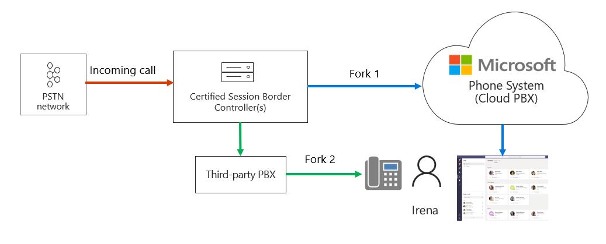

# Administrar notificaciones perdidas

En este artículo se describe cómo administrar las notificaciones de llamadas de los usuarios. Puede configurar los puntos de conexión de llamada tanto en Teams como en una central de conmutación (PBX) privada de terceros o en un controlador de borde de sesión (SBC).  Esto resulta útil, por ejemplo, si quiere enviar una llamada a los teléfonos móviles y de escritorio de un usuario al mismo tiempo.   

En el siguiente diagrama, el usuario Irena tiene dos puntos de conexión:

- Un punto de conexión de Teams
- Un teléfono SIP conectado a un SBC de terceros

Cuando llega una llamada, SBC bifurca la llamada entre el enrutamiento directo del sistema telefónico y el SBC de terceros.

Si se acepta la llamada en la bifurcación 2 (por el SBC de terceros), Teams generará una notificación de "Llamada perdida".  

Puede evitar la notificación "Llamada perdida" configurando el SBC para enviar una cancelación en bifurcación 1 como se explica a continuación:

RAZÓN: SIP; cause=200;text"Llamada completada en otro lugar" 

Tenga en cuenta que la llamada no se registrará en los registros de detalles de la llamada de Microsoft Phone System como una llamada correcta. La llamada se registrará como un "Intento" con código SIP final "487", subcodificación final de Microsoft "540200" y frase final de código SIP "Llamada completada en otro lugar".  (Para ver los registros de detalles de las llamadas, vaya al Portal de administración de Teams, Análisis e informes, Informes de uso y seleccione Uso de RTC).

En el diagrama siguiente se muestra la bifurcación SIP para bifurcación 1, se explica el flujo de llamadas y el motivo esperado en el mensaje de cancelación. 

