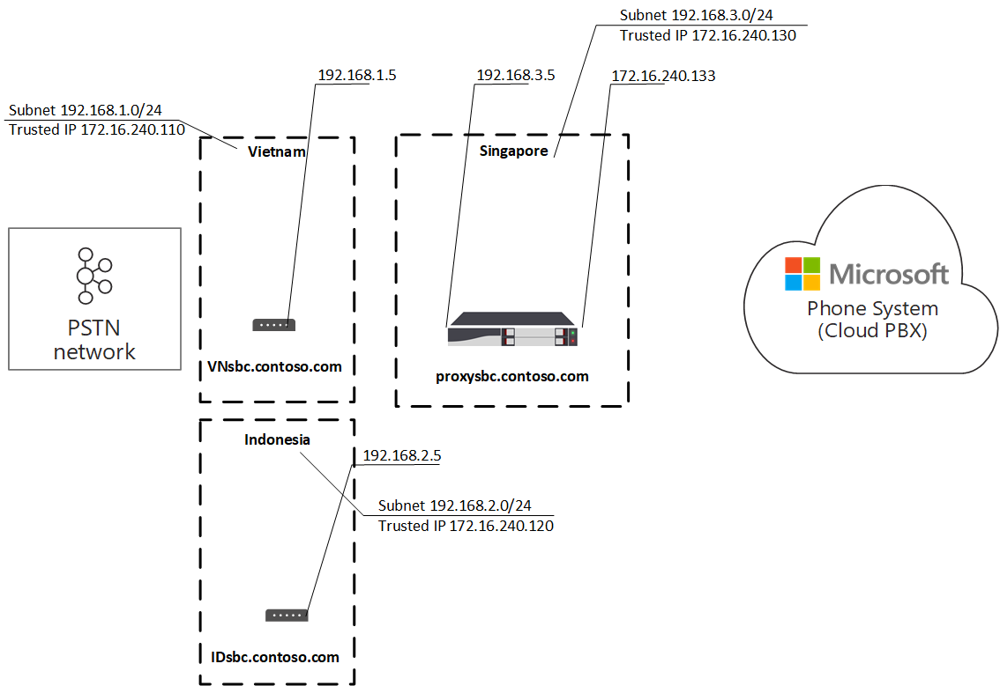

# <a name="configure-local-media-optimization-for-direct-routing"></a><span data-ttu-id="7d27c-103">Configurar la optimización de medios locales para el enrutamiento directo</span><span class="sxs-lookup"><span data-stu-id="7d27c-103">Configure Local Media Optimization for Direct Routing</span></span>

<span data-ttu-id="7d27c-104">La configuración para la optimización de medios locales se basa en la configuración de red que es común a otras características de voz en la nube, como el enrutamiento basado en la ubicación y las llamadas de emergencia dinámicas.</span><span class="sxs-lookup"><span data-stu-id="7d27c-104">Configuration for Local Media Optimization is based on network settings that are common to other cloud voice features, such as Location-Based Routing and dynamic emergency calling.</span></span> <span data-ttu-id="7d27c-105">Para obtener más información sobre regiones de red, sitios de red, subredes de red y direcciones IP de confianza, consulte [configuración de red para características de voz en la nube](cloud-voice-network-settings.md).</span><span class="sxs-lookup"><span data-stu-id="7d27c-105">To learn more about network regions, network sites, network subnets, and trusted IP addresses, see [Network settings for cloud voice features](cloud-voice-network-settings.md).</span></span>

<span data-ttu-id="7d27c-106">Antes de configurar la optimización de medios locales, consulte la [optimización local de medios para el enrutamiento directo](direct-routing-media-optimization.md).</span><span class="sxs-lookup"><span data-stu-id="7d27c-106">Before you configure Local Media Optimization, see [Local media Optimization for Direct Routing](direct-routing-media-optimization.md).</span></span>  

<span data-ttu-id="7d27c-107">Para configurar la optimización local de medios, se requieren los pasos siguientes.</span><span class="sxs-lookup"><span data-stu-id="7d27c-107">To configure Local Media Optimization, the following steps are required.</span></span> <span data-ttu-id="7d27c-108">Puede usar el centro de administración de Teams o PowerShell.</span><span class="sxs-lookup"><span data-stu-id="7d27c-108">You can use the Teams Admin Center or PowerShell.</span></span> <span data-ttu-id="7d27c-109">Para obtener más información, consulte [administrar la topología de red](manage-your-network-topology.md).</span><span class="sxs-lookup"><span data-stu-id="7d27c-109">For details, see [Manage your network topology](manage-your-network-topology.md).</span></span>

1. <span data-ttu-id="7d27c-110">Configure el usuario y los sitios de SBC (como se describe en este artículo).</span><span class="sxs-lookup"><span data-stu-id="7d27c-110">Configure the user and the SBC sites (as described in this article).</span></span>
2. <span data-ttu-id="7d27c-111">Configure el SBCs para la optimización de medios locales (según la especificación de proveedor de SBC).</span><span class="sxs-lookup"><span data-stu-id="7d27c-111">Configure the SBCs for Local Media Optimization (according to your SBC vendor specification).</span></span>

<span data-ttu-id="7d27c-112">En el siguiente diagrama se muestra la configuración de red usada en los ejemplos de este artículo.</span><span class="sxs-lookup"><span data-stu-id="7d27c-112">The following diagram shows the network setup used in the examples throughout this article.</span></span>

<span data-ttu-id="7d27c-113"></span><span class="sxs-lookup"><span data-stu-id="7d27c-113"></span></span>


## <a name="configure-the-user-and-the-sbc-sites"></a><span data-ttu-id="7d27c-114">Configurar el usuario y los sitios de SBC</span><span class="sxs-lookup"><span data-stu-id="7d27c-114">Configure the user and the SBC sites</span></span>

<span data-ttu-id="7d27c-115">Para configurar los sitios de usuario y SBC, tendrá que:</span><span class="sxs-lookup"><span data-stu-id="7d27c-115">To configure the user and the SBC sites, you will need to:</span></span>

1. <span data-ttu-id="7d27c-116">[Administrar direcciones IP externas de confianza](#manage-external-trusted-ip-addresses).</span><span class="sxs-lookup"><span data-stu-id="7d27c-116">[Manage external trusted IP addresses](#manage-external-trusted-ip-addresses).</span></span>  

2. <span data-ttu-id="7d27c-117">[Defina la topología de red](#define-the-network-topology) configurando las regiones de red, los sitios de red y las subredes de red.</span><span class="sxs-lookup"><span data-stu-id="7d27c-117">[Define the network topology](#define-the-network-topology) by configuring the network regions, network sites, and network subnets.</span></span>

3. <span data-ttu-id="7d27c-118">[Defina la topología de red virtual](#define-the-virtual-network-topology) asignando SBC (s) a los sitios con los modos y valores de SBC de proxy.</span><span class="sxs-lookup"><span data-stu-id="7d27c-118">[Define the virtual network topology](#define-the-virtual-network-topology) by assigning SBC(s) to site(s) with relevant modes and proxy SBC values.</span></span>


## <a name="configure-sbcs-for-local-media-optimization-according-to-the-sbc-vendor-specification"></a><span data-ttu-id="7d27c-119">Configurar SBC (s) para la optimización de medios locales según la especificación de proveedor de SBC</span><span class="sxs-lookup"><span data-stu-id="7d27c-119">Configure SBC(s) for Local Media Optimization according to the SBC vendor specification</span></span>

<span data-ttu-id="7d27c-120">En este artículo se describe la configuración de los componentes de Microsoft.</span><span class="sxs-lookup"><span data-stu-id="7d27c-120">This article describes configuration for Microsoft components.</span></span> <span data-ttu-id="7d27c-121">Para obtener información sobre la configuración de SBC, consulte la documenation de proveedor de SBC.</span><span class="sxs-lookup"><span data-stu-id="7d27c-121">For information on SBC configuration, see your SBC vendor documenation.</span></span>

<span data-ttu-id="7d27c-122">La optimización local de medios es compatible con los siguientes proveedores de SBC:</span><span class="sxs-lookup"><span data-stu-id="7d27c-122">Local Media Optimization is supported by the following SBC vendors:</span></span>

| <span data-ttu-id="7d27c-123">Proveedor</span><span class="sxs-lookup"><span data-stu-id="7d27c-123">Vendor</span></span> | <span data-ttu-id="7d27c-124">Producto</span><span class="sxs-lookup"><span data-stu-id="7d27c-124">Product</span></span> |    <span data-ttu-id="7d27c-125">Versión del software</span><span class="sxs-lookup"><span data-stu-id="7d27c-125">Software version</span></span> |
|:------------|:-------|:-------| :-------|
| [<span data-ttu-id="7d27c-126">AudioCodes</span><span class="sxs-lookup"><span data-stu-id="7d27c-126">Audiocodes</span></span>](https://www.audiocodes.com/media/13253/connecting-audiocodes-sbc-to-microsoft-teams-direct-routing-enterprise-model-configuration-note.pdf) |    <span data-ttu-id="7d27c-127">SBC Mediant 500</span><span class="sxs-lookup"><span data-stu-id="7d27c-127">Mediant 500 SBC</span></span> |   <span data-ttu-id="7d27c-128">7.20 a. 256</span><span class="sxs-lookup"><span data-stu-id="7d27c-128">7.20A.256</span></span> | 
|            |  <span data-ttu-id="7d27c-129">SBC Mediant 800</span><span class="sxs-lookup"><span data-stu-id="7d27c-129">Mediant 800 SBC</span></span> |   <span data-ttu-id="7d27c-130">7.20 a. 256</span><span class="sxs-lookup"><span data-stu-id="7d27c-130">7.20A.256</span></span> | 
|            |  <span data-ttu-id="7d27c-131">SBC Mediant 2600</span><span class="sxs-lookup"><span data-stu-id="7d27c-131">Mediant 2600 SBC</span></span> |  <span data-ttu-id="7d27c-132">7.20 a. 256</span><span class="sxs-lookup"><span data-stu-id="7d27c-132">7.20A.256</span></span> | 
|            |  <span data-ttu-id="7d27c-133">SBC Mediant 4000</span><span class="sxs-lookup"><span data-stu-id="7d27c-133">Mediant 4000 SBC</span></span> |  <span data-ttu-id="7d27c-134">7.20 a. 256</span><span class="sxs-lookup"><span data-stu-id="7d27c-134">7.20A.256</span></span> | 
|            |  <span data-ttu-id="7d27c-135">SBC 1000B</span><span class="sxs-lookup"><span data-stu-id="7d27c-135">Mediant 1000B SBC</span></span> | <span data-ttu-id="7d27c-136">7.20 a. 256</span><span class="sxs-lookup"><span data-stu-id="7d27c-136">7.20A.256</span></span> | 
|            |  <span data-ttu-id="7d27c-137">SBC 9000</span><span class="sxs-lookup"><span data-stu-id="7d27c-137">Mediant 9000 SBC</span></span> |  <span data-ttu-id="7d27c-138">7.20 a. 256</span><span class="sxs-lookup"><span data-stu-id="7d27c-138">7.20A.256</span></span> | 
|            |  <span data-ttu-id="7d27c-139">SBC Virtual Edition SBC</span><span class="sxs-lookup"><span data-stu-id="7d27c-139">Mediant Virtual Edition SBC</span></span> |   <span data-ttu-id="7d27c-140">7.20 a. 256</span><span class="sxs-lookup"><span data-stu-id="7d27c-140">7.20A.256</span></span> | 
|            |  <span data-ttu-id="7d27c-141">La nube Cloud Edition SBC</span><span class="sxs-lookup"><span data-stu-id="7d27c-141">Mediant Cloud Edition SBC</span></span> | <span data-ttu-id="7d27c-142">7.20 a. 256</span><span class="sxs-lookup"><span data-stu-id="7d27c-142">7.20A.256</span></span> |
| [<span data-ttu-id="7d27c-143">Núcleo de SBC de cinta</span><span class="sxs-lookup"><span data-stu-id="7d27c-143">Ribbon SBC Core</span></span>](https://support.sonus.net/display/ALLDOC/SBC+8.2+-+Configure+Local+Media+Optimization)  |  <span data-ttu-id="7d27c-144">SBC 5110</span><span class="sxs-lookup"><span data-stu-id="7d27c-144">SBC 5110</span></span>         | <span data-ttu-id="7d27c-145">8,2</span><span class="sxs-lookup"><span data-stu-id="7d27c-145">8.2</span></span>  |
|            |  <span data-ttu-id="7d27c-146">SBC 5210</span><span class="sxs-lookup"><span data-stu-id="7d27c-146">SBC 5210</span></span>         | <span data-ttu-id="7d27c-147">8,2</span><span class="sxs-lookup"><span data-stu-id="7d27c-147">8.2</span></span>  |
|            |  <span data-ttu-id="7d27c-148">SBC 5400</span><span class="sxs-lookup"><span data-stu-id="7d27c-148">SBC 5400</span></span>         | <span data-ttu-id="7d27c-149">8,2</span><span class="sxs-lookup"><span data-stu-id="7d27c-149">8.2</span></span>  |
|            |  <span data-ttu-id="7d27c-150">SBC 7000</span><span class="sxs-lookup"><span data-stu-id="7d27c-150">SBC 7000</span></span>         | <span data-ttu-id="7d27c-151">8,2</span><span class="sxs-lookup"><span data-stu-id="7d27c-151">8.2</span></span>  |
|            |  <span data-ttu-id="7d27c-152">SBC SWe</span><span class="sxs-lookup"><span data-stu-id="7d27c-152">SBC SWe</span></span>          | <span data-ttu-id="7d27c-153">8,2</span><span class="sxs-lookup"><span data-stu-id="7d27c-153">8.2</span></span>  |
| [<span data-ttu-id="7d27c-154">Borde de SBC de cinta</span><span class="sxs-lookup"><span data-stu-id="7d27c-154">Ribbon SBC Edge</span></span>](https://support.sonus.net/display/UXDOC81/Microsoft+Teams+Direct+Routing+-+On+Premises+Deployment)  |  <span data-ttu-id="7d27c-155">SBC 1000</span><span class="sxs-lookup"><span data-stu-id="7d27c-155">SBC 1000</span></span>         | <span data-ttu-id="7d27c-156">8.1.1, compilación 527</span><span class="sxs-lookup"><span data-stu-id="7d27c-156">8.1.1, build 527</span></span> |
|            |  <span data-ttu-id="7d27c-157">SBC 2000</span><span class="sxs-lookup"><span data-stu-id="7d27c-157">SBC 2000</span></span>         | <span data-ttu-id="7d27c-158">8.1.1, compilación 527</span><span class="sxs-lookup"><span data-stu-id="7d27c-158">8.1.1, build 527</span></span> |
|            |  <span data-ttu-id="7d27c-159">SBC SWe Lite</span><span class="sxs-lookup"><span data-stu-id="7d27c-159">SBC SWe Lite</span></span>     | <span data-ttu-id="7d27c-160">8.1.0, compilación 222</span><span class="sxs-lookup"><span data-stu-id="7d27c-160">8.1.0, build 222</span></span> |
| [<span data-ttu-id="7d27c-161">TE-SYSTEMS</span><span class="sxs-lookup"><span data-stu-id="7d27c-161">TE-SYSTEMS</span></span>](https://www.anynode.de/local_media_optimization/) |  <span data-ttu-id="7d27c-162">anynode</span><span class="sxs-lookup"><span data-stu-id="7d27c-162">anynode</span></span>          | <span data-ttu-id="7d27c-163">4.0.1 +</span><span class="sxs-lookup"><span data-stu-id="7d27c-163">4.0.1+</span></span> |


## <a name="manage-external-trusted-ip-addresses"></a><span data-ttu-id="7d27c-164">Administrar direcciones IP de confianza externas</span><span class="sxs-lookup"><span data-stu-id="7d27c-164">Manage external trusted IP addresses</span></span>

<span data-ttu-id="7d27c-165">Las direcciones IP externas de confianza son direcciones IP externas de Internet de la red empresarial.</span><span class="sxs-lookup"><span data-stu-id="7d27c-165">External trusted IPs are the Internet external IPs of the enterprise network.</span></span> <span data-ttu-id="7d27c-166">Estas son las direcciones IP que usan los clientes de Microsoft Teams cuando se conectan a Microsoft 365.</span><span class="sxs-lookup"><span data-stu-id="7d27c-166">These IP’s are the IP addresses used by Microsoft Teams clients when they connect to Microsoft 365.</span></span> <span data-ttu-id="7d27c-167">Debe agregar estas direcciones IP externas para cada sitio en el que tenga usuarios que usen la optimización local de medios.</span><span class="sxs-lookup"><span data-stu-id="7d27c-167">You need to add these external IPs for each site where you have users using Local Media Optimization.</span></span>

<span data-ttu-id="7d27c-168">Para agregar las direcciones IP públicas de cada sitio, use el cmdlet New-CsTenantTrustedIPAddress.</span><span class="sxs-lookup"><span data-stu-id="7d27c-168">To add the public IP addresses for each site, use the New-CsTenantTrustedIPAddress cmdlet.</span></span> <span data-ttu-id="7d27c-169">Puede definir un número ilimitado de direcciones IP de confianza para un inquilino.</span><span class="sxs-lookup"><span data-stu-id="7d27c-169">You can define an unlimited number of trusted IP addresses for a tenant.</span></span> <span data-ttu-id="7d27c-170">Si el IPs externo visto por Microsoft 365 son direcciones IPv4 e IPv6, tendrá que agregar ambos tipos de direcciones IP.</span><span class="sxs-lookup"><span data-stu-id="7d27c-170">If the external IPs seen by Microsoft 365 are both IPv4 and IPv6 addresses, you need to add both types of IP addresses.</span></span> <span data-ttu-id="7d27c-171">Para IPv4, use la máscara 32.</span><span class="sxs-lookup"><span data-stu-id="7d27c-171">For IPv4, use mask 32.</span></span> <span data-ttu-id="7d27c-172">Para IPv6, use la máscara 128.</span><span class="sxs-lookup"><span data-stu-id="7d27c-172">For IPv6, use mask 128.</span></span> <span data-ttu-id="7d27c-173">Puede agregar direcciones IP externas individuales y subredes IP externas especificando diferentes MaskBits en el cmdlet.</span><span class="sxs-lookup"><span data-stu-id="7d27c-173">You can add both individual external IP addresses and external IP subnets by specifying different MaskBits on the cmdlet.</span></span>

```
New-CsTenantTrustedIPAddress -IPAddress <External IP address> -MaskBits <Subnet bitmask> -Description <description>
```


<span data-ttu-id="7d27c-174">Ejemplo de adición de direcciones IP fiables.</span><span class="sxs-lookup"><span data-stu-id="7d27c-174">Example of adding trusted IP addresses.</span></span>

```
New-CsTenantTrustedIPAddress -IPAddress 172.16.240.110 -MaskBits 32 -Description "Vietnam site trusted IP"
New-CsTenantTrustedIPAddress -IPAddress 172.16.240.120 -MaskBits 32 -Description "Indonesia site trusted IP"
New-CsTenantTrustedIPAddress -IPAddress 172.16.240.130 -MaskBits 32 -Description "Singapore site trusted IP"
```


## <a name="define-the-network-topology"></a><span data-ttu-id="7d27c-175">Definir la topología de red</span><span class="sxs-lookup"><span data-stu-id="7d27c-175">Define the network topology</span></span>

<span data-ttu-id="7d27c-176">En esta sección se describe cómo definir las regiones de red, los sitios de red y las subredes de red para su topología de red.</span><span class="sxs-lookup"><span data-stu-id="7d27c-176">This section describes how to define the network regions, network sites, and network subnets for your network topology.</span></span>

<span data-ttu-id="7d27c-177">Todos los parámetros distinguen entre mayúsculas y minúsculas, por lo que debe asegurarse de usar el mismo caso que se usó durante la configuración.</span><span class="sxs-lookup"><span data-stu-id="7d27c-177">All parameters are case sensitive so you need to ensure that you use the same case that was used during setup.</span></span>  <span data-ttu-id="7d27c-178">(Por ejemplo, los valores de GatewaySiteID "Vietnam" y "Vietnam" se tratarán como sitios diferentes).</span><span class="sxs-lookup"><span data-stu-id="7d27c-178">(For example, GatewaySiteID values “Vietnam” and “vietnam” will be treated as different sites.)</span></span>

### <a name="define-network-regions"></a><span data-ttu-id="7d27c-179">Definir regiones de red</span><span class="sxs-lookup"><span data-stu-id="7d27c-179">Define network regions</span></span>

<span data-ttu-id="7d27c-180">Para definir regiones de red, use el cmdlet New-CsTenantNetworkRegion.</span><span class="sxs-lookup"><span data-stu-id="7d27c-180">To define network regions, use the New-CsTenantNetworkRegion cmdlet.</span></span> <span data-ttu-id="7d27c-181">El parámetro RegionID es un nombre lógico que representa la geografía de la región y no tiene dependencias ni restricciones.</span><span class="sxs-lookup"><span data-stu-id="7d27c-181">The RegionID parameter is a logical name that represents the geography of the region and has no dependencies or restrictions.</span></span> <span data-ttu-id="7d27c-182">El parámetro <site ID> CentralSite es opcional.</span><span class="sxs-lookup"><span data-stu-id="7d27c-182">The CentralSite <site ID> parameter is optional.</span></span>

```
New-CsTenantNetworkRegion -NetworkRegionID <region ID>  
```

<span data-ttu-id="7d27c-183">En el ejemplo siguiente se crea una región de red denominada APAC:</span><span class="sxs-lookup"><span data-stu-id="7d27c-183">The following example creates a network region named APAC:</span></span>

```
New-CsTenantNetworkRegion -NetworkRegionID "APAC"  
```

###  <a name="define-network-sites"></a><span data-ttu-id="7d27c-184">Definir sitios de red</span><span class="sxs-lookup"><span data-stu-id="7d27c-184">Define network sites</span></span>

<span data-ttu-id="7d27c-185">Para definir sitios de red, use el cmdlet New-CsTenantNetworkSite.</span><span class="sxs-lookup"><span data-stu-id="7d27c-185">To define network sites, use the New-CsTenantNetworkSite cmdlet.</span></span> <span data-ttu-id="7d27c-186">Cada sitio de red debe estar asociado a una región de red.</span><span class="sxs-lookup"><span data-stu-id="7d27c-186">Each network site must be associated with a network region.</span></span>

```
New-CsTenantNetworkSite -NetworkSiteID <site ID> -NetworkRegionID <region ID>
```

<span data-ttu-id="7d27c-187">En el siguiente ejemplo se crean tres sitios de red nuevos, Vietnam, Indonesia y Singapur en la región APAC:</span><span class="sxs-lookup"><span data-stu-id="7d27c-187">The following example creates three new network sites, Vietnam, Indonesia, and Singapore in the APAC region:</span></span>

```
New-CsTenantNetworkSite -NetworkSiteID "Vietnam" -NetworkRegionID "APAC"
New-CsTenantNetworkSite -NetworkSiteID "Indonesia" -NetworkRegionID "APAC"
New-CsTenantNetworkSite -NetworkSiteID "Singapore" -NetworkRegionID "APAC"
```

### <a name="define-network-subnets"></a><span data-ttu-id="7d27c-188">Definir subredes de red</span><span class="sxs-lookup"><span data-stu-id="7d27c-188">Define network subnets</span></span>

<span data-ttu-id="7d27c-189">Para definir subredes de red y asociarlas a sitios de red, use el cmdlet New-CsTenantNetworkSubnet.</span><span class="sxs-lookup"><span data-stu-id="7d27c-189">To define network subnets and associate them to network sites, use the New-CsTenantNetworkSubnet cmdlet.</span></span> <span data-ttu-id="7d27c-190">Cada subred de red solo se puede asociar con un sitio.</span><span class="sxs-lookup"><span data-stu-id="7d27c-190">Each network subnet can only be associated with one site.</span></span> 

```
New-CsTenantNetworkSubnet -SubnetID <Subnet IP address> -MaskBits <Subnet bitmask> -NetworkSiteID <site ID>
```

<span data-ttu-id="7d27c-191">En el ejemplo siguiente se definen tres subredes de red y se asocian con los tres sitios de red: Vietnam, Indonesia y Singapur:</span><span class="sxs-lookup"><span data-stu-id="7d27c-191">The following example defines three network subnets and associates them with the three network sites:  Vietnam, Indonesia, and Singapore:</span></span>

```
New-CsTenantNetworkSubnet -SubnetID 192.168.1.0 -MaskBits 24 -NetworkSiteID “Vietnam”
New-CsTenantNetworkSubnet -SubnetID 192.168.2.0 -MaskBits 24 -NetworkSiteID “Indonesia”
New-CsTenantNetworkSubnet -SubnetID 192.168.3.0 -MaskBits 24 -NetworkSiteID “Singapore”
```

## <a name="define-the-virtual-network-topology"></a><span data-ttu-id="7d27c-192">Definir la topología de red virtual</span><span class="sxs-lookup"><span data-stu-id="7d27c-192">Define the virtual network topology</span></span> 

<span data-ttu-id="7d27c-193">En primer lugar, el administrador de inquilinos crea una nueva configuración de SBC para cada SBC relevante mediante el cmdlet New-CsOnlinePSTNGateway.</span><span class="sxs-lookup"><span data-stu-id="7d27c-193">First, the tenant administrator creates a new SBC configuration for each relevant SBC by using the New-CsOnlinePSTNGateway cmdlet.</span></span>
<span data-ttu-id="7d27c-194">El administrador de inquilinos define la topología de red virtual mediante la especificación de los sitios de red de los objetos de la puerta de enlace RTC con el cmdlet Set-CsOnlinePSTNGateway:</span><span class="sxs-lookup"><span data-stu-id="7d27c-194">The tenant administrator defines the virtual network topology by specifying the network sites for the PSTN gateway objects using the Set-CsOnlinePSTNGateway cmdlet:</span></span>

```
PS C:\> Set-CsOnlinePSTNGateway -Identity <Identity> -GatewaySiteID <site ID> -MediaBypass <true/false> -BypassMode <Always/OnlyForLocalUsers> -ProxySBC  <proxy SBC FQDN or $null>
```

<span data-ttu-id="7d27c-195">Tenga en cuenta lo siguiente:</span><span class="sxs-lookup"><span data-stu-id="7d27c-195">Note the following:</span></span> 
   - <span data-ttu-id="7d27c-196">Si el cliente tiene un único SBC, el parámetro-ProxySBC debe ser obligatorio $null o valor FQDN de SBC (SBC central con escenario de troncos centralizados).</span><span class="sxs-lookup"><span data-stu-id="7d27c-196">If the customer has a single SBC, the -ProxySBC parameter must be either mandatory $null or SBC FQDN value (Central SBC with centralized trunks scenario).</span></span>
   - <span data-ttu-id="7d27c-197">El parámetro-MediaBypass debe establecerse en $true para admitir la optimización de medios locales.</span><span class="sxs-lookup"><span data-stu-id="7d27c-197">The -MediaBypass parameter must be set to $true in order to support Local Media Optimization.</span></span>
   - <span data-ttu-id="7d27c-198">Si el SBC no tiene establecido el parámetro-BypassMode, no se enviarán los encabezados X-MS.</span><span class="sxs-lookup"><span data-stu-id="7d27c-198">If the SBC doesn’t have the -BypassMode parameter set, X-MS headers will not be sent.</span></span> 
   - <span data-ttu-id="7d27c-199">Todos los parámetros distinguen entre mayúsculas y minúsculas, por lo que debe asegurarse de usar el mismo caso que el usado durante la configuración.</span><span class="sxs-lookup"><span data-stu-id="7d27c-199">All parameters are case sensitive so you need to ensure that you use the same case that was used used during setup.</span></span>  <span data-ttu-id="7d27c-200">(Por ejemplo, los valores de GatewaySiteID "Vietnam" y "Vietnam" se tratarán como sitios diferentes).</span><span class="sxs-lookup"><span data-stu-id="7d27c-200">(For example, GatewaySiteID values “Vietnam” and “vietnam” will be treated as different sites.)</span></span>

<span data-ttu-id="7d27c-201">En el ejemplo siguiente se agrega tres SBCs a los sitios de red Vietnam, Indonesia y Singapur en la región de APACtion con MODE omite siempre:</span><span class="sxs-lookup"><span data-stu-id="7d27c-201">The following example adds three SBCs to the network sites Vietnam, Indonesia, and Singapore in the APAC region with mode Always bypass:</span></span>

```
Set-CSOnlinePSTNGateway -Identity “proxysbc.contoso.com” -GatewaySiteID “Singapore” -MediaBypass $true -BypassMode “Always” -ProxySBC $null

Set-CSOnlinePSTNGateway -Identity “VNsbc.contoso.com” -GatewaySiteID “Vietnam” -MediaBypass $true -BypassMode “Always” -ProxySBC “proxysbc.contoso.com”

Set-CSOnlinePSTNGateway -Identity “IDsbc.contoso.com” -GatewaySiteID “Indonesia” -MediaBypass $true -BypassMode “Always” -ProxySBC “proxysbc.contoso.com”
```

<span data-ttu-id="7d27c-202">Nota: para asegurarse de que las operaciones no interrumpidas se configuran al mismo tiempo con la optimización local de medios y el enrutamiento basado en ubicación (LBR), es necesario habilitar SBCs para LBR al configurar el $true parámetro GatewaySiteLbrEnabled para cada SBC de indirecto.</span><span class="sxs-lookup"><span data-stu-id="7d27c-202">Note: To ensure uninterrupted operations when Local Media Optimization and Location-Based Routing (LBR) are configured at the same time, downstream SBCs must be enabled for LBR by setting the GatewaySiteLbrEnabled parameter to $true for each downstream SBC.</span></span> <span data-ttu-id="7d27c-203">(Esta configuración no es obligatoria para el SBC proxy).</span><span class="sxs-lookup"><span data-stu-id="7d27c-203">(This setting is not mandatory for the proxy SBC.)</span></span>

<span data-ttu-id="7d27c-204">En función de la información anterior, el enrutamiento directo incluirá tres encabezados SIP de propiedad para las invitaciones SIP y las reinvitaciones, tal y como se muestra en la tabla siguiente.</span><span class="sxs-lookup"><span data-stu-id="7d27c-204">Based on the information above, Direct Routing will include three proprietary SIP Headers to SIP Invites and Re-invites as shown  in the following table.</span></span>

<span data-ttu-id="7d27c-205">Encabezados X-MS introducidos en enrutamiento directo en invitaciones y reinvitaciones si se define BypassMode:</span><span class="sxs-lookup"><span data-stu-id="7d27c-205">X-MS Headers introduced in Direct Routing on Invites and Re-Invites if BypassMode is defined:</span></span>

| <span data-ttu-id="7d27c-206">Nombre del encabezado</span><span class="sxs-lookup"><span data-stu-id="7d27c-206">Header name</span></span> | <span data-ttu-id="7d27c-207">Los</span><span class="sxs-lookup"><span data-stu-id="7d27c-207">Values</span></span> | <span data-ttu-id="7d27c-208">Comentarios</span><span class="sxs-lookup"><span data-stu-id="7d27c-208">Comments</span></span> | 
|:------------|:-------|:-------|
| <span data-ttu-id="7d27c-209">X-MS-UserLocation</span><span class="sxs-lookup"><span data-stu-id="7d27c-209">X-MS-UserLocation</span></span> | <span data-ttu-id="7d27c-210">interno/externo</span><span class="sxs-lookup"><span data-stu-id="7d27c-210">internal/external</span></span> | <span data-ttu-id="7d27c-211">Indica si el usuario es interno o externo</span><span class="sxs-lookup"><span data-stu-id="7d27c-211">Indicates if user is internal or external</span></span> |
| <span data-ttu-id="7d27c-212">Solicitud: URI INVITE SIP: + 84439263000@VNsbc.contoso.com SIP/2,0</span><span class="sxs-lookup"><span data-stu-id="7d27c-212">Request-URI   INVITE sip: +84439263000@VNsbc.contoso.com SIP /2.0</span></span> | <span data-ttu-id="7d27c-213">FQDN DE SBC</span><span class="sxs-lookup"><span data-stu-id="7d27c-213">SBC FQDN</span></span> | <span data-ttu-id="7d27c-214">El FQDN que se destina a la llamada incluso si la SBC no está conectada directamente al enrutamiento directo</span><span class="sxs-lookup"><span data-stu-id="7d27c-214">The FQDN which is targeted for the call even if the SBC is not directly connected to Direct Routing</span></span> |
| <span data-ttu-id="7d27c-215">X-MS-MediaPath</span><span class="sxs-lookup"><span data-stu-id="7d27c-215">X-MS-MediaPath</span></span> | <span data-ttu-id="7d27c-216">Ejemplo: proxysbc.contoso.com, VNsbc.contoso.com</span><span class="sxs-lookup"><span data-stu-id="7d27c-216">Example: proxysbc.contoso.com, VNsbc.contoso.com</span></span> | <span data-ttu-id="7d27c-217">Orden de SBCs que debe usarse para la ruta de medios entre el usuario y el SBC de destino.</span><span class="sxs-lookup"><span data-stu-id="7d27c-217">Order of SBCs that should be used for Media path between the user and target SBC.</span></span> <span data-ttu-id="7d27c-218">El SBC final es siempre el último</span><span class="sxs-lookup"><span data-stu-id="7d27c-218">The final SBC is always last</span></span> |
| <span data-ttu-id="7d27c-219">X-MS-UserSite</span><span class="sxs-lookup"><span data-stu-id="7d27c-219">X-MS-UserSite</span></span> | <span data-ttu-id="7d27c-220">usersiteID</span><span class="sxs-lookup"><span data-stu-id="7d27c-220">usersiteID</span></span> | <span data-ttu-id="7d27c-221">Cadena definida por el administrador de inquilinos</span><span class="sxs-lookup"><span data-stu-id="7d27c-221">String defined by tenant administrator</span></span> |

## <a name="call-flows"></a><span data-ttu-id="7d27c-222">Flujos de llamadas</span><span class="sxs-lookup"><span data-stu-id="7d27c-222">Call flows</span></span> 

<span data-ttu-id="7d27c-223">A continuación se muestran los flujos de llamadas para dos modos:</span><span class="sxs-lookup"><span data-stu-id="7d27c-223">The following shows call flows for two modes:</span></span>

- [<span data-ttu-id="7d27c-224">Omitir siempre</span><span class="sxs-lookup"><span data-stu-id="7d27c-224">Always Bypass</span></span>](#always-bypass-mode)
- [<span data-ttu-id="7d27c-225">Solo para usuarios locales</span><span class="sxs-lookup"><span data-stu-id="7d27c-225">Only for local users</span></span>](#only-for-local-users-mode)

### <a name="always-bypass-mode"></a><span data-ttu-id="7d27c-226">Modo de omisión de siempre</span><span class="sxs-lookup"><span data-stu-id="7d27c-226">Always Bypass mode</span></span>

<span data-ttu-id="7d27c-227">El modo de omisión de siempre es la opción más sencilla para configurar.</span><span class="sxs-lookup"><span data-stu-id="7d27c-227">Always Bypass mode is the simplest option to configure.</span></span> <span data-ttu-id="7d27c-228">El administrador de inquilinos puede configurar un solo sitio para todos los usuarios y SBCs si todo SBCs es alcanzable desde cualquier sitio.</span><span class="sxs-lookup"><span data-stu-id="7d27c-228">The tenant administrator can configure a single site for all users and SBCs if all SBCs are reachable from any site.</span></span>

<span data-ttu-id="7d27c-229">Los ejemplos muestran siempre el modo de omisión en los siguientes escenarios:</span><span class="sxs-lookup"><span data-stu-id="7d27c-229">The examples show Always bypass mode for the following scenarios:</span></span>

- [<span data-ttu-id="7d27c-230">Llamadas salientes y el usuario está en la misma ubicación que el SBC</span><span class="sxs-lookup"><span data-stu-id="7d27c-230">Outbound calls and the user is in the same location as the SBC</span></span>](#outbound-calls-and-the-user-is-in-the-same-location-as-the-sbc-with-always-bypass)
- [<span data-ttu-id="7d27c-231">Llamadas entrantes y el usuario está en la misma ubicación que el SBC</span><span class="sxs-lookup"><span data-stu-id="7d27c-231">Inbound calls and the user is in the same location as the SBC</span></span>](#inbound-calls-and-the-user-is-in-the-same-location-as-the-sbc-with-always-bypass)
- [<span data-ttu-id="7d27c-232">Llamadas salientes y el usuario es externo</span><span class="sxs-lookup"><span data-stu-id="7d27c-232">Outbound calls and the user is external</span></span>](#outbound-calls-and-the-user-is-external-with-always-bypass)
- [<span data-ttu-id="7d27c-233">Llamadas entrantes y el usuario es externo</span><span class="sxs-lookup"><span data-stu-id="7d27c-233">Inbound calls and the user is external</span></span>](#inbound-calls-and-the-user-is-external-with-always-bypass)

<span data-ttu-id="7d27c-234">En la siguiente tabla se muestran los FQDN y las direcciones IP que se usan en los ejemplos:</span><span class="sxs-lookup"><span data-stu-id="7d27c-234">The following table shows the FQDN and IP addresses used in the examples:</span></span>

| <span data-ttu-id="7d27c-235">FQDN</span><span class="sxs-lookup"><span data-stu-id="7d27c-235">FQDN</span></span> | <span data-ttu-id="7d27c-236">Dirección IP externa de SBC</span><span class="sxs-lookup"><span data-stu-id="7d27c-236">SBC external IP address</span></span> | <span data-ttu-id="7d27c-237">Dirección IP interna de SBC</span><span class="sxs-lookup"><span data-stu-id="7d27c-237">SBC internal IP Address</span></span> | <span data-ttu-id="7d27c-238">Subred interna</span><span class="sxs-lookup"><span data-stu-id="7d27c-238">Internal subnet</span></span> | <span data-ttu-id="7d27c-239">Ubicación</span><span class="sxs-lookup"><span data-stu-id="7d27c-239">Location</span></span> | <span data-ttu-id="7d27c-240">NAT externa (IP de confianza)</span><span class="sxs-lookup"><span data-stu-id="7d27c-240">External NAT (Trusted IP)</span></span> |
|:------------|:-------|:-------|:-------|:-------|:-------|
| <span data-ttu-id="7d27c-241">VNsbc.contoso.com</span><span class="sxs-lookup"><span data-stu-id="7d27c-241">VNsbc.contoso.com</span></span> | <span data-ttu-id="7d27c-242">Ninguna</span><span class="sxs-lookup"><span data-stu-id="7d27c-242">None</span></span> | <span data-ttu-id="7d27c-243">192.168.1.5</span><span class="sxs-lookup"><span data-stu-id="7d27c-243">192.168.1.5</span></span> | <span data-ttu-id="7d27c-244">192.168.1.0/24</span><span class="sxs-lookup"><span data-stu-id="7d27c-244">192.168.1.0/24</span></span> | <span data-ttu-id="7d27c-245">Vietnam</span><span class="sxs-lookup"><span data-stu-id="7d27c-245">Vietnam</span></span> | <span data-ttu-id="7d27c-246">172.16.240.110</span><span class="sxs-lookup"><span data-stu-id="7d27c-246">172.16.240.110</span></span> |
| <span data-ttu-id="7d27c-247">IDsbc.contoso.com</span><span class="sxs-lookup"><span data-stu-id="7d27c-247">IDsbc.contoso.com</span></span> | <span data-ttu-id="7d27c-248">Ninguna</span><span class="sxs-lookup"><span data-stu-id="7d27c-248">None</span></span> | <span data-ttu-id="7d27c-249">192.168.2.5</span><span class="sxs-lookup"><span data-stu-id="7d27c-249">192.168.2.5</span></span> | <span data-ttu-id="7d27c-250">192.168.2.0/24</span><span class="sxs-lookup"><span data-stu-id="7d27c-250">192.168.2.0/24</span></span> | <span data-ttu-id="7d27c-251">Indonesia</span><span class="sxs-lookup"><span data-stu-id="7d27c-251">Indonesia</span></span> | <span data-ttu-id="7d27c-252">172.16.240.120</span><span class="sxs-lookup"><span data-stu-id="7d27c-252">172.16.240.120</span></span> |
| <span data-ttu-id="7d27c-253">proxysbc.contoso.com</span><span class="sxs-lookup"><span data-stu-id="7d27c-253">proxysbc.contoso.com</span></span> | <span data-ttu-id="7d27c-254">172.16.240.133</span><span class="sxs-lookup"><span data-stu-id="7d27c-254">172.16.240.133</span></span> | <span data-ttu-id="7d27c-255">192.168.3.5</span><span class="sxs-lookup"><span data-stu-id="7d27c-255">192.168.3.5</span></span> | <span data-ttu-id="7d27c-256">192.168.3.0/24</span><span class="sxs-lookup"><span data-stu-id="7d27c-256">192.168.3.0/24</span></span> | <span data-ttu-id="7d27c-257">Singapur</span><span class="sxs-lookup"><span data-stu-id="7d27c-257">Singapore</span></span> | <span data-ttu-id="7d27c-258">172.16.240.130</span><span class="sxs-lookup"><span data-stu-id="7d27c-258">172.16.240.130</span></span> |


#### <a name="outbound-calls-and-the-user-is-in-the-same-location-as-the-sbc-with-always-bypass"></a><span data-ttu-id="7d27c-259">Llamadas salientes y el usuario está en la misma ubicación que el SBC con el método de omitir siempre</span><span class="sxs-lookup"><span data-stu-id="7d27c-259">Outbound calls and the user is in the same location as the SBC with Always Bypass</span></span>

| <span data-ttu-id="7d27c-260">Modo</span><span class="sxs-lookup"><span data-stu-id="7d27c-260">Mode</span></span> |    <span data-ttu-id="7d27c-261">Usuario</span><span class="sxs-lookup"><span data-stu-id="7d27c-261">User</span></span> |  <span data-ttu-id="7d27c-262">Ubicación</span><span class="sxs-lookup"><span data-stu-id="7d27c-262">Location</span></span> |  <span data-ttu-id="7d27c-263">Dirección de la llamada</span><span class="sxs-lookup"><span data-stu-id="7d27c-263">Call direction</span></span> |
|:------------|:-------|:-------| :-------|
| <span data-ttu-id="7d27c-264">AlwaysBypass</span><span class="sxs-lookup"><span data-stu-id="7d27c-264">AlwaysBypass</span></span> |    <span data-ttu-id="7d27c-265">Interno</span><span class="sxs-lookup"><span data-stu-id="7d27c-265">Internal</span></span> |  <span data-ttu-id="7d27c-266">El mismo sitio que el SBC</span><span class="sxs-lookup"><span data-stu-id="7d27c-266">The same site as SBC</span></span> |  <span data-ttu-id="7d27c-267">Saliente</span><span class="sxs-lookup"><span data-stu-id="7d27c-267">Outbound</span></span> |

<span data-ttu-id="7d27c-268">En la tabla siguiente se muestra la acción y la configuración de usuario final:</span><span class="sxs-lookup"><span data-stu-id="7d27c-268">The following table shows the end user configuration and action:</span></span>

| <span data-ttu-id="7d27c-269">Ubicación física de usuario</span><span class="sxs-lookup"><span data-stu-id="7d27c-269">User physical location</span></span>| <span data-ttu-id="7d27c-270">El usuario realiza o recibe una llamada a o desde el número</span><span class="sxs-lookup"><span data-stu-id="7d27c-270">User makes or receives a call to/from number</span></span> | <span data-ttu-id="7d27c-271">Número de teléfono del usuario</span><span class="sxs-lookup"><span data-stu-id="7d27c-271">User phone number</span></span>  | <span data-ttu-id="7d27c-272">Directiva de enrutamiento de voz en línea</span><span class="sxs-lookup"><span data-stu-id="7d27c-272">Online Voice Routing Policy</span></span> | <span data-ttu-id="7d27c-273">Modo configurado para SBC</span><span class="sxs-lookup"><span data-stu-id="7d27c-273">Mode configured for SBC</span></span> |
|:------------|:-------|:-------|:-------|:-------|
| <span data-ttu-id="7d27c-274">Vietnam</span><span class="sxs-lookup"><span data-stu-id="7d27c-274">Vietnam</span></span> | <span data-ttu-id="7d27c-275">+ 84 4 3926 3000</span><span class="sxs-lookup"><span data-stu-id="7d27c-275">+84 4 3926 3000</span></span> | <span data-ttu-id="7d27c-276">+ 84 4 5555 5555</span><span class="sxs-lookup"><span data-stu-id="7d27c-276">+84 4 5555 5555</span></span>   | <span data-ttu-id="7d27c-277">Prioridad 1: ^\+84 (\d{9}) $-VNsbc.contoso.com</span><span class="sxs-lookup"><span data-stu-id="7d27c-277">Priority 1: ^\+84(\d{9})$ -VNsbc.contoso.com</span></span> <br> <span data-ttu-id="7d27c-278">Prioridad 2:. \*-proxysbc.contoso.com</span><span class="sxs-lookup"><span data-stu-id="7d27c-278">Priority 2: .\* - proxysbc.contoso.com</span></span>   | <span data-ttu-id="7d27c-279">VNsbc.contoso.com: omite siempre</span><span class="sxs-lookup"><span data-stu-id="7d27c-279">VNsbc.contoso.com – Always Bypass</span></span> <br> <span data-ttu-id="7d27c-280">proxysbc.contoso.com: omite siempre</span><span class="sxs-lookup"><span data-stu-id="7d27c-280">proxysbc.contoso.com – Always Bypass</span></span>


<span data-ttu-id="7d27c-281">En el siguiente diagrama se muestra la escalera SIP para una llamada saliente con el modo Omitir siempre y el usuario en la misma ubicación que la SBC.</span><span class="sxs-lookup"><span data-stu-id="7d27c-281">The following diagram shows the SIP ladder for an outbound call with Always bypass mode, and the user in the same location as the SBC.</span></span>

<span data-ttu-id="7d27c-282"></span><span class="sxs-lookup"><span data-stu-id="7d27c-282"></span></span>

<span data-ttu-id="7d27c-283">En la tabla siguiente se muestran los encabezados X-MS enviados por enrutamiento directo:</span><span class="sxs-lookup"><span data-stu-id="7d27c-283">The following table shows the X-MS headers sent by Direct Routing:</span></span>

| <span data-ttu-id="7d27c-284">Parámetro</span><span class="sxs-lookup"><span data-stu-id="7d27c-284">Parameter</span></span> | <span data-ttu-id="7d27c-285">Explicación</span><span class="sxs-lookup"><span data-stu-id="7d27c-285">Explanation</span></span> |
|:------------|:-------|
| <span data-ttu-id="7d27c-286">Invitar a + 8443926300@VNsbc.contoso.com</span><span class="sxs-lookup"><span data-stu-id="7d27c-286">Invite +8443926300@VNsbc.contoso.com</span></span> | <span data-ttu-id="7d27c-287">El nombre de destino de la SBC según se define en la Directiva de enrutamiento de voz en línea se envía en el URI de la solicitud.</span><span class="sxs-lookup"><span data-stu-id="7d27c-287">The target name of the SBC as defined in the Online Voice Routing Policy is sent in the Request URI</span></span> | 
| <span data-ttu-id="7d27c-288">X-MS-UserLocation: Internal</span><span class="sxs-lookup"><span data-stu-id="7d27c-288">X-MS-UserLocation: internal</span></span> | <span data-ttu-id="7d27c-289">El campo indicó que el usuario se encuentra dentro de la red corporativa</span><span class="sxs-lookup"><span data-stu-id="7d27c-289">The field indicated that user is located inside the corporate network</span></span> |
| <span data-ttu-id="7d27c-290">X-MS-MediaPath: VNsbc.contoso.com</span><span class="sxs-lookup"><span data-stu-id="7d27c-290">X-MS-MediaPath: VNsbc.contoso.com</span></span> |   <span data-ttu-id="7d27c-291">Especifica qué SBC debe atravesar el cliente hasta el SBC de destino.</span><span class="sxs-lookup"><span data-stu-id="7d27c-291">Specifies which SBC the client must traverse to the target SBC.</span></span> <span data-ttu-id="7d27c-292">En este caso, puesto que siempre hemos omitido y el cliente es interno, el nombre de destino enviado como el único nombre en el encabezado.</span><span class="sxs-lookup"><span data-stu-id="7d27c-292">In this case as we have Always Bypass, and the client is internal the target name sent as the only name in the header.</span></span> | 
|<span data-ttu-id="7d27c-293">X-MS-UserSite: Vietnam</span><span class="sxs-lookup"><span data-stu-id="7d27c-293">X-MS-UserSite: Vietnam</span></span> |   <span data-ttu-id="7d27c-294">El campo indicado dentro del sitio donde se encuentra el usuario.</span><span class="sxs-lookup"><span data-stu-id="7d27c-294">The field indicated within the site the user is located.</span></span> |


#### <a name="inbound-calls-and-the-user-is-in-the-same-location-as-the-sbc-with-always-bypass"></a><span data-ttu-id="7d27c-295">Las llamadas entrantes y el usuario se encuentra en la misma ubicación que el SBC con el método de omitir siempre</span><span class="sxs-lookup"><span data-stu-id="7d27c-295">Inbound calls and the user is in the same location as the SBC with Always Bypass</span></span>

| <span data-ttu-id="7d27c-296">Modo</span><span class="sxs-lookup"><span data-stu-id="7d27c-296">Mode</span></span> |    <span data-ttu-id="7d27c-297">Usuario</span><span class="sxs-lookup"><span data-stu-id="7d27c-297">User</span></span> |  <span data-ttu-id="7d27c-298">Ubicación</span><span class="sxs-lookup"><span data-stu-id="7d27c-298">Location</span></span> |  <span data-ttu-id="7d27c-299">Dirección de la llamada</span><span class="sxs-lookup"><span data-stu-id="7d27c-299">Call direction</span></span> |
|:------------|:-------|:-------|:-------|:-------|
| <span data-ttu-id="7d27c-300">AlwaysBypass</span><span class="sxs-lookup"><span data-stu-id="7d27c-300">AlwaysBypass</span></span> |    <span data-ttu-id="7d27c-301">Interno</span><span class="sxs-lookup"><span data-stu-id="7d27c-301">Internal</span></span> | <span data-ttu-id="7d27c-302">El mismo sitio que el SBC</span><span class="sxs-lookup"><span data-stu-id="7d27c-302">The same site as SBC</span></span> | <span data-ttu-id="7d27c-303">Entrada</span><span class="sxs-lookup"><span data-stu-id="7d27c-303">Inbound</span></span> |


<span data-ttu-id="7d27c-304">En una llamada entrante, se desconoce la ubicación del usuario y la SBC debe adivinar dónde se encuentra el usuario.</span><span class="sxs-lookup"><span data-stu-id="7d27c-304">On an inbound call, the location of the user is unknown, and the SBC must guess where the user is.</span></span> <span data-ttu-id="7d27c-305">Si la conjetura no es correcta, será necesario volver a invitar.</span><span class="sxs-lookup"><span data-stu-id="7d27c-305">If the guess is not correct, a re-invite will be required.</span></span> <span data-ttu-id="7d27c-306">Este caso supone que el usuario es interno, los medios pueden fluir directamente y no se necesita ninguna otra acción (volver a invitar).</span><span class="sxs-lookup"><span data-stu-id="7d27c-306">This case assumes user is internal, media can flow directly, and no further actions are required (re-invite).</span></span>
<span data-ttu-id="7d27c-307">La SBC conectada al servicio de enrutamiento directo informa de la ubicación de la SBC de origen proporcionando los campos de ruta de registro y de contacto.</span><span class="sxs-lookup"><span data-stu-id="7d27c-307">The SBC connected to the Direct Routing service reports the originating SBC location by providing Record-Route and Contact fields.</span></span> <span data-ttu-id="7d27c-308">En función de estos campos, el enrutamiento directo calcula la ruta de medios.</span><span class="sxs-lookup"><span data-stu-id="7d27c-308">Based on these fields, the media path is calculated by Direct Routing.</span></span>

<span data-ttu-id="7d27c-309">Nota: dado que un usuario puede tener varios puntos de conexión, no es posible la compatibilidad con 183.</span><span class="sxs-lookup"><span data-stu-id="7d27c-309">Note: Given that a user can have multiple endpoints, support of 183 is not possible.</span></span> <span data-ttu-id="7d27c-310">El enrutamiento directo siempre usará timbres de 180 en este caso.</span><span class="sxs-lookup"><span data-stu-id="7d27c-310">The Direct Routing will always use 180 Ringing in this case.</span></span> 

<span data-ttu-id="7d27c-311">En el siguiente diagrama se muestra la escalera de SIP para la llamada entrante con el modo AlwaysBypass, y el usuario está en la misma ubicación que la SBC.</span><span class="sxs-lookup"><span data-stu-id="7d27c-311">The following diagram shows the SIP ladder for in inbound call with AlwaysBypass mode, and the user is in the same location as the SBC.</span></span>


#### <a name="outbound-calls-and-the-user-is-external-with-always-bypass"></a><span data-ttu-id="7d27c-313">Las llamadas salientes y el usuario son externos con el método de omitir siempre</span><span class="sxs-lookup"><span data-stu-id="7d27c-313">Outbound calls and the user is external with Always Bypass</span></span>

| <span data-ttu-id="7d27c-314">Modo</span><span class="sxs-lookup"><span data-stu-id="7d27c-314">Mode</span></span> |    <span data-ttu-id="7d27c-315">Usuario</span><span class="sxs-lookup"><span data-stu-id="7d27c-315">User</span></span> |  <span data-ttu-id="7d27c-316">Sitio</span><span class="sxs-lookup"><span data-stu-id="7d27c-316">Site</span></span> |  <span data-ttu-id="7d27c-317">Dirección de la llamada</span><span class="sxs-lookup"><span data-stu-id="7d27c-317">Call direction</span></span>
|:------------|:-------|:-------|:-------|
<span data-ttu-id="7d27c-318">AlwaysBypass</span><span class="sxs-lookup"><span data-stu-id="7d27c-318">AlwaysBypass</span></span> |  <span data-ttu-id="7d27c-319">Externo</span><span class="sxs-lookup"><span data-stu-id="7d27c-319">External</span></span> |  <span data-ttu-id="7d27c-320">N/D</span><span class="sxs-lookup"><span data-stu-id="7d27c-320">N/A</span></span> | <span data-ttu-id="7d27c-321">Saliente</span><span class="sxs-lookup"><span data-stu-id="7d27c-321">Outbound</span></span> |


<span data-ttu-id="7d27c-322">En el siguiente diagrama se muestra la escalera SIP para una llamada saliente con el modo AlwaysBypass, y el usuario es externo:</span><span class="sxs-lookup"><span data-stu-id="7d27c-322">The following diagram shows the SIP ladder for an outbound call with AlwaysBypass mode, and the user is external:</span></span>


<span data-ttu-id="7d27c-324">En la tabla siguiente se muestran los encabezados X-MS enviados por el servicio de enrutamiento directo:</span><span class="sxs-lookup"><span data-stu-id="7d27c-324">The following table shows the X-MS headers sent by the Direct Routing service:</span></span>

| <span data-ttu-id="7d27c-325">Parámetro</span><span class="sxs-lookup"><span data-stu-id="7d27c-325">Parameter</span></span> |   <span data-ttu-id="7d27c-326">Explicación</span><span class="sxs-lookup"><span data-stu-id="7d27c-326">Explanation</span></span> |
|:------------|:-------|
|<span data-ttu-id="7d27c-327">Invitar a + 8443926300@VNsbc.contoso.com</span><span class="sxs-lookup"><span data-stu-id="7d27c-327">Invite +8443926300@VNsbc.contoso.com</span></span> | <span data-ttu-id="7d27c-328">El nombre de destino de la SBC, según se define en la Directiva de enrutamiento de voz en línea, se envía en el URI de la solicitud.</span><span class="sxs-lookup"><span data-stu-id="7d27c-328">The target name of the SBC as defined in the Online Voice Routing Policy is sent in the Request URI.</span></span>|
| <span data-ttu-id="7d27c-329">X-MS-UserLocation: External</span><span class="sxs-lookup"><span data-stu-id="7d27c-329">X-MS-UserLocation: external</span></span> | <span data-ttu-id="7d27c-330">El campo indicó que el usuario se encuentra fuera de la red corporativa.</span><span class="sxs-lookup"><span data-stu-id="7d27c-330">The field indicated that user is located outside the corporate network.</span></span> |
| <span data-ttu-id="7d27c-331">X-MS-MediaPath: proxysbc.contoso.com, VNsbc.contoso.com</span><span class="sxs-lookup"><span data-stu-id="7d27c-331">X-MS-MediaPath: proxysbc.contoso.com, VNsbc.contoso.com</span></span>    | <span data-ttu-id="7d27c-332">Especifica qué SBC debe atravesar el cliente hasta el SBC de destino.</span><span class="sxs-lookup"><span data-stu-id="7d27c-332">Specifies which SBC the client must traverse to the target SBC.</span></span> <span data-ttu-id="7d27c-333">En este caso, ya que siempre hemos omitido y el cliente es externo.</span><span class="sxs-lookup"><span data-stu-id="7d27c-333">In this case as we have Always Bypass, and the client is external.</span></span> |

#### <a name="inbound-calls-and-the-user-is-external-with-always-bypass"></a><span data-ttu-id="7d27c-334">Las llamadas entrantes y las del usuario son externas Si omiten siempre</span><span class="sxs-lookup"><span data-stu-id="7d27c-334">Inbound calls and the user is external with Always Bypass</span></span>

| <span data-ttu-id="7d27c-335">Modo</span><span class="sxs-lookup"><span data-stu-id="7d27c-335">Mode</span></span> | <span data-ttu-id="7d27c-336">Usuario</span><span class="sxs-lookup"><span data-stu-id="7d27c-336">User</span></span> | <span data-ttu-id="7d27c-337">Sitio</span><span class="sxs-lookup"><span data-stu-id="7d27c-337">Site</span></span> |  <span data-ttu-id="7d27c-338">Dirección de la llamada</span><span class="sxs-lookup"><span data-stu-id="7d27c-338">Call direction</span></span> |
|:------------|:-------|:-------|:-------|
<span data-ttu-id="7d27c-339">AlwaysBypass</span><span class="sxs-lookup"><span data-stu-id="7d27c-339">AlwaysBypass</span></span> |  <span data-ttu-id="7d27c-340">Externo</span><span class="sxs-lookup"><span data-stu-id="7d27c-340">External</span></span> |  <span data-ttu-id="7d27c-341">N/D</span><span class="sxs-lookup"><span data-stu-id="7d27c-341">N/A</span></span> |   <span data-ttu-id="7d27c-342">Entrada</span><span class="sxs-lookup"><span data-stu-id="7d27c-342">Inbound</span></span> |

<span data-ttu-id="7d27c-343">En el caso de una llamada entrante, la SBC conectada al enrutamiento directo necesita enviar una nueva invitación (de forma predeterminada, se ofrecen siempre los candidatos de medio local) si la ubicación del usuario es externa.</span><span class="sxs-lookup"><span data-stu-id="7d27c-343">For an inbound call, the SBC connected to Direct Routing needs to send a re-invite (by default, local media candidates are always offered) if the location of the user is external.</span></span>  <span data-ttu-id="7d27c-344">La X-MediaPath se calcula en función de la ruta de registro y el usuario de SBC especificado.</span><span class="sxs-lookup"><span data-stu-id="7d27c-344">The X-MediaPath is calculated based on Record-Route and the SBC user specified.</span></span>

<span data-ttu-id="7d27c-345">En el siguiente diagrama se muestra la escalera SIP para una llamada entrante con el modo AlwaysBypass, y el usuario es externo.</span><span class="sxs-lookup"><span data-stu-id="7d27c-345">The following diagram shows the SIP ladder for an inbound call with AlwaysBypass mode, and the user is external.</span></span>


### <a name="only-for-local-users-mode"></a><span data-ttu-id="7d27c-347">Solo para el modo de usuarios locales</span><span class="sxs-lookup"><span data-stu-id="7d27c-347">Only for local users mode</span></span>

<span data-ttu-id="7d27c-348">Los candidatos de medio local del SBC objetivo se ofrecerán solo si un usuario se encuentra en la misma ubicación que la SBC.</span><span class="sxs-lookup"><span data-stu-id="7d27c-348">Local media candidates of the target SBC will be offered only if a user is in the same location as the SBC.</span></span> <span data-ttu-id="7d27c-349">En todos los demás casos, los medios se transmiten a través de una IP interna o externa del SBC proxy.</span><span class="sxs-lookup"><span data-stu-id="7d27c-349">In all other cases, media will flow through either an internal or external IP of the proxy SBC.</span></span>

<span data-ttu-id="7d27c-350">Se describen los escenarios siguientes:</span><span class="sxs-lookup"><span data-stu-id="7d27c-350">The following scenarios are described:</span></span>

- [<span data-ttu-id="7d27c-351">Llamadas salientes y el usuario está en la misma ubicación que el SBC</span><span class="sxs-lookup"><span data-stu-id="7d27c-351">Outbound calls and the user is in the same location as the SBC</span></span>](#outbound-calls-and-the-user-is-in-the-same-location-as-the-sbc-with-only-for-local-users)
- [<span data-ttu-id="7d27c-352">Llamadas entrantes y el usuario está en la misma ubicación que el SBC</span><span class="sxs-lookup"><span data-stu-id="7d27c-352">Inbound calls and the user is in the same location as the SBC</span></span>](#inbound-calls-and-the-user-is-in-the-same-location-as-the-sbc-with-only-for-local-users)
- [<span data-ttu-id="7d27c-353">El usuario no está en la misma ubicación que la SBC pero está en la red corporativa</span><span class="sxs-lookup"><span data-stu-id="7d27c-353">User is not at the same location as the SBC but is in the corporate network</span></span>](#user-is-not-at-the-same-location-as-the-sbc-but-is-in-the-corporate-network-with-only-for-local-users)
- [<span data-ttu-id="7d27c-354">Las llamadas entrantes y el usuario son internas, pero no están en la misma ubicación que el SBC</span><span class="sxs-lookup"><span data-stu-id="7d27c-354">Inbound calls and the user is internal but is not at the same location as the SBC</span></span>](#inbound-call-and-the-user-is-internal-but-is-not-at-the-same-location-as-the-sbc-with-only-for-local-users)

<span data-ttu-id="7d27c-355">La siguiente tabla muestra la configuración y la acción del usuario final:</span><span class="sxs-lookup"><span data-stu-id="7d27c-355">The following table shows end user configuration and action:</span></span>

| <span data-ttu-id="7d27c-356">Ubicación física de usuario</span><span class="sxs-lookup"><span data-stu-id="7d27c-356">User physical location</span></span> |  <span data-ttu-id="7d27c-357">El usuario realiza o recibe una llamada a o desde el número</span><span class="sxs-lookup"><span data-stu-id="7d27c-357">User makes or receives a call to/from number</span></span> |  <span data-ttu-id="7d27c-358">Número de teléfono del usuario</span><span class="sxs-lookup"><span data-stu-id="7d27c-358">User phone number</span></span> | <span data-ttu-id="7d27c-359">Directiva de enrutamiento de voz en línea</span><span class="sxs-lookup"><span data-stu-id="7d27c-359">Online Voice Routing Policy</span></span> |   <span data-ttu-id="7d27c-360">Modo configurado para SBC</span><span class="sxs-lookup"><span data-stu-id="7d27c-360">Mode configured for SBC</span></span> |
|:------------|:-------|:-------|:-------|:-------|
| <span data-ttu-id="7d27c-361">Vietnam</span><span class="sxs-lookup"><span data-stu-id="7d27c-361">Vietnam</span></span> | <span data-ttu-id="7d27c-362">+ 84 4 3926 3000</span><span class="sxs-lookup"><span data-stu-id="7d27c-362">+84 4 3926  3000</span></span> |  <span data-ttu-id="7d27c-363">+ 84 4 5555 5555</span><span class="sxs-lookup"><span data-stu-id="7d27c-363">+84 4 5555 5555</span></span> | <span data-ttu-id="7d27c-364">Prioridad 1: ^\+84 (\d{9}) $-VNsbc.contoso.com</span><span class="sxs-lookup"><span data-stu-id="7d27c-364">Priority 1: ^\+84(\d{9})$ -VNsbc.contoso.com</span></span> <br> <span data-ttu-id="7d27c-365">Prioridad 2:. \*-proxysbc.contoso.com</span><span class="sxs-lookup"><span data-stu-id="7d27c-365">Priority 2: .\* - proxysbc.contoso.com</span></span> | <span data-ttu-id="7d27c-366">VNsbc.contoso.com – OnlyForLocalUsers Proxysbc.contoso.com – omitir siempre</span><span class="sxs-lookup"><span data-stu-id="7d27c-366">VNsbc.contoso.com – OnlyForLocalUsers Proxysbc.contoso.com – Always Bypass</span></span> |

#### <a name="outbound-calls-and-the-user-is-in-the-same-location-as-the-sbc-with-only-for-local-users"></a><span data-ttu-id="7d27c-367">Llamadas salientes y el usuario está en la misma ubicación que la SBC solo para usuarios locales</span><span class="sxs-lookup"><span data-stu-id="7d27c-367">Outbound calls and the user is in the same location as the SBC with Only for local users</span></span>

| <span data-ttu-id="7d27c-368">Modo</span><span class="sxs-lookup"><span data-stu-id="7d27c-368">Mode</span></span> | <span data-ttu-id="7d27c-369">Usuario</span><span class="sxs-lookup"><span data-stu-id="7d27c-369">User</span></span> | <span data-ttu-id="7d27c-370">Sitio</span><span class="sxs-lookup"><span data-stu-id="7d27c-370">Site</span></span> | <span data-ttu-id="7d27c-371">Dirección de la llamada</span><span class="sxs-lookup"><span data-stu-id="7d27c-371">Call direction</span></span> |
|:------------|:-------|:-------|:-------|
| <span data-ttu-id="7d27c-372">OnlyForLocalUsers</span><span class="sxs-lookup"><span data-stu-id="7d27c-372">OnlyForLocalUsers</span></span> |   <span data-ttu-id="7d27c-373">Interno</span><span class="sxs-lookup"><span data-stu-id="7d27c-373">Internal</span></span> |<span data-ttu-id="7d27c-374">Igual que SBC</span><span class="sxs-lookup"><span data-stu-id="7d27c-374">Same as SBC</span></span>   | <span data-ttu-id="7d27c-375">Saliente</span><span class="sxs-lookup"><span data-stu-id="7d27c-375">Outbound</span></span> |

<span data-ttu-id="7d27c-376">En el siguiente diagrama se muestra una llamada saliente con el modo OnlyForLocalUsers y el usuario se encuentra en la misma ubicación que el SBC.</span><span class="sxs-lookup"><span data-stu-id="7d27c-376">The following diagram shows an outbound call with OnlyForLocalUsers mode, and the user is in the same location as the SBC.</span></span> <span data-ttu-id="7d27c-377">Este es el mismo flujo que se muestra en las [llamadas salientes cuando el usuario está en la misma ubicación que la SBC](#outbound-calls-and-the-user-is-in-the-same-location-as-the-sbc-with-always-bypass).</span><span class="sxs-lookup"><span data-stu-id="7d27c-377">This is the same flow shown in [Outbound calls when the user is in the same location as the SBC](#outbound-calls-and-the-user-is-in-the-same-location-as-the-sbc-with-always-bypass).</span></span>


#### <a name="inbound-calls-and-the-user-is-in-the-same-location-as-the-sbc-with-only-for-local-users"></a><span data-ttu-id="7d27c-379">Las llamadas entrantes y el usuario se encuentra en la misma ubicación que la SBC solo para los usuarios locales</span><span class="sxs-lookup"><span data-stu-id="7d27c-379">Inbound calls and the user is in the same location as the SBC with Only for local users</span></span>

| <span data-ttu-id="7d27c-380">Modo</span><span class="sxs-lookup"><span data-stu-id="7d27c-380">Mode</span></span> | <span data-ttu-id="7d27c-381">Usuario</span><span class="sxs-lookup"><span data-stu-id="7d27c-381">User</span></span> | <span data-ttu-id="7d27c-382">Sitio</span><span class="sxs-lookup"><span data-stu-id="7d27c-382">Site</span></span> | <span data-ttu-id="7d27c-383">Dirección de la llamada</span><span class="sxs-lookup"><span data-stu-id="7d27c-383">Call direction</span></span> |
|:------------|:-------|:-------|:-------|
| <span data-ttu-id="7d27c-384">OnlyForLocalUsers</span><span class="sxs-lookup"><span data-stu-id="7d27c-384">OnlyForLocalUsers</span></span> |   <span data-ttu-id="7d27c-385">Interno</span><span class="sxs-lookup"><span data-stu-id="7d27c-385">Internal</span></span> | <span data-ttu-id="7d27c-386">Igual que SBC</span><span class="sxs-lookup"><span data-stu-id="7d27c-386">Same as SBC</span></span> | <span data-ttu-id="7d27c-387">Entrada</span><span class="sxs-lookup"><span data-stu-id="7d27c-387">Inbound</span></span> |

<span data-ttu-id="7d27c-388">En el siguiente diagrama se muestra una llamada entrante con el modo OnlyForLocalUsers y el usuario se encuentra en la misma ubicación que el SBC.</span><span class="sxs-lookup"><span data-stu-id="7d27c-388">The following diagram shows an inbound call with OnlyForLocalUsers mode, and the user is in the same location as the SBC.</span></span> <span data-ttu-id="7d27c-389">Este es el mismo flujo que se muestra en las [llamadas entrantes cuando el usuario está en la misma ubicación que la SBC](#inbound-calls-and-the-user-is-in-the-same-location-as-the-sbc-with-always-bypass).</span><span class="sxs-lookup"><span data-stu-id="7d27c-389">This is the same flow as shown in [Inbound calls when the user is in the same location as the SBC](#inbound-calls-and-the-user-is-in-the-same-location-as-the-sbc-with-always-bypass).</span></span>


#### <a name="user-is-not-at-the-same-location-as-the-sbc-but-is-in-the-corporate-network-with-only-for-local-users"></a><span data-ttu-id="7d27c-391">El usuario no está en la misma ubicación que la SBC pero está en la red corporativa solo para usuarios locales</span><span class="sxs-lookup"><span data-stu-id="7d27c-391">User is not at the same location as the SBC but is in the corporate network with Only for local users</span></span>

| <span data-ttu-id="7d27c-392">Modo</span><span class="sxs-lookup"><span data-stu-id="7d27c-392">Mode</span></span> | <span data-ttu-id="7d27c-393">Usuario</span><span class="sxs-lookup"><span data-stu-id="7d27c-393">User</span></span> | <span data-ttu-id="7d27c-394">Sitio</span><span class="sxs-lookup"><span data-stu-id="7d27c-394">Site</span></span> |<span data-ttu-id="7d27c-395">Dirección de la llamada</span><span class="sxs-lookup"><span data-stu-id="7d27c-395">Call direction</span></span> |
|:------------|:-------|:-------|:-------|
| <span data-ttu-id="7d27c-396">OnlyForLocalUsers</span><span class="sxs-lookup"><span data-stu-id="7d27c-396">OnlyForLocalUsers</span></span>  | <span data-ttu-id="7d27c-397">Interno</span><span class="sxs-lookup"><span data-stu-id="7d27c-397">Internal</span></span> |   <span data-ttu-id="7d27c-398">Diferente de SBC</span><span class="sxs-lookup"><span data-stu-id="7d27c-398">Different from SBC</span></span> | <span data-ttu-id="7d27c-399">Saliente</span><span class="sxs-lookup"><span data-stu-id="7d27c-399">Outbound</span></span> |

<span data-ttu-id="7d27c-400">El enrutamiento directo calcula la X-MediaPath en función de la ubicación de la que se informó del usuario y el modo configurado en la SBC.</span><span class="sxs-lookup"><span data-stu-id="7d27c-400">Direct routing calculates X-MediaPath based on the reported location of the user and mode configured on the SBC.</span></span>


<span data-ttu-id="7d27c-401">En el siguiente diagrama se muestra una llamada saliente con el modo OnlyForLocalUsers y un usuario interno que no se encuentra en la misma ubicación que la SBC.</span><span class="sxs-lookup"><span data-stu-id="7d27c-401">The following diagram shows an outbound call with OnlyForLocalUsers mode, and an internal user who is not at the same location as the SBC.</span></span>


#### <a name="inbound-call-and-the-user-is-internal-but-is-not-at-the-same-location-as-the-sbc-with-only-for-local-users"></a><span data-ttu-id="7d27c-403">La llamada entrante y el usuario son internas, pero no están en la misma ubicación que el SBC solo para usuarios locales</span><span class="sxs-lookup"><span data-stu-id="7d27c-403">Inbound call and the user is internal but is not at the same location as the SBC with Only for local users</span></span>

| <span data-ttu-id="7d27c-404">Modo</span><span class="sxs-lookup"><span data-stu-id="7d27c-404">Mode</span></span> |    <span data-ttu-id="7d27c-405">Usuario</span><span class="sxs-lookup"><span data-stu-id="7d27c-405">User</span></span> |  <span data-ttu-id="7d27c-406">Sitio</span><span class="sxs-lookup"><span data-stu-id="7d27c-406">Site</span></span> |  <span data-ttu-id="7d27c-407">Dirección de la llamada</span><span class="sxs-lookup"><span data-stu-id="7d27c-407">Call direction</span></span> |
|:------------|:-------|:-------|:-------|
| <span data-ttu-id="7d27c-408">OnlyForLocalUsers</span><span class="sxs-lookup"><span data-stu-id="7d27c-408">OnlyForLocalUsers</span></span> | <span data-ttu-id="7d27c-409">Interno</span><span class="sxs-lookup"><span data-stu-id="7d27c-409">Internal</span></span> |    <span data-ttu-id="7d27c-410">Diferente de SBC</span><span class="sxs-lookup"><span data-stu-id="7d27c-410">Different from SBC</span></span> |    <span data-ttu-id="7d27c-411">Entrada</span><span class="sxs-lookup"><span data-stu-id="7d27c-411">Inbound</span></span> |

<span data-ttu-id="7d27c-412">En el siguiente diagrama se muestra una llamada entrante con el modo OnlyForLocalUsers y un usuario interno que no se encuentra en la misma ubicación que la SBC.</span><span class="sxs-lookup"><span data-stu-id="7d27c-412">The following diagram shows an inbound call with OnlyForLocalUsers mode, and an internal user who is not at the same location as the SBC.</span></span>


