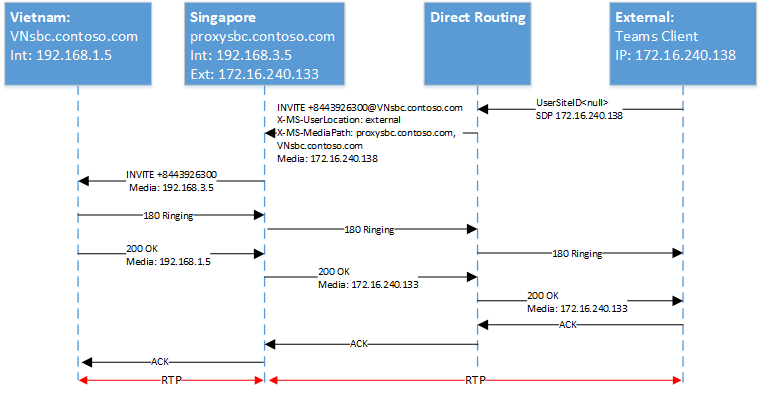

# <a name="configure-local-media-optimization-for-direct-routing"></a>Configurar la optimización de medios locales para el enrutamiento directo

La configuración para la optimización de medios locales se basa en la configuración de red que es común a otras características de voz en la nube, como el enrutamiento basado en la ubicación y las llamadas de emergencia dinámicas. Para obtener más información sobre regiones de red, sitios de red, subredes de red y direcciones IP de confianza, consulte [configuración de red para características de voz en la nube](cloud-voice-network-settings.md).

Antes de configurar la optimización de medios locales, consulte la [optimización local de medios para el enrutamiento directo](direct-routing-media-optimization.md).  

Para configurar la optimización local de medios, se requieren los pasos siguientes. Puede usar el centro de administración de Teams o PowerShell. Para obtener más información, consulte [administrar la topología de red](manage-your-network-topology.md).

1. Configure el usuario y los sitios de SBC (como se describe en este artículo).
2. Configure el SBCs para la optimización de medios locales (según la especificación de proveedor de SBC).

En el siguiente diagrama se muestra la configuración de red usada en los ejemplos de este artículo.


## <a name="configure-the-user-and-the-sbc-sites"></a>Configurar el usuario y los sitios de SBC

Para configurar los sitios de usuario y SBC, tendrá que:

1. [Administrar direcciones IP externas de confianza](#manage-external-trusted-ip-addresses).  

2. [Defina la topología de red](#define-the-network-topology) configurando las regiones de red, los sitios de red y las subredes de red.

3. [Defina la topología de red virtual](#define-the-virtual-network-topology) asignando SBC (s) a los sitios con los modos y valores de SBC de proxy.


## <a name="configure-sbcs-for-local-media-optimization-according-to-the-sbc-vendor-specification"></a>Configurar SBC (s) para la optimización de medios locales según la especificación de proveedor de SBC

En este artículo se describe la configuración de los componentes de Microsoft. Para obtener información sobre la configuración de SBC, consulte la documenation de proveedor de SBC.

La optimización local de medios es compatible con los siguientes proveedores de SBC:

| Proveedor | Producto |    Versión del software |
|:------------|:-------|:-------| :-------|
| [AudioCodes](https://www.audiocodes.com/media/13253/connecting-audiocodes-sbc-to-microsoft-teams-direct-routing-enterprise-model-configuration-note.pdf) |    SBC Mediant 500 |   7.20 a. 256 | 
|            |  SBC Mediant 800 |   7.20 a. 256 | 
|            |  SBC Mediant 2600 |  7.20 a. 256 | 
|            |  SBC Mediant 4000 |  7.20 a. 256 | 
|            |  SBC 1000B | 7.20 a. 256 | 
|            |  SBC 9000 |  7.20 a. 256 | 
|            |  SBC Virtual Edition SBC |   7.20 a. 256 | 
|            |  La nube Cloud Edition SBC | 7.20 a. 256 |
| [Núcleo de SBC de cinta](https://support.sonus.net/display/ALLDOC/SBC+8.2+-+Configure+Local+Media+Optimization)  |  SBC 5110         | 8,2  |
|            |  SBC 5210         | 8,2  |
|            |  SBC 5400         | 8,2  |
|            |  SBC 7000         | 8,2  |
|            |  SBC SWe          | 8,2  |
| [TE-SYSTEMS](https://www.anynode.de/local_media_optimization/) |  anynode          | 4.0.1 + |
| [Oracle](https://www.oracle.com/industries/communications/enterprise-communications/session-border-controller/microsoft.html) | AP 1100 | 8.4.0.0.0 |
|        | AP 3900 | 8.4.0.0.0 |
|        | AP 4600 | 8.4.0.0.0 | 
|        | AP 6300 | 8.4.0.0.0 |
|        | AP 6350 | 8.4.0.0.0 | 
|        | VME     | 8.4.0.0.0 |


## <a name="manage-external-trusted-ip-addresses"></a>Administrar direcciones IP de confianza externas

Las direcciones IP externas de confianza son direcciones IP externas de Internet de la red empresarial. Estas son las direcciones IP que usan los clientes de Microsoft Teams cuando se conectan a Microsoft 365. Debe agregar estas direcciones IP externas para cada sitio en el que tenga usuarios que usen la optimización local de medios.

Para agregar las direcciones IP públicas de cada sitio, use el cmdlet New-CsTenantTrustedIPAddress. Puede definir un número ilimitado de direcciones IP de confianza para un inquilino. Si el IPs externo visto por Microsoft 365 son direcciones IPv4 e IPv6, tendrá que agregar ambos tipos de direcciones IP. Para IPv4, use la máscara 32. Para IPv6, use la máscara 128. Puede agregar direcciones IP externas individuales y subredes IP externas especificando diferentes MaskBits en el cmdlet.

```
New-CsTenantTrustedIPAddress -IPAddress <External IP address> -MaskBits <Subnet bitmask> -Description <description>
```


Ejemplo de adición de direcciones IP fiables.

```
New-CsTenantTrustedIPAddress -IPAddress 172.16.240.110 -MaskBits 32 -Description "Vietnam site trusted IP"
New-CsTenantTrustedIPAddress -IPAddress 172.16.240.120 -MaskBits 32 -Description "Indonesia site trusted IP"
New-CsTenantTrustedIPAddress -IPAddress 172.16.240.130 -MaskBits 32 -Description "Singapore site trusted IP"
```


## <a name="define-the-network-topology"></a>Definir la topología de red

En esta sección se describe cómo definir las regiones de red, los sitios de red y las subredes de red para su topología de red.

Todos los parámetros distinguen entre mayúsculas y minúsculas, por lo que debe asegurarse de usar el mismo caso que se usó durante la configuración.  (Por ejemplo, los valores de GatewaySiteID "Vietnam" y "Vietnam" se tratarán como sitios diferentes).

### <a name="define-network-regions"></a>Definir regiones de red

Para definir regiones de red, use el cmdlet New-CsTenantNetworkRegion. El parámetro RegionID es un nombre lógico que representa la geografía de la región y no tiene dependencias ni restricciones. El parámetro <site ID> CentralSite es opcional.

```
New-CsTenantNetworkRegion -NetworkRegionID <region ID>  
```

En el ejemplo siguiente se crea una región de red denominada APAC:

```
New-CsTenantNetworkRegion -NetworkRegionID "APAC"  
```

###  <a name="define-network-sites"></a>Definir sitios de red

Para definir sitios de red, use el cmdlet New-CsTenantNetworkSite. Cada sitio de red debe estar asociado a una región de red.

```
New-CsTenantNetworkSite -NetworkSiteID <site ID> -NetworkRegionID <region ID>
```

En el siguiente ejemplo se crean tres sitios de red nuevos, Vietnam, Indonesia y Singapur en la región APAC:

```
New-CsTenantNetworkSite -NetworkSiteID "Vietnam" -NetworkRegionID "APAC"
New-CsTenantNetworkSite -NetworkSiteID "Indonesia" -NetworkRegionID "APAC"
New-CsTenantNetworkSite -NetworkSiteID "Singapore" -NetworkRegionID "APAC"
```

### <a name="define-network-subnets"></a>Definir subredes de red

Para definir subredes de red y asociarlas a sitios de red, use el cmdlet New-CsTenantNetworkSubnet. Cada subred de red solo se puede asociar con un sitio. 

```
New-CsTenantNetworkSubnet -SubnetID <Subnet IP address> -MaskBits <Subnet bitmask> -NetworkSiteID <site ID>
```

En el ejemplo siguiente se definen tres subredes de red y se asocian con los tres sitios de red: Vietnam, Indonesia y Singapur:

```
New-CsTenantNetworkSubnet -SubnetID 192.168.1.0 -MaskBits 24 -NetworkSiteID “Vietnam”
New-CsTenantNetworkSubnet -SubnetID 192.168.2.0 -MaskBits 24 -NetworkSiteID “Indonesia”
New-CsTenantNetworkSubnet -SubnetID 192.168.3.0 -MaskBits 24 -NetworkSiteID “Singapore”
```

## <a name="define-the-virtual-network-topology"></a>Definir la topología de red virtual 

En primer lugar, el administrador de inquilinos crea una nueva configuración de SBC para cada SBC relevante mediante el cmdlet New-CsOnlinePSTNGateway.
El administrador de inquilinos define la topología de red virtual mediante la especificación de los sitios de red de los objetos de la puerta de enlace RTC con el cmdlet Set-CsOnlinePSTNGateway:

```
PS C:\> Set-CsOnlinePSTNGateway -Identity <Identity> -GatewaySiteID <site ID> -MediaBypass <true/false> -BypassMode <Always/OnlyForLocalUsers> -ProxySBC  <proxy SBC FQDN or $null>
```

Tenga en cuenta lo siguiente: 
   - Si el cliente tiene un único SBC, el parámetro-ProxySBC debe ser obligatorio $null o valor FQDN de SBC (SBC central con escenario de troncos centralizados).
   - El parámetro-MediaBypass debe establecerse en $true para admitir la optimización de medios locales.
   - Si el SBC no tiene establecido el parámetro-BypassMode, no se enviarán los encabezados X-MS. 
   - Todos los parámetros distinguen entre mayúsculas y minúsculas, por lo que debe asegurarse de usar el mismo caso que el usado durante la configuración.  (Por ejemplo, los valores de GatewaySiteID "Vietnam" y "Vietnam" se tratarán como sitios diferentes).

En el ejemplo siguiente se agrega tres SBCs a los sitios de red Vietnam, Indonesia y Singapur en la región de APACtion con MODE omite siempre:

```
Set-CSOnlinePSTNGateway -Identity “proxysbc.contoso.com” -GatewaySiteID “Singapore” -MediaBypass $true -BypassMode “Always” -ProxySBC $null

Set-CSOnlinePSTNGateway -Identity “VNsbc.contoso.com” -GatewaySiteID “Vietnam” -MediaBypass $true -BypassMode “Always” -ProxySBC “proxysbc.contoso.com”

Set-CSOnlinePSTNGateway -Identity “IDsbc.contoso.com” -GatewaySiteID “Indonesia” -MediaBypass $true -BypassMode “Always” -ProxySBC “proxysbc.contoso.com”
```

Nota: para asegurarse de que las operaciones no interrumpidas se configuran al mismo tiempo con la optimización local de medios y el enrutamiento basado en ubicación (LBR), es necesario habilitar SBCs para LBR al configurar el $true parámetro GatewaySiteLbrEnabled para cada SBC de indirecto. (Esta configuración no es obligatoria para el SBC proxy).

En función de la información anterior, el enrutamiento directo incluirá tres encabezados SIP de propiedad para las invitaciones SIP y las reinvitaciones, tal y como se muestra en la tabla siguiente.

Encabezados X-MS introducidos en enrutamiento directo en invitaciones y reinvitaciones si se define BypassMode:

| Nombre del encabezado | Los | Comentarios | 
|:------------|:-------|:-------|
| X-MS-UserLocation | interno/externo | Indica si el usuario es interno o externo |
| Solicitud: URI INVITE SIP: + 84439263000@VNsbc.contoso.com SIP/2,0 | FQDN DE SBC | El FQDN que se destina a la llamada incluso si la SBC no está conectada directamente al enrutamiento directo |
| X-MS-MediaPath | Ejemplo: proxysbc.contoso.com, VNsbc.contoso.com | Orden de SBCs que debe usarse para la ruta de medios entre el usuario y el SBC de destino. El SBC final es siempre el último |
| X-MS-UserSite | usersiteID | Cadena definida por el administrador de inquilinos |

## <a name="call-flows"></a>Flujos de llamadas 

A continuación se muestran los flujos de llamadas para dos modos:

- [Omitir siempre](#always-bypass-mode)
- [Solo para usuarios locales](#only-for-local-users-mode)

### <a name="always-bypass-mode"></a>Modo de omisión de siempre

El modo de omisión de siempre es la opción más sencilla para configurar. El administrador de inquilinos puede configurar un solo sitio para todos los usuarios y SBCs si todo SBCs es alcanzable desde cualquier sitio.

Los ejemplos muestran siempre el modo de omisión en los siguientes escenarios:

- [Llamadas salientes y el usuario está en la misma ubicación que el SBC](#outbound-calls-and-the-user-is-in-the-same-location-as-the-sbc-with-always-bypass)
- [Llamadas entrantes y el usuario está en la misma ubicación que el SBC](#inbound-calls-and-the-user-is-in-the-same-location-as-the-sbc-with-always-bypass)
- [Llamadas salientes y el usuario es externo](#outbound-calls-and-the-user-is-external-with-always-bypass)
- [Llamadas entrantes y el usuario es externo](#inbound-calls-and-the-user-is-external-with-always-bypass)

En la siguiente tabla se muestran los FQDN y las direcciones IP que se usan en los ejemplos:

| FQDN | Dirección IP externa de SBC | Dirección IP interna de SBC | Subred interna | Ubicación | NAT externa (IP de confianza) |
|:------------|:-------|:-------|:-------|:-------|:-------|
| VNsbc.contoso.com | Ninguna | 192.168.1.5 | 192.168.1.0/24 | Vietnam | 172.16.240.110 |
| IDsbc.contoso.com | Ninguna | 192.168.2.5 | 192.168.2.0/24 | Indonesia | 172.16.240.120 |
| proxysbc.contoso.com | 172.16.240.133 | 192.168.3.5 | 192.168.3.0/24 | Singapur | 172.16.240.130 |


#### <a name="outbound-calls-and-the-user-is-in-the-same-location-as-the-sbc-with-always-bypass"></a>Llamadas salientes y el usuario está en la misma ubicación que el SBC con el método de omitir siempre

| Modo |    Usuario |  Ubicación |  Dirección de la llamada |
|:------------|:-------|:-------| :-------|
| AlwaysBypass |    Interno |  El mismo sitio que el SBC |  Saliente |

En la tabla siguiente se muestra la acción y la configuración de usuario final:

| Ubicación física de usuario| El usuario realiza o recibe una llamada a o desde el número | Número de teléfono del usuario  | Directiva de enrutamiento de voz en línea | Modo configurado para SBC |
|:------------|:-------|:-------|:-------|:-------|
| Vietnam | + 84 4 3926 3000 | + 84 4 5555 5555   | Prioridad 1: ^\+84 (\d{9}) $-VNsbc.contoso.com <br> Prioridad 2:. *-proxysbc.contoso.com   | VNsbc.contoso.com: omite siempre <br> proxysbc.contoso.com: omite siempre


En el siguiente diagrama se muestra la escalera SIP para una llamada saliente con el modo Omitir siempre y el usuario en la misma ubicación que la SBC.


En la tabla siguiente se muestran los encabezados X-MS enviados por enrutamiento directo:

| Parámetro | Explicación |
|:------------|:-------|
| Invitar a + 8443926300@VNsbc.contoso.com | El nombre de destino de la SBC según se define en la Directiva de enrutamiento de voz en línea se envía en el URI de la solicitud. | 
| X-MS-UserLocation: Internal | El campo indicó que el usuario se encuentra dentro de la red corporativa |
| X-MS-MediaPath: VNsbc.contoso.com |   Especifica qué SBC debe atravesar el cliente hasta el SBC de destino. En este caso, puesto que siempre hemos omitido y el cliente es interno, el nombre de destino enviado como el único nombre en el encabezado. | 
|X-MS-UserSite: Vietnam |   El campo indicado dentro del sitio donde se encuentra el usuario. |


#### <a name="inbound-calls-and-the-user-is-in-the-same-location-as-the-sbc-with-always-bypass"></a>Las llamadas entrantes y el usuario se encuentra en la misma ubicación que el SBC con el método de omitir siempre

| Modo |    Usuario |  Ubicación |  Dirección de la llamada |
|:------------|:-------|:-------|:-------|:-------|
| AlwaysBypass |    Interno | El mismo sitio que el SBC | Entrada |


En una llamada entrante, se desconoce la ubicación del usuario y la SBC debe adivinar dónde se encuentra el usuario. Si la conjetura no es correcta, será necesario volver a invitar. Este caso supone que el usuario es interno, los medios pueden fluir directamente y no se necesita ninguna otra acción (volver a invitar).
La SBC conectada al servicio de enrutamiento directo informa de la ubicación de la SBC de origen proporcionando los campos de ruta de registro y de contacto. En función de estos campos, el enrutamiento directo calcula la ruta de medios.

Nota: dado que un usuario puede tener varios puntos de conexión, no es posible la compatibilidad con 183. El enrutamiento directo siempre usará timbres de 180 en este caso. 

En el siguiente diagrama se muestra la escalera de SIP para la llamada entrante con el modo AlwaysBypass, y el usuario está en la misma ubicación que la SBC.


#### <a name="outbound-calls-and-the-user-is-external-with-always-bypass"></a>Las llamadas salientes y el usuario son externos con el método de omitir siempre

| Modo |    Usuario |  Sitio |  Dirección de la llamada
|:------------|:-------|:-------|:-------|
AlwaysBypass |  Externo |  N/D | Saliente |


En el siguiente diagrama se muestra la escalera SIP para una llamada saliente con el modo AlwaysBypass, y el usuario es externo:



En la tabla siguiente se muestran los encabezados X-MS enviados por el servicio de enrutamiento directo:

| Parámetro |   Explicación |
|:------------|:-------|
|Invitar a + 8443926300@VNsbc.contoso.com | El nombre de destino de la SBC, según se define en la Directiva de enrutamiento de voz en línea, se envía en el URI de la solicitud.|
| X-MS-UserLocation: External | El campo indicó que el usuario se encuentra fuera de la red corporativa. |
| X-MS-MediaPath: proxysbc.contoso.com, VNsbc.contoso.com    | Especifica qué SBC debe atravesar el cliente hasta el SBC de destino. En este caso, ya que siempre hemos omitido y el cliente es externo. |

#### <a name="inbound-calls-and-the-user-is-external-with-always-bypass"></a>Las llamadas entrantes y las del usuario son externas Si omiten siempre

| Modo | Usuario | Sitio |  Dirección de la llamada |
|:------------|:-------|:-------|:-------|
AlwaysBypass |  Externo |  N/D |   Entrada |

En el caso de una llamada entrante, la SBC conectada al enrutamiento directo necesita enviar una nueva invitación (de forma predeterminada, se ofrecen siempre los candidatos de medio local) si la ubicación del usuario es externa.  La X-MediaPath se calcula en función de la ruta de registro y el usuario de SBC especificado.

En el siguiente diagrama se muestra la escalera SIP para una llamada entrante con el modo AlwaysBypass, y el usuario es externo.


### <a name="only-for-local-users-mode"></a>Solo para el modo de usuarios locales

Los candidatos de medio local del SBC objetivo se ofrecerán solo si un usuario se encuentra en la misma ubicación que la SBC. En todos los demás casos, los medios se transmiten a través de una IP interna o externa del SBC proxy.

Se describen los escenarios siguientes:

- [Llamadas salientes y el usuario está en la misma ubicación que el SBC](#outbound-calls-and-the-user-is-in-the-same-location-as-the-sbc-with-only-for-local-users)
- [Llamadas entrantes y el usuario está en la misma ubicación que el SBC](#inbound-calls-and-the-user-is-in-the-same-location-as-the-sbc-with-only-for-local-users)
- [El usuario no está en la misma ubicación que la SBC pero está en la red corporativa](#user-is-not-at-the-same-location-as-the-sbc-but-is-in-the-corporate-network-with-only-for-local-users)
- [Las llamadas entrantes y el usuario son internas, pero no están en la misma ubicación que el SBC](#inbound-call-and-the-user-is-internal-but-is-not-at-the-same-location-as-the-sbc-with-only-for-local-users)

La siguiente tabla muestra la configuración y la acción del usuario final:

| Ubicación física de usuario |  El usuario realiza o recibe una llamada a o desde el número |  Número de teléfono del usuario | Directiva de enrutamiento de voz en línea |   Modo configurado para SBC |
|:------------|:-------|:-------|:-------|:-------|
| Vietnam | + 84 4 3926 3000 |  + 84 4 5555 5555 | Prioridad 1: ^\+84 (\d{9}) $-VNsbc.contoso.com <br> Prioridad 2:. *-proxysbc.contoso.com | VNsbc.contoso.com – OnlyForLocalUsers Proxysbc.contoso.com – omitir siempre |

#### <a name="outbound-calls-and-the-user-is-in-the-same-location-as-the-sbc-with-only-for-local-users"></a>Llamadas salientes y el usuario está en la misma ubicación que la SBC solo para usuarios locales

| Modo | Usuario | Sitio | Dirección de la llamada |
|:------------|:-------|:-------|:-------|
| OnlyForLocalUsers |   Interno |Igual que SBC   | Saliente |

En el siguiente diagrama se muestra una llamada saliente con el modo OnlyForLocalUsers y el usuario se encuentra en la misma ubicación que el SBC. Este es el mismo flujo que se muestra en las [llamadas salientes cuando el usuario está en la misma ubicación que la SBC](#outbound-calls-and-the-user-is-in-the-same-location-as-the-sbc-with-always-bypass).


#### <a name="inbound-calls-and-the-user-is-in-the-same-location-as-the-sbc-with-only-for-local-users"></a>Las llamadas entrantes y el usuario se encuentra en la misma ubicación que la SBC solo para los usuarios locales

| Modo | Usuario | Sitio | Dirección de la llamada |
|:------------|:-------|:-------|:-------|
| OnlyForLocalUsers |   Interno | Igual que SBC | Entrada |

En el siguiente diagrama se muestra una llamada entrante con el modo OnlyForLocalUsers y el usuario se encuentra en la misma ubicación que el SBC. Este es el mismo flujo que se muestra en las [llamadas entrantes cuando el usuario está en la misma ubicación que la SBC](#inbound-calls-and-the-user-is-in-the-same-location-as-the-sbc-with-always-bypass).


#### <a name="user-is-not-at-the-same-location-as-the-sbc-but-is-in-the-corporate-network-with-only-for-local-users"></a>El usuario no está en la misma ubicación que la SBC pero está en la red corporativa solo para usuarios locales

| Modo | Usuario | Sitio |Dirección de la llamada |
|:------------|:-------|:-------|:-------|
| OnlyForLocalUsers  | Interno |   Diferente de SBC | Saliente |

El enrutamiento directo calcula la X-MediaPath en función de la ubicación de la que se informó del usuario y el modo configurado en la SBC.


En el siguiente diagrama se muestra una llamada saliente con el modo OnlyForLocalUsers y un usuario interno que no se encuentra en la misma ubicación que la SBC.


#### <a name="inbound-call-and-the-user-is-internal-but-is-not-at-the-same-location-as-the-sbc-with-only-for-local-users"></a>La llamada entrante y el usuario son internas, pero no están en la misma ubicación que el SBC solo para usuarios locales

| Modo |    Usuario |  Sitio |  Dirección de la llamada |
|:------------|:-------|:-------|:-------|
| OnlyForLocalUsers | Interno |    Diferente de SBC |    Entrada |

En el siguiente diagrama se muestra una llamada entrante con el modo OnlyForLocalUsers y un usuario interno que no se encuentra en la misma ubicación que la SBC.


