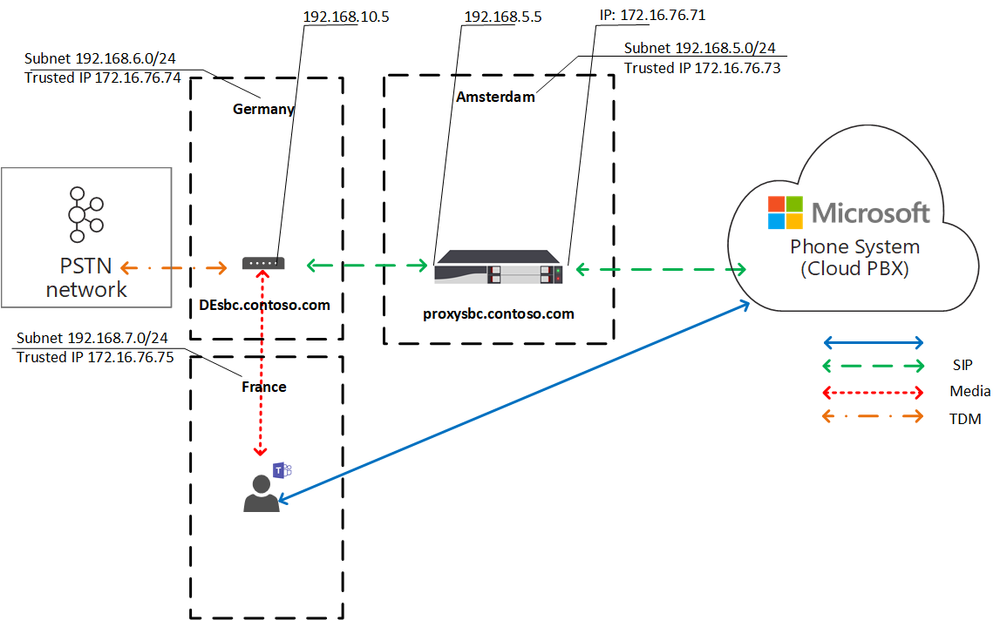

# Optimización de medios locales para enrutamiento directoLocal Media Optimization for Direct Routing

La voz de red telefónica conmutada (RTC) se considera una aplicación crítica para la empresa con grandes expectativas para la calidad de la voz.Public Switched Telephone Network (PSTN) voice is considered a business-critical application with high expectations for voice quality. El enrutamiento directo le permite controlar los flujos de tráfico de medios para dar cabida a una multitud de topologías de red y configuraciones de telefonía local para varias empresas de todo el mundo.Direct Routing lets you control media traffic flows to accommodate a multitude of network topologies and local telephony setups for various enterprises all over the world. 

La optimización de medios locales para enrutamiento directo le permite administrar la calidad de voz mediante:Local Media Optimization for Direct Routing lets you manage voice quality by:

-   Controlar cómo fluye el tráfico multimedia entre los clientes de Teams y los controladores de borde de sesión (SBCs) del cliente.Controlling how media traffic flows between the Teams clients and the customer Session Border Controllers (SBCs).
-   Mantener los medios locales dentro de los límites de las subredes de red corporativas.Keeping media local within the boundaries of corporate network subnets.
-   Permitir transmisiones multimedia entre los clientes de Teams y las OSN incluso si las sbcs están detrás de los firewalls corporativos con IP privadas y no son visibles para Microsoft directamente.Allowing media streams between the Teams clients and the SBCs even if the SBCs are behind corporate firewalls with private IPs and not visible to Microsoft directly.

La optimización de medios locales admite dos escenarios:Local Media Optimization supports two scenarios:

- Centralización de todos los troncos locales a través de un SBC centralizado conectado al tronco principal del Protocolo de inicio de sesión (SIP), lo que proporciona servicios de telefonía a todas las sucursales locales de la empresa.Centralization of all local trunks through a centralized SBC connected to the main Session Initiation Protocol (SIP)trunk--providing telephony services to all local branch offices of the company.

-   Crear una topología de red virtual de SBC, donde los SBC de las sucursales locales están conectados a un SBC proxy centralizado visible para Microsoft Phone System a través de su dirección IP externa y comunicarse con él.Building a virtual network topology of SBCs--where the SBCs in the local branch offices are connected to a centralized proxy SBC that is visible to, and communicating with, Microsoft Phone System through its external IP address. En una topología de red virtual, los SSS de bajada se comunican a través de IP internas y no son visibles directamente para Sistema telefónico.In a virtual network topology, downstream SBCs are communicating through internal IPs and are not directly visible to Phone System.

En este artículo se describen la funcionalidad de las características, así como los escenarios y soluciones de los clientes.This article describes feature functionality, and customer scenarios and solutions. Para obtener más información sobre la configuración, vea [Configurar optimización de medios locales.](direct-routing-media-optimization-configure.md)For details on configuration, see [Configure Local Media Optimization](direct-routing-media-optimization-configure.md). 

  > [!NOTE]
  > Si quiere mantener los medios locales dentro de los límites de la intranet, se recomienda optimizar los medios locales.If you want to keep media local within the boundaries of your intranet, Local Media Optimization is recommended. Si ya tiene omita medios y use solo las direcciones IP públicas de sus sbcs, no es obligatorio pasar a la optimización de medios locales.If you already have Media Bypass and you use only the public IP addresses of your SBCs, it is not mandatory to move to Local Media Optimization. Puede seguir usando Media Bypass.You can continue to use Media Bypass. Para obtener más información, vea [Plan de omisión de medios.](direct-routing-plan-media-bypass.md)For more information, see [Plan Media Bypass](direct-routing-plan-media-bypass.md).

## Escenarios de clientes admitidosSupported customer scenarios

Para esta discusión, suponga que Contoso administra varias empresas en todo el mundo de la manera siguiente.For this discussion, assume that Contoso runs multiple businesses across the globe as follows. (Tenga en cuenta que las regiones de Europa y APAC solo se usan como ejemplos.(Note that Europe and APAC regions are used as examples only. Una empresa puede tener varias regiones diferentes con requisitos similares).A company might have several different regions with similar requirements.)
 
- **En Europa,** Contoso tiene oficinas en aproximadamente 30 países.**In Europe**, Contoso has offices in approximately 30 countries. Cada oficina tiene su propia central de conmutación (PBX).Each office has its own Private Branch Exchange (PBX). 

  Contoso tenía la opción de centralizar los troncos en una ubicación(Ámsterdam) para las 30 oficinas europeas.Contoso was offered an option to centralize the trunks in one location--Amsterdam--for all 30 European offices. Contoso implementó el SBC en Ámsterdam, proporcionó ancho de banda suficiente para realizar llamadas a través de la ubicación centralizada, conectó un tronco SIP central a la ubicación centralizada y comenzó a servir a todas las ubicaciones europeas desde Ámsterdam.Contoso deployed the SBC in Amsterdam, provided enough bandwidth to run calls through the centralized location, connected a central SIP trunk to the centralized location, and started serving all European locations from Amsterdam. 

- **En la región APAC,** Contoso tiene varias oficinas en diferentes países.**In the APAC region**, Contoso has multiple offices in different countries. 

  En muchos países, la compañía todavía tiene troncos de multiplexación de división de tiempo (TDM) en las sucursales locales.In many countries, the company still has time-division multiplexing (TDM) trunks in local branch offices. La centralización de los troncos TDM no es una opción en la región APAC, por lo que no es posible cambiar a SIP.Centralization of the TDM trunks is not an option in the APAC region, so switching to SIP is not possible. Suponga que hay más de cincuenta sucursales de Contoso en la región de APAC con cientos de puertas de enlace (SBCs).Assume there are more than fifty Contoso branch offices across the APAC region with hundreds of gateways (SBCs). En este escenario, no es posible emparejar todas las puertas de enlace con la interfaz de enrutamiento directo debido a la falta de direcciones IP públicas o de saltos de Internet locales.In this scenario, it is not possible to pair all gateways to the Direct Routing interface because of a lack of public IP addresses and/or local internet breakouts. Además, algunos países imponen requisitos normativos que no se pueden cumplir sin tener conectividad de red RTC local.In addition, some countries impose regulatory requirements that cannot be fulfilled without having local PSTN network connectivity.

Según los requisitos empresariales, Contoso implementó dos soluciones con la optimización de medios locales para enrutamiento directo:Based on their business requirements, Contoso implemented two solutions with Local Media Optimization for Direct Routing:

- **En Europa,** todos los troncos están centralizados y los flujos de medios entre la central SBC y los usuarios, en función de la ubicación del usuario.**In Europe**, all trunks are centralized and media flows between the central SBC and the users, based on the user location. 

  - Si un usuario está conectado a la subred local de una red corporativa (es decir, el usuario es interno), los medios fluyen entre la DIRECCIÓN IP interna de la central SBC y el cliente de Teams del usuario.If a user is connected to the local subnet of a corporate network (that is, the user is internal), media flows between the internal IP of the central SBC and the user’s Teams client. 
  
  - Si un usuario está fuera de los límites de la red corporativa (por ejemplo, si el usuario está usando una conexión a Internet inalámbrica pública), entonces se considera que el usuario es externo.If a user is outside the boundaries of the corporate network--for example, if the user is using a public wireless Internet connection--then the user is considered to be external. En este caso, los medios fluyen entre la DIRECCIÓN IP externa del SBC central y el cliente de Teams.In this case, the media flows between the external IP of the central SBC and the Teams client.

- En la **región APAC,** un servidor proxy centralizado SBC está emparejado con El enrutamiento directo de Microsoft, que dirige los medios entre la interfaz de enrutamiento directo y los SBC de bajada en las sucursales locales.**In the APAC region**, a centralized proxy SBC is paired to Microsoft Direct Routing, which directs media between the Direct Routing interface and the downstream SBCs in local branch offices. 

  Las sbcs de bajada en las sucursales locales no están directamente visibles para enrutamiento directo en APAC, pero están emparejadas mediante el uso del cmdlet Set-CSOnlinePSTNGateway para crear una topología de red virtual dentro de Microsoft Phone System.The downstream SBCs in the local branch offices are not directly visible to Direct Routing in APAC, but they are paired by using the Set-CSOnlinePSTNGateway cmdlet to create a virtual network topology within Microsoft Phone System. Siempre que sea posible, los medios permanecen en su configuración local.Media always stays local when possible. Los usuarios externos tienen medios que fluyen entre el cliente de Teams y la DIRECCIÓN IP pública del SBC del proxy.External users have media flowing between the Teams client and the public IP of the proxy SBC.

## Central SBC con troncos centralizadosCentral SBC with centralized trunks

Para crear una solución en la que se proporcionan servicios RTC a todas las sucursales locales a través de un único SBC central con un tronco SIP centralizado conectado, el administrador de inquilinos de Contoso empareja un SBC (centralsbc.contoso.com) al servicio; la SBC tiene un tronco SIP centralizado conectado a él.To build a solution where PSTN services are provided to all local branch offices through a single central SBC with a connected centralized SIP trunk, the Contoso tenant administrator pairs one SBC (centralsbc.contoso.com) to the service; the SBC has a centralized SIP trunk connected to it. 

- Cuando un usuario está en la red interna de la compañía, SBC proporciona la IP interna del SBC para los medios.When a user is in the internal network of the company, the SBC provides the internal IP of the SBC for media. 

- Cuando un usuario está fuera de la red corporativa, SBC proporciona la IP externa (pública) de la SBC.When a user is outside of the corporate network, the SBC provides the external (public) IP of the SBC.

Nota: Todos los valores de ejemplos, tablas o diagramas se presentan únicamente con fines de ilustración.Note: All values within examples, tables, or diagrams are presented for illustration purposes only.

Tabla 1.Table 1. Parámetros de red de ejemplo para sbCsExample network parameters for SBCs 

| UbicaciónLocation | SBC FQDNSBC FQDN | Subred internaInternal subnet | NAT externa (IP de confianza)External NAT (Trusted IP) | Dirección IP externa SBCSBC external IP address | Dirección IP interna de SBCSBC internal IP address |
|:------------|:-------|:-------|:-------|:-------|:-------|
| ÁmsterdamAmsterdam | centralsbc.contoso.comcentralsbc.contoso.com | 192.168.5.0/24192.168.5.0/24 | 172.16.76.73172.16.76.73 | 172.16.76.71172.16.76.71 | 192.168.5.5192.168.5.5 |
| AlemaniaGermany | No implementadoNot deployed | 192.168.6.0/24192.168.6.0/24 | 172.16.76.74172.16.76.74 | No implementadoNot deployed |  No implementadoNot deployed |
| FranciaFrance | No implementadoNot deployed | 192.168.7.0/24192.168.7.0/24 | 172.16.76.75172.16.76.75 | No implementadoNot deployed |  No implementadoNot deployed ||||

### Usuario internoInternal user

El siguiente diagrama muestra el flujo de tráfico cuando un usuario está conectado a la red corporativa en la sucursal o el sitio del usuario.The following diagram shows the traffic flow when a user is connected to the corporate network in the user’s home branch office or site. 

Mientras que local, se asigna al usuario la sucursal local en Alemania.While on premises, the user is assigned to the local branch office in Germany. El usuario realiza una llamada telefónica de enrutamiento directo a través de Teams.The user makes a Direct Routing phone call through Teams.

- El cliente de Teams del usuario se comunica al sistema telefónico directamente a través de la API de REST, pero los medios generados durante el flujo de llamadas a la dirección IP interna del SBC central.The user’s Teams client communicates to Phone System directly through the REST API, but the media generated during the call flows to the central SBC’s internal IP address. 

- La SBC redirige el flujo a Sistema telefónico y a la red RTC conectada.The SBC redirects the flow to Phone System and the connected PSTN network. 

- Sistema telefónico puede ver la central SBC solo a través de la dirección IP externa.The central SBC is visible to Phone System through the external IP address only. 

Diagrama 1.Diagram 1. Flujo de tráfico cuando el usuario está en el sitio "hogar" con un SBC centralizado y con un tronco SIP centralizado conectadoTraffic flow when the user is in the ‘home’ site with a centralized SBC and with a connected centralized SIP Trunk

### Usuario externoExternal user

El siguiente diagrama muestra el flujo de tráfico cuando un usuario no está local y no está conectado a la red corporativa (es decir, el dispositivo del usuario está conectado a Internet a través de un dispositivo móvil o una red Wi-Fi pública).The following diagram shows the traffic flow when a user is not on premises and is not connected to the corporate network (that is, the user’s device is connected to the Internet through a mobile device or public Wi-Fi). El usuario realiza una llamada telefónica de enrutamiento directo a través de Teams:The user makes a Direct Routing phone call through Teams:

- El cliente de Teams del usuario se comunica al sistema telefónico directamente a través de la API de REST, pero, en este caso, los medios generados durante los flujos de llamada a la dirección IP externa de la central SBC.The user’s Teams client communicates to Phone System directly through the REST API, but, in this case, the media generated during the call flows to the central SBC’s external IP address. 

- La SBC redirige el flujo a Sistema telefónico y a la red RTC conectada.The SBC redirects the flow to Phone System and the connected PSTN network. 

- Sistema telefónico puede ver la central SBC solo a través de la dirección IP externa.The central SBC is visible to Phone System through the external IP address only. 

En este caso, el comportamiento es similar tanto si el usuario es local en la sucursal en Alemania como en cualquier otra sucursal.In this case, the behavior is similar whether the user is local to the branch office in Germany or to any other branch office. El usuario se considera externo porque se encuentra fuera de los límites de la red corporativa.The user is considered external because the user is outside the boundaries of the corporate network.

Diagrama 2.Diagram 2. Flujo de tráfico cuando el usuario está externo con un SBC centralizado y con un tronco SIP centralizado conectadoTraffic flow when the user is external with a centralized SBC and with a connected centralized SIP Trunk

## SBC del proxy con SBCs de bajada conectadosProxy SBC with connected downstream SBCs

Para crear una solución en la que los servicios RTC se proporcionan en todas las sucursales locales de la región APAC, donde la centralización de los troncos TDM no es una opción, el administrador de Contoso empareja un SBC (proxysbc.contoso.com), también denominado SBC proxy, al servicio de enrutamiento directo.To build a solution where PSTN services are provided in all local branch offices in the APAC region where centralization of the TDM trunks is not an option, the Contoso administrator pairs one SBC (proxysbc.contoso.com), also called the proxy SBC, to the Direct Routing service. 

Posteriormente, el administrador de Contoso agrega algunos SBC de bajada que indican que se puede llegar a ellos a través del SBC proxy proxysbc.contoso.com.Afterwards, the Contoso administrator adds some downstream SBCs indicating that they can be reached through the proxy SBC proxysbc.contoso.com. Sin embargo, los sbcs de bajada no tienen IP públicas, pero se pueden asignar a las rutas de voz.Downstream SBCs do not have public IPs, however, they can be assigned to voice routes. En la tabla siguiente se muestran ejemplos de parámetros de red y configuración.The table below shows example network parameters and configuration.

Cuando un usuario está en la sucursal local donde se encuentra la SBC descendente, el tráfico multimedia fluye entre el usuario y el SBC local descendente directamente.When a user is in the local branch office where the downstream SBC is located, the media traffic flows between the user and the local downstream SBC directly. Si un usuario está fuera de la oficina (en una Internet pública), los medios fluyen desde el usuario a la DIRECCIÓN IP pública del SBC del proxy, que lo proxy lo asigna a los SBC de bajada relevantes.If a user is outside of the office (on a public internet), the media flows from the user to the public IP of the Proxy SBC, which proxies it to the relevant downstream SBC(s).

Tabla 2.Table 2. Ejemplo de información de red SBCExample SBC network information

| UbicaciónLocation | SBC FQDNSBC FQDN | Subred internaInternal subnet | NAT externa (IP de confianza)External NAT (Trusted IP) | Dirección IP externa SBCSBC external IP address  | Dirección IP interna de SBCSBC internal IP address |
|:------------|:-------|:-------|:-------|:-------|:-------|
| VietnamVietnam | VNsbc.contoso.comVNsbc.contoso.com | 192.168.1.0/24192.168.1.0/24 | 172.16.240.110172.16.240.110 | NingunaNone |  192.168.1.5192.168.1.5 |
| IndonesiaIndonesia  | IDsbc.contoso.comIDsbc.contoso.com | 192.168.2.0/24192.168.2.0/24 | 172.16.240.120172.16.240.120 | NingunaNone |  192.168.2.5192.168.2.5 |
| SingapurSingapore | proxysbc.contoso.comproxysbc.contoso.com |   192.168.3.0/24192.168.3.0/24 | 172.16.240.130172.16.240.130 | 172.16.240.133172.16.240.133 | 192.168.3.5192.168.3.5 |

### Usuario internoInternal user 

El siguiente diagrama muestra el flujo de tráfico de alto nivel para el escenario cuando un usuario está dentro de la oficina en la región APAC.The following diagram shows the high-level traffic flow for the scenario when a user is inside the office in the APAC region. El usuario, que está asignado a una sucursal local en Vietnam y está en local, realiza una llamada telefónica de enrutamiento directo a través de Teams.The user, who is assigned to a local branch office in Vietnam, and is on premises, makes a Direct Routing phone call through Teams. 

- El cliente de Teams del usuario se comunica con Sistema telefónico directamente a través de la API de REST, pero los medios que se generan durante el flujo de llamadas a la dirección IP interna de SBC local.The user’s Teams client communicates with Phone System directly through the REST API, but media generated during the call flows to local SBC’s internal IP address.

- La SBC local redirige el flujo al SBC proxy en Singapur y a la red RTC local conectada.The local SBC redirects the flow to the proxy SBC in Singapore and to the connected local PSTN network.

-  The proxy SBC is visible to Phone System through the external IP address only and routes the flow from the downstream SBC (in this case the local SBC in Vietnam) to Phone System.The proxy SBC is visible to Phone System through the external IP address only and routes the flow from the downstream SBC (in this case the local SBC in Vietnam) to Phone System. 

- La SBC descendente en la sucursal local no es visible para Sistema telefónico directamente, sino que se asigna dentro de la topología de red virtual definida por el administrador de Contoso al configurar la optimización de medios locales.The downstream SBC in the local branch office is not visible to Phone System directly but is mapped within the virtual network topology that is defined by the Contoso administrator while setting up Local Media Optimization.

Nota: El comportamiento puede ser diferente para usuarios locales y usuarios no locales, según el modo de optimización de medios locales configurado.Note: The behavior might be different for local users and non-local users depending on the configured Local Media Optimization mode. 

Para obtener más información sobre los posibles modos y el comportamiento relevante, vea Configurar la optimización de medios locales.For more information on possible modes and relevant behavior, see Configure Local Media Optimization.

Diagrama 3.Diagram 3. Flujo de tráfico cuando el usuario está en la red "doméstica" con un SBC proxy y con SBC conectados de bajadaTraffic flow when the user is in the “home” network with a proxy SBC and with connected downstream SBCs 

### Usuario externoExternal user

El siguiente diagrama muestra el flujo de tráfico cuando un usuario está fuera de los límites de la red corporativa.The following diagram shows the traffic flow when a user is outside of the corporate network boundaries. El usuario no es local (no está dentro de los límites de la red corporativa).The user is not on premises (is not within the boundaries of corporate network). El usuario realiza una llamada de enrutamiento directo a través de Teams a un número de teléfono en Vietnam.The user makes a Direct Routing phone call through Teams to a phone number in Vietnam. 

- El cliente de Teams del usuario se comunica con Sistema telefónico directamente a través de la API REST, pero los medios que se generan durante la llamada fluyen primero a la dirección IP externa del servidor proxy SBC en Singapur.The user’s Teams client communicates with Phone System directly through the REST API, but the  media generated during the call flows first to the external IP address of the proxy SBC in Singapore. 

- Según las directivas de  configuración y voz (consulte Configurar optimización de medios locales para obtener más información), el SBC del proxy redirige el flujo al SBC descendente en Vietnam.Based on configuration and voice policies (see [Configure Local Media Optimization](direct-routing-media-optimization-configure.md) for details), the proxy SBC redirects the flow to the downstream SBC in Vietnam. 

- La secuencia descendente de SBC en Vietnam redirige el flujo a la red RTC local conectada.The downstream SBC in Vietnam redirects the flow to the connected local PSTN network. 

- El SBC del proxy está visible para Sistema telefónico solo a través de la dirección IP externa.The proxy SBC is visible to Phone System through the external IP address only.

-  La SBC descendente en la sucursal local no es visible para Sistema telefónico directamente, sino que se asigna dentro de la topología de red virtual definida por el administrador de Contoso al configurar la optimización de medios locales.The downstream SBC in the local branch office is not visible to Phone System directly, but is mapped within the virtual network topology that is defined by the Contoso administrator while setting up Local Media Optimization. En el ejemplo, el usuario se considera externo porque está fuera de los límites de la red corporativa.In the example, the user is considered external because the user is outside the boundaries of the corporate network. 

Diagrama 4.Diagram 4. Flujo de tráfico cuando el usuario es externo con un SBC proxy y con SBCs conectados de bajadaTraffic flow when the user is external with a proxy SBC and with connected downstream SBCs

## Modos de optimización de medios localesLocal Media Optimization modes

La optimización de medios locales admite dos modos:Local Media Optimization supports two modes:

- **Modo 1: Omitir siempre.****Mode 1: Always bypass**. En este caso, si el usuario es interno, los medios fluirán por la dirección IP interna de SBC local descendente independientemente de la ubicación real del usuario interno; por ejemplo, dentro de la misma sucursal donde se encuentra la SBC de bajada o en alguna otra sucursal.In this case, if the user is internal, the media will flow through the local downstream SBC’s internal IP address regardless of the actual location of the internal user; for example, within the same branch office where the downstream SBC is located or in some other branch office.  

- **Modo 2: Solo para usuarios locales.****Mode 2: Only for local users**. In this mode, media will flow directly to the local downstream SBC's internal IP address only when generated by the internal user located in the same branch office as the downstream SBC.In this mode, media will flow directly to the local downstream SBC’s internal IP address only when generated by the internal user located in the same branch office as the downstream SBC. 

Para distinguir entre los modos de optimización de medios locales, el administrador de inquilinos debe establecer el parámetro -BypassMode en "Always" o "OnlyForLocalUsers" para cada SBC usando el cmdlet Set-CSonlinePSTNGateway.To distinguish between Local Media Optimization modes, the tenant administrator needs to set the -BypassMode parameter to either ‘Always’ or ‘OnlyForLocalUsers’ for every SBC by using the  Set-CSonlinePSTNGateway cmdlet. Para obtener más información, vea [Configurar la optimización de medios locales.](direct-routing-media-optimization-configure.md)For more information, see [Configure Local Media Optimization](direct-routing-media-optimization-configure.md).  

 > [!NOTE]
  > Cuando los usuarios son internos, se requiere la conectividad multimedia entre el usuario y el SBC a través de la dirección IP **interna.**When users are internal, media connectivity between the user and the SBC over the internal IP address is **required**. No hay ninguna reserva de retransmisión de transporte público para los medios en este caso, ya que la SBC estará proporcionando una DIRECCIÓN IP interna para la conectividad multimedia.There is no fallback to public transport relays for media in this case as the SBC will be providing an internal IP for media connectivity. 

### Modo 1: Omitir siempreMode 1: Always bypass

Si tiene una buena conexión entre sucursales, el modo recomendado siempre se omite.If you have good connection between branch offices, the recommended mode is Always bypass.
 
Por ejemplo, supongamos que una compañía tiene un tronco SIP centralizado en Ámsterdam, que sirve a 30 países y tiene una buena conectividad entre los 30 sitios y los usuarios locales.For example, assume a company has a centralized SIP trunk in Amsterdam, which serves 30 countries and has good connectivity between all 30 sites and local users. También hay una rama en Alemania donde hay implementado un SBC local.There is also a branch in Germany where a local SBC is deployed.

La SBC en Alemania se puede configurar en modo de "omisión siempre".The SBC in Germany can be configured in “Always bypass” mode. Los usuarios, independientemente de su ubicación, se conectarán a la SBC directamente a través de la dirección IP interna de la SBC (por ejemplo, de Francia a Alemania; consulte el diagrama siguiente para consultarlo).Users, regardless of their location, will connect to the SBC directly through the internal IP address of the SBC (for example from France to Germany; see the diagram below for reference).

A continuación se describen dos escenarios:The following describes two scenarios:

- Escenario 1.Scenario 1. El usuario se encuentra en la misma ubicación que el SBC definido en la directiva de enrutamiento de voz en línea.The user is in the same location as the SBC defined in the Online Voice Routing Policy.

- Escenario 2.Scenario 2. El usuario y las puertas de enlace se encuentran en sitios diferentes.The user and gateways are in different sites.

#### Escenario 1.Scenario 1. El usuario se encuentra en la misma ubicación que el SBC definido en la directiva de enrutamiento de voz en línea.The user is in the same location as the SBC defined in the Online Voice Routing Policy

El SBC de Ámsterdam está configurado para ser un SBC proxy para un SBC local de bajada en Alemania.The SBC in Amsterdam is configured to be a proxy SBC for a local downstream SBC in Germany. El usuario se encuentra en Alemania dentro de la misma subred que la red corporativa de la SBC local.The user is in Germany within the same subnet as the corporate network of the local SBC. Ambos SCS (proxy y corriente abajo) se configuran para el modo de omisión siempre.Both SBCs (proxy and downstream) are configured for Always Bypass mode. Las directivas de enrutamiento de voz en línea especifican que, en el caso de llamadas dentro de Alemania (con el código de área +49), deberían dirigirse a la SBC local en Alemania.Online voice routing policies specify that in case of calls within Germany (with area code +49) they should be routed to the local SBC in Germany. Todas las demás llamadas (y, en caso de que se produce un error en la SBC en Alemania, las llamadas en Alemania) deberían dirigirse al SBC proxy en Ámsterdam.All other calls--and in case the SBC in Germany fails, calls in Germany--should be routed to the proxy SBC in Amsterdam. En la tabla siguiente se resume la configuración de ejemplo.The following table summarizes the example configuration. 

Tabla 3.Table 3. Configuración de ejemplo para el escenario 1Example configuration for Scenario 1

| Ubicación física del usuarioUser physical location | El usuario realiza una llamada a un númeroUser makes a call to a number | Directiva de enrutamiento de voz en líneaOnline Voice Routing Policy | Modo configurado para SBCMode configured for SBC | Media FlowMedia Flow | 
|:------------|:-------|:-------|:-------|:-------|
| AlemaniaGermany | +49 1 437 2800+49 1 437 2800 | Prioridad 1: ^ \+ 49(\d {8} )$ -DEsbc.contoso.comPriority 1: ^\+49(\d{8})$ -DEsbc.contoso.com Prioridad 2: .\* - proxysbc.contoso.comPriority 2: .\* - proxysbc.contoso.com| DEsbc.contoso.com– Omitir siempreDEsbc.contoso.com – Always Bypass  proxysbc.contoso.com– Omitir siempreproxysbc.contoso.com – Always Bypass | Aplicación de usuario < Teams > DEsbc.contoso.comTeams User <–> DEsbc.contoso.com |

El siguiente diagrama muestra el flujo de tráfico de alto nivel para el usuario interno en Alemania que realiza una llamada telefónica de enrutamiento directo a través de Teams al número en Alemania.The diagram below shows the high-level traffic flow for the internal user in Germany making a Direct Routing phone call through Teams to the number in Germany. 

- El cliente de Teams del usuario se comunica con Sistema telefónico directamente a través de la API de REST.The user’s Teams client communicates with Phone System directly through the REST API. 

- Los medios generados durante el flujo de llamadas a la dirección IP interna de SBC local.The media generated during the call flows to the local SBC’s internal IP address. 

- La SBC local redirige el flujo al SBC proxy en Ámsterdam y a la red RTC local conectada.The local SBC redirects the flow to the proxy SBC in Amsterdam and to the connected local PSTN network. 

- The proxy SBC is visible to Phone System through the external IP address only and routes the flow from the downstream SBC (in this case, the local SBC in Germany) to Phone System.The proxy SBC is visible to Phone System through the external IP address only and routes the flow from the downstream SBC (in this case, the local SBC in Germany) to Phone System. 

- La SBC descendente en la sucursal local no es visible para Sistema telefónico directamente, sino que se asigna dentro de la topología de red virtual definida por el administrador de Contoso al configurar la optimización de medios locales.The downstream SBC in the local branch office is not visible to Phone System directly but is mapped within the virtual network topology that is defined by the Contoso administrator while setting up Local Media Optimization.

Diagrama 5.Diagram 5.  Flujo de tráfico con el modo "Omitir siempre" y el usuario está en el sitio "principal"Traffic flow with “Always Bypass” mode and the user is in the “home” site

#### Situación 2: El usuario y las puertas de enlace se encuentran en sitios diferentesScenario 2: The user and gateways are in different sites

El SBC de Ámsterdam está configurado para ser un SBC proxy para un SBC local de bajada en Alemania.The SBC in Amsterdam is configured to be a proxy SBC for a local downstream SBC in Germany. Ambos SCS (proxy y corriente abajo) se configuran para el modo de omisión siempre.Both SBCs (proxy and downstream) are configured for Always Bypass mode. El usuario interno en Francia, ubicado en la sucursal local, está realizando una llamada de enrutamiento directo a Alemania.The internal user in France, located in the local branch office, is making a Direct Routing call to Germany. Las directivas de enrutamiento de voz en línea especifican que las llamadas a Alemania (con el código de área +49) se enrutar a la SBC local en Alemania.Online voice routing policies specify that calls to Germany (with area code +49) should be routed to the local SBC in Germany. Todas las demás llamadas (y, en caso de que se produce un error en la SBC en Alemania, todas las llamadas en Alemania) deberían dirigirse al SBC proxy en Ámsterdam.All other calls--and, in case the SBC in Germany fails, all calls in Germany--should be routed to the proxy SBC in Amsterdam. En la tabla siguiente se resume la configuración de ejemplo.The following table summarizes the example configuration. 

Tabla 4.Table 4. Configuración de ejemplo para el escenario 2Example configuration for Scenario 2

| Ubicación física del usuarioUser physical location | El usuario realiza una llamada a un númeroUser makes a call to a number | Directiva de enrutamiento de voz en líneaOnline Voice Routing Policy | Modo configurado para SBCMode configured for SBC | Media FlowMedia Flow | 
|:------------|:-------|:-------|:-------|:-------|
| FranciaFrance | +49 1 437 2800+49 1 437 2800 | Prioridad 1: ^ \+ 49(\d {8} )$ -DEsbc.contoso.comPriority 1: ^\+49(\d{8})$ -DEsbc.contoso.com  Prioridad 2: .\* - proxysbc.contoso.comPriority 2: .\* - proxysbc.contoso.com |  DEsbc.contoso.com – Omitir siempre proxysbc.contoso.com – Omitir siempreDEsbc.contoso.com  – Always Bypass proxysbc.contoso.com – Always Bypass | Aplicación para < Teams: > DEsbc.contoso.comTeams User <– > DEsbc.contoso.com  |

El siguiente diagrama muestra el flujo de tráfico de alto nivel cuando el usuario interno alemán ubicado en Francia realiza una llamada telefónica de enrutamiento directo a través de Teams al número en Alemania.The following diagram shows the high-level traffic flow when the internal German user located in France makes a Direct Routing phone call through Teams to the number in Germany. 

- El cliente de Teams del usuario se comunica con Sistema telefónico directamente a través de la API de REST.The user’s Teams client communicates with Phone System directly through the REST API.

- Los medios generados durante la llamada fluyen directamente a la SBC en la dirección IP interna de Alemania.The media generated during the call flows directly to the SBC in Germany's internal IP address. 

- La SBC en Alemania redirige el flujo a la SBC proxy en Ámsterdam y a la red RTC local conectada.The SBC in Germany redirects the flow to the proxy SBC in Amsterdam and to the connected local PSTN network. 

Diagrama 6.Diagram 6.  Flujo de tráfico con el modo "Omitir siempre" y el usuario no está en el sitio "hogar", sino en la red internaTraffic flow with “Always Bypass” mode and the user is not in “home” site but in the internal network

### Modo 2: Solo para usuarios localesMode 2: Only for local users

Si hay conexiones malas entre sucursales locales pero conexiones buenas entre cada sucursal local y oficina regional, entonces el modo recomendado es "Solo para usuarios locales".If there are bad connections between local branch offices but good connections between each local branch office and regional office, then the recommended mode is “Only For Local Users”.

Por ejemplo, en la región APAC, supongamos que Contoso tiene varias oficinas en diferentes países.For example, in the APAC region, assume Contoso has multiple offices in different countries. Para muchos países, no es posible cambiar a SIP porque la compañía todavía tiene troncos TDM en muchas sucursales locales.For many countries, switching to SIP is not possible because the company still has TDM trunks in many local branch offices. La centralización de los troncos TDM no es una opción en la región APAC.Centralization of the TDM trunks is not an option in the APAC region. Además, hay más de cincuenta sucursales de Contoso en la región de APAC con cientos de puertas de enlace (SBCs).Moreover, there are more than fifty Contoso branch offices across the APAC region with hundreds of gateways (SBCs). 

Para crear una solución en la que los servicios RTC se proporcionan en todas las sucursales locales de la región APAC donde la centralización de los troncos TDM no es una opción, el administrador de Contoso empareja un SBC regional en Singapur como SBC proxy al servicio de enrutamiento directo.To build a solution where PSTN services are provided in all local branch offices in the APAC region where centralization of the TDM trunks is not an option, the Contoso administrator pairs one regional SBC in Singapore as the proxy SBC to the Direct Routing service. La conexión directa entre las sucursales locales no es buena, pero hay una buena conexión entre cada sucursal local y el SBC regional en Singapur.The direct connection between the local branch offices is not good, but there is a good connection between each local branch office and the regional SBC in Singapore. Para la SBC regional, el administrador elige "Omitir siempre" el modo y, para los SBC locales descendentes, el administrador elige "Solo para usuarios locales".For the regional SBC, the administrator chooses ‘Always Bypass’ mode, and for the local downstream SBCs, the administrator chooses ‘Only For Local Users’ mode.

A continuación se describen dos escenarios:The following describes two scenarios:

- Escenario 1.Scenario 1. El usuario se encuentra en la misma ubicación que el SBC definido en la directiva de enrutamiento de voz en línea.The user is in the same location as the SBC defined in the Online Voice Routing Policy

- Escenario 2.Scenario 2. El usuario y las puertas de enlace se encuentran en diferentes sitiosThe user and gateways are in different sites

#### Escenario 1.Scenario 1. El usuario se encuentra en la misma ubicación que el SBC definido en la directiva de enrutamiento de voz en línea.The user is in the same location as the SBC defined in Online Voice Routing Policy

Suponga que la SBC en Singapur está configurada para ser un SBC proxy para los SBC locales de bajada en Vietnam e Indonesia.Assume the SBC in Singapore is configured to be a proxy SBC for the local downstream SBCs in Vietnam and Indonesia. El usuario está en Vietnam dentro de la misma ubicación que la SBC local.The user is in Vietnam within the same location as the local SBC. Las directivas de enrutamiento de voz en línea especifican que las llamadas en Vietnam (con el código de área +84) se enrutan a la SBC local en Vietnam.Online voice routing policies specify that calls in Vietnam (with area code +84) should be routed to the local SBC in Vietnam. Todas las demás llamadas (y, si se produce un error en la SBC en Vietnam, las llamadas en Vietnam) deberían dirigirse al SBC proxy en Singapur.All other calls--and, if the SBC in Vietnam fails, calls in Vietnam--should be routed to the proxy SBC in Singapore. En la tabla siguiente se resume la configuración de ejemplo.The following table summarizes the example configuration. 

Tabla 5.Table 5. Configuración de ejemplo para el escenario 1 de modo "Solo para usuarios locales"Example configuration for ‘Only For Local Users’ mode Scenario 1

| Ubicación física del usuarioUser physical location | El usuario realiza una llamada a un númeroUser makes a call to a number | Directiva de enrutamiento de voz en líneaOnline Voice Routing Policy | Modo configurado para SBCMode configured for SBC | Media FlowMedia Flow | 
|:------------|:-------|:-------|:-------|:-------|
| VietnamVietnam | +84 4 3926 3000+84 4 3926 3000 | Prioridad 1: ^ \+ 84(\d {9} )$ -VNsbc.contoso.comPriority 1: ^\+84(\d{9})$ -VNsbc.contoso.com  Prioridad 2: .\* - proxysbc.contoso.comPriority 2: .\* - proxysbc.contoso.com | VNsbc.contoso.com: solo para usuarios localesVNsbc.contoso.com – Only For Local Users   proxysbc.contoso.com– Omitir siempreproxysbc.contoso.com – Always Bypass | Aplicación de usuario < Teams > VNsbc.contoso.comTeams User <–> VNsbc.contoso.com |

En el siguiente diagrama, un usuario asignado a la sucursal local en Vietnam, mientras que está de forma local, realiza una llamada telefónica de enrutamiento directo a través de Teams.In the following diagram, a user assigned to the local branch office in Vietnam, while on premises, makes a Direct Routing phone call through Teams. 

- El cliente de Teams del usuario se comunica con Sistema telefónico directamente a través de la API de REST.The user’s Teams client communicates with Phone System directly through the REST API. 

- Medios generados durante los flujos de llamada a la dirección IP interna de SBC local.Media generated during the call flows to the local SBC’s internal IP address. 

- La SBC local redirige el flujo al SBC proxy en Singapur y a la red RTC local conectada.The local SBC redirects the flow to the proxy SBC in Singapore and to the connected local PSTN network. 

- The proxy SBC is visible to Phone System through the external IP address only and routes the flow from the downstream SBC (in this case, the local SBC in Vietnam) to Phone System.The proxy SBC is visible to Phone System through the external IP address only and routes the flow from the downstream SBC (in this case, the local SBC in Vietnam) to Phone System. 

- La SBC descendente en la sucursal local no es visible para Sistema telefónico directamente, pero se asigna dentro de la topología de red virtual.The downstream SBC in the local branch office is not visible to Phone System directly but is mapped within the virtual network topology.

Diagrama 7.Diagram 7. Flujo de tráfico con el modo "Solo para usuarios locales" y el usuario está en el sitio "hogar"Traffic flow with “Only For Local Users” mode and the user is in “home” site

#### Escenario 2.Scenario 2. El usuario y las puertas de enlace se encuentran en diferentes sitiosThe user and gateways are in different sites

Suponga que la SBC en Singapur está configurada para ser un SBC proxy para los SBC locales de bajada en Vietnam e Indonesia.Assume the SBC in Singapore is configured to be a proxy SBC for the local downstream SBCs in Vietnam and Indonesia. El usuario interno en Indonesia, ubicado en la sucursal local, está realizando una llamada directa a Vietnam.The internal user in Indonesia, located in the local branch office, is making a Direct Routing call to Vietnam. Las directivas de enrutamiento de voz en línea especifican que las llamadas a Vietnam (con el código de área +84) se enrutan a la SBC local en Vietnam.Online Voice routing policies specify that calls to Vietnam (with area code +84) should be routed to the local SBC in Vietnam. Todas las demás llamadas (y, en caso de que la SBC en Vietnam falle, las llamadas a Vietnam) deberían dirigirse al SBC proxy en Singapur.All other calls--and, in case the SBC in Vietnam fails, calls to Vietnam--should be routed to the proxy SBC in Singapore. El SBC proxy en Singapur está establecido en el modo "Omitir siempre" y el SBC local en Vietnam está establecido en el modo "Solo para usuarios locales".The proxy SBC in Singapore is set to ‘Always Bypass’ mode, and the local SBC in Vietnam is set to ‘Only For Local Users’ mode. En la tabla siguiente se resume la configuración de ejemplo.The following table summarizes the example configuration. 

Tabla 6.Table 6. Configuración de usuarioUser configuration

| Ubicación física del usuarioUser physical location | El usuario realiza una llamada a un númeroUser makes a call to a number | Directiva de enrutamiento de voz en líneaOnline Voice Routing Policy | Modo configurado para SBCMode configured for SBC | Media FlowMedia Flow | 
|:------------|:-------|:-------|:-------|:-------|
| IndonesiaIndonesia | +84 4 3926 3000+84 4 3926 3000 | Prioridad 1: ^ \+ 84(\d {9} )$ -VNsbc.contoso.comPriority 1: ^\+84(\d{9})$ -VNsbc.contoso.com   Prioridad 2: .\* - proxysbc.contoso.comPriority 2: .\* - proxysbc.contoso.com |VNsbc.contoso.com: solo para usuarios localesVNsbc.contoso.com – Only For Local Users   proxysbc.contoso.com– Omitir siempreproxysbc.contoso.com – Always Bypass | Los administradores < de > proxysbc.contoso.com < teams > VNsbc.contoso.comTeams User <–> proxysbc.contoso.com <–> VNsbc.contoso.com |

En el siguiente diagrama, el usuario interno, mientras esté en las instalaciones de la sucursal de Indonesia, realiza una llamada de enrutamiento directo a través de Teams a un número en Vietnam.In the following diagram, the internal user, while on premises in the Indonesian branch office, makes a Direct Routing phone call through Teams to a number in Vietnam. 

- El cliente de Teams del usuario se comunica con Sistema telefónico directamente a través de la API de REST.The user’s Teams client communicates with Phone System directly through the REST API.

- Los medios generados durante los flujos de llamada a la dirección IP interna del proxy SBC en primer lugar.Media generated during the call flows to proxy SBC’s internal IP address first. 

- The proxy SBC in Singapore redirects the flow to the internal IP address of the downstream SBC in Vietnam and to Phone System.The proxy SBC in Singapore redirects the flow to the internal IP address of the downstream SBC in Vietnam and to Phone System. 

- La secuencia descendente de SBC en Vietnam enruta el flujo a la red RTC local conectada.The Downstream SBC in Vietnam routes the flow to the connected local PSTN network. 

- El SBC del proxy está visible para Sistema telefónico solo a través de la dirección IP externa.The proxy SBC is visible to Phone System through the external IP address only.

- Las sbcs de bajada de las sucursales locales no son visibles para Sistema telefónico directamente, pero se asignan dentro de la topología de red virtual.The downstream SBCs in local branch offices are not visible to Phone System directly but are mapped within the virtual network topology.

Diagrama 8.Diagram 8.  Flujo de tráfico con el modo "Solo para usuarios locales" y el usuario no está en el sitio "hogar", sino en la red interna.Traffic flow with “Only For Local Users” mode, and the user is not in “home” site but in the internal network

## Problemas conocidosKnown issues

A continuación se muestra una lista de problemas conocidos que están presentes actualmente en la optimización de medios locales.The following is a list of known issues that are currently present in Local Media Optimization. Microsoft está trabajando para solucionar estos problemas.Microsoft is working on addressing these issues.

| ProblemaIssue | Solución alternativaWorkaround |
| :--- | :--- |
| El cliente de Teams no se identifica como interno **cuando** la IP pública del cliente de Teams coincide con la lista de IP de confianza del cliente.Teams client is not identified as **internal** when the Teams client Public IP matches the customer Trusted IP list. | La optimización de medios locales requiere que la subred del cliente de Teams coincida con una subred de red configurada [por el inquilino.](https://docs.microsoft.com/powershell/module/skype/new-cstenantnetworksubnet?view=skype-ps)Local Media Optimization requires that the Teams client subnet matches a tenant configured [network subnet](https://docs.microsoft.com/powershell/module/skype/new-cstenantnetworksubnet?view=skype-ps)|
| Las escalaciones de llamadas resultan en llamadas que se descartan cuando el cliente de Teams se identifica como interno.Call escalations result in dropped calls when the Teams client is identified as internal.| Deshabilite la optimización de medios locales en el SBC de enrutamiento directo.Disable Local Media Optimization on the Direct Routing SBC.|

