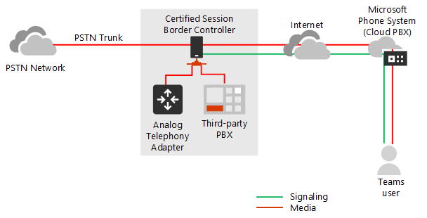
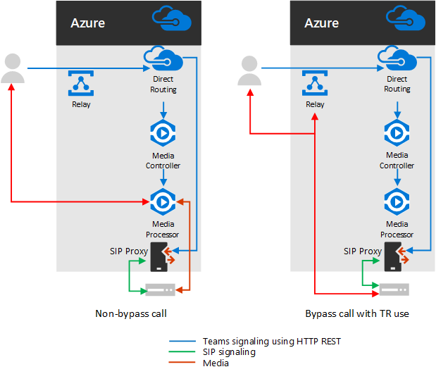

# Planear desvío de medios con enrutamiento directo

## Acerca de la omisión de elementos multimedia con enrutamiento directo

La omisión de elementos multimedia le permite acortar la ruta de acceso al tráfico multimedia y reducir el número de saltos en tránsito para mejorar el rendimiento. Con la omisión de medios, los medios se mantienen entre el controlador de borde de sesión (SBC) y el cliente, en lugar de enviarlo a través del sistema telefónico de Microsoft. Para configurar la omisión de medios, la SBC y el cliente deben estar en la misma ubicación o red.

Puede controlar la omisión de elementos multimedia para cada SBC con el comando **set-CSOnlinePSTNGateway** con el parámetro **-MediaBypass** establecido en true o false. Si habilita la omisión de medios, esto no significa que todo el tráfico multimedia permanecerá dentro de la red corporativa. En este artículo se describe el flujo de llamadas en diferentes escenarios.    

Los diagramas siguientes ilustran la diferencia en el flujo de llamadas con y sin omisión de medios.

Sin omisión de medios, cuando un cliente realiza o recibe una llamada, tanto la señalización como el flujo de medios entre el SBC, el sistema telefónico de Microsoft y el cliente de equipos, tal y como se muestra en el siguiente diagrama:

Pero supongamos que un usuario está en el mismo edificio o en la misma red que la SBC. Por ejemplo, supongamos que un usuario de un edificio de Frankfurt hace una llamada a un usuario de la RTC: 

- **Sin omisión de medios**, los medios se transmiten a través de Amsterdam o Dublín (donde se implementan los centros de datos de Microsoft) y de vuelta al SBC en Frankfurt. 

  El centro de recursos de Europa está seleccionado porque SBC está en Europa y Microsoft usa el centro de la Datacenter más cercano a SBC. A pesar de que este enfoque no afecta la calidad de las llamadas debido a la optimización del flujo de tráfico dentro de las redes Microsoft en la mayoría de los lugares, el tráfico tiene un bucle innecesario.     

- **Con la omisión de elementos multimedia**, los medios se mantienen directamente entre el usuario de los equipos y el SBC, tal y como se muestra en el siguiente diagrama:

La omisión de multimedia aprovecha los protocolos denominados establecimiento de conectividad interactiva (ICE) en el cliente de Teams y ICE Lite en la SBC. Estos protocolos permiten el enrutamiento directo para usar la ruta de medios más directa para una calidad óptima. ICE y ICE Lite son estándares de WebRTC. Para obtener información detallada sobre estos protocolos, consulte RFC 5245.

## Planificación de flujo de llamadas y firewall

El flujo de llamadas y el plan de Firewall depende de si el usuario tiene acceso directo a la dirección IP pública de SBC y si el usuario está dentro o fuera de la red.

### Flujo de llamadas si el usuario tiene acceso directo a la dirección IP pública de la SBC

Si el usuario tiene acceso directo a la dirección IP pública de la SBC, el flujo de llamadas es el siguiente:

- Para la omisión de elementos multimedia, el cliente de Teams debe tener acceso a la dirección IP pública de SBC incluso desde una red interna. Si no desea usar medios directos, los medios pueden fluir a través de transmisiones de transporte.

- Esta es la solución recomendada cuando un usuario está en el mismo edificio o en la misma red que el SBC, quite los componentes de la nube de Microsoft de la ruta de medios.

- La señalización siempre fluye a través de la nube de Microsoft.

El siguiente diagrama muestra el flujo de llamadas cuando la omisión de elementos multimedia está habilitada, el cliente es interno y el cliente puede comunicarse con la dirección IP pública de la SBC (medios directos): 

- Las flechas y los valores numéricos de los trazados se ajustan al artículo [flujos de llamada de Microsoft Teams](https://docs.microsoft.com/microsoftteams/microsoft-teams-online-call-flows) .

- La señalización del SIP siempre tiene las rutas 4 y 4 (según la dirección del tráfico). El medio permanece local y toma la ruta de acceso 5B.

### Flujo de llamadas si el usuario no tiene acceso a la dirección IP pública de la SBC

A continuación, se describe el flujo de llamadas si el usuario no tiene acceso a la dirección IP pública de la SBC. 

Por ejemplo, supongamos que el usuario es externo y el administrador de inquilinos decidió no abrir la dirección IP pública de SBC a todos los usuarios de Internet, pero solo a la nube de Microsoft. Los componentes internos del tráfico pueden fluir a través de los transmisores de transporte de los equipos. Esta es la configuración recomendada para los usuarios de fuera de la red corporativa. Tenga en cuenta lo siguiente:

- Se usan los transmisores de transporte de Teams.

- Para la omisión de medios, Microsoft usa una versión de los relés de transporte que requiere que se abran los puertos 50 000 a 59 999 entre los equipos de transporte de transporte y la SBC (en el futuro se planea ir a la versión que solo requiere puertos 3478 y 3479).

- Para fines de optimización de multimedia, Microsoft recomienda abrir la dirección IP pública de SBC solo para los grupos de transporte de transporte. Para los clientes fuera de la red corporativa, Microsoft recomienda usar relés de transporte en lugar de alcanzar directamente la dirección IP pública de SBC.

El siguiente diagrama muestra el flujo de llamadas cuando la omisión de medios está habilitada, el cliente es externo y el cliente no puede comunicarse con la dirección IP pública del controlador de borde de la sesión (los medios son retransmitidos por la retransmisión de transporte de Teams).

- Las flechas y los valores numéricos de los trazados se ajustan al artículo [flujos de llamada de Microsoft Teams](https://docs.microsoft.com/microsoftteams/microsoft-teams-online-call-flows) .

- Los medios se retransmiten a través de las rutas 3, 3 ', 4 y 4 '.

### Flujo de llamadas si un usuario está fuera de la red y tiene acceso a la IP pública de la SBC

> [!NOTE]
> Esta no es una configuración recomendada porque no aprovecha las retransmisiones de transporte de Teams. En su lugar, debe considerar el escenario anterior en el que el usuario no tiene acceso a la dirección IP pública de SBC. 

El siguiente diagrama muestra el flujo de llamadas cuando la omisión de elementos multimedia está habilitada, el cliente es externo y el cliente puede comunicarse con la dirección IP pública de la SBC (soporte directo).

- Las flechas y los valores numéricos de los trazados se ajustan al artículo [flujos de llamada de Microsoft Teams](https://docs.microsoft.com/microsoftteams/microsoft-teams-online-call-flows) .

- La señalización SIP siempre toma las rutas 3 y 3 ' (según la dirección del tráfico). Los flujos multimedia usan la ruta 2.

## Uso de procesadores de medios y transmisiones de transporte

Hay dos componentes en la nube de Microsoft que pueden estar en la ruta de tráfico de multimedia: procesadores de medios y transmisiones de transporte. 

- El procesador multimedia es un componente público que controla los elementos multimedia en casos de no omisión y controla medios para las aplicaciones de voz.

   Los procesadores multimedia siempre están en la ruta de acceso para las llamadas sin ignorar del usuario final, pero nunca en la ruta de acceso para las llamadas omitidas. Los procesadores de medios siempre están en la ruta de todas las aplicaciones de voz, como estacionamiento de llamadas, operador automático de la organización y colas de llamadas.

- La retransmisión de transporte se usa para conectarse al servicio de transporte más cercano para enviar tráfico en tiempo real.

   Los relés de transporte pueden estar o no en la ruta de acceso para las llamadas omitidas, que proceden de o se destinan a usuarios finales, en función de dónde se encuentra el usuario y de la configuración de la red.

En el siguiente diagrama se muestran dos flujos de llamada: uno con la omisión de elementos multimedia habilitado y el segundo con omisión de medios deshabilitado. Nota el diagrama solo ilustra el tráfico que se origina en los usuarios finales o que se destinan a ellos.  
- El controlador de medios es un microservicio en Azure que asigna procesadores de medios y crea ofertas de protocolo de descripción de sesiones (SDP).

- El proxy SIP es un componente que traduce las señales de REST HTTP usadas en Teams a SIP.    

En la tabla siguiente se resume la diferencia entre los procesadores multimedia y los relés de transporte.

|    | Procesadores de medios | Transmisiones de transporte|
| :--------------|:---------------|:------------|
En la ruta multimedia de las llamadas no omitidas para usuarios finales | Constantemente | Sin | 
En la ruta multimedia de las llamadas omitidas para usuarios finales | Sin | Si el cliente no puede alcanzar la SBC en la dirección IP pública | 
En la ruta multimedia de las aplicaciones de voz | Constantemente | Sin | 
Puede realizar transcodificación (B2BUA)\* | Sí | No, solo retransmite audio entre puntos de conexión | 
Cantidad de instancias en todo el mundo y ubicación | 8 total: 2 en Oriente de EE. UU. y oeste; 2 en Amsterdam y Dublín; 2 en Hong Kong y Singapur; 2 en Japón  | Multiple

Los intervalos de IP son:
- 52.112.0.0/14 (direcciones IP de 52.112.0.1 a 52.115.255.254)
- 52.120.0.0/14 (direcciones IP de 52.120.0.1 a 52.123.255.254)

\*Explicación de transcodificación: 

- El procesador multimedia es B2BUA, lo que significa que puede cambiar un códec (por ejemplo, seda del cliente de Teams al panel de administración y G. 711 entre MP y SBC).

- Los relés de transporte no son B2BUA, lo que significa que el códec nunca cambia entre el cliente y SBC, aunque el tráfico fluya por medio de retransmisiones.

### Uso de los procesadores de equipos multimedia si el tronco está configurado para la omisión de medios

Los procesadores multimedia de Teams siempre se insertan en la ruta multimedia en los siguientes escenarios:

- La llamada se transfiere de 1:1 a una llamada grupal
- La llamada va a un usuario de equipos federados
- La llamada se desvía o se transfiere a un usuario de Skype empresarial

Asegúrese de que su SBC tenga acceso a los intervalos de los procesadores de medios y transmisiones de transporte como se describe a continuación.    

## Señalización SIP: FQDN

Para las señales SIP, los requisitos de FQDN y firewall son los mismos que para los casos no omitidos. 

El enrutamiento directo se ofrece en los siguientes entornos de Office 365:
- Creación de inquilino
- Office 365 GCC
- Office 365 GCC High
- Office 365 DoD más información sobre los [entornos gubernamentales de office 365 y de EE. UU.](https://docs.microsoft.com/office365/servicedescriptions/office-365-platform-service-description/office-365-us-government/office-365-us-government) , como GCC, GCC High y DoD.

### Entornos de Office 365 y Office 365 GCC

Los puntos de conexión para el enrutamiento directo son los tres FQDN siguientes:

- **SIP.pstnhub.Microsoft.com** (FQDN global) debe probarse en primer lugar. Cuando la SBC envía una solicitud para resolver este nombre, los servidores DNS de Microsoft Azure devuelven una dirección IP que apunta al centro de información principal de Azure asignado a SBC. La asignación se basa en las métricas de rendimiento de los centros de trabajo y la proximidad geográfica a la SBC. La dirección IP devuelta corresponde al FQDN principal.

- **SIP2.pstnhub.Microsoft.com** : FQDN secundario: se asigna geográficamente a la segunda región prioritaria.

- **sip3.pstnhub.Microsoft.com** – terciario FQDN: se asigna geográficamente a la tercera región prioritaria.

Debe colocar estos tres FQDN para:

- Proporciona una experiencia óptima (menos cargadas y más cercana al centro de proceso de la la de SBC asignado consultando el primer FQDN).

- Proporcione conmutación por error cuando se establezca una conexión de SBC a un centro de información que esté experimentando un problema temporal. Para obtener más información, vea mecanismo de conmutación por error a continuación.

Los FQDN **SIP.pstnhub.Microsoft.com**, **SIP2.pstnhub.Microsoft.com**y **sip3.pstnhub.Microsoft.com** se resolverán en una de las siguientes direcciones IP:
- 52.114.148.0
- 52.114.132.46
- 52.114.75.24
- 52.114.76.76
- 52.114.7.24
- 52.114.14.70

Necesitas abrir puertos para todas estas direcciones IP en tu firewall para permitir el tráfico entrante y saliente hacia y desde las direcciones para la señalización. Si su Firewall admite nombres DNS, el FQDN **SIP-ALL.pstnhub.Microsoft.com** se resuelve en todas estas direcciones IP. 

### Entorno DoD de Office 365 GCC

El punto de conexión para enrutamiento directo es el siguiente FQDN:

**SIP.pstnhub.DoD.Teams.Microsoft.US** : FQDN global. Puesto que el entorno de Office 365 DoD solo existe en los centros de datos de los Estados Unidos, no hay FQDN secundarios ni terciarios.

Los FQDN-sip.pstnhub.dod.teams.microsoft.us se resolverán en una de las siguientes direcciones IP:

- 52.127.64.33
- 52.127.68.34

Necesitas abrir puertos para todas estas direcciones IP en tu firewall para permitir el tráfico entrante y saliente hacia y desde las direcciones para la señalización.  Si su Firewall admite nombres DNS, el FQDN sip.pstnhub.dod.teams.microsoft.us se resuelve en todas estas direcciones IP. 

### Office 365 GCC de gran entorno

El punto de conexión para enrutamiento directo es el siguiente FQDN:

**SIP.pstnhub.gov.Teams.Microsoft.US** : FQDN global. Puesto que el entorno alto de GCC solo existe en los centros de datos de los Estados Unidos, no hay FQDN secundarios ni terciarios.

Los FQDN-sip.pstnhub.gov.teams.microsoft.us se resolverán en una de las siguientes direcciones IP:

- 52.127.88.59
- 52.127.92.64

Necesitas abrir puertos para todas estas direcciones IP en tu firewall para permitir el tráfico entrante y saliente hacia y desde las direcciones para la señalización.  Si su Firewall admite nombres DNS, el FQDN sip.pstnhub.gov.teams.microsoft.us se resuelve en todas estas direcciones IP. 

## Señalización SIP: puertos

Los requisitos de puerto son los mismos para todos los entornos de Office 365 donde se ofrece enrutamiento directo:
- Creación de inquilino
- Office 365 GCC
- Office 365 GCC High
- Office 365 DoD

Debe usar los siguientes puertos:

| Transmisión | De | Hasta | Puerto de origen | Puerto de destino|
| :-------- | :-------- |:-----------|:--------|:---------|
SIP/TLS| Proxy SIP | SBC | 1024-65535 | Definido en la SBC |
| SIP/TLS | SBC | Proxy SIP | Definido en la SBC | 5061 |

## Tráfico de medios: IP y intervalos de Puerto

El tráfico multimedia fluye entre el cliente de SBC y Teams si está disponible una conexión directa o a través de los equipos de transporte de transporte si el cliente no puede comunicarse con el SBC mediante la dirección IP pública.

### Requisitos para el tráfico de medios directos (entre el cliente de Teams y el SBC) 

El cliente debe tener acceso a los puertos especificados (vea la tabla) en la dirección IP pública de SBC. 

Nota: Si el cliente se encuentra en una red interna, los medios fluyen a la dirección IP pública de la SBC. Puede configurar el anclaje del cabello en su dispositivo NAT para que el tráfico nunca salga del equipo de red empresarial.

| Transmisión | De | Hasta | Puerto de origen | Puerto de destino|
| :-------- | :-------- |:-----------|:--------|:---------|
UDP/SRTP | Cliente | SBC | 50 000 – 50 019  | Definido en la SBC |
| UDP/SRTP | SBC | Cliente | Definido en la SBC | 50 000 – 50 019  |

> [!NOTE]
> Si tiene un dispositivo de red que traduce los puertos de origen del cliente, asegúrese de que los puertos traducidos estén abiertos entre el equipo de red y el SBC. 

### Requisitos para usar transmisiones de transporte

Los relés de transporte están en el mismo intervalo que los procesadores de medios (para casos de no omisión): 

### Entornos de Office 365 y Office 365 GCC

- 52.112.0.0/14 (direcciones IP de 52.112.0.1 a 52.115.255.254)

## Entorno DoD de Office 365 GCC

- 52.127.64.0/21

### Office 365 GCC de gran entorno

- 52.127.88.0/21

En la siguiente tabla se muestra el intervalo de puertos de los transmisores de transporte de los equipos (aplicables a todos los entornos):

| Transmisión | De | Hasta | Puerto de origen | Puerto de destino|
| :-------- | :-------- |:-----------|:--------|:---------|
UDP/SRTP | Retransmisión de transporte | SBC | 50 000-59 999    | Definido en la SBC |
| UDP/SRTP | SBC | Retransmisión de transporte | Definido en la SBC | 50 000:59 999, 3478, 3479     |

> [!NOTE]
> Microsoft recomienda al menos dos puertos por llamada simultánea en la SBC. Como Microsoft tiene dos versiones de transmisores de transporte, se requiere lo siguiente:
> 
> - V4, que solo puede funcionar con el intervalo de puertos 50 000 a 59 999
> 
> - V6, que funciona con los puertos 3478, 3479

En este momento, la omisión de elementos multimedia solo admite la versión v4 de retransmisiones de transporte. Presentaremos la compatibilidad de V6 en el futuro. 

Para realizar la transición, debe abrir los puertos 3478 y 3479. Cuando Microsoft introduce compatibilidad con los relés de transporte de V6 con omisión de medios, no tendrá que volver a configurar su equipo de red ni SBCs. 

### Requisitos para usar procesadores multimedia

Los procesadores de medios siempre están en la ruta multimedia de las aplicaciones de voz y de los clientes Web (por ejemplo, los clientes de Teams en Edge o Google Chrome). Los requisitos son los mismos que para la configuración sin omisión.

El intervalo IP para el tráfico de medios es 

### Entornos de Office 365 y Office 365 GCC

- 52.112.0.0/14 (direcciones IP de 52.112.0.1 a 52.115.255.254)

## Entorno DoD de Office 365 GCC

- 52.127.64.0/21

### Office 365 GCC de gran entorno

- 52.127.88.0/21

El intervalo de puertos de los procesadores de medios (aplicables a todos los entornos) se muestra en la tabla siguiente:

| Transmisión | De | Hasta | Puerto de origen | Puerto de destino|
| :-------- | :-------- |:-----------|:--------|:---------|
UDP/SRTP | Procesador de medios | SBC | 3478, 3479 y 49 152 – 53 247    | Definido en la SBC |
| UDP/SRTP | SBC | Procesador de medios | Definido en la SBC | 3478, 3479 y 49 152 – 53 247     |

## Configurar troncos independientes para la omisión de medios y no multimedia  

Si va a migrar a elementos multimedia de omisión de medios y desea confirmar la funcionalidad antes de migrar todo el uso a los medios omitidos, puede crear un tronco independiente y una directiva de enrutamiento de voz en línea independiente para enrutar a los medios de derivación de medios y asignarlos a usuarios específicos. 

Pasos de configuración de alto nivel:

- Identifique a los usuarios para probar la omisión de medios.

- Cree dos troncos independientes con diferentes FQDN: uno habilitado para la omisión de medios; el otro no. 

  Ambos troncos apuntan a la misma SBC. Los puertos para la señalización TLS SIP deben ser diferentes. Los puertos para los medios deben ser los mismos.

- Cree una nueva Directiva de enrutamiento de voz en línea y asigne el tronco de omisión de medios a las rutas correspondientes asociadas con el uso de RTC para esta Directiva.

- Asigne la nueva Directiva de enrutamiento de voz en línea a los usuarios que haya identificado para probar la omisión de medios.

En el ejemplo siguiente se muestra esta lógica.

| Conjunto de usuarios | Número de usuarios | FQDN de tronco asignado en OVRP | Omisión de medios habilitado |
| :------------ |:----------------- |:--------------|:--------------|
Usuarios con tronco de omisión de medios no multimedia | 980 | sbc1.contoso.com:5060 | verdadero
Los usuarios con medios omiten el tronco | veinte | sbc2.contoso.com:5061 | falso | 

Ambos troncos pueden apuntar al mismo SBC con la misma dirección IP pública. Los puertos de señalización TLS en la SBC deben ser diferentes, tal como se muestra en el siguiente diagrama. Nota tendrá que asegurarse de que su certificado admite ambos troncos. En SAN, debe tener dos nombres (**sbc1.contoso.com** y **sbc2.contoso.com**) o tener un certificado comodín.

Para obtener más información sobre cómo configurar dos troncos en el mismo SBC, consulte la documentación proporcionada por el proveedor de SBC:

 - [Documentación de la implementación de AudioCodes](https://www.audiocodes.com/solutions-products/products/products-for-microsoft-365/direct-routing-for-microsoft-teams)
- [Documentación de implementación de Oracle](https://www.oracle.com/industries/communications/enterprise-session-border-controller/microsoft.html)
- [Documentación de implementación de comunicaciones de la cinta](https://ribboncommunications.com/solutions/enterprise-solutions/microsoft-solutions/direct-routing-microsoft-teams-calling)
- [Documentación de la implementación de TE-Systems (anynode)](https://www.anynode.de/anynode-and-microsoft-teams/)

## Extremos de cliente compatibles con la omisión de medios

La omisión de elementos multimedia es compatible con todos los clientes de escritorio y equipos móviles de equipos. 

Para todos los demás puntos de conexión que no admitan la omisión de elementos multimedia, se rescribirá la llamada en el modo no omitido aunque se haya iniciado como una llamada de omisión. Esto sucede automáticamente y no requiere ninguna acción del administrador. Esto incluye los teléfonos de Skype empresarial 3PIP y los clientes Web de teams que admiten las llamadas de enrutamiento directo (nuevo Microsoft Edge basado en cromo, Google Chrome, Mozilla Firefox). 
 
## Vea también

[Configurar el desvío de medios con enrutamiento directo](direct-routing-configure-media-bypass.md)

