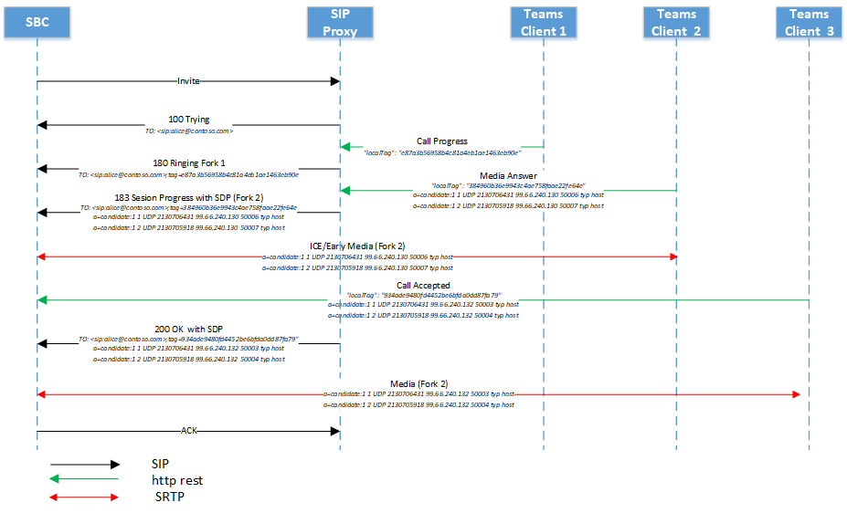

# <a name="direct-routing---sip-protocol"></a>Enrutamiento directo: protocolo SIP

En este artículo se describe cómo el enrutamiento directo implementa el protocolo de inicio de sesión (SIP). Para enrutar correctamente el tráfico entre un controlador de borde de sesión (SBC) y el proxy SIP, algunos parámetros SIP deben tener valores específicos. Este artículo está dirigido a los administradores de voz responsables de configurar la conexión entre el SBC local y el servicio de proxy SIP.

## <a name="processing-the-incoming-request-finding-the-tenant-and-user"></a>Procesando la solicitud entrante: buscar el inquilino y el usuario

En una llamada entrante, el proxy SIP necesita encontrar el inquilino al que está destinada la llamada y buscar el usuario específico dentro de este inquilino. El administrador de inquilinos puede configurar números no realizado, por ejemplo + 1001, en varios inquilinos. Por lo tanto, es importante encontrar el inquilino específico en el que se va a realizar la búsqueda de números, ya que los números no recuperados podrían ser los mismos en varios inquilinos de Office 365.  

En esta sección se describe cómo el proxy SIP busca el inquilino y el usuario, y realiza la autenticación de SBC en la conexión entrante.

El siguiente es un ejemplo del mensaje SIP invite en una llamada entrante:

| Nombre de parámetro | Ejemplo del valor | 
| :---------------------  |:---------------------- |
| URI de solicitud | INVITAr sip:+18338006777@sip.pstnhub.microsoft.com SIP/2,0 |
| Encabezado de Via | Via: SIP/2.0/TLS sbc1. adatum. BIZ: 5058; alias; Branch = z9hG4bKac2121518978 | 
| Encabezado Max-forwards | Max-forwards: 68 |
| Desde encabezado | De encabezado de: <SIP: 7168712781@sbc1. adatum. BIZ; transporte = UDP; Tag = 1c747237679 |
| A encabezado | Para: sip:+183338006777@sbc1.adatum.biz | 
| Encabezado de CSeq | CSeq: 1 INVITAr | 
| Encabezado de contacto | Contacto: <SIP: 68712781@sbc1. adatum. BIZ; Transport = TLS> | 

Al recibir la invitación, el proxy SIP realiza los pasos siguientes:

1. Compruebe el certificado. En la conexión inicial, el servicio de enrutamiento directo toma el nombre de dominio completo presentado en el encabezado del contacto y lo hace coincidir con el nombre común o el nombre alternativo del firmante del certificado presentado. El nombre de SBC debe coincidir con una de las siguientes opciones:

   - Opción 1. El nombre de FQDN completo que se presenta en el encabezado del contacto debe coincidir con el nombre común/nombre alternativo del firmante del certificado presentado.  

   - Opción 2. La parte de dominio del nombre de FQDN presentado en el encabezado de contacto (por ejemplo, adatum.biz del nombre de FQDN sbc1.adatum.biz) debe coincidir con el valor de comodín de nombre común/nombre alternativo de asunto (por ejemplo *. adatum.biz).

2. Intenta encontrar un inquilino con el nombre FQDN completo presentado en el encabezado de contacto.  

   Compruebe si el nombre de dominio completo del encabezado del contacto (sbc1.adatum.biz) está registrado como un nombre DNS en cualquier inquilino de Office 365. Si se encuentra, la búsqueda del usuario se realiza en el inquilino que tiene el FQDN de SBC registrado como un nombre de dominio. Si no se encuentra, se aplica el paso 3.   

3. El paso 3 solo se aplica si falló el paso 2. 

   Quite la parte del host del FQDN, presentada en el encabezado del contacto (FQDN: sbc12.adatum.biz, después de quitar la parte del host: adatum.biz) y compruebe si este nombre está registrado como un nombre DNS en cualquier inquilino de Office 365. Si se encuentra, la búsqueda del usuario se realiza en este inquilino. Si no se encuentra, se produce un error en la llamada.

4. Con el número de teléfono presentado en el URI de solicitud, realice la búsqueda de números invertidas en el inquilino que se encuentra en el paso 2 ó 3. Hacer coincidir el número de teléfono presentado con el URI del SIP del usuario dentro del inquilino que se encuentra en el paso anterior.

5. Aplicar configuración de troncal. Busque los parámetros establecidos por el administrador de inquilinos para este SBC.

   Microsoft no admite el uso de un proxy SIP de terceros o de un servidor de agente de usuario entre el proxy SIP de Microsoft y el SBC emparejado, lo que puede modificar el URI de solicitud creado por el SBC emparejado.

   Los requisitos para las dos búsquedas (pasos 2 y 3) necesarios para el escenario en el que un SBC está interconectado con muchos espacios empresariales (escenario de operador) se tratan más adelante en este artículo.

### <a name="detailed-requirements-for-contact-header-and-request-uri"></a>Requisitos detallados para el encabezado de contacto y solicitud: URI

#### <a name="contact-header"></a>Encabezado de contacto

Para todas las llamadas entrantes al proxy SIP de Microsoft, el encabezado del contacto debe tener el FQDN emparejado de SBC en el nombre de host del URI de la siguiente manera:

Sintaxis: contacto: <SIP: address@FQDN telefónica o SIP de la SBC; Transport = TLS> 

Este nombre debe estar también en el nombre común o en el campo (s) de nombre alternativo de asunto del certificado presentado. Microsoft admite el uso de valores comodín de los nombres en los campos Nombre común o nombre alternativo del asunto del certificado.   

La compatibilidad con los caracteres comodín se describe en el [documento RFC 2818, sección 3,1](https://tools.ietf.org/html/rfc2818#section-3.1). Específicas

*"Los nombres pueden contener el carácter \* comodín, que se considera que coincide con cualquier componente del nombre de dominio o fragmento de componente. Por ejemplo, \*. a.com coincide con foo.a.com pero no bar.foo.a.com. f\*. com coincide con foo.com, pero no con bar.com. "*

Si el SBC envía más de un valor en el encabezado del contacto en un mensaje SIP, solo se usa la parte FQDN del primer valor del encabezado de contacto.

#### <a name="request-uri"></a>URI de solicitud 

Para todas las llamadas entrantes, el URI de solicitud se usa para hacer coincidir el número de teléfono con un usuario.   

Por el momento, el número de teléfono debe contener un signo más (+), tal como se muestra en el siguiente ejemplo. 

```
INVITE sip:+18338006777@sip.pstnhub.microsoft.com SIP /2.0
```

## <a name="contact-and-record-route-headers-considerations"></a>Consideraciones de los encabezados de contacto y de ruta de grabación

El proxy SIP necesita calcular el FQDN del próximo salto para las nuevas transacciones de cliente en el cuadro de diálogo (por ejemplo, bye o volver a invitar), y al responder a opciones de SIP. Se usa contacto o registro-ruta. 

Según RFC 3261, se requiere un encabezado de contacto en cualquier solicitud que pueda dar lugar a un nuevo cuadro de diálogo. La ruta record-Route solo es necesaria si un proxy desea permanecer en la ruta de acceso de futuras solicitudes en un cuadro de diálogo. 

Microsoft recomienda usar solo el encabezado de contacto por los siguientes motivos:

- Por RFC 3261, se usa la ruta de grabación si un proxy desea permanecer en la ruta de acceso de solicitudes futuras en un cuadro de diálogo, lo cual no es esencial, ya que todo el tráfico pasa entre el proxy SIP de Microsoft y el SBC emparejado. No es necesario un servidor proxy intermedio entre el SBC y el proxy SIP de Microsoft.

- El proxy SIP de Microsoft solo usa el encabezado de contacto (no record-Route) para determinar el próximo salto al enviar opciones de ping salientes. La configuración de un solo parámetro (contacto) en lugar de dos (contacto y grabación-ruta) simplifica la administración.

Para calcular el siguiente salto, el proxy SIP usa:

- Prioridad 1. Registro de nivel superior: ruta. Si la ruta de registro de nivel superior contiene el nombre de dominio completo o la dirección IP, se usa el nombre de dominio o la dirección IP para realizar la conexión entrante en el cuadro de diálogo.

- Prioridad 2. Encabezado de contacto. Si no existe una ruta de registro, el proxy SIP buscará el valor del encabezado de contacto para establecer la conexión saliente. (Esta es la configuración recomendada).

Si se usa tanto contacto como record-Route, el administrador de SBC debe mantener sus valores idénticos, lo que provoca una sobrecarga administrativa. 

### <a name="use-of-fqdn-name-in-contact-or-record-route"></a>Uso de nombre de dominio completo en contacto o registro-ruta

No se admite el uso de una dirección IP en record-Route o contact. La única opción admitida es un FQDN, que debe coincidir con el nombre común o el nombre de sujeto alternativo del certificado de SBC (se admiten valores comodín en el certificado).

- Si se presenta una dirección IP en registro-ruta o contacto, se produce un error en la comprobación del certificado y se produce un error en la llamada.

- Si el FQDN no coincide con el valor del nombre común o del asunto alternativo del certificado presentado, se produce un error en la llamada. 

## <a name="inbound-call-sip-dialog-description"></a>Descripción del cuadro de diálogo SIP llamada entrante:

En la siguiente tabla se resumen las diferencias entre los modos no de omisión y omisión del flujo de llamadas:

| Nombre de parámetro | Modo de no omisión | Modo de omisión
| :---------------------  |:---------------------- |:----------------|
| Candidatos multimedia en 183 y 200 de los mensajes de | Procesadores de medios | Clientes | 
| Número de mensajes de 183 que puede recibir el SBC | Una por sesión | Multiple | 
| La llamada puede tener una respuesta provisional (183) | Sí | Sí |
| La llamada puede ser sin respuesta provisional (183) | Sí | Sí |

###  <a name="non-media-bypass-flow"></a>Flujo de derivación de medios no multimedia

Un usuario de Teams puede tener varios puntos de conexión al mismo tiempo. Por ejemplo, Teams para el cliente de Windows, Teams para el cliente de iPhone y Teams Phone (Teams Android Client). Cada extremo puede indicar un HTTP REST de la siguiente manera:

-   Progreso de la llamada: convertido por el proxy SIP al mensaje SIP 180. Al recibir el mensaje 180, la SBC debe generar timbre local.

-   Respuesta de medios: el proxy SIP lo convierte en el mensaje 183 con candidatos multimedia en el protocolo de descripción de sesión (SDP). Al recibir el mensaje 183, SBC espera que se conecte a los candidatos de medios recibidos en el mensaje SDP. Tenga en cuenta que, en algunos casos, es posible que no se genere la respuesta multimedia y que el punto final pueda responder con el mensaje "llamada aceptada".

-   Llamada aceptada: la convierte el proxy SIP al mensaje SIP 200 con SDP. Al recibir el mensaje 200, se espera que la SBC envíe y reciba medios a los candidatos SDP proporcionados.

#### <a name="multiple-endpoints-ringing-with-provisional-answer"></a>Varios puntos de conexión están sonando con una respuesta provisional

1.  Al recibir la primera invitación de SBC, el proxy SIP envía el mensaje "SIP SIP/2.0 100 probando" y notifica a todos los puntos de conexión del usuario final acerca de la llamada entrante. 

2.  Una vez notificada, cada punto de conexión iniciará el timbre y enviará mensajes "progreso de la llamada" al proxy SIP. Dado que un usuario de un equipo puede tener varios puntos finales, es posible que el proxy SIP reciba varios mensajes de progreso de llamadas.

3.  Para cada mensaje de progreso de la llamada recibido de los clientes, el proxy SIP convierte el mensaje de progreso de la llamada en el mensaje SIP ("SIP SIP/2.0 180 probando"). El intervalo de envío de esos mensajes se define por el intervalo de los mensajes de recepción del controlador de llamadas. En el siguiente diagrama, hay 2 180 mensajes generados por el proxy SIP. Estos mensajes provienen de los dos puntos de conexión de los equipos del usuario. Cada uno de los clientes tiene un identificador de etiqueta único.  Cada mensaje procedente de un extremo diferente será una sesión independiente (el parámetro "etiqueta" del campo "para" será diferente). Pero un extremo podría no generar el mensaje 180 y enviar el mensaje 183 inmediatamente, tal y como se muestra en el siguiente diagrama.

4.  Una vez que un extremo genera un mensaje de respuesta multimedia con las direcciones IP de los candidatos de medios del punto final, el proxy SIP convierte el mensaje recibido en un mensaje "progreso de sesión 183 de SIP" con SDP del cliente reemplazado por SDP del procesador multimedia. En el siguiente diagrama, el punto final de la horquilla 2 respondió a la llamada. Si el tronco no se pasa por alto, el mensaje SIP 183 se genera solo una vez (ya sea bot o punto final del cliente). El 183 puede venir en una bifurcación existente o iniciar una nueva.

5.  Se envía un mensaje de aceptación de llamada con los candidatos finales del punto de conexión que aceptó la llamada. El mensaje de aceptación de llamada se convierte en el mensaje SIP 200. 


#### <a name="multiple-endpoints-ringing-without-provisional-answer"></a>Varios puntos de conexión sonando sin respuesta provisional

1.  Al recibir la primera invitación de SBC, el proxy SIP envía el mensaje "SIP SIP/2.0 100 probando" y notifica a todos los puntos de conexión del usuario final acerca de la llamada entrante. 

2.  Después de la notificación, cada punto de conexión comenzará a sonar y enviará el mensaje "progreso de la llamada" al proxy SIP. Dado que un usuario de un equipo puede tener varios puntos finales, es posible que el proxy SIP reciba varios mensajes de progreso de llamadas.

3.  Para cada mensaje de progreso de la llamada recibido de los clientes, el proxy SIP convierte el mensaje de progreso de la llamada en el mensaje SIP ("SIP SIP/2.0 180 probando").  El intervalo de recepción de mensajes del controlador de llamadas define el intervalo de envío de los mensajes. En la imagen siguiente, hay 2 180 mensajes generados por el proxy SIP, lo que significa que el usuario ha iniciado sesión en tres equipos clientes y cada cliente envía el progreso de la llamada. Cada mensaje será una sesión independiente (el parámetro "etiqueta" del campo "para" es diferente).

4.  Se envía un mensaje de aceptación de llamada con los candidatos finales del punto de conexión que aceptó la llamada. El mensaje de aceptación de llamada se convierte en el mensaje SIP 200. 


### <a name="media-bypass-flow"></a>Flujo de omisión de medios

Los mismos mensajes (100 probando, 180, 183) se usan en el escenario de omisión de medios. 

El esquema siguiente muestra un ejemplo del flujo de llamadas de omisión. Tenga en cuenta que los candidatos para multimedia pueden provenir de diferentes puntos de conexión. 



## <a name="replaces-option"></a>Opción de reemplazos

La SBC debe admitir la invitación para reemplazar.

## <a name="size-of-sdp-considerations"></a>Tamaño de las consideraciones de SDP

Es posible que la interfaz de enrutamiento directo envíe un mensaje SIP que supere los 1.500 bytes.  El tamaño de SDP provoca principalmente esto. Sin embargo, si hay un tronco UDP detrás del SBC, es posible que rechace el mensaje si se desvía del proxy SIP de Microsoft al tronco sin modificar. Microsoft recomienda quitar algunos valores de SDP de la SBC al enviar el mensaje a los troncos UDP. Por ejemplo, los candidatos para hielo o los códecs no usados se pueden eliminar.

## <a name="call-transfer"></a>Transferencia de llamadas

El enrutamiento directo admite dos métodos para la transferencia de llamadas:

- Opción 1. Los procesos del proxy SIP hacen referencia al cliente de forma local y actúan como un árbitro, como se describe en la sección 7,1 de RFC 3892.

  Con esta opción, el proxy SIP finaliza la transferencia y agrega una nueva invitación. 


- Opción 2. El proxy SIP envía la referencia al SBC y actúa como un cedente que describe la sección 6 de RFC 5589.

  Con esta opción, el proxy SIP envía una referencia al SBC y espera que la SBC Controle por completo la transferencia.

El proxy SIP selecciona el método en función de las capacidades notificadas por SBC. Si la SBC indica que admite el método "refer", el proxy SIP usará la opción 2 para las transferencias de llamadas.

El siguiente es un ejemplo de un SBC que envía el mensaje de que el método refer es compatible:

```
ALLOW: INVITE, OPTIONS, INFO, BYE, CANCEL, ACK, PRACK, UPDATE, REFER, SUBSCRIBE, NOTIFY
```

Si el SBC no indica que se refiere como un método admitido, el enrutamiento directo usará la opción 1 (el proxy SIP actúa como árbitro). La SBC también debe indicar que admite el método Notify:

Ejemplo de SBC que indica que no se admite el método refer:

```
ALLOW: INVITE, ACK, CANCEL, BYE, INFO, NOTIFY, PRACK, UPDATE, OPTIONS
```

### <a name="sip-proxy-processes-refer-from-the-client-locally-and-acts-as-a-referee"></a>Los procesos del proxy SIP hacen referencia al cliente de forma local y actúan como un árbitro

Si el SBC indicó que el método refer no es compatible, el proxy SIP actúa como árbitro. 

La solicitud de referencia que proviene del cliente se terminará en el proxy SIP. (La solicitud de referencia del cliente se muestra como "transferencia de llamadas a David" en el siguiente diagrama.  Para obtener más información, consulte la sección 7,1 de [RFC 3892](https://www.ietf.org/rfc/rfc3892.txt). 


### <a name="sip-proxy-send-the-refer-to-the-sbc-and-acts-as-a-transferor"></a>El proxy SIP envía la referencia a SBC y actúa como un cedente

Este es el método preferido para las transferencias de llamadas, y es obligatorio para los dispositivos que buscan una certificación de omisión de medios. La transferencia de llamadas sin que la SBC pueda controlar la referencia no es compatible con el modo de omisión de medios. 

La norma se describe en la sección 6 de RFC 5589. Las RFC relacionadas son:

- [Control de llamada de protocolo de inicio de sesión (SIP): transferencia](https://tools.ietf.org/html/rfc5589)

- [Encabezado SIP (Protocolo de inicio de sesión)](https://tools.ietf.org/html/rfc3891)

- [Mecanismo de referencia del Protocolo de inicio de sesión (SIP)](https://tools.ietf.org/html/rfc3892)

Esta opción presupone que el proxy SIP actúa como un cedente y envía un mensaje de referencia a SBC. El SBC actúa como un cesionario y administra la referencia para generar una nueva oferta para la transferencia. Existen dos posibles casos:

- La llamada se transfiere a un participante externo de la RTC. 
- La llamada se transfiere desde un usuario de Teams a otro usuario de Teams en el mismo inquilino a través de SBC. 

Si la llamada se transfiere de un usuario de un equipo a otro a través de SBC, se espera que la SBC emita una nueva invitación (iniciar un nuevo cuadro de diálogo) para el destino de transferencia (el usuario de Teams) con la información recibida en el mensaje refer. 

Para rellenar los campos to/transferr para la transacción de la solicitud internamente, el proxy SIP debe transmitir esta información dentro de los encabezados REFER-TO/devuelto. 

El proxy SIP va a formar a la referencia como URI del SIP, que consta de un FQDN de proxy SIP en el nombre de host y uno de los siguientes:

- Un número de teléfono E. 164 en la parte de nombre de usuario del URI en caso de que el destino de la transferencia sea un número de teléfono, o bien

- parámetros x-m y x-t codificar el identificador de inquilino y el resonancia de destino de transferencia completa, respectivamente 

El encabezado al que se hace referencia es un URI del SIP con la resonancia de la resonancia magnética codificada, así como el identificador de inquilino del cedente y otros parámetros de contexto de transferencia, tal como se muestra en la siguiente tabla:

| Parámetro | Valor | Descripción |  
|:---------------------  |:---------------------- |:---------------------- |
| x-m | RM | Reenvío/resonancia completa completa de transferencia rellenada por CC |
| x-t | IDENTIFICADOR de inquilino | identificador de inquilino x-t opcional ID de inquilino opcional rellenado por CC |
| x-ti | Identificador de correlación del cedente | Identificador de correlación de la llamada al cedente |
| x-TT | Transferir URI de llamada de destino | URI de reemplazo de llamada codificada |

El tamaño del encabezado refer puede ser de hasta 400 símbolos en este caso. La SBC debe admitir el control de los mensajes que tengan un tamaño de hasta 400 símbolos.


## <a name="session-timer"></a>Temporizador de sesión

El proxy SIP admite (siempre ofrece) el temporizador de sesión en las llamadas sin omisión, pero no las ofrece en las llamadas de omisión. El uso del temporizador de sesión en la SBC no es obligatorio.

##  <a name="use-of-request-uri-parameter-userphone"></a>Uso del parámetro de solicitud de URI de usuario = teléfono

El proxy SIP analiza el URI de la solicitud y, si el parámetro user = Phone está presente, el servicio administrará el identificador URI de solicitud como un número de teléfono, coincidiendo el número con un usuario. Si el parámetro no está presente, el proxy SIP aplica la heurística para determinar el tipo de usuario de URI de solicitud (número de teléfono o dirección SIP).

Microsof recomienda aplicar siempre el parámetro user = Phone para simplificar el proceso de configuración de la llamada.

## <a name="history-info-header"></a>Historial: encabezado de información

El encabezado información del historial se usa para redestinar solicitudes SIP y "proporciona (s) un mecanismo estándar para capturar la información del historial de solicitudes para habilitar una amplia variedad de servicios para redes y usuarios finales". Para obtener más información, consulte la [sección 1,1 de RFC 4244](http://www.ietf.org/rfc/rfc4244.txt). Para Microsoft Phone System, este encabezado se usa en los escenarios de SimulRing y desvío de llamadas.  

Si se envía, la información del historial se habilita de la siguiente manera:

- El proxy SIP inserta un parámetro que contiene el número de teléfono asociado en entradas de información de historial individuales que contienen el encabezado info (historial) enviado a la controladora PSTN.  Si solo usa entradas que tienen el parámetro número de teléfono, el controlador PSTN volverá a crear un nuevo encabezado de información de historial y lo transmitirá al proveedor de troncal SIP a través del proxy SIP.

- Historial: el encabezado de información se agregará a casos de llamadas simultáneas y de desvío de llamadas.

- El encabezado de información no se agregará a los casos de transferencia de llamadas.

- Una entrada de historial individual en el encabezado reconstruido-info tendrá el parámetro de número de teléfono proporcionado junto con el FQDN de enrutamiento directo (sip.pstnhub.microsoft.com) establecido como la parte del identificador URI; se agregará un parámetro de ' User = Phone ' como parte del URI del SIP.  Cualquier otro parámetro asociado con el encabezado original información del historial, excepto los parámetros de contexto del teléfono, se transmitirá en el encabezado reconstruido info-info.  Tenga en cuenta que las entradas privadas (según lo determinado por los mecanismos definidos en la sección 3,3 de RFC 4244) se desviarán de la misma manera que el proveedor de tronco del SIP es un par de confianza.

- Historial entrante: se omite info.

A continuación se encuentra el formato del encabezado info-info enviado por el proxy SIP:

```
<sip:UserB@sip.pstnhub.microsoft.com?Privacy=history&Reason=SIP%3B\cause%3D486>;index=1.2,
```

Si la llamada se redirigió varias veces, la información sobre cada redirección se incluirá con el motivo correspondiente en orden cronológico.


Ejemplo de encabezado:

```
History-info: 
<sip:+14257123456@sip.pstnhub.microsoft.com;user=phone?Reason=SIP;cause=302;text=”Move Temporarily”>;index=1
<sip:+14257123457@sip.pstnhub.microsoft.com;user=phone?Reason=SIP;cause=496;text=”User Busy”>;index=1.1
```

El historial de información está protegido por un mecanismo obligatorio de TLS. 

## <a name="sbc-connection-to-direct-routing-and-failover-mechanism"></a>Conexión de SBC para enrutamiento directo y mecanismo de conmutación por error

Consulte la sección mecanismo de conmutación por error de la señalización SIP en [plan para enrutamiento directo](direct-routing-plan.md#failover-mechanism-for-sip-signaling).

## <a name="retry-after"></a>Reintentar y después

Si un centro de recursos de enrutamiento directo está ocupado, el servicio puede enviar un mensaje de reintento después de un intervalo de un segundo a la SBC. Cuando el SBC recibe un mensaje de 503 con un encabezado Retry-After en respuesta a una invitación, la SBC debe finalizar la conexión y probar el siguiente centro de información de Microsoft disponible. 

## <a name="ice-restart-media-bypass-call-transferred-to-an-endpoint-that-does-not-support-media-bypass"></a>Reinicio de hielo: llamada de omisión de medios transferida a un extremo que no admite omisión de medios

La SBC debe admitir reinicios de ICE, como se describe en [RFC 5245, sección 9.1.1.1](https://tools.ietf.org/html/rfc5245#section-9.1.1.1).

El reinicio en el enrutamiento directo se implementa de acuerdo con los siguientes párrafos de la solicitud de cambio:

*Para reiniciar ICE, el agente debe cambiar tanto el ICE-pwd, como el ICE-ufrag por la corriente de una oferta.  Ten en cuenta que es permisible usar un atributo de nivel de sesión en una oferta, pero para proporcionar el mismo Ice-pwd o ICE-ufrag como atributo de nivel de medio en una oferta posterior.  Esto no es un cambio de contraseña, tan solo un cambio en su representación y no causa un reinicio de hielo.*

*Un agente establece el resto de los campos en SDP para esta secuencia multimedia como lo haría en una oferta inicial de esta secuencia multimedia (consulte la sección 4,3).  Por lo tanto, el conjunto de candidatos puede incluir algunos, ninguno o todos los candidatos anteriores para la transmisión y puede incluir un conjunto de candidatos totalmente nuevo recogidos como se describe en el punto 4.1.1.*

Si la llamada se estableció inicialmente con omisión de medios y la llamada se transfiere a un cliente de Skype empresarial, el enrutamiento directo debe insertar un procesador de medios (esto es porque el enrutamiento directo no puede usarse con un cliente de Skype empresarial con omisión de medios). El enrutamiento directo inicia el proceso de reinicio del hielo cambiando el ICE-PWD y el hielo: ufrag y ofrece nuevos candidatos a los medios en una reinvitación. 


