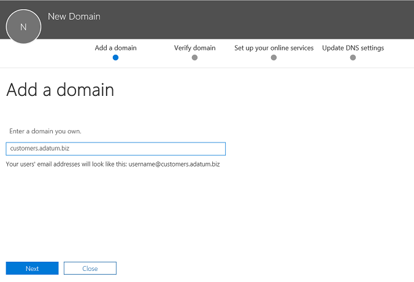
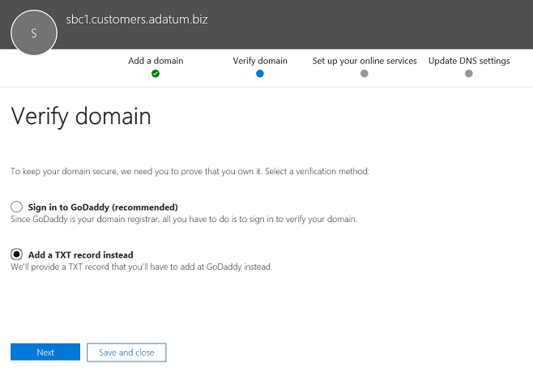

# <a name="configure-a-session-border-controller-for-multiple-tenants"></a><span data-ttu-id="b4e09-103">Configurar un controlador de borde de sesión para varios inquilinos</span><span class="sxs-lookup"><span data-stu-id="b4e09-103">Configure a Session Border Controller for multiple tenants</span></span>

<span data-ttu-id="b4e09-104">El enrutamiento directo admite la configuración de un controlador de borde de sesión (SBC) para que sirva a varios inquilinos.</span><span class="sxs-lookup"><span data-stu-id="b4e09-104">Direct Routing supports configuring one Session Border Controller (SBC) to serve multiple tenants.</span></span>

> [!NOTE]
> <span data-ttu-id="b4e09-105">Este escenario está diseñado para socios de Microsoft y/o para operadores de RTC, denominados operadores de telefonía más adelante en este documento.</span><span class="sxs-lookup"><span data-stu-id="b4e09-105">This scenario is designed for Microsoft partners and/or PSTN carriers, referred to as carriers later in this document.</span></span> <span data-ttu-id="b4e09-106">Un transportista vende servicios de telefonía que se envían a Microsoft Teams a sus clientes.</span><span class="sxs-lookup"><span data-stu-id="b4e09-106">A carrier sells telephony services delivered to Microsoft Teams to their customers.</span></span> 

<span data-ttu-id="b4e09-107">Un transportista:</span><span class="sxs-lookup"><span data-stu-id="b4e09-107">A carrier:</span></span>
- <span data-ttu-id="b4e09-108">Implementa y administra un SBC en su centro de proceso de información (los clientes no necesitan implementar un SBC y reciben servicios de telefonía del transportista en el cliente de Teams).</span><span class="sxs-lookup"><span data-stu-id="b4e09-108">Deploys and manages an SBC in their datacenter (customers do not need to implement an SBC, and they receive telephony services from the carrier in the Teams client).</span></span>
- <span data-ttu-id="b4e09-109">Conecta la SBC a varios inquilinos.</span><span class="sxs-lookup"><span data-stu-id="b4e09-109">Interconnects the SBC to multiple tenants.</span></span>
- <span data-ttu-id="b4e09-110">Proporciona servicios RTC a los clientes.</span><span class="sxs-lookup"><span data-stu-id="b4e09-110">Provides PSTN services to customers.</span></span>
- <span data-ttu-id="b4e09-111">Administra la calidad de las llamadas de un extremo a otro.</span><span class="sxs-lookup"><span data-stu-id="b4e09-111">Manages call quality end to end.</span></span>
- <span data-ttu-id="b4e09-112">Cargos por separado para los servicios RTC.</span><span class="sxs-lookup"><span data-stu-id="b4e09-112">Charges separately for PSTN services.</span></span>

<span data-ttu-id="b4e09-113">Microsoft no administra transportistas.</span><span class="sxs-lookup"><span data-stu-id="b4e09-113">Microsoft does not manage carriers.</span></span> <span data-ttu-id="b4e09-114">Microsoft ofrece un sistema PBX (Microsoft Phone System) y un cliente de equipo, certifica teléfonos y certifica SBCs, que puede usarse con el sistema telefónico de Microsoft.</span><span class="sxs-lookup"><span data-stu-id="b4e09-114">Microsoft offers a PBX (Microsoft Phone System) and a Teams client, certifies phones, and certifies SBCs that can be used with the Microsoft Phone System.</span></span> <span data-ttu-id="b4e09-115">Antes de elegir un operador, asegúrese de que su elección tiene un SBC certificado y puede administrar la calidad de voz de un extremo a otro.</span><span class="sxs-lookup"><span data-stu-id="b4e09-115">Before choosing a carrier, please ensure that your choice has a certified SBC and can manage voice quality end to end.</span></span>

<span data-ttu-id="b4e09-116">Estos son los pasos técnicos de implementación para configurar el escenario.</span><span class="sxs-lookup"><span data-stu-id="b4e09-116">The following are the technical implementation steps to configure the scenario.</span></span>

<span data-ttu-id="b4e09-117">**Solo para operadores:**</span><span class="sxs-lookup"><span data-stu-id="b4e09-117">**Carrier only:**</span></span>
1. <span data-ttu-id="b4e09-118">Implemente la SBC y configúrela para el escenario de hospedaje según las [instrucciones de los proveedores de SBC certificados](#deploy-and-configure-the-sbc).</span><span class="sxs-lookup"><span data-stu-id="b4e09-118">Deploy the SBC and configure it for the hosting scenario according to the [instructions from the certified SBC vendors](#deploy-and-configure-the-sbc).</span></span>
2. <span data-ttu-id="b4e09-119">Registre un nombre de dominio base en el inquilino del operador y solicite un certificado comodín.</span><span class="sxs-lookup"><span data-stu-id="b4e09-119">Register a base domain name in the carrier tenant and request a wildcard certificate.</span></span>
3. <span data-ttu-id="b4e09-120">Registrar un subdominio para cada cliente, que es parte del dominio base.</span><span class="sxs-lookup"><span data-stu-id="b4e09-120">Register a subdomain for every customer, which is part of the base domain.</span></span>

<span data-ttu-id="b4e09-121">**Transportista con un administrador global del cliente:**</span><span class="sxs-lookup"><span data-stu-id="b4e09-121">**Carrier with a Customer Global Administrator:**</span></span>
1. <span data-ttu-id="b4e09-122">Agregue el nombre de subdominio al inquilino del cliente.</span><span class="sxs-lookup"><span data-stu-id="b4e09-122">Add the subdomain name to the customer tenant.</span></span>
2. <span data-ttu-id="b4e09-123">Activar el nombre del subdominio.</span><span class="sxs-lookup"><span data-stu-id="b4e09-123">Activate the subdomain name.</span></span>
3. <span data-ttu-id="b4e09-124">Configure el tronco desde el transportista hasta el espacio empresarial del cliente y aprovisione usuarios.</span><span class="sxs-lookup"><span data-stu-id="b4e09-124">Configure the trunk from the carrier to the customer tenant and provision users.</span></span>

<span data-ttu-id="b4e09-125">*Asegúrese de comprender los conceptos básicos de DNS y de cómo se administra el nombre de dominio en Office 365. Revise [obtener ayuda con los dominios de Office 365](https://support.office.com/article/Get-help-with-Office-365-domains-28343f3a-dcee-41b6-9b97-5b0f4999b7ef) antes de continuar.*</span><span class="sxs-lookup"><span data-stu-id="b4e09-125">*Please make sure you understand DNS basics and how the domain name is managed in Office 365. Review [Get help with Office 365 domains](https://support.office.com/article/Get-help-with-Office-365-domains-28343f3a-dcee-41b6-9b97-5b0f4999b7ef) before proceeding further.*</span></span>

## <a name="deploy-and-configure-the-sbc"></a><span data-ttu-id="b4e09-126">Implementar y configurar la SBC</span><span class="sxs-lookup"><span data-stu-id="b4e09-126">Deploy and configure the SBC</span></span>

<span data-ttu-id="b4e09-127">Para conocer los pasos detallados sobre cómo implementar y configurar SBCs para un escenario de hospedaje de SBC, consulte la documentación del proveedor de SBC.</span><span class="sxs-lookup"><span data-stu-id="b4e09-127">For the detailed steps on how to deploy and configure SBCs for an SBC hosting scenario, please refer to the SBC vendor's documentation.</span></span>

- <span data-ttu-id="b4e09-128">**AudioCodes:** [Notas de configuración de enrutamiento directo](https://www.audiocodes.com/solutions-products/products/products-for-microsoft-365/direct-routing-for-Microsoft-Teams), la configuración del escenario de hospedaje de SBC, descrito en "conexión de SBC AudioCodes a Microsoft Teams Direct Routing modelo Hosting Model."</span><span class="sxs-lookup"><span data-stu-id="b4e09-128">**AudioCodes:** [Direct Routing Configuration notes](https://www.audiocodes.com/solutions-products/products/products-for-microsoft-365/direct-routing-for-Microsoft-Teams), the configuration of the SBC hosting scenario described in “Connecting AudioCodes SBC to Microsoft Teams Direct Routing Hosting Model Configuration Note.”</span></span> 
- <span data-ttu-id="b4e09-129">**Comunicaciones de la cinta de opciones:**  Consulte la guía de [configuración básica de Microsoft Teams](https://support.sonus.net/display/IOT/PBXs+-+SBC+5k7kSWe) en la cinta de opciones de SBC de comunicaciones para obtener información sobre cómo configurar la serie de núcleos de la cinta SBCS y a esta página [mejor práctica de la cinta: configuración de operadores para Microsoft Teams enrutamiento directo de SBC Borde](https://support.sonus.net/display/UXDOC70/Best+Practice+-+Configuring+Carriers+for+Microsoft+Teams+Direct+Routing)</span><span class="sxs-lookup"><span data-stu-id="b4e09-129">**Ribbon Communications:**  Please refer to the [Ribbon Communications SBC Core Microsoft Teams Configuration Guide](https://support.sonus.net/display/IOT/PBXs+-+SBC+5k7kSWe) for documentation on how to configure Ribbon Core Series SBCs and to this page [Ribbon Best Practice - Configuring Carriers for Microsoft Teams Direct Routing SBC Edge](https://support.sonus.net/display/UXDOC70/Best+Practice+-+Configuring+Carriers+for+Microsoft+Teams+Direct+Routing)</span></span>

> [!NOTE]
> <span data-ttu-id="b4e09-130">Preste atención a cómo configurar el encabezado "contacto".</span><span class="sxs-lookup"><span data-stu-id="b4e09-130">Please pay attention to how to configure the “Contact” header.</span></span> <span data-ttu-id="b4e09-131">El encabezado de contacto se usa para buscar el inquilino del cliente en el mensaje entrante.</span><span class="sxs-lookup"><span data-stu-id="b4e09-131">The Contact header is used to find the customer tenant on the incoming invite message.</span></span> 

## <a name="register-a-base-domain-and-subdomains"></a><span data-ttu-id="b4e09-132">Registrar un dominio base y subdominios</span><span class="sxs-lookup"><span data-stu-id="b4e09-132">Register a base domain and subdomains</span></span>

<span data-ttu-id="b4e09-133">Para el escenario de hospedaje, necesita crear:</span><span class="sxs-lookup"><span data-stu-id="b4e09-133">For the hosting scenario, you need to create:</span></span>
- <span data-ttu-id="b4e09-134">Un nombre de dominio base de la propiedad del transportista.</span><span class="sxs-lookup"><span data-stu-id="b4e09-134">One base domain name owned by the carrier.</span></span>
- <span data-ttu-id="b4e09-135">Subdominio que forma parte del nombre de dominio base de todos los inquilinos de cliente.</span><span class="sxs-lookup"><span data-stu-id="b4e09-135">A subdomain that is part of the base domain name in every customer tenant.</span></span>

<span data-ttu-id="b4e09-136">En el siguiente ejemplo:</span><span class="sxs-lookup"><span data-stu-id="b4e09-136">In the following example:</span></span>
- <span data-ttu-id="b4e09-137">Adatum es un portador que sirve a varios clientes proporcionando servicios de telefonía y de Internet.</span><span class="sxs-lookup"><span data-stu-id="b4e09-137">Adatum is a carrier that serves several customers by providing Internet and telephony services.</span></span>
- <span data-ttu-id="b4e09-138">Woodgrove Bank, contoso y Adventure Works son tres clientes que tienen los dominios de Office 365, pero reciben los servicios de telefonía de Adatum.</span><span class="sxs-lookup"><span data-stu-id="b4e09-138">Woodgrove Bank, Contoso, and Adventure Works are three customers that have Office 365 domains but receive the telephony services from Adatum.</span></span>

<span data-ttu-id="b4e09-139">Los subdominios **deben** coincidir con el nombre de FQDN del tronco que se configurará para el cliente y el FQDN en el encabezado del contacto al enviar la invitación a Office 365.</span><span class="sxs-lookup"><span data-stu-id="b4e09-139">Subdomains **MUST** match the FQDN name of the trunk that will be configured for the customer and the FQDN in the Contact header when sending the Invite to Office 365.</span></span> 

<span data-ttu-id="b4e09-140">Cuando una llamada llega a la interfaz de enrutamiento directo de Office 365, la interfaz usa el encabezado del contacto para buscar el inquilino donde se debe buscar el usuario.</span><span class="sxs-lookup"><span data-stu-id="b4e09-140">When a call arrives at the Office 365 Direct Routing interface, the interface uses the Contact header to find the tenant where the user should be looked up.</span></span> <span data-ttu-id="b4e09-141">El enrutamiento directo no usa la búsqueda de números de teléfono en la invitación, ya que es posible que algunos clientes tengan números no realizados que pueden superponerse en varios inquilinos.</span><span class="sxs-lookup"><span data-stu-id="b4e09-141">Direct Routing does not use phone number lookup on the Invite, as some customers might have non-DID numbers that can overlap in several tenants.</span></span> <span data-ttu-id="b4e09-142">Por lo tanto, el nombre de dominio completo en el encabezado del contacto es necesario para identificar el inquilino exacto para buscar al usuario por el número de teléfono.</span><span class="sxs-lookup"><span data-stu-id="b4e09-142">Therefore, the FQDN name in the Contact header is required to identify the exact tenant to look up the user by the phone number.</span></span>

<span data-ttu-id="b4e09-143">*Consulte [obtener ayuda con los dominios de office 365](https://support.office.com/article/Get-help-with-Office-365-domains-28343f3a-dcee-41b6-9b97-5b0f4999b7ef) para obtener más información sobre cómo crear nombres de dominio en inquilinos de Office 365.*</span><span class="sxs-lookup"><span data-stu-id="b4e09-143">*Please review  [Get help with Office 365 domains](https://support.office.com/article/Get-help-with-Office-365-domains-28343f3a-dcee-41b6-9b97-5b0f4999b7ef) for more information about creating domain names in Office 365 tenants.*</span></span>

<span data-ttu-id="b4e09-144">En el diagrama siguiente se resumen los requisitos para el dominio, los subdominios y el encabezado de contacto básicos.</span><span class="sxs-lookup"><span data-stu-id="b4e09-144">The following diagram summarizes the requirements to base domain, subdomains, and Contact header.</span></span>


<span data-ttu-id="b4e09-146">La SBC necesita un certificado para autenticar las conexiones.</span><span class="sxs-lookup"><span data-stu-id="b4e09-146">The SBC requires a certificate to authenticate the connections.</span></span> <span data-ttu-id="b4e09-147">Para el escenario de hospedaje de SBC, el proveedor debe solicitar un certificado con San \* \*. base_domain (por ejemplo \*, customers.adatum.BIZ)\*.</span><span class="sxs-lookup"><span data-stu-id="b4e09-147">For the SBC hosting scenario, the carrier needs to request a certificate with SAN *\*.base_domain (for example, \*customers.adatum.biz)*.</span></span> <span data-ttu-id="b4e09-148">Este certificado se puede usar para autenticar conexiones a varios inquilinos servidos desde un único SBC.</span><span class="sxs-lookup"><span data-stu-id="b4e09-148">This certificate can be used to authenticate connections to multiple tenants served from a single SBC.</span></span>

<span data-ttu-id="b4e09-149">La siguiente tabla es un ejemplo de una configuración.</span><span class="sxs-lookup"><span data-stu-id="b4e09-149">The following table is an example of one configuration.</span></span>


|<span data-ttu-id="b4e09-150">Nuevo nombre de dominio</span><span class="sxs-lookup"><span data-stu-id="b4e09-150">New domain name</span></span> |<span data-ttu-id="b4e09-151">Tipo</span><span class="sxs-lookup"><span data-stu-id="b4e09-151">Type</span></span>|<span data-ttu-id="b4e09-152">Registra</span><span class="sxs-lookup"><span data-stu-id="b4e09-152">Registered</span></span>  |<span data-ttu-id="b4e09-153">SAN de certificado para SBC</span><span class="sxs-lookup"><span data-stu-id="b4e09-153">Certificate SAN for SBC</span></span>  |<span data-ttu-id="b4e09-154">Dominio predeterminado del inquilino en el ejemplo</span><span class="sxs-lookup"><span data-stu-id="b4e09-154">Tenant default domain in the example</span></span>  |<span data-ttu-id="b4e09-155">Nombre FQDN que SBC debe presentar en el encabezado del contacto al enviar llamadas a los usuarios</span><span class="sxs-lookup"><span data-stu-id="b4e09-155">FQDN name that SBC must present in the Contact header when sending calls to users</span></span>|
|---------|---------|---------|---------|---------|---------|
|<span data-ttu-id="b4e09-156">customers.adatum.biz</span><span class="sxs-lookup"><span data-stu-id="b4e09-156">customers.adatum.biz</span></span>|    <span data-ttu-id="b4e09-157">Básica</span><span class="sxs-lookup"><span data-stu-id="b4e09-157">Base</span></span>     |     <span data-ttu-id="b4e09-158">En el inquilino del operador</span><span class="sxs-lookup"><span data-stu-id="b4e09-158">In carrier tenant</span></span>  |    <span data-ttu-id="b4e09-159">\*. customers.adatum.biz</span><span class="sxs-lookup"><span data-stu-id="b4e09-159">\*.customers.adatum.biz</span></span>  |   <span data-ttu-id="b4e09-160">adatum.biz</span><span class="sxs-lookup"><span data-stu-id="b4e09-160">adatum.biz</span></span>      |<span data-ttu-id="b4e09-161">NA, este es un inquilino de servicio, sin usuarios</span><span class="sxs-lookup"><span data-stu-id="b4e09-161">NA, this is a service tenant, no users</span></span> |
|<span data-ttu-id="b4e09-162">sbc1.customers.adatum.biz</span><span class="sxs-lookup"><span data-stu-id="b4e09-162">sbc1.customers.adatum.biz</span></span>|    <span data-ttu-id="b4e09-163">Subdominio</span><span class="sxs-lookup"><span data-stu-id="b4e09-163">Subdomain</span></span>  |    <span data-ttu-id="b4e09-164">En un espacio empresarial de cliente</span><span class="sxs-lookup"><span data-stu-id="b4e09-164">In a customer tenant</span></span>  |    <span data-ttu-id="b4e09-165">\*. customers.adatum.biz</span><span class="sxs-lookup"><span data-stu-id="b4e09-165">\*.customers.adatum.biz</span></span>  | <span data-ttu-id="b4e09-166">woodgrovebank.us</span><span class="sxs-lookup"><span data-stu-id="b4e09-166">woodgrovebank.us</span></span>  |  <span data-ttu-id="b4e09-167">sbc1.customers.adatum.biz</span><span class="sxs-lookup"><span data-stu-id="b4e09-167">sbc1.customers.adatum.biz</span></span>|
|<span data-ttu-id="b4e09-168">sbc2.customers.adatum.biz</span><span class="sxs-lookup"><span data-stu-id="b4e09-168">sbc2.customers.adatum.biz</span></span>  |   <span data-ttu-id="b4e09-169">Subdominio</span><span class="sxs-lookup"><span data-stu-id="b4e09-169">Subdomain</span></span> | <span data-ttu-id="b4e09-170">En un espacio empresarial de cliente</span><span class="sxs-lookup"><span data-stu-id="b4e09-170">In a customer tenant</span></span>   |   <span data-ttu-id="b4e09-171">\*. customers.adatum.biz</span><span class="sxs-lookup"><span data-stu-id="b4e09-171">\*.customers.adatum.biz</span></span>   |<span data-ttu-id="b4e09-172">contoso.com</span><span class="sxs-lookup"><span data-stu-id="b4e09-172">contoso.com</span></span>   |<span data-ttu-id="b4e09-173">sbc2.customers.adatum.biz</span><span class="sxs-lookup"><span data-stu-id="b4e09-173">sbc2.customers.adatum.biz</span></span> |
|<span data-ttu-id="b4e09-174">sbc3.customers.adatum.biz</span><span class="sxs-lookup"><span data-stu-id="b4e09-174">sbc3.customers.adatum.biz</span></span> |   <span data-ttu-id="b4e09-175">Subdominio</span><span class="sxs-lookup"><span data-stu-id="b4e09-175">Subdomain</span></span> | <span data-ttu-id="b4e09-176">En un espacio empresarial de cliente</span><span class="sxs-lookup"><span data-stu-id="b4e09-176">In a customer tenant</span></span> |   <span data-ttu-id="b4e09-177">\*. customers.adatum.biz</span><span class="sxs-lookup"><span data-stu-id="b4e09-177">\*.customers.adatum.biz</span></span>  |  <span data-ttu-id="b4e09-178">adventureworks.com</span><span class="sxs-lookup"><span data-stu-id="b4e09-178">adventureworks.com</span></span> | <span data-ttu-id="b4e09-179">sbc3.customers.adatum.biz</span><span class="sxs-lookup"><span data-stu-id="b4e09-179">sbc3.customers.adatum.biz</span></span> |
||         |         |         |         |         |

<span data-ttu-id="b4e09-180">Para configurar la base y los subdominios, siga los pasos que se describen a continuación.</span><span class="sxs-lookup"><span data-stu-id="b4e09-180">To configure the base and subdomains, please follow the steps described below.</span></span> <span data-ttu-id="b4e09-181">En el ejemplo, configuraremos un nombre de dominio base (customers.adatum.biz) y un subdominio para un cliente (sbc1.customers.adatum.biz en inquilino de Woodgrove Bank).</span><span class="sxs-lookup"><span data-stu-id="b4e09-181">In the example, we will configure a base domain name (customers.adatum.biz) and a subdomain for one customer (sbc1.customers.adatum.biz in Woodgrove Bank tenant).</span></span>

## <a name="register-a-base-domain-name-in-the-carrier-tenant"></a><span data-ttu-id="b4e09-182">Registrar un nombre de dominio base en el inquilino de la portadora</span><span class="sxs-lookup"><span data-stu-id="b4e09-182">Register a base domain name in the carrier tenant</span></span>

<span data-ttu-id="b4e09-183">**Estas acciones se realizan en el inquilino del transportista.**</span><span class="sxs-lookup"><span data-stu-id="b4e09-183">**These actions are performed in the carrier tenant.**</span></span>

### <a name="ensure-that-you-have-appropriate-rights-in-the-carrier-tenant"></a><span data-ttu-id="b4e09-184">Asegurarse de que tiene los derechos adecuados en el inquilino del transportista</span><span class="sxs-lookup"><span data-stu-id="b4e09-184">Ensure that you have appropriate rights in the carrier tenant</span></span>

<span data-ttu-id="b4e09-185">Solo puede agregar dominios nuevos si inició sesión en el centro de administración de Microsoft 365 como administrador global.</span><span class="sxs-lookup"><span data-stu-id="b4e09-185">You can only add new domains if you signed in to the Microsoft 365 admin center as a Global Administrator.</span></span> 

<span data-ttu-id="b4e09-186">Para validar el rol que tiene, inicie sesión en el centro de administración de Microsoft 365https://portal.office.com)(, vaya \*\*\*\* > a usuarios**activos**y, a continuación, compruebe que tiene un rol de administrador global.</span><span class="sxs-lookup"><span data-stu-id="b4e09-186">To validate the role you have, please sign in to the Microsoft 365 admin center (https://portal.office.com), go to **Users** > **Active Users**, and then verify that you have a Global Administrator role.</span></span> 

<span data-ttu-id="b4e09-187">Para obtener más información acerca de los roles de administrador y cómo asignar un rol en Office 365, consulte [acerca de los roles de administrador de office 365](https://support.office.com/article/About-Office-365-admin-roles-da585eea-f576-4f55-a1e0-87090b6aaa9d).</span><span class="sxs-lookup"><span data-stu-id="b4e09-187">For more information about admin roles and how to assign a role in Office 365, see [About Office 365 admin roles](https://support.office.com/article/About-Office-365-admin-roles-da585eea-f576-4f55-a1e0-87090b6aaa9d).</span></span>

### <a name="add-a-base-domain-to-the-tenant-and-verify-it"></a><span data-ttu-id="b4e09-188">Agregar un dominio base al inquilino y comprobarlo</span><span class="sxs-lookup"><span data-stu-id="b4e09-188">Add a base domain to the tenant and verify it</span></span>

1.  <span data-ttu-id="b4e09-189">En el centro de administración de Microsoft 365, vaya a**dominios** > de **configuración** > **Agregar dominio**.</span><span class="sxs-lookup"><span data-stu-id="b4e09-189">In the Microsoft 365 admin center, go to **Setup** > **Domains** > **Add domain**.</span></span>
2.  <span data-ttu-id="b4e09-190">En el cuadro **Escriba un dominio** , escriba el FQDN del dominio base.</span><span class="sxs-lookup"><span data-stu-id="b4e09-190">In the **Enter a domain you own** box, type the FQDN of the base domain.</span></span> <span data-ttu-id="b4e09-191">En el ejemplo siguiente, el dominio base es *customers.adatum.BIZ*.</span><span class="sxs-lookup"><span data-stu-id="b4e09-191">In the following example, the base domain is *customers.adatum.biz*.</span></span>

    

3. <span data-ttu-id="b4e09-193">Haga clic en **Siguiente**.</span><span class="sxs-lookup"><span data-stu-id="b4e09-193">Click **Next**.</span></span>
4. <span data-ttu-id="b4e09-194">En el ejemplo, el inquilino ya tiene adatum.biz como un nombre de dominio verificado.</span><span class="sxs-lookup"><span data-stu-id="b4e09-194">In the example, the tenant already has adatum.biz as a verified domain name.</span></span> <span data-ttu-id="b4e09-195">El asistente no pedirá una verificación adicional porque customers.adatum.biz es un subdominio para el nombre que ya está registrado.</span><span class="sxs-lookup"><span data-stu-id="b4e09-195">The wizard will not ask for additional verification because customers.adatum.biz is a subdomain for the already registered name.</span></span> <span data-ttu-id="b4e09-196">Sin embargo, si agrega un FQDN que no se ha verificado antes, tendrá que pasar por el proceso de verificación.</span><span class="sxs-lookup"><span data-stu-id="b4e09-196">However, if you add an FQDN that has not been verified before, you will need to go through the process of verification.</span></span> <span data-ttu-id="b4e09-197">El proceso de verificación se [describe a continuación](#add-a-subdomain-to-the-customer-tenant-and-verify-it).</span><span class="sxs-lookup"><span data-stu-id="b4e09-197">The process of verification is [described below](#add-a-subdomain-to-the-customer-tenant-and-verify-it).</span></span>

    

5.  <span data-ttu-id="b4e09-199">Haga clic en **siguiente**y, en la página **Actualizar configuración DNS** , seleccione **agregaré los registros DNS** y haga clic en **siguiente**.</span><span class="sxs-lookup"><span data-stu-id="b4e09-199">Click **Next**, and on the **Update DNS Settings** page, select **I’ll add the DNS records myself** and click **Next**.</span></span>
6.  <span data-ttu-id="b4e09-200">En la página siguiente, borre todos los valores (a menos que desee usar el nombre de dominio para Exchange, SharePoint o Teams/Skype empresarial), haga clic en **siguiente**y, a continuación, haga clic en **Finalizar**.</span><span class="sxs-lookup"><span data-stu-id="b4e09-200">On the next page, clear all values (unless you want to use the domain name for Exchange, SharePoint, or Teams/Skype for Business), click **Next**, and then click **Finish**.</span></span> <span data-ttu-id="b4e09-201">Asegúrese de que el nuevo dominio se encuentra en el estado de instalación completada.</span><span class="sxs-lookup"><span data-stu-id="b4e09-201">Make sure your new domain is in the Setup complete status.</span></span>

    

### <a name="activate-the-domain-name"></a><span data-ttu-id="b4e09-203">Activar el nombre de dominio</span><span class="sxs-lookup"><span data-stu-id="b4e09-203">Activate the domain name</span></span>

<span data-ttu-id="b4e09-204">Después de haber registrado un nombre de dominio, debe activarlo agregando al menos un usuario con licencia de E1, E3 o E5 y asignando una dirección SIP a la parte FQDN de la dirección SIP que coincide con el dominio base creado.</span><span class="sxs-lookup"><span data-stu-id="b4e09-204">After you have registered a domain name, you need to activate it by adding at least one E1, E3, or E5 licensed user and assigning a SIP address with the FQDN portion of the SIP address matching the created base domain.</span></span> 

<span data-ttu-id="b4e09-205">*Para obtener más información sobre cómo agregar usuarios en Office 365 inquilinos, consulte [obtener ayuda con los dominios de office 365](https://support.office.com/article/Get-help-with-Office-365-domains-28343f3a-dcee-41b6-9b97-5b0f4999b7ef) .*</span><span class="sxs-lookup"><span data-stu-id="b4e09-205">*Please review [Get help with Office 365 domains](https://support.office.com/article/Get-help-with-Office-365-domains-28343f3a-dcee-41b6-9b97-5b0f4999b7ef) for more information about adding users in Office 365 tenants.*</span></span>

<span data-ttu-id="b4e09-206">Por ejemplo: test@customers.adatum.biz</span><span class="sxs-lookup"><span data-stu-id="b4e09-206">For example: test@customers.adatum.biz</span></span>


## <a name="register-a-subdomain-name-in-a-customer-tenant"></a><span data-ttu-id="b4e09-208">Registrar un nombre de subdominio en un espacio empresarial de cliente</span><span class="sxs-lookup"><span data-stu-id="b4e09-208">Register a subdomain name in a customer tenant</span></span>

<span data-ttu-id="b4e09-209">Tendrá que crear un nombre de subdominio único para cada cliente.</span><span class="sxs-lookup"><span data-stu-id="b4e09-209">You will need to create a unique subdomain name for every customer.</span></span> <span data-ttu-id="b4e09-210">En este ejemplo, crearemos un subdominio sbc1.customers.adatum.biz en un inquilino con el nombre de dominio predeterminado woodgrovebank.us.</span><span class="sxs-lookup"><span data-stu-id="b4e09-210">In this example, we will create a subdomain sbc1.customers.adatum.biz in a tenant with the default domain name woodgrovebank.us.</span></span>

<span data-ttu-id="b4e09-211">**Todas las acciones siguientes se encuentran en el inquilino del cliente.**</span><span class="sxs-lookup"><span data-stu-id="b4e09-211">**All actions below are in the customer tenant.**</span></span>

### <a name="ensure-that-you-have-appropriate-rights-in-the-customer-tenant"></a><span data-ttu-id="b4e09-212">Asegurarse de que tiene los derechos adecuados en el inquilino del cliente</span><span class="sxs-lookup"><span data-stu-id="b4e09-212">Ensure that you have appropriate rights in the customer tenant</span></span>

<span data-ttu-id="b4e09-213">Solo puede agregar dominios nuevos si inició sesión en el centro de administración de Microsoft 365 como administrador global.</span><span class="sxs-lookup"><span data-stu-id="b4e09-213">You can only add new domains if you signed in to the Microsoft 365 admin center as a Global Administrator.</span></span> 

<span data-ttu-id="b4e09-214">Para validar el rol que tiene, inicie sesión en el centro de administración de Microsoft 365https://portal.office.com)(, vaya \*\*\*\* > a usuarios**activos**y, a continuación, compruebe que tiene un rol de administrador global.</span><span class="sxs-lookup"><span data-stu-id="b4e09-214">To validate the role you have, please sign in to the Microsoft 365 admin center (https://portal.office.com), go to **Users** > **Active Users**, and then verify that you have a Global Administrator role.</span></span> 

<span data-ttu-id="b4e09-215">Para obtener más información acerca de los roles de administrador y cómo asignar un rol en Office 365, consulte [acerca de los roles de administrador de office 365](https://support.office.com/article/About-Office-365-admin-roles-da585eea-f576-4f55-a1e0-87090b6aaa9d).</span><span class="sxs-lookup"><span data-stu-id="b4e09-215">For more information about admin roles and how to assign a role in Office 365, see [About Office 365 admin roles](https://support.office.com/article/About-Office-365-admin-roles-da585eea-f576-4f55-a1e0-87090b6aaa9d).</span></span>

### <a name="add-a-subdomain-to-the-customer-tenant-and-verify-it"></a><span data-ttu-id="b4e09-216">Agregar un subdominio al inquilino del cliente y comprobarlo</span><span class="sxs-lookup"><span data-stu-id="b4e09-216">Add a subdomain to the customer tenant and verify it</span></span>
1. <span data-ttu-id="b4e09-217">En el centro de administración de Microsoft 365, vaya a**dominios** > de **configuración** > **Agregar dominio**.</span><span class="sxs-lookup"><span data-stu-id="b4e09-217">In the Microsoft 365 admin center, go to **Setup** > **Domains** > **Add domain**.</span></span>
2. <span data-ttu-id="b4e09-218">En el cuadro **Escriba un dominio** , escriba el FQDN del subdominio para este inquilino.</span><span class="sxs-lookup"><span data-stu-id="b4e09-218">In the **Enter a domain you own** box, type the FQDN of the subdomain for this tenant.</span></span> <span data-ttu-id="b4e09-219">En el ejemplo siguiente, el subdominio es sbc1.customers.adatum.biz.</span><span class="sxs-lookup"><span data-stu-id="b4e09-219">In the example below, the subdomain is sbc1.customers.adatum.biz.</span></span>

    

3. <span data-ttu-id="b4e09-221">Haga clic en **Siguiente**.</span><span class="sxs-lookup"><span data-stu-id="b4e09-221">Click **Next**.</span></span>
4. <span data-ttu-id="b4e09-222">El FQDN nunca se ha registrado en el inquilino.</span><span class="sxs-lookup"><span data-stu-id="b4e09-222">The FQDN has never been registered in the tenant.</span></span> <span data-ttu-id="b4e09-223">En el siguiente paso, tendrá que comprobar el dominio.</span><span class="sxs-lookup"><span data-stu-id="b4e09-223">In the next step, you will need to verify the domain.</span></span> <span data-ttu-id="b4e09-224">**En su lugar, seleccione Agregar un registro TXT**.</span><span class="sxs-lookup"><span data-stu-id="b4e09-224">Select **Add a TXT record instead**.</span></span> 

    

5. <span data-ttu-id="b4e09-226">Haga clic en **siguiente**y anote el valor txt generado para comprobar el nombre de dominio.</span><span class="sxs-lookup"><span data-stu-id="b4e09-226">Click **Next**, and note the TXT value generated to verify the domain name.</span></span>

    

6. <span data-ttu-id="b4e09-228">Cree el registro TXT con el valor del paso anterior en el proveedor de hospedaje DNS del operador.</span><span class="sxs-lookup"><span data-stu-id="b4e09-228">Create the TXT record with the value from the previous step in carrier’s DNS hosting provider.</span></span>

    

    <span data-ttu-id="b4e09-230">Para obtener más información, consulte [crear registros DNS en cualquier proveedor de hospedaje DNS para Office 365](https://support.office.com/article/create-dns-records-at-any-dns-hosting-provider-for-office-365-7b7b075d-79f9-4e37-8a9e-fb60c1d95166).</span><span class="sxs-lookup"><span data-stu-id="b4e09-230">For more information, refer to [Create DNS records at any DNS hosting provider for Office 365](https://support.office.com/article/create-dns-records-at-any-dns-hosting-provider-for-office-365-7b7b075d-79f9-4e37-8a9e-fb60c1d95166).</span></span>

7. <span data-ttu-id="b4e09-231">Vuelva al centro de administración de Microsoft 365 del cliente y haga clic en **comprobar**.</span><span class="sxs-lookup"><span data-stu-id="b4e09-231">Go back to the customer's Microsoft 365 admin center and click **Verify**.</span></span> 
8. <span data-ttu-id="b4e09-232">En la página siguiente, seleccione **voy a agregar los registros DNS** y haga clic en **siguiente**.</span><span class="sxs-lookup"><span data-stu-id="b4e09-232">On the next page, select **I’ll add the DNS records myself** and click **Next**.</span></span>

    

9. <span data-ttu-id="b4e09-234">En la página **elegir los servicios en línea** , desactive todas las opciones y haga clic en **siguiente**.</span><span class="sxs-lookup"><span data-stu-id="b4e09-234">On the **Choose your online services** page, clear all options and click **Next**.</span></span>

    

10. <span data-ttu-id="b4e09-236">Haga clic en **Finalizar** en la página **actualizar la configuración DNS** .</span><span class="sxs-lookup"><span data-stu-id="b4e09-236">Click **Finish** on the **Update DNS settings** page.</span></span>

    

11. <span data-ttu-id="b4e09-238">Asegúrese de que el estado es de **configuración completada**.</span><span class="sxs-lookup"><span data-stu-id="b4e09-238">Ensure that the status is **Setup complete**.</span></span> 
    
    

### <a name="activate-the-subdomain-name"></a><span data-ttu-id="b4e09-240">Activar el nombre del subdominio</span><span class="sxs-lookup"><span data-stu-id="b4e09-240">Activate the subdomain name</span></span>

<span data-ttu-id="b4e09-241">Después de registrar un nombre de dominio, debe activarlo agregando al menos un usuario y asignarle una dirección SIP con la parte FQDN de la dirección SIP que coincide con el subdominio creado en el inquilino del cliente.</span><span class="sxs-lookup"><span data-stu-id="b4e09-241">After you register a domain name, you need to activate it by adding at least one user and assign a SIP address with the FQDN portion of the SIP address matching the created subdomain in the customer tenant.</span></span>

<span data-ttu-id="b4e09-242">*Para obtener más información sobre cómo agregar usuarios en Office 365 inquilinos, consulte [obtener ayuda con los dominios de office 365](https://support.office.com/article/Get-help-with-Office-365-domains-28343f3a-dcee-41b6-9b97-5b0f4999b7ef) .*</span><span class="sxs-lookup"><span data-stu-id="b4e09-242">*Please review [Get help with Office 365 domains](https://support.office.com/article/Get-help-with-Office-365-domains-28343f3a-dcee-41b6-9b97-5b0f4999b7ef) for more information about adding users in Office 365 tenants.*</span></span>

<span data-ttu-id="b4e09-243">Por ejemplo: test@sbc1.customers.adatum.biz</span><span class="sxs-lookup"><span data-stu-id="b4e09-243">For example: test@sbc1.customers.adatum.biz</span></span>


### <a name="create-a-trunk-and-provision-users"></a><span data-ttu-id="b4e09-245">Crear un tronco y los usuarios de provisioning</span><span class="sxs-lookup"><span data-stu-id="b4e09-245">Create a trunk and provision users</span></span>

> [!NOTE]
> <span data-ttu-id="b4e09-246">En función de los comentarios que recibimos en el programa de adopción técnica, Microsoft podría cambiar el proceso de creación de troncos en los inquilinos de clientes para simplificar el proceso.</span><span class="sxs-lookup"><span data-stu-id="b4e09-246">Based on feedback we received in the Technical Adoption Program, Microsoft might change the process of creating trunks in the customer tenants to simplify the process.</span></span> <span data-ttu-id="b4e09-247">Vea las actualizaciones de documentación en esta página y siga los blogs de la comunidad técnica de Microsoft para obtener más información.</span><span class="sxs-lookup"><span data-stu-id="b4e09-247">Please watch the documentation updates on this page and follow the Microsoft Technical Community blogs for further information.</span></span> 

<span data-ttu-id="b4e09-248">Cree un tronco en el dominio del cliente con el comando New-CSonlinePSTNGateway.</span><span class="sxs-lookup"><span data-stu-id="b4e09-248">Create a trunk in the customer domain using the New-CSonlinePSTNGateway command.</span></span> <span data-ttu-id="b4e09-249">El FQDN del tronco **debe** coincidir con el subdominio creado para el cliente.</span><span class="sxs-lookup"><span data-stu-id="b4e09-249">The trunk FQDN **MUST** match the subdomain created for the customer.</span></span>

<span data-ttu-id="b4e09-250">Por ejemplo:</span><span class="sxs-lookup"><span data-stu-id="b4e09-250">For example:</span></span>

```
New-CSOnlinePSTNGateway –FQDN sbc1.customers.adatum.biz -SipSignallingPort 5068
```

<span data-ttu-id="b4e09-251">Al crear el tronco, es posible que reciba el siguiente mensaje de error:</span><span class="sxs-lookup"><span data-stu-id="b4e09-251">When creating the trunk, you may receive the following error message:</span></span>

```
Can not use the "sbc1.customers.adatum.biz" domain as it was not configured for this tenant.
```

<span data-ttu-id="b4e09-252">Deje que se replique un tiempo para el registro de dominios y la activación e inténtelo de nuevo.</span><span class="sxs-lookup"><span data-stu-id="b4e09-252">Please allow some time for domain registration and activation to replicate and try again.</span></span>

<span data-ttu-id="b4e09-253">Aprovisione los números de teléfono a los usuarios y configure el enrutamiento de voz.</span><span class="sxs-lookup"><span data-stu-id="b4e09-253">Provision users with the phone numbers and configure voice routing.</span></span>

<span data-ttu-id="b4e09-254">Para obtener más información sobre el nuevo-CSOnlinePSTNGateway, los usuarios de aprovisionamiento y la configuración del enrutamiento de voz, consulte [configurar el enrutamiento directo](direct-routing-configure.md).</span><span class="sxs-lookup"><span data-stu-id="b4e09-254">For more information on the New-CSOnlinePSTNGateway, provisioning users, and configuring voice routing, please refer to [Configure Direct Routing](direct-routing-configure.md).</span></span>


<span data-ttu-id="b4e09-255">Consulte las instrucciones de [proveedor de SBC](#deploy-and-configure-the-sbc) para configurar el envío del nombre de dominio completo de los subdominios en el encabezado de contacto.</span><span class="sxs-lookup"><span data-stu-id="b4e09-255">Please refer to the [SBC vendor instructions](#deploy-and-configure-the-sbc) on configuring sending the FQDN name of subdomains in the Contact header.</span></span>

