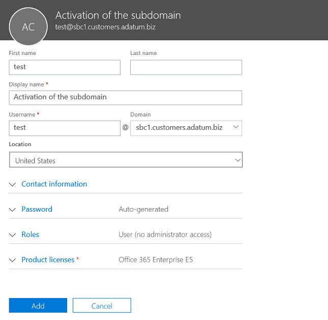

# Configurar un controlador de borde de sesión para varios inquilinosConfigure a Session Border Controller for multiple tenants

Enrutamiento directo admite la configuración de un controlador de borde de sesión (SBC) para atender a varios inquilinos.Direct Routing supports configuring one Session Border Controller (SBC) to serve multiple tenants.

> [!NOTE]
> Este escenario está diseñado para partners de Microsoft o operadores RTC, denominados operadores más adelante en este documento.This scenario is designed for Microsoft partners and/or PSTN carriers, referred to as carriers later in this document. Un operador vende servicios de telefonía entregados a Microsoft Teams a sus clientes.A carrier sells telephony services delivered to Microsoft Teams to their customers. 

Un operador:A carrier:
- Implementa y administra un SBC en su centro de datos (los clientes no necesitan implementar un SBC y reciben servicios de telefonía del operador en el Teams cliente).Deploys and manages an SBC in their datacenter (customers do not need to implement an SBC, and they receive telephony services from the carrier in the Teams client).
- Interconecta el SBC con varios inquilinos.Interconnects the SBC to multiple tenants.
- Proporciona servicios RTC a los clientes.Provides PSTN services to customers.
- Administra la calidad de la llamada de un extremo a otro.Manages call quality end to end.
- Cobra por separado los servicios RTC.Charges separately for PSTN services.

Microsoft no administra operadores.Microsoft does not manage carriers. Microsoft ofrece un PBX (Teléfono Microsoft system) y un Teams cliente.Microsoft offers a PBX (Microsoft Phone System) and a Teams client. Microsoft también certifica los teléfonos y certifica los SBC que se pueden usar con el Teléfono Microsoft sistema.Microsoft also certifies phones, and certifies SBCs that can be used with the Microsoft Phone System. Antes de elegir un operador, asegúrese de que su elección tiene un SBC certificado y puede administrar la calidad de voz de un extremo a otro.Before choosing a carrier, please ensure that your choice has a certified SBC and can manage voice quality end to end.

A continuación se indican los pasos de implementación técnica para configurar el escenario.The following are the technical implementation steps to configure the scenario.

**Solo operador:****Carrier only:**
1. Implemente el SBC y configúrelo para el escenario de hospedaje según las instrucciones de los proveedores [de SBC certificados.](#deploy-and-configure-the-sbc)Deploy the SBC and configure it for the hosting scenario according to the [instructions from the certified SBC vendors](#deploy-and-configure-the-sbc).
2. Registre un nombre de dominio base en el inquilino del operador y solicite un certificado comodín.Register a base domain name in the carrier tenant and request a wildcard certificate.
3. Registre un subdominio para cada cliente, que forma parte del dominio base.Register a subdomain for every customer, which is part of the base domain.

**Operador con un administrador global de clientes:****Carrier with a Customer Global Administrator:**
1. Agregue el nombre del subdominio al inquilino del cliente.Add the subdomain name to the customer tenant.
2. Activar el nombre del subdominio.Activate the subdomain name.
3. Configure el tronco del operador para el inquilino del cliente y aprovisione a los usuarios.Configure the trunk from the carrier to the customer tenant and provision users.

*Asegúrese de comprender los conceptos básicos de DNS y cómo se administra el nombre de dominio en Microsoft 365 o Office 365. Revisar [Obtenga ayuda con Microsoft 365 o Office 365 dominios antes](https://support.office.com/article/Get-help-with-Office-365-domains-28343f3a-dcee-41b6-9b97-5b0f4999b7ef) de continuar.**Please make sure you understand DNS basics and how the domain name is managed in Microsoft 365 or Office 365. Review [Get help with Microsoft 365 or Office 365 domains](https://support.office.com/article/Get-help-with-Office-365-domains-28343f3a-dcee-41b6-9b97-5b0f4999b7ef) before proceeding further.*

## Implementar y configurar el SBCDeploy and configure the SBC

Para obtener los pasos detallados sobre cómo implementar y configurar SBC para un escenario de hospedaje de SBC, consulte la documentación del proveedor de SBC.For the detailed steps on how to deploy and configure SBCs for an SBC hosting scenario, please refer to the SBC vendor's documentation.

- **AudioCodes: Notas** de configuración de enrutamiento directo [,](https://www.audiocodes.com/solutions-products/products/products-for-microsoft-365/direct-routing-for-Microsoft-Teams)la configuración del escenario de hospedaje de SBC descrito en "Conexión de AudioCodes SBC Microsoft Teams nota de configuración del modelo de hospedaje de enrutamiento directo".**AudioCodes:** [Direct Routing Configuration notes](https://www.audiocodes.com/solutions-products/products/products-for-microsoft-365/direct-routing-for-Microsoft-Teams), the configuration of the SBC hosting scenario described in "Connecting AudioCodes SBC to Microsoft Teams Direct Routing Hosting Model Configuration Note." 
- **Oracle: Notas** [de configuración de enrutamiento directo,](https://www.oracle.com/technetwork/indexes/documentation/acme-packet-2228107.html)la configuración del escenario de hospedaje de SBC se describe en la sección "Microsoft".**Oracle:** [Direct Routing Configuration notes](https://www.oracle.com/technetwork/indexes/documentation/acme-packet-2228107.html), the configuration of the SBC hosting scenario is described in the "Microsoft" section. 
- **Comunicaciones de la cinta de opciones:**  Consulte la Guía de configuración de [SBC Core Microsoft Teams](https://support.sonus.net/display/IOT/PBXs+-+SBC+5k7kSWe) de comunicaciones de la cinta de opciones para obtener documentación sobre cómo configurar SBC Edge de la serie Core de cinta de opciones y en esta página Procedimientos recomendados de la cinta de opciones: configuración de operadores para Microsoft Teams Enrutamiento directo [de SBC Edge](https://support.sonus.net/display/UXDOC81/Connect+SBC+Edge+to+Microsoft+Teams+Direct+Routing+to+Support+Direct+Routing+Carrier)**Ribbon Communications:**  Please refer to the [Ribbon Communications SBC Core Microsoft Teams Configuration Guide](https://support.sonus.net/display/IOT/PBXs+-+SBC+5k7kSWe) for documentation on how to configure Ribbon Core Series SBCs and to this page [Ribbon Best Practice - Configuring Carriers for Microsoft Teams Direct Routing SBC Edge](https://support.sonus.net/display/UXDOC81/Connect+SBC+Edge+to+Microsoft+Teams+Direct+Routing+to+Support+Direct+Routing+Carrier)
- **TE-Systems (anynode):**  Regístrese en la página de Community de [TE-Systems](https://community.te-systems.de/) para obtener documentación y ejemplos sobre cómo configurar anynode SBC para varios inquilinos.**TE-Systems (anynode):**  Please register on the [TE-Systems Community page](https://community.te-systems.de/) for documentation and examples on how to configure anynode SBC for multiple tenants.
- **Metaswitch:**  Regístrese en la página [de Community Metaswitch](https://manuals.metaswitch.com/MAN39555) para obtener documentación sobre cómo habilitar Perimeta SBC para varios inquilinos.**Metaswitch:**  Please register on the [Metaswitch Community page](https://manuals.metaswitch.com/MAN39555) for documentation on how to enable Perimeta SBC for multiple tenants.

> [!NOTE]
> Preste atención a cómo configurar el encabezado "Contacto".Please pay attention to how to configure the "Contact" header. El encabezado Contacto se usa para buscar el inquilino del cliente en el mensaje de invitación entrante.The Contact header is used to find the customer tenant on the incoming invite message. 

## Registrar un dominio base y subdominiosRegister a base domain and subdomains

Para el escenario de hospedaje, debe crear:For the hosting scenario, you need to create:
- Un nombre de dominio base propiedad del operador.One base domain name owned by the carrier.
- Un subdominio que forma parte del nombre de dominio base en cada inquilino del cliente.A subdomain that is part of the base domain name in every customer tenant.

En el ejemplo siguiente:In the following example:
- Adatum es un operador que ofrece servicios de telefonía y Internet a varios clientes.Adatum is a carrier that serves several customers by providing Internet and telephony services.
- Woodgrove Bank, Contoso y Adventure Works son tres clientes que tienen dominios Microsoft 365 o Office 365 pero reciben los servicios de telefonía de Adatum.Woodgrove Bank, Contoso, and Adventure Works are three customers that have Microsoft 365 or Office 365 domains but receive the telephony services from Adatum.

Los subdominios **DEBEN** coincidir con el nombre FQDN del tronco que se configurará para el cliente y el FQDN en el encabezado Contacto al enviar la invitación a Microsoft 365 o Office 365.Subdomains **MUST** match the FQDN name of the trunk that will be configured for the customer and the FQDN in the Contact header when sending the Invite to Microsoft 365 or Office 365. 

Cuando una llamada llega a la interfaz de enrutamiento directo Microsoft 365 o Office 365, la interfaz usa el encabezado Contacto para buscar el espacio empresarial donde se debe buscar al usuario.When a call arrives at the Microsoft 365 or Office 365 Direct Routing interface, the interface uses the Contact header to find the tenant where the user should be looked up. Enrutamiento directo no usa la búsqueda de números de teléfono en la Invitación, ya que algunos clientes pueden tener números que no son DID que pueden superponerse en varios inquilinos.Direct Routing does not use phone number lookup on the Invite, as some customers might have non-DID numbers that can overlap in several tenants. Por lo tanto, el nombre FQDN del encabezado de contacto es necesario para identificar el espacio empresarial exacto para buscar al usuario por el número de teléfono.Therefore, the FQDN name in the Contact header is required to identify the exact tenant to look up the user by the phone number.

*Consulte Obtener [ayuda con Office 365 dominios para](https://support.office.com/article/Get-help-with-Office-365-domains-28343f3a-dcee-41b6-9b97-5b0f4999b7ef) obtener más información sobre cómo crear nombres de dominio en Microsoft 365 o Office 365 organizaciones.**Please review  [Get help with Office 365 domains](https://support.office.com/article/Get-help-with-Office-365-domains-28343f3a-dcee-41b6-9b97-5b0f4999b7ef) for more information about creating domain names in Microsoft 365 or Office 365 organizations.*

En el siguiente diagrama se resumen los requisitos para el dominio base, los subdominios y el encabezado de contacto.The following diagram summarizes the requirements to base domain, subdomains, and Contact header.

El SBC requiere un certificado para autenticar las conexiones.The SBC requires a certificate to authenticate the connections. Para el escenario de hospedaje de SBC, el operador debe solicitar un certificado con CN o SAN *\* .base_domain (por ejemplo, \* .customers.adatum.biz).*For the SBC hosting scenario, the carrier needs to request a certificate with CN and/or SAN *\*.base_domain (for example, \*.customers.adatum.biz)*. Este certificado se puede usar para autenticar las conexiones a varios inquilinos servidos desde un único SBC.This certificate can be used to authenticate connections to multiple tenants served from a single SBC.

La tabla siguiente es un ejemplo de una configuración.The following table is an example of one configuration.

|Nuevo nombre de dominioNew domain name |TipoType|RegistradoRegistered  |Certificado CN/SAN para SBCCertificate CN/SAN for SBC  |Dominio predeterminado del inquilino en el ejemploTenant default domain in the example  |Nombre FQDN que debe presentar SBC en el encabezado De contacto al enviar llamadas a los usuariosFQDN name that SBC must present in the Contact header when sending calls to users|
|---------|---------|---------|---------|---------|---------|
|customers.adatum.bizcustomers.adatum.biz|    BaseBase     |     En el inquilino del operadorIn carrier tenant  |    \*.customers.adatum.biz\*.customers.adatum.biz  |   adatum.bizadatum.biz      |NA, este es un inquilino del servicio, sin usuariosNA, this is a service tenant, no users |
|sbc1.customers.adatum.bizsbc1.customers.adatum.biz|    SubdominioSubdomain  |    En un inquilino de clienteIn a customer tenant  |    \*.customers.adatum.biz\*.customers.adatum.biz  | woodgrovebank.uswoodgrovebank.us  |  sbc1.customers.adatum.bizsbc1.customers.adatum.biz|
|sbc2.customers.adatum.bizsbc2.customers.adatum.biz  |   SubdominioSubdomain | En un inquilino de clienteIn a customer tenant   |   \*.customers.adatum.biz\*.customers.adatum.biz   |contoso.comcontoso.com   |sbc2.customers.adatum.bizsbc2.customers.adatum.biz |
|sbc3.customers.adatum.bizsbc3.customers.adatum.biz |   SubdominioSubdomain | En un inquilino de clienteIn a customer tenant |   \*.customers.adatum.biz\*.customers.adatum.biz  |  adventureworks.comadventureworks.com | sbc3.customers.adatum.bizsbc3.customers.adatum.biz |
||         |         |         |         |         |

Para configurar la base y los subdominios, siga los pasos que se describen a continuación.To configure the base and subdomains, please follow the steps described below. En el ejemplo, configuraremos un nombre de dominio base (customers.adatum.biz) y un subdominio para un cliente (sbc1.customers.adatum.biz inquilino de Woodgrove Bank).In the example, we will configure a base domain name (customers.adatum.biz) and a subdomain for one customer (sbc1.customers.adatum.biz in Woodgrove Bank tenant).

> [!NOTE]
> Use sbcX.customers.adatum.biz para habilitar la voz en el espacio empresarial del operador.Use sbcX.customers.adatum.biz to enable voice in the carrier tenant. sbcX puede ser cualquier nombre de host alfanumérico único y válido.sbcX can be any unique and valid alphanumeric hostname.

## Registrar un nombre de dominio base en el inquilino del operadorRegister a base domain name in the carrier tenant

**Estas acciones se realizan en el espacio empresarial del operador.****These actions are performed in the carrier tenant.**

### Asegúrese de que tiene los derechos adecuados en el inquilino del operadorEnsure that you have appropriate rights in the carrier tenant

Solo puede agregar nuevos dominios si ha iniciado sesión en el centro de Microsoft 365 como administrador global.You can only add new domains if you signed in to the Microsoft 365 admin center as a Global Administrator. 

Para validar el rol que tiene, inicie sesión en el centro de administración de Microsoft 365 ( , vaya a Usuarios usuarios activos y compruebe que tiene un rol de https://portal.office.com)   >  administrador global.To validate the role you have, please sign in to the Microsoft 365 admin center (https://portal.office.com), go to **Users** > **Active Users**, and then verify that you have a Global Administrator role. 

Para obtener más información sobre los roles de administrador y cómo asignar un rol en Microsoft 365 o Office 365, vea Acerca de los [roles de administrador.](https://support.office.com/article/About-Office-365-admin-roles-da585eea-f576-4f55-a1e0-87090b6aaa9d)For more information about admin roles and how to assign a role in Microsoft 365 or Office 365, see [About admin roles](https://support.office.com/article/About-Office-365-admin-roles-da585eea-f576-4f55-a1e0-87090b6aaa9d).

### Agregar un dominio base al inquilino y comprobarloAdd a base domain to the tenant and verify it

1. En el Microsoft 365 de administración, vaya **a Configurar** dominios  >    >  **Agregar dominio.**In the Microsoft 365 admin center, go to **Setup** > **Domains** > **Add domain**.
2. En el **cuadro Escribir un dominio** de su propiedad, escriba el FQDN del dominio base.In the **Enter a domain you own** box, type the FQDN of the base domain. En el ejemplo siguiente, el dominio base se *customers.adatum.biz*.In the following example, the base domain is *customers.adatum.biz*.

    

3. Haga clic en **Siguiente**.Click **Next**.
4. En el ejemplo, el inquilino ya tiene adatum.biz como un nombre de dominio comprobado.In the example, the tenant already has adatum.biz as a verified domain name. El asistente no pedirá verificación adicional porque customers.adatum.biz es un subdominio para el nombre ya registrado.The wizard will not ask for additional verification because customers.adatum.biz is a subdomain for the already registered name. Sin embargo, si agrega un FQDN que no se ha comprobado antes, tendrá que pasar por el proceso de verificación.However, if you add an FQDN that has not been verified before, you will need to go through the process of verification. El proceso de verificación se [describe a continuación.](#add-a-subdomain-to-the-customer-tenant-and-verify-it)The process of verification is [described below](#add-a-subdomain-to-the-customer-tenant-and-verify-it).

    

5. Haga **clic en** Siguiente y, en la página Actualizar dns **Configuración,** seleccione Agregaré los registros DNS yo **mismo** y haga clic en **Siguiente.**Click **Next**, and on the **Update DNS Settings** page, select **I'll add the DNS records myself** and click **Next**.
6. En la página siguiente, desactive todos los valores (a menos que desee usar el nombre de dominio para Exchange, SharePoint o Teams/Skype Empresarial), haga clic en Siguiente y, a continuación, haga clic en **Finalizar.** On the next page, clear all values (unless you want to use the domain name for Exchange, SharePoint, or Teams/Skype for Business), click **Next**, and then click **Finish**. Asegúrese de que el nuevo dominio se encuentra en el estado Configurar completado.Make sure your new domain is in the Setup complete status.

    

### Activar el nombre de dominioActivate the domain name

Después de registrar un nombre de dominio Sistema telefónico, debe activarlo agregando al menos un usuario con una licencia y asignando una dirección SIP con la parte FQDN de la dirección SIP que coincida con el dominio base creado.After you have registered a domain name, you need to activate it by adding at least one user with Phone System license and assigning a SIP address with the FQDN portion of the SIP address matching the created base domain. La licencia se puede revocar después de la activación del dominio (puede tardar hasta 24 horas).License can be revoked after the domain activation (it can take up to 24 hours).

> [!NOTE]
> El inquilino del operador debe conservar al menos Sistema telefónico licencia asignada al inquilino para evitar la eliminación de Skype Empresarial configuración.The Carrier tenant must keep at least one Phone System license assigned to the tenant to avoid removal of the Skype for Business configuration. 

*Consulte [Obtener ayuda con Microsoft 365](https://support.office.com/article/Get-help-with-Office-365-domains-28343f3a-dcee-41b6-9b97-5b0f4999b7ef) o Office 365 para obtener más información sobre cómo agregar usuarios en Microsoft 365 o Office 365 organizaciones.**Please review [Get help with Microsoft 365 or Office 365 domains](https://support.office.com/article/Get-help-with-Office-365-domains-28343f3a-dcee-41b6-9b97-5b0f4999b7ef) for more information about adding users in Microsoft 365 or Office 365 organizations.*

Por ejemplo: test@customers.adatum.bizFor example: test@customers.adatum.biz

## Registrar un nombre de subdominio en un inquilino de clienteRegister a subdomain name in a customer tenant

Tendrá que crear un nombre de subdominio único para cada cliente.You will need to create a unique subdomain name for every customer. En este ejemplo, crearemos un subdominio sbc1.customers.adatum.biz en un espacio empresarial con el nombre de dominio predeterminado woodgrovebank.us.In this example, we will create a subdomain sbc1.customers.adatum.biz in a tenant with the default domain name woodgrovebank.us.

**Todas las acciones siguientes se encuentran en el inquilino del cliente.****All actions below are in the customer tenant.**

### Asegúrese de que tiene los derechos adecuados en el inquilino del clienteEnsure that you have appropriate rights in the customer tenant

Solo puede agregar nuevos dominios si ha iniciado sesión en el centro de Microsoft 365 como administrador global.You can only add new domains if you signed in to the Microsoft 365 admin center as a Global Administrator. 

Para validar el rol que tiene, inicie sesión en el centro de administración de Microsoft 365 ( , vaya a Usuarios usuarios activos y compruebe que tiene un rol de https://portal.office.com)   >  administrador global.To validate the role you have, please sign in to the Microsoft 365 admin center (https://portal.office.com), go to **Users** > **Active Users**, and then verify that you have a Global Administrator role. 

Para obtener más información sobre los roles de administrador y cómo asignar un rol en Microsoft 365 o Office 365, vea Acerca de los [roles de administrador.](https://support.office.com/article/About-Office-365-admin-roles-da585eea-f576-4f55-a1e0-87090b6aaa9d)For more information about admin roles and how to assign a role in Microsoft 365 or Office 365, see [About admin roles](https://support.office.com/article/About-Office-365-admin-roles-da585eea-f576-4f55-a1e0-87090b6aaa9d).

### Agregar un subdominio al inquilino del cliente y comprobarloAdd a subdomain to the customer tenant and verify it
1. En el Microsoft 365 de administración, vaya **a Configurar** dominios  >    >  **Agregar dominio.**In the Microsoft 365 admin center, go to **Setup** > **Domains** > **Add domain**.
2. En el **cuadro Escribir un dominio** de su propiedad, escriba el FQDN del subdominio para este inquilino.In the **Enter a domain you own** box, type the FQDN of the subdomain for this tenant. En el ejemplo siguiente, el subdominio se sbc1.customers.adatum.biz.In the example below, the subdomain is sbc1.customers.adatum.biz.

    

3. Haga clic en **Siguiente**.Click **Next**.
4. El FQDN nunca se ha registrado en el inquilino.The FQDN has never been registered in the tenant. En el siguiente paso, tendrá que comprobar el dominio.In the next step, you will need to verify the domain. Seleccione **Agregar un registro TXT en su lugar.**Select **Add a TXT record instead**. 

    

5. Haga **clic en** Siguiente y anote el valor TXT generado para comprobar el nombre de dominio.Click **Next**, and note the TXT value generated to verify the domain name.

    

6. Cree el registro TXT con el valor del paso anterior en el proveedor de host DNS del operador.Create the TXT record with the value from the previous step in carrier's DNS hosting provider.

    

    Para obtener más información, consulte [Crear registros DNS en cualquier proveedor de hospedaje DNS.](https://support.office.com/article/create-dns-records-at-any-dns-hosting-provider-for-office-365-7b7b075d-79f9-4e37-8a9e-fb60c1d95166)For more information, refer to [Create DNS records at any DNS hosting provider](https://support.office.com/article/create-dns-records-at-any-dns-hosting-provider-for-office-365-7b7b075d-79f9-4e37-8a9e-fb60c1d95166).

7. Vuelva al centro de administración de Microsoft 365 cliente y haga clic en **Comprobar**.Go back to the customer's Microsoft 365 admin center and click **Verify**. 
8. En la página siguiente, seleccione **Agregaré** los registros DNS yo mismo y haga clic en **Siguiente.**On the next page, select **I'll add the DNS records myself** and click **Next**.

    

9. En la **página Elegir los servicios en** línea, desactive todas las opciones y haga clic en **Siguiente.**On the **Choose your online services** page, clear all options and click **Next**.

    

10. Haga **clic en Finalizar** en la página Actualizar configuración **dns.**Click **Finish** on the **Update DNS settings** page.

    

11. Asegúrese de que el estado es **Configuración completada.**Ensure that the status is **Setup complete**. 
    
    
    
> [!NOTE]
> La dirección URL base y el subdominio del cliente individual tienen que estar en el mismo espacio empresarial para poder agregar un _tronco de ruta_ directa.The base URL and the subdomain for the individual client have to be on the same tenant to enable you to add a _direct route_ trunk.

### Activar el nombre del subdominioActivate the subdomain name

Después de registrar un nombre de dominio, debe activarlo agregando al menos un usuario y asignando una dirección SIP con la parte FQDN de la dirección SIP que coincida con el subdominio creado en el inquilino del cliente.After you register a domain name, you need to activate it by adding at least one user and assign a SIP address with the FQDN portion of the SIP address matching the created subdomain in the customer tenant. La licencia se puede revocar del usuario después de la activación del subdominio (puede tardar hasta 24 horas).License can be revoked from user after the subdomain activation (it can take up to 24 hours).

*Consulte [Obtener ayuda con Microsoft 365](https://support.office.com/article/Get-help-with-Office-365-domains-28343f3a-dcee-41b6-9b97-5b0f4999b7ef) o Office 365 para obtener más información sobre cómo agregar usuarios en Microsoft 365 o Office 365 organizaciones.**Please review [Get help with Microsoft 365 or Office 365 domains](https://support.office.com/article/Get-help-with-Office-365-domains-28343f3a-dcee-41b6-9b97-5b0f4999b7ef) for more information about adding users in Microsoft 365 or Office 365 organizations.*

Por ejemplo: test@sbc1.customers.adatum.bizFor example: test@sbc1.customers.adatum.biz

### Crear un tronco y aprovisionar usuariosCreate a trunk and provision users

Con la versión inicial de Enrutamiento directo, Microsoft requirió que se agregara un tronco a cada espacio empresarial servido (inquilino del cliente) con New-CSOnlinePSTNGateway.With the initial release of Direct Routing, Microsoft required a trunk to be added to each served tenant (customer tenant) using New-CSOnlinePSTNGateway.

Sin embargo, esto no ha resultado óptimo por dos motivos:However, this has not proved optimal for two reasons:
 
- **Administración de sobrecargas**.**Overhead management**. Descargar o vaciar un SBC, por ejemplo, cambia algunos parámetros, como habilitar o deshabilitar la omisión de medios.Offloading or draining an SBC, for example, changes some parameters, like enabling or disabling media bypass. Cambiar el puerto requiere cambiar los parámetros en varios inquilinos (ejecutando Set-CSOnlinePSTNGateway), pero de hecho es el mismo SBC.Changing the port requires changing parameters in multiple tenants (by running Set-CSOnlinePSTNGateway), but it is in fact the same SBC. 

-  **Procesamiento de sobrecarga**.**Overhead processing**. Recopilación y supervisión de datos de estado del tronco: las opciones SIP recopiladas de varios troncos lógicos que, en realidad, son el mismo SBC y el mismo tronco físico, ralentizan el procesamiento de los datos de enrutamiento.Gathering and monitoring trunk health data - SIP options collected from multiple logical trunks that are, in reality, the same SBC and the same physical trunk, slows down processing of the routing data.
 
En función de estos comentarios, Microsoft está trayendo una nueva lógica para aprovisionar los troncos para los inquilinos del cliente.Based on this feedback, Microsoft is bringing in a new logic to provision the trunks for the customer tenants.

Se introdujeron dos nuevas entidades:Two new entities were introduced:
-    Un tronco de operador registrado en el espacio empresarial del operador con el comando New-CSOnlinePSTNGateway, por ejemplo New-CSOnlinePSTNGateway -FQDN customers.adatum.biz -SIPSignalingport 5068 -ForwardPAI $true.A carrier trunk registered in the carrier tenant using the command New-CSOnlinePSTNGateway, for example New-CSOnlinePSTNGateway -FQDN customers.adatum.biz -SIPSignalingport 5068 -ForwardPAI $true.

-    Un tronco derivado, que no requiere registro.A derived trunk, that does not require registration. Es simplemente un nombre de host deseado que se agrega desde el tronco del operador.It is simply a desired host name added in from of the carrier trunk. Deriva todos sus parámetros de configuración del tronco del operador.It derives all of its configuration parameters from the carrier trunk. No es necesario crear el tronco derivado en PowerShell y la asociación con el tronco del operador se basa en el nombre FQDN (vea los detalles a continuación).The derived trunk doesn't need to be created in PowerShell, and the association with the carrier trunk is based on the FQDN name (see details below).

**Ejemplo y lógica de aprovisionamiento****Provisioning logic and example**

-    Los transportistas solo necesitan configurar y administrar un único tronco (tronco del operador en el dominio del operador), con el comando Set-CSOnlinePSTNGateway operador.Carriers only need to set up and manage a single trunk  (carrier trunk in the carrier domain), using the Set-CSOnlinePSTNGateway command. En el ejemplo anterior se muestra adatum.biz;In the example above it is adatum.biz;
-    En el inquilino del cliente, el operador solo necesita agregar el FQDN del tronco derivado a las directivas de enrutamiento de voz de los usuarios.In the customer tenant, the carrier need only to add the derived trunk FQDN to the voice routing policies of the users. No es necesario ejecutar New-CSOnlinePSTNGateway para un tronco.There is no need to run New-CSOnlinePSTNGateway for a trunk.
-    El tronco derivado, como su nombre sugiere, hereda o deriva todos los parámetros de configuración del tronco del operador.The derived trunk, as the name suggests, inherits or derives all the configuration parameters from the carrier trunk. Ejemplos:Examples:
-    Customers.adatum.biz: el tronco del operador que debe crearse en el espacio empresarial del operador.Customers.adatum.biz – the carrier trunk which needs to be created in the carrier tenant.
-    Sbc1.customers.adatum.biz: el tronco derivado de un inquilino de cliente que no es necesario crear en PowerShell.Sbc1.customers.adatum.biz – the derived trunk in a customer tenant that does not need to be created in PowerShell.  Simplemente puede agregar el nombre del tronco derivado en el inquilino del cliente en la directiva de enrutamiento de voz en línea sin crearlo.You can simply add the name of the derived trunk in the customer tenant in the online voice routing policy without creating it.
-   El operador tendrá que configurar el FQDN del tronco derivado del registro DNS para la dirección ip del operador SBC.Carrier will need to setup DNS record resolving derived trunk FQDN to carrier SBC ip address.

-    Los cambios realizados en un tronco de operador (en el inquilino del operador) se aplican automáticamente a los troncos derivados.Any changes made on a carrier trunk (on carrier tenant) is automatically applied to derived trunks. Por ejemplo, los operadores pueden cambiar un puerto SIP en el tronco del operador y este cambio se aplica a todos los troncos derivados.For example, carriers can change an SIP port on the carrier trunk, and this change applies to all derived trunks. La nueva lógica para configurar los troncos simplifica la administración, ya que no es necesario ir a todos los inquilinos y cambiar el parámetro en cada tronco.New logic to configure the trunks simplifies the management as you don't need to go to every tenant and change the parameter on every trunk.
-    Las opciones solo se envían al FQDN del tronco del operador.The options are sent only to the carrier trunk FQDN. El estado del tronco del operador se aplica a todos los troncos derivados y se usa para las decisiones de enrutamiento.The health status of the carrier trunk is applied to all derived trunks and is used for routing decisions. Más información sobre las [opciones de enrutamiento directo.](./direct-routing-monitor-and-troubleshoot.md)Find out more about [Direct Routing options](./direct-routing-monitor-and-troubleshoot.md).
-    El operador puede vaciar el tronco del operador y todos los troncos derivados también se vaciarán.The carrier can drain the carrier trunk, and all derived trunks will be drained as well. 
 
> [!NOTE]
> Las reglas de traducción de números aplicadas en el tronco del operador no se aplican a los troncos derivados.Number translation rules applied on the carrier trunk do not apply to derived trunks. Este es un problema conocido.This is a known issue. Como solución alternativa, se debe crear una regla de traducción de números para el inquilino de cada cliente.As an alternative solution, number translation rule must be created for each customer's tenant.

**Migración del modelo anterior al tronco del operador de transporte****Migration from the previous model to the carrier trunk**
 
Para la migración desde la implementación actual del modelo hospedado del operador al nuevo modelo, los operadores tendrán que volver a configurar los troncos para los inquilinos del cliente.For migration from the current implementation of the carrier hosted model to the new model, the carriers will need to reconfigure the trunks for customer tenants. Quite los troncos de los inquilinos del cliente Remove-CSOnlinePSTNGateway (dejando el tronco en el inquilino del operador)-Remove the trunks from the customer tenants using Remove-CSOnlinePSTNGateway (leaving the trunk in the carrier tenant)-

Recomendamos encarecidamente migrar a la nueva solución lo antes posible, ya que mejoraremos la supervisión y el aprovisionamiento con el operador y el modelo de tronco derivado.We highly encourage migrating to the new solution as soon as possible as we will be enhancing monitoring and provisioning using the carrier and derived trunk model.
 

Consulte las instrucciones del proveedor [de SBC](#deploy-and-configure-the-sbc) sobre cómo configurar el envío del nombre FQDN de los subdominios en el encabezado Contacto.Please refer to the [SBC vendor instructions](#deploy-and-configure-the-sbc) on configuring sending the FQDN name of subdomains in the Contact header.

## Consideraciones para configurar la conmutación por error de muti-tenantConsiderations for setting up muti-tenant failover 

Para configurar la conmutación por error para un entorno de varios inquilinos, deberá hacer lo siguiente:To set up failover for a multi-tenant environment, you'll need to do the following:

- Para cada espacio empresarial, agregue los FQDN para dos SBC diferentes.For each tenant, add the FQDNs for two different SBCs.  Por ejemplo:For example:

   customer1.sbc1.contoso.comcustomer1.sbc1.contoso.com  
   customer1.sbc2.contoso.comcustomer1.sbc2.contoso.com  

- En las directivas de enrutamiento de voz en línea de los usuarios, especifique ambos SBC.In the Online Voice Routing policies of the users, specify both SBCs.  Si se produce un error en un SBC, la directiva de enrutamiento enruta las llamadas al segundo SBC.If one SBC fails, the routing policy will route calls to the second SBC.

## Vea tambiénSee also

[Planear el enrutamiento directoPlan Direct Routing](direct-routing-plan.md)

[Configurar el enrutamiento directoConfigure Direct Routing](direct-routing-configure.md)
