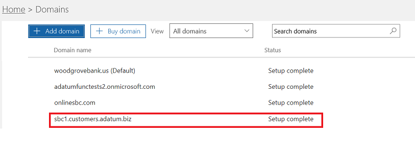

# <a name="configure-a-session-border-controller-for-multiple-tenants"></a>Configurar un controlador de borde de sesión para varios inquilinos

Enrutamiento directo admite la configuración de un controlador de borde de sesión (SBC) para atender a varios inquilinos.

> [!NOTE]
> Este escenario está diseñado para partners de Microsoft o operadores RTC, denominados operadores más adelante en este documento. Un operador vende servicios de telefonía entregados a Microsoft Teams a sus clientes. 

Un operador:
- Implementa y administra un SBC en su centro de datos (los clientes no necesitan implementar un SBC y reciben servicios de telefonía del operador en el Teams cliente).
- Interconecta el SBC con varios inquilinos.
- Proporciona servicios de red telefónica conmutada (RTC) a los clientes.
- Administra la calidad de la llamada de un extremo a otro.
- Cobra por separado los servicios RTC.

Microsoft no administra operadores. Microsoft ofrece Sistema telefónico ,una sucursal privada Exchange (PBX) y un Teams cliente. Microsoft también certifica los teléfonos y certifica los SBC que se pueden usar con Sistema telefónico. Antes de elegir un operador, asegúrese de que su elección tiene un SBC certificado y puede administrar la calidad de voz de un extremo a otro.

A continuación se indican los pasos de implementación técnica para configurar el escenario.

**Solo operador:**
1. Implemente el SBC y configúrelo para el escenario de hospedaje según las instrucciones [de los proveedores de SBC certificados](#deploy-and-configure-the-sbc).
2. Registre un nombre de dominio base en el inquilino del operador y solicite un certificado comodín.
3. Registre un subdominio para cada cliente, que forma parte del dominio base.

**Operador con un administrador global de clientes:**
1. Agregue el nombre del subdominio al inquilino del cliente.
2. Activar el nombre del subdominio.
3. Configure el tronco del operador para el inquilino del cliente y aprovisione a los usuarios.

*Asegúrese de comprender los conceptos básicos de DNS y cómo se administra el nombre de dominio en Microsoft 365. Consulte [Obtener ayuda con Microsoft 365 dominios antes](https://support.office.com/article/Get-help-with-Office-365-domains-28343f3a-dcee-41b6-9b97-5b0f4999b7ef) de continuar.*

## <a name="deploy-and-configure-the-sbc"></a>Implementar y configurar el SBC

Para obtener pasos detallados sobre cómo implementar y configurar SBC para un escenario de hospedaje de SBC, vea la documentación del proveedor de SBC.

- **AudioCodes:** vea Notas [](https://www.audiocodes.com/solutions-products/products/products-for-microsoft-365/direct-routing-for-Microsoft-Teams) de configuración de enrutamiento directo para la configuración del escenario de hospedaje de SBC como se describe en "Conectar audiocodes SBC Microsoft Teams nota de configuración del modelo de hospedaje de enrutamiento directo". 
- **Oracle:** vea Notas [de configuración de enrutamiento](https://www.oracle.com/technetwork/indexes/documentation/acme-packet-2228107.html) directo para la configuración del escenario de hospedaje de SBC como se describe en la sección "Microsoft". 
- **Comunicaciones de la cinta de opciones:** Consulte [Guía de configuración de SBC Core Microsoft Teams ribbon Communications](https://support.sonus.net/display/IOT/PBXs+-+SBC+5k7kSWe) para obtener documentación sobre cómo configurar los SBC de la serie Core de la cinta de opciones. Vea también [Procedimientos recomendados de la cinta de opciones: Configurar operadores para Microsoft Teams enrutamiento directo de SBC Edge](https://support.sonus.net/display/UXDOC81/Connect+SBC+Edge+to+Microsoft+Teams+Direct+Routing+to+Support+Direct+Routing+Carrier)
- **TE-Systems (anynode):** - Regístrese en el sitio de página de [TE-Systems Community](https://community.te-systems.de/) para obtener documentación y ejemplos sobre cómo configurar anynode SBC para varios inquilinos.
- **Metaswitch:** - Registrarse en el sitio de [página Community Metaswitch](https://manuals.metaswitch.com/MAN39555) para obtener documentación sobre cómo habilitar Perimeta SBC para varios inquilinos.

> [!NOTE]
> Asegúrese de que sabe cómo configurar el encabezado "Contacto". El encabezado Contacto se usa para buscar el inquilino del cliente en el mensaje de invitación entrante. 

## <a name="register-a-base-domain-and-subdomains"></a>Registrar un dominio base y subdominios

Para el escenario de hospedaje, debe crear:

- Un nombre de dominio base propiedad del operador.
- Un subdominio que forma parte del nombre de dominio base en cada inquilino del cliente.

En el ejemplo siguiente:

- Adatum es un operador que ofrece servicios de telefonía y Internet a varios clientes.
- Woodgrove Bank, Contoso y Adventure Works son tres clientes que Microsoft 365 pero reciben los servicios de telefonía de Adatum.

Los subdominios **DEBEN** coincidir con el nombre FQDN del tronco que se configurará para el cliente y el FQDN en el encabezado Contacto al enviar la invitación a Microsoft 365. 

Cuando una llamada llega a la interfaz de enrutamiento directo Microsoft 365, la interfaz usa el encabezado Contacto para buscar el espacio empresarial donde se debe buscar al usuario. Enrutamiento directo no usa la búsqueda de números de teléfono en la Invitación, ya que es posible que algunos clientes tengan números que no son DID que se pueden superponer en varios inquilinos. Por lo tanto, el nombre FQDN del encabezado de contacto es necesario para identificar el espacio empresarial exacto para buscar al usuario por el número de teléfono.

*Para obtener más información sobre cómo crear nombres de dominio Microsoft 365 organizaciones, vea Obtener [ayuda con Microsoft 365 dominios](https://support.office.com/article/Get-help-with-Office-365-domains-28343f3a-dcee-41b6-9b97-5b0f4999b7ef).*

En el siguiente diagrama se resumen los requisitos para el dominio base, los subdominios y el encabezado de contacto.


El SBC requiere un certificado para autenticar las conexiones. Para el escenario de hospedaje de SBC, el operador debe solicitar un certificado con CN o SAN *\*.base_domain (por ejemplo, \*.customers.adatum.biz)*. Este certificado se puede usar para autenticar las conexiones a varios inquilinos servidos desde un único SBC.

La tabla siguiente es un ejemplo de una configuración.


|Nuevo nombre de dominio |Tipo|Registrado  |Certificado CN/SAN para SBC  |Dominio predeterminado del inquilino en el ejemplo  |Nombre FQDN que debe presentar SBC en el encabezado De contacto al enviar llamadas a los usuarios|
|---------|---------|---------|---------|---------|---------|
|customers.adatum.biz|    Base     |     En el inquilino del operador  |    \*.customers.adatum.biz  |   adatum.biz      |NA, este es un inquilino del servicio, sin usuarios |
|sbc1.customers.adatum.biz|    Subdominio  |    En un inquilino de cliente  |    \*.customers.adatum.biz  | woodgrovebank.us  |  sbc1.customers.adatum.biz|
|sbc2.customers.adatum.biz  |   Subdominio | En un inquilino de cliente   |   \*.customers.adatum.biz   |contoso.com   |sbc2.customers.adatum.biz |
|sbc3.customers.adatum.biz |   Subdominio | En un inquilino de cliente |   \*.customers.adatum.biz  |  adventureworks.com | sbc3.customers.adatum.biz |
||         |         |         |         |         |

Para configurar la base y los subdominios, siga los pasos que se describen a continuación. En este ejemplo se configura un nombre de dominio base (customers.adatum.biz) y un subdominio para un cliente (sbc1.customers.adatum.biz inquilino de Woodgrove Bank).

> [!NOTE]
> Use sbcX.customers.adatum.biz para habilitar la voz en el espacio empresarial del operador; sbcX puede ser cualquier nombre de host alfanumérico único y válido.

## <a name="register-a-base-domain-name-in-the-carrier-tenant"></a>Registrar un nombre de dominio base en el inquilino del operador

**Estas acciones se realizan en el espacio empresarial del operador.**

### <a name="ensure-that-you-have-appropriate-rights-in-the-carrier-tenant"></a>Asegúrese de que tiene los derechos adecuados en el inquilino del operador

Solo puede agregar nuevos dominios si ha iniciado sesión en el Centro de administración de Microsoft 365 como administrador global. 

Para validar el rol que tiene, inicie sesión en el Centro de administración de Microsoft 365 (https://portal.office.com)vaya a **UsuariosActivos** >  y, después, compruebe que tiene un rol de administrador global. 

Para obtener más información sobre los roles de administrador y cómo asignar un rol en Microsoft 365, vea Acerca [de los roles de administrador](https://support.office.com/article/About-Office-365-admin-roles-da585eea-f576-4f55-a1e0-87090b6aaa9d).

### <a name="add-a-base-domain-to-the-tenant-and-verify-it"></a>Agregar un dominio base al inquilino y comprobarlo

1. En el Centro de administración de Microsoft 365, vaya a **SetupDomainsAdd** >  >  **dominio**.

2. En el **cuadro Escribir un dominio** de su propiedad, escriba el FQDN del dominio base. En el ejemplo siguiente, el dominio base se *customers.adatum.biz*.

3. Haga clic en **Siguiente**.

4. En este ejemplo, el inquilino ya tiene adatum.biz como un nombre de dominio comprobado. El asistente no pedirá verificación adicional porque customers.adatum.biz es un subdominio para el nombre ya registrado. Sin embargo, si agrega un FQDN que no se ha comprobado antes, tendrá que pasar por el proceso de verificación. El proceso de verificación se [describe a continuación](#add-a-subdomain-to-the-customer-tenant-and-verify-it).

5. Seleccione **Siguiente** y, en la página Actualizar **dns Configuración**, seleccione Agregaré los registros **DNS yo mismo** y seleccione **Siguiente**.

6. En la página siguiente, desactive todos los valores (a menos que desee usar el nombre de dominio para Exchange, SharePoint, Teams o Skype Empresarial), seleccione Siguiente **y, a** continuación, seleccione **Finalizar**. Asegúrese de que el nuevo dominio se encuentra en el estado Configurar completado.

### <a name="activate-the-domain-name"></a>Activar el nombre de dominio

Después de registrar un nombre de dominio, debe activarlo agregando al menos un usuario con una licencia de Sistema telefónico y asignando una dirección SIP con la parte FQDN de la dirección SIP que coincida con el dominio base creado.

> [!NOTE]
> El inquilino del operador debe conservar al menos Sistema telefónico licencia asignada al inquilino para evitar la eliminación de Skype Empresarial configuración. 

*Para obtener más información sobre cómo agregar usuarios Microsoft 365 organizaciones, vea Obtener [ayuda con Microsoft 365 dominios](https://support.office.com/article/Get-help-with-Office-365-domains-28343f3a-dcee-41b6-9b97-5b0f4999b7ef).*

Por ejemplo: test@customers.adatum.biz


## <a name="register-a-subdomain-name-in-a-customer-tenant"></a>Registrar un nombre de subdominio en un inquilino de cliente

Deberá crear un nombre de subdominio único para cada cliente. En este ejemplo, crearemos un subdominio sbc1.customers.adatum.biz en un espacio empresarial con el nombre de dominio predeterminado woodgrovebank.us.

**Todas las acciones siguientes se encuentran en el inquilino del cliente.**

### <a name="ensure-that-you-have-appropriate-rights-in-the-customer-tenant"></a>Asegúrese de que tiene los derechos adecuados en el inquilino del cliente

Solo puede agregar nuevos dominios si ha iniciado sesión en el Centro de administración de Microsoft 365 como administrador global. 

Para validar el rol que tiene, inicie sesión en el Centro de administración de Microsoft 365 (https://portal.office.com)vaya a **UsuariosActivos** >  y, después, compruebe que tiene un rol de administrador global. 

Para obtener más información sobre los roles de administrador y cómo asignar un rol en Microsoft 365, vea Acerca [de los roles de administrador](https://support.office.com/article/About-Office-365-admin-roles-da585eea-f576-4f55-a1e0-87090b6aaa9d).

### <a name="add-a-subdomain-to-the-customer-tenant-and-verify-it"></a>Agregar un subdominio al inquilino del cliente y comprobarlo

1. En el Centro de administración de Microsoft 365, vaya a **SetupDomainsAdd** >  >  **dominio**.

2. En el **cuadro Escribir un dominio** de su propiedad, escriba el FQDN del subdominio para este inquilino. En el ejemplo siguiente, el subdominio se sbc1.customers.adatum.biz.

3. Seleccione **Siguiente**.

4. El FQDN nunca se ha registrado en el inquilino. En el paso siguiente, tendrá que comprobar el dominio. Seleccione **Agregar un registro TXT en su lugar**. 

5. Seleccione **Siguiente** y anote el valor TXT generado para comprobar el nombre de dominio.

    

6. Cree el registro TXT con el valor del paso anterior en el proveedor de hospedaje DNS del operador.

    Para obtener más información, vea [Crear registros DNS en cualquier proveedor de host DNS](https://support.office.com/article/create-dns-records-at-any-dns-hosting-provider-for-office-365-7b7b075d-79f9-4e37-8a9e-fb60c1d95166).

7. Vaya a la página del cliente Centro de administración de Microsoft 365 y seleccione **Comprobar**. 

8. En la página siguiente, seleccione **Agregaré los registros DNS yo mismo** y seleccione **Siguiente**.

9. En la **página Elegir los servicios en línea** , desactive todas las opciones y seleccione **Siguiente**.

10. Seleccione **Finalizar en** la **página Actualizar configuración DNS** .

11. Asegúrese de que el estado es **Configuración completada**. 
    
    
    
> [!NOTE]
> La dirección URL base y el subdominio del cliente individual tienen que estar en el mismo espacio empresarial para poder agregar un _tronco de ruta_ directa.

### <a name="activate-the-subdomain-name"></a>Activar el nombre del subdominio

Después de registrar un nombre de dominio, debe activarlo agregando al menos un usuario y asignando una dirección SIP con la parte FQDN de la dirección SIP que coincida con el subdominio creado en el inquilino del cliente. 

*Para obtener más información sobre cómo agregar usuarios Microsoft 365 organizaciones, vea Obtener [ayuda con Microsoft 365](https://support.office.com/article/Get-help-with-Office-365-domains-28343f3a-dcee-41b6-9b97-5b0f4999b7ef).*

Por ejemplo: test@sbc1.customers.adatum.biz


### <a name="create-a-trunk-and-provision-users"></a>Crear un tronco y aprovisionar usuarios

Con la versión inicial de Enrutamiento directo, Microsoft requirió que se agregara un tronco a cada espacio empresarial servido (inquilino del cliente) con el cmdlet New-CSOnlinePSTNGateway cliente.

Sin embargo, este método no ha resultado óptimo por dos motivos:
 
- **Administración de sobrecargas**. Descargar o vaciar un SBC, por ejemplo, cambia algunos parámetros, como habilitar o deshabilitar la omisión de medios. Cambiar el puerto requiere cambiar los parámetros en varios inquilinos (ejecutando Set-CSOnlinePSTNGateway), pero de hecho es el mismo SBC. 

-  **Procesamiento de sobrecarga**. Recopilación y supervisión de datos de estado del tronco: las opciones SIP recopiladas de varios troncos lógicos que, en realidad, son el mismo SBC y el mismo tronco físico, ralentizan el procesamiento de los datos de enrutamiento.
 
En función de estos comentarios, Microsoft está trayendo una nueva lógica para aprovisionar los troncos para los inquilinos del cliente.

Se introdujeron dos nuevas entidades:

- Un tronco de operador registrado en el espacio empresarial del operador mediante el comando New-CSOnlinePSTNGateway. Por ejemplo: 
   
   ```PowerShell
   New-CSOnlinePSTNGateway -FQDN customers.adatum.biz -SIPSignalingport 5068 -ForwardPAI $true
    ```

- Un tronco derivado que no requiere registro. Es simplemente un nombre de host deseado que se agrega desde el tronco del operador. Deriva todos sus parámetros de configuración del tronco del operador. No es necesario crear el tronco derivado en PowerShell y la asociación con el tronco del operador se basa en el nombre FQDN (vea los detalles a continuación).

**Ejemplo y lógica de aprovisionamiento**

- Los transportistas deben configurar y administrar solo un solo tronco (el tronco del operador en el dominio del operador) mediante el comando Set-CSOnlinePSTNGateway operador. En el ejemplo anterior se muestra adatum.biz.

- En el inquilino del cliente, el operador debe agregar el FQDN de tronco derivado a las directivas de enrutamiento de voz de los usuarios. No es necesario ejecutar New-CSOnlinePSTNGateway para un tronco.

- El tronco derivado, como su nombre sugiere, hereda o deriva todos los parámetros de configuración del tronco del operador. 

Ejemplos:
- Customers.adatum.biz: el tronco del operador que debe crearse en el espacio empresarial del operador.

- Sbc1.customers.adatum.biz: el tronco derivado de un inquilino de cliente que no necesita crearse en PowerShell. Puede agregar el nombre del tronco derivado en el inquilino del cliente en la directiva de enrutamiento de voz en línea sin crearlo (use FQDN de tronco derivado al configurar la directiva de enrutamiento de voz en TAC en el campo rutas de Teams-Voice-Direct Routing-Voice inscritos).

- El operador tendrá que configurar el FQDN del tronco derivado del registro DNS para la dirección ip del operador SBC.

- Los cambios realizados en un tronco de operador (en el inquilino del operador) se aplican automáticamente a los troncos derivados. Por ejemplo, los operadores pueden cambiar un puerto SIP en el tronco del operador y este cambio se aplica a todos los troncos derivados. La nueva lógica para configurar los troncos simplifica la administración, ya que no es necesario ir a todos los inquilinos y cambiar el parámetro en cada tronco.

- Las opciones solo se envían al FQDN del tronco del operador. El estado del tronco del operador se aplica a todos los troncos derivados y se usa para las decisiones de enrutamiento. Más información sobre las [opciones de enrutamiento directo](./direct-routing-monitor-and-troubleshoot.md).

- El operador puede vaciar el tronco del operador y todos los troncos derivados también se vaciarán. 
 
> [!NOTE]
> Las reglas de traducción de números aplicadas en el tronco del operador no se aplican a los troncos derivados. Este es un problema conocido. Como solución alternativa, se deben crear reglas de traducción de números para el inquilino de cada cliente.

**Migración del modelo anterior al tronco del operador de transporte**
 
Para la migración desde la implementación actual del modelo hospedado del operador al nuevo modelo, los operadores tendrán que volver a configurar los troncos para los inquilinos del cliente. Quite los troncos de los inquilinos del cliente Remove-CSOnlinePSTNGateway (dejando el tronco en el inquilino del operador)-

Recomendamos encarecidamente migrar a la nueva solución lo antes posible, ya que mejoraremos la supervisión y el aprovisionamiento con el operador y el modelo de tronco derivado.
 
Para obtener más información sobre cómo configurar el envío del nombre FQDN de los subdominios en el encabezado Contacto, vea las instrucciones del proveedor [de SBC](#deploy-and-configure-the-sbc).

## <a name="considerations-for-setting-up-multi-tenant-failover"></a>Consideraciones para configurar la conmutación por error de varios inquilinos 

Para configurar la conmutación por error para un entorno de varios inquilinos, deberá hacer lo siguiente:

- Para cada espacio empresarial, agregue los FQDN para dos SBC diferentes. Por ejemplo:

   customer1.sbc1.contoso.com <br>
   customer1.sbc2.contoso.com <br>

- En las directivas de enrutamiento de voz en línea de los usuarios, especifique ambos SBC. Si se produce un error en un SBC, la directiva de enrutamiento enruta las llamadas al segundo SBC.


## <a name="see-also"></a>Vea también

[Planear el enrutamiento directo](direct-routing-plan.md)

[Configurar el enrutamiento directo](direct-routing-configure.md)
