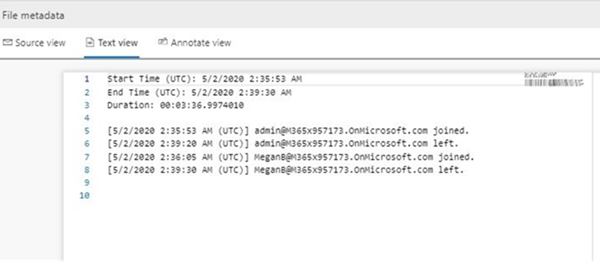

# <a name="conduct-an-ediscovery-investigation-of-content-in-microsoft-teams"></a>Realizar una investigación de eDiscovery en Microsoft Teams

Las grandes empresas suelen estar expuestas a procedimientos legales con penas elevadas que exigen el envío de toda la información almacenada electrónicamente (ESI). Microsoft Teams contenido se puede buscar y usar durante las investigaciones de exhibición de documentos electrónicos.

## <a name="overview"></a>Información general

Todos Microsoft Teams chats de grupo o 1:1 se pasan por diario a los buzones de los usuarios respectivos. Todos los mensajes de canal estándar se envían en diario al buzón de grupo que representa al equipo. Los archivos cargados en canales estándar se cubren en la funcionalidad de exhibición de documentos electrónicos para SharePoint Online y OneDrive para la Empresa.

La exhibición de mensajes y archivos en [canales privados](private-channels.md) funciona de forma diferente que en los canales estándar. Para obtener más información, vea [Exhibición de documentos electrónicos de canales privados](#ediscovery-of-private-and-shared-channels).

No todo Teams contenido es eDiscoverable. En la tabla siguiente se muestran los tipos de contenido que puede buscar con herramientas de exhibición de documentos electrónicos de Microsoft:

| Tipo de contenido | eDiscoverable | Notas |
|:--- | :--- |:--- |
|Grabaciones de audio | No | |
|Contenido de la tarjeta|Sí|Vea [Buscar contenido de tarjeta](#search-for-card-content) para obtener más información.|
|Vínculos de chat | Sí | |
|Mensajes de chat | Sí |Esto incluye contenido en canales Teams estándar, chats de 1:1, chats grupales 1:N y chats con participantes de usuario invitado.  |
|Fragmentos de código | No | |
|Mensajes editados | Sí | Si el usuario está en espera, también se conservan las versiones anteriores de los mensajes editados. |
|Emojis, GIF y adhesivos | Sí | |
|Notificaciones de fuentes | No | |
|Imágenes en línea | Sí | |
|Bucle de componentes| Sí|El contenido de un componente de bucle se guarda en un archivo .fluid que se almacena en la cuenta de OneDrive para la Empresa del usuario que envía el componente de bucle. Esto significa que debe incluir OneDrive como un origen de datos al buscar contenido en componentes de bucle. |
|Conversaciones de mensajería instantánea de reunión | Sí | |
|Metadatos de la <sup>reunión1</sup> | Sí |  |
|Nombre del canal | Sí | |
|Mensajes de chat de canal privado y compartido | Sí | |
|Comillas | Sí | Se puede buscar contenido entre comillas. Sin embargo, los resultados de la búsqueda no indican que el contenido se citó. |
|Reacciones (como me gusta, corazones y otras reacciones) | No | |
|Asunto | Sí | |
|Tablas | Sí | |
||||

<sup>1 Los</sup> metadatos de reunión (y llamada) incluyen lo siguiente:

- Hora y duración de inicio y finalización de la reunión
- Reunión unirse y dejar eventos para cada participante
- Voip se une o llama
- Combinaciones anónimas
- Combinaciones de usuarios federados
- Se une el usuario invitado

Este es un ejemplo de una conversación de chat entre participantes durante una reunión.


[!div class="mx-imgBorder"]

Este es un ejemplo de la copia de cumplimiento de la misma conversación de chat vista en una herramienta de exhibición de documentos electrónicos.


Este es un ejemplo de los metadatos de la reunión.

  > [!div class="mx-imgBorder"]
  > 

Para obtener más información sobre cómo llevar a cabo una investigación de exhibición de documentos electrónicos, vea Introducción a [eDiscovery principal](/microsoft-365/compliance/get-started-core-ediscovery).

Microsoft Teams datos aparecerán como mensajería instantánea o Conversaciones en el Excel de exportación de exhibición de documentos electrónicos. Puede abrir el archivo en `.pst` Outlook ver esos mensajes después de exportarlos.

Al ver el archivo .pst para el equipo, todas las conversaciones se encuentran en la carpeta Chat de grupo en Historial de conversaciones. El título del mensaje contiene el nombre del equipo y el nombre del canal. Por ejemplo, en la imagen siguiente se muestra un mensaje de Bob que ha Project canal estándar 7 del equipo de Especificaciones de fabricación.


Los chats privados en el buzón de un usuario se almacenan en la carpeta Chat de grupo en Historial de conversaciones.

## <a name="ediscovery-of-private-and-shared-channels"></a>eDiscovery de canales privados y compartidos

Las copias de cumplimiento de los mensajes en canales privados y compartidos se envían a distintos buzones según el tipo de canal. Esto significa que tiene que buscar diferentes ubicaciones de buzón en función del tipo de canal del que es miembro un usuario.

- **Canales privados**. Las copias de cumplimiento se envían al buzón de todos los miembros de los miembros del canal privado. Esto significa que tiene que buscar en el buzón de usuario al buscar contenido en mensajes de canal privado.

- **Canales compartidos**. Las copias de cumplimiento se envían a un buzón del sistema asociado con el equipo principal. Como Teams no admite una búsqueda de exhibición de documentos electrónicos de un único buzón del sistema para un canal compartido, tiene que buscar en el buzón el equipo principal (seleccionando el nombre del buzón de equipo) al buscar contenido de mensajes en canales compartidos.

Cada canal privado y compartido tiene su propio sitio SharePoint independiente del sitio de grupo principal. Esto significa que los archivos en canales privados y compartidos se almacenan en su propio sitio y se administran independientemente del equipo principal. Esto significa que debe identificar y buscar el sitio específico asociado a un canal al buscar contenido en archivos y datos adjuntos de mensajes de canal.

Use las secciones siguientes para identificar el canal privado o compartido que se incluirá en la búsqueda de exhibición de documentos electrónicos.

### <a name="identifying-the-members-of-a-private-channel"></a>Identificar los miembros de un canal privado

Use el procedimiento de esta sección para identificar los miembros de un canal privado para que pueda usar herramientas de exhibición de documentos electrónicos para buscar contenido en los mensajes de canal privado en el buzón del miembro.

Antes de realizar estos pasos, asegúrese de que tiene instalada la [versión más reciente Teams módulo de PowerShell](teams-powershell-overview.md).

1. Ejecute el siguiente comando para obtener el id. de grupo del equipo que contiene los canales compartidos que desea buscar.

   ```powershell
   Get-Team -DisplayName <display name of the the parent team>
   ```

   > [!TIP]
   > Ejecute el cmdlet **Get-Team** sin ningún parámetro para mostrar una lista de todos los Teams de su organización. La lista contiene el id. del grupo y el nombre para mostrar para cada equipo.

2. Ejecute el siguiente comando para obtener una lista de canales privados en el equipo primario. Use el id. de grupo para el equipo que obtuvo en el paso 1.

   ```PowerShell
    Get-TeamChannel -GroupId <parent team GroupId> -MembershipType Private
   ```

3. Ejecute el siguiente comando para obtener una lista de propietarios y miembros de canales privados para un canal privado específico.

   ```PowerShell
    Get-TeamChannelUser -GroupId <parent team GroupId> -DisplayName "Partner Shared Channel"
   ```

4. Incluya los buzones de los propietarios y miembros de un canal privado como parte de la consulta de búsqueda de exhibición de documentos electrónicos en [eDiscovery](/microsoft-365/compliance/search-for-content-in-core-ediscovery) principal o al identificar y recopilar contenido custodio [en Advanced eDiscovery](/microsoft-365/compliance/add-custodians-to-case).

### <a name="identifying-the-sharepoint-site-for-private-and-shared-channels"></a>Identificar el SharePoint para canales privados y compartidos

Como se explicó anteriormente, los archivos compartidos en canales privados y compartidos (y archivos adjuntos a mensajes de canal) se almacenan en la colección de sitios asociada al canal. Use el procedimiento de esta sección para identificar la dirección URL del sitio asociado a un canal privado o compartido específico. A continuación, puede usar herramientas de exhibición de documentos electrónicos para buscar contenido en el sitio.

Antes de realizar estos pasos, instale SharePoint Shell de administración en línea [y conéctese a SharePoint Online](/powershell/sharepoint/sharepoint-online/connect-sharepoint-online).

1. Opcionalmente, ejecute lo siguiente para obtener una lista de todas las SharePoint de sitios asociadas con canales compartidos en el equipo primario.

   ```PowerShell
    Get-SPOSite
   ```

   > [!TIP]
   > La convención de nomenclatura de la dirección URL de un sitio asociado a canales privados y compartidos es `[SharePoint domain]/sites/[Name of parent team]-[Name of private or shared channel]`. Por ejemplo, la dirección URL del canal compartido denominado "Colaboración de partners", que se encuentra en el equipo primario "Equipo de ingeniero" de la organización contoso es `https://contoso.sharepoint.com/sites/EngineeringTeam-PartnerCollaboration`.

2. Ejecute los siguientes comandos de PowerShell para mostrar la dirección URL de todos los SharePoint asociados con los canales privados y compartidos de su organización. El resultado del script también incluye el id. de grupo del equipo primario, que debe ejecutar los comandos en el paso 3.

    ```PowerShell
    $sites = Get-SPOSite -Template "TEAMCHANNEL#1"
    foreach ($site in $sites) {$x= Get-SPOSite -Identity $site.url -Detail; $x.relatedgroupID; $x.url}
    ```

   > [!NOTE]
   > SharePoint para canales privados creados antes del 28 de junio de 2021 `"TEAMCHANNEL#0"` usan el valor para el id. de plantilla personalizada. Para mostrar los canales privados creados después de esta fecha, use el valor `"TEAMCHANNEL#1"` al ejecutar los dos scripts anteriores. Los canales compartidos solo usan el valor de `"TEAMCHANNEL#1"`.

3. Para cada equipo primario, ejecute los siguientes comandos de PowerShell para identificar los sitios de canal privado y compartido, `$groupID` donde está el id. de grupo del equipo primario.

    ```PowerShell
    $sites = Get-SPOSite -Template "TEAMCHANNEL#1"
    $groupID = "<group ID of parent team)"
    foreach ($site in $sites) {$x= Get-SpoSite -Identity $site.url -Detail; if ($x.RelatedGroupId -eq $groupID) {$x.RelatedGroupId;$x.url}}
    ```

4. Incluya el sitio asociado a un canal privado o compartido como parte de la consulta de búsqueda de exhibición de documentos electrónicos en [eDiscovery](/microsoft-365/compliance/search-for-content-in-core-ediscovery) principal o al identificar y recopilar contenido custodio [en Advanced eDiscovery](/microsoft-365/compliance/add-custodians-to-case).

## <a name="search-for-content-for-guest-users"></a>Buscar contenido para usuarios invitados

Puede usar herramientas de exhibición de documentos electrónicos para buscar Teams contenido relacionado con los usuarios invitados de su organización. Teams contenido de chat asociado a un usuario invitado se conserva en una ubicación de almacenamiento basada en la nube y se puede buscar con eDiscovery. Esto incluye buscar contenido en conversaciones de chat 1:1 y 1:N en las que un usuario invitado es un participante con otros usuarios de su organización. También puede buscar mensajes de canal privado en los que un usuario invitado es un participante y buscar contenido en conversaciones de chat de invitado *:* invitado, donde los únicos participantes son usuarios invitados.

Para buscar contenido para los usuarios invitados:

1. Conectar para Azure AD PowerShell. Para obtener instrucciones, vea la sección "Conectar con Azure Active Directory PowerShell" en Conectar para Microsoft 365 [con PowerShell](/microsoft-365/enterprise/connect-to-microsoft-365-powershell#connect-with-the-azure-active-directory-powershell-for-graph-module). Asegúrese de completar los pasos 1 y 2 en el tema anterior.

2. Después de conectarse correctamente Azure AD PowerShell, ejecute el siguiente comando para mostrar el nombre principal de usuario (UPN) para todos los usuarios invitados de su organización. Debe usar el UPN del usuario invitado al crear la búsqueda en el paso 4.

   ```powershell
   Get-AzureADUser -Filter "userType eq 'Guest'" -All $true | FL UserPrincipalName
   ```

   > [!TIP]
   > En lugar de mostrar una lista de nombres principales de usuario en la pantalla del equipo, puede redirigir el resultado del comando a un archivo de texto. Puede hacerlo anexando al `> filename.txt` comando anterior. El archivo de texto con los nombres principales de usuario se guardará en la carpeta actual.

3. En otra ventana Windows PowerShell, conéctese a PowerShell del Centro de & de cumplimiento. Para obtener instrucciones, [vea Conectar PowerShell del Centro de & seguridad](/powershell/exchange/connect-to-scc-powershell). Puede conectarse con o sin la autenticación multifactor.

4. Cree una búsqueda de contenido que busque todo el contenido (como mensajes de chat y mensajes de correo electrónico) en el que el usuario invitado especificado fuera un participante ejecutando el comando siguiente.

   ```powershell
   New-ComplianceSearch <search name> -ExchangeLocation <guest user UPN>  -AllowNotFoundExchangeLocationsEnabled $true -IncludeUserAppContent $true
   ```

   Por ejemplo, para buscar contenido asociado con la usuario invitada Sara Davis, ejecutaría el siguiente comando.

   ```powershell
   New-ComplianceSearch "Sara Davis Guest User" -ExchangeLocation "sara.davis_hotmail.com#EXT#@contoso.onmicrosoft.com" -AllowNotFoundExchangeLocationsEnabled $true -IncludeUserAppContent $true
   ```

    Para obtener más información sobre cómo usar PowerShell para crear búsquedas de contenido, vea [Búsqueda de nuevo cumplimiento](/powershell/module/exchange/new-compliancesearch).

5. Ejecute el comando siguiente para iniciar la búsqueda de contenido que creó en el paso 4:

   ```powershell
   Start-ComplianceSearch <search name>
   ```

6. Vaya a y [https://compliance.microsoft.com](https://compliance.microsoft.com), a continuación, haga clic **en Mostrar todas las búsquedas** >  **de contenido**.

7. En la lista de búsquedas, seleccione la búsqueda que creó en el paso 4 para mostrar la página desplegable.

8. En la página desplegable, puede hacer lo siguiente:

   - Haga **clic en Ver resultados** para ver los resultados de la búsqueda y obtener una vista previa del contenido.

   - Junto al **campo Consulta** , haga clic **en Editar** para editar y, a continuación, vuelva a ejecutar la búsqueda. Por ejemplo, puede agregar una consulta de búsqueda para restringir los resultados.

   - Haga **clic en Exportar resultados** para exportar y descargar los resultados de búsqueda.

## <a name="search-for-card-content"></a>Buscar contenido de tarjeta

El contenido de la tarjeta generado por las aplicaciones en Teams canales, chats 1:1 y chats 1xN se almacena en buzones y se puede buscar. Una *tarjeta es* un contenedor de interfaz de usuario para fragmentos cortos de contenido. Las tarjetas pueden tener varias propiedades y datos adjuntos, y pueden incluir botones que pueden desencadenar acciones de tarjeta. Para obtener más información, vea [Tarjetas](/microsoftteams/platform/task-modules-and-cards/what-are-cards)

Al igual que Teams contenido, donde se almacena el contenido de la tarjeta se basa en el lugar donde se usó la tarjeta. El contenido de las tarjetas usadas en Teams canal se almacena en el buzón Teams grupo. El contenido de la tarjeta para chats 1:1 y 1xN se almacena en los buzones de los participantes del chat.

Para buscar contenido de tarjeta, puede usar las condiciones `kind:microsoftteams` de búsqueda `itemclass:IPM.SkypeTeams.Message` o o. Al revisar los resultados de búsqueda, el contenido de la tarjeta generado por bots en un canal de Teams tiene la propiedad de correo electrónico Remitente **/**`<appname>@teams.microsoft.com`Autor como , `appname` donde está el nombre de la aplicación que generó el contenido de la tarjeta. Si un usuario generó contenido de tarjeta, el valor de **Remitente/Autor** identifica al usuario.

Al ver el contenido de la tarjeta en los resultados de búsqueda de contenido, el contenido aparece como datos adjuntos al mensaje. El archivo adjunto se denomina `appname.html`, donde `appname` está el nombre de la aplicación que generó el contenido de la tarjeta. Las siguientes capturas de pantalla muestran cómo el contenido de la tarjeta (para una aplicación denominada Asana) aparece en Teams y en los resultados de una búsqueda.

### <a name="card-content-in-teams"></a>Contenido de tarjeta en Teams


### <a name="card-content-in-search-results"></a>Contenido de la tarjeta en los resultados de búsqueda
  


> [!NOTE]
> Para mostrar imágenes del contenido de la tarjeta en los resultados de búsqueda en este momento (como las marcas de verificación de la captura de pantalla anterior), debe haber iniciado sesión en Teams (https://teams.microsoft.com)en una pestaña diferente en la misma sesión del explorador que usa para ver los resultados de búsqueda. En caso contrario, se mostrarán marcadores de posición de imagen.

## <a name="related-topics"></a>Temas relacionados

- [Microsoft 365 de exhibición de documentos electrónicos](/microsoft-365/compliance/ediscovery)
- [Introducción a eDiscovery principal](/microsoft-365/compliance/get-started-core-ediscovery)
- [Teams flujo de trabajo en Advanced eDiscovery](/microsoft-365/compliance/teams-workflow-in-advanced-ediscovery)
- [Descripción de PowerShell para Teams](teams-powershell-overview.md)
