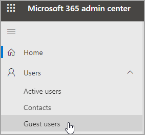

# Editar información del usuario invitadoEdit guest user information

Puede editar la información de invitado desde el Centro de administración de Microsoft 365 o desde el portal de Azure Active Directory.You can edit guest information from the Microsoft 365 admin center or the Azure Active Directory portal.

## Usuarios invitados en el administrador de Microsoft 365Guest users in the Microsoft 365 admin

1. Para editar la información de invitado en el Centro de administración de [Microsoft 365,](https://admin.microsoft.com)seleccione **Usuarios**  >  **invitados.**To edit the guest information in the [Microsoft 365 admin center](https://admin.microsoft.com), select **Users** > **Guest Users**.

   

2. Seleccione un usuario de **Usuarios invitados.**Select a user from **Guest users**.

3. En información de usuario de invitado, seleccione **Administrar información de contacto.**In guest user information, select **Manage contact information**.

   

4. Edite los campos que elija, excepto El nombre para **mostrar,** en Administrar **información de contacto** y, a continuación, seleccione Guardar **cambios.**Edit any fields that you choose except for **Display name** in **Manage contact information**, and then select **Save changes**.

   

También puede editar el usuario invitado desde el [portal de Azure Active Directory.](https://aad.portal.azure.com/#blade/Microsoft_AAD_IAM/UsersManagementMenuBlade/MsGraphUsers)You can also edit the guest user from the [Azure Active Directory portal](https://aad.portal.azure.com/#blade/Microsoft_AAD_IAM/UsersManagementMenuBlade/MsGraphUsers).
