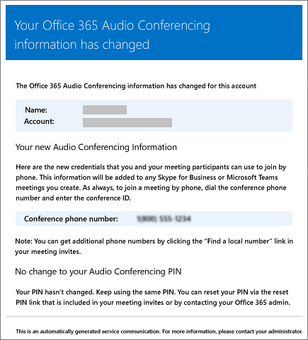

# Correos electrónicos que se envían a los usuarios cuando cambia la configuración en Microsoft Teams

Los correos electrónicos se enviarán automáticamente a los usuarios habilitados para [conferencias](set-up-audio-conferencing-in-teams.md) de audio con Microsoft como proveedor de audioconferencias.

De forma predeterminada, hay cuatro tipos de correo electrónico que se enviarán a los usuarios habilitados para audioconferencias. Pero, si quiere limitar el número de correos electrónicos que se envían a los usuarios, puede desactivarlo. Las audioconferencias en Microsoft 365 u Office 365 enviarán correo electrónico al correo electrónico de los usuarios cuando:

- **Se les asigna una licencia de audioconferencia o cuando cambia el proveedor de audioconferencias a Microsoft.**

     Este correo electrónico incluye el id. de conferencia, el número de teléfono de conferencia predeterminado para las reuniones, el PIN de audioconferencia para el usuario, las instrucciones y el vínculo para usar la Herramienta de actualización de reuniones de Skype Empresarial Online que se usa para actualizar las reuniones existentes para el usuario. Vea [Asignar licencias de complementos de Microsoft Teams](./teams-add-on-licensing/microsoft-teams-add-on-licensing.md) o Asignar Microsoft como el proveedor de [audioconferencias.](/SkypeForBusiness/audio-conferencing-in-office-365/assign-microsoft-as-the-audio-conferencing-provider)

    > [!NOTE]
    > Si en su organización se han habilitado los identificadores de conferencia dinámicos, todas las reuniones que se programen de un usuario tendrán identificadores de conferencia únicos. Puede configurar los [ID dinámicos de audioconferencia en su organización.](/skypeforbusiness/audio-conferencing-in-office-365/reset-a-conference-id-for-a-user) 

    Este es un ejemplo de este correo electrónico:

     

    Para obtener más información sobre las licencias, vea [Licencias de complementos de Microsoft Teams.](./teams-add-on-licensing/microsoft-teams-add-on-licensing.md)

- **Cambia el id. de conferencia o número de teléfono de conferencia predeterminado de un usuario.**

    Este correo electrónico contiene el id. de conferencia, el número de teléfono de conferencia predeterminado, las instrucciones y el vínculo para usar la Herramienta de actualización de reuniones de Skype Empresarial Online que se usa para actualizar las reuniones existentes para el usuario. Pero este correo electrónico no incluye el PIN de audioconferencia del usuario. See [Reset a conference ID for a user](reset-a-conference-id-for-a-user-in-teams.md).

    Este es un ejemplo de este correo electrónico:

     

- **Se restablece el PIN de audioconferencia de un usuario.**

    Este correo electrónico contiene el PIN de audioconferencia del organizador, el id. de conferencia existente y el número de teléfono de conferencia predeterminado para el usuario. Vea [Restablecer el PIN de audioconferencia.](reset-the-audio-conferencing-pin-in-teams.md)
    
     Este es un ejemplo de este correo electrónico:
    
     
  
- **Se quita la licencia de un usuario o cuando el proveedor de servicios de audioconferencia cambia de Microsoft a otro proveedor o ninguno.**

    Esto ocurre cuando se **quita la** licencia de conferencias de audio de un usuario o al establecer el proveedor de audioconferencias en **Ninguno.**

    Vea [Asignar o quitar licencias de Microsoft 365 para empresas.](https://support.office.com/article/997596b5-4173-4627-b915-36abac6786dc)

    Este es un ejemplo de este correo electrónico:

     

> [!NOTE]
> [!INCLUDE [updating-admin-interfaces](includes/updating-admin-interfaces.md)]

## Realizar cambios en los mensajes de correo electrónico que se les envían

Puede realizar cambios en el correo electrónico que se envía automáticamente a los usuarios. De forma predeterminada, el remitente de los correos electrónicos será de Microsoft 365 u Office 365, pero puede cambiar el nombre para mostrar con Windows PowerShell. Vea la [referencia de PowerShell de Microsoft Teams](/powershell/module/teams/?view=teams-ps) para obtener más información.

## ¿Qué pasa si no desea que se les envíen correos electrónicos?

Al deshabilitar el envío de correos electrónicos a los usuarios, el correo electrónico no se enviará incluso cuando se asigne una licencia a un usuario. En este caso, el ID de conferencia, el número de teléfono de conferencia predeterminado y, lo que es más importante, su PIN de audioconferencia no se enviarán al usuario. Cuando esto sucede, debe avisarle al usuario enviándole un correo electrónico independiente o llamándolo.

De forma predeterminada, los correos electrónicos se enviarán a los usuarios, pero si quiere evitar que reciban correo electrónico para audioconferencias, puede usar Microsoft Teams o Windows PowerShell. 

 **Centro de administración de Microsoft Teams en uso**

1. En el panel de navegación izquierdo, vaya a **Reuniones** > **Puentes de conferencia**. 

2. En la parte superior de la **página Puentes de** conferencia, haga clic en **Configuración de puente.** 

3. En el **panel Configuración de puente,** habilite o deshabilite Enviar mensajes de correo electrónico automáticamente a los usuarios si cambia la configuración **de acceso telefónico.**

4. Haga clic en **Guardar**.

> [!Note]
> [!INCLUDE [updating-admin-interfaces](includes/updating-admin-interfaces.md)]

Vea **Enviar un correo electrónico a un usuario con su información de conferencias de Audio**.

Vea la [referencia de PowerShell de Microsoft Teams](/powershell/module/teams/?view=teams-ps) para obtener más información.

## ¿Quiere saber más sobre Windows PowerShell?

De forma predeterminada, el remitente de los correos electrónicos será de Microsoft 365 u Office 365, pero puede cambiar la dirección de correo electrónico y el nombre para mostrar con Windows PowerShell. 

Windows PowerShell se centra en la administración de usuarios y en las acciones que se les está permitido o no realizar. Con Windows PowerShell, puede administrar Microsoft 365 u Office 365 con un único punto de administración que puede simplificar su trabajo diario cuando tiene varias tareas que hacer. To get started with Windows PowerShell, see these topics:

  - [Seis motivos por los que posiblemente quiera usar Windows PowerShell para administrar Office 365](/microsoft-365/enterprise/why-you-need-to-use-microsoft-365-powershell)

  - [Las mejores formas de administrar Office 365 con Windows PowerShell](/previous-versions//dn568025(v=technet.10))

Para obtener más información sobre Windows PowerShell, consulte la [referencia de PowerShell para Microsoft Teams](/powershell/module/teams/?view=teams-ps).

## Temas relacionados

[Habilitar o deshabilitar el envío de correos electrónicos cuando cambie la configuración de conferencias de Audio](enable-or-disable-sending-emails-when-their-settings-change-in-teams.md)

[Enviar un correo electrónico a un usuario con su información de conferencias de Audio](send-an-email-to-a-user-with-their-dial-in-information-in-teams.md)