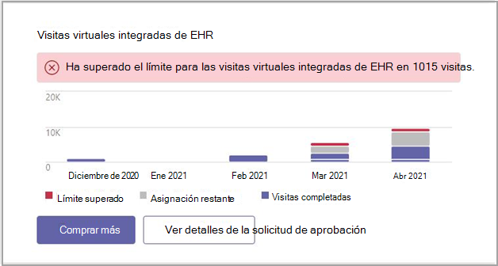

# Microsoft Teams Informes de administrador del conector EHR

El Microsoft Teams de administrador del conector de estado electrónico (EHR) proporciona una vista rápida y fácil de leer de los datos de uso.

Puede ver el informe Microsoft Teams administrador del conector EHR yendo al panel Microsoft Teams centro de administración y viendo el cuadro de diálogo allí.

Acceda al informe desde el panel Microsoft Teams centro de administración.

 

El cuadro de diálogo proporciona los siguientes datos:

- Límite superado
- Asignación restante
- Visitas completadas

Puede usar el cuadro de diálogo informe para comprar más visitas virtuales.

## Temas relacionados

[Teams para visitas virtuales](ehr-admin.md)
