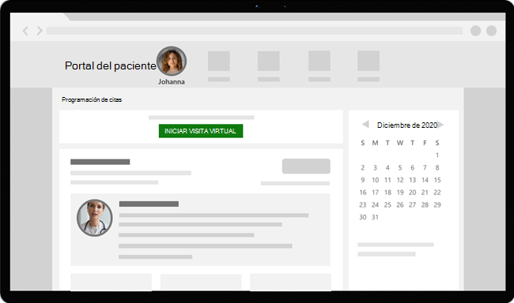

# Visitas virtuales con Teams: integración en Épico EHR

El Microsoft Teams registro de salud electrónico (EHR) hace que sea más fácil para los médicos iniciar una visita virtual al paciente o una consulta con otro proveedor en Microsoft Teams directamente desde el sistema Épico EHR. Integrada en la nube de Microsoft 365, Teams permite una colaboración y comunicación sencillas y seguras con herramientas de chat, vídeo, voz y atención sanitaria en un único concentrador compatible con el cumplimiento de hipaa, certificación HITECH y mucho más.

La plataforma de comunicación y colaboración de Teams facilita a los médicos cortar el desorden de sistemas fragmentados para que puedan centrarse en proporcionar la mejor atención posible. Con el Teams EHR, puede:

- Inicie Teams visitas virtuales desde su sistema Épico EHR con un flujo de trabajo clínico integrado.
- Permitir que los pacientes se unan Teams visitas virtuales desde el portal del paciente o a través de SMS.
- Admite otros escenarios, incluidos varios participantes, visitas grupales y servicios de intérpretes.
- Vuelva a escribir metadatos en el sistema EHR sobre Teams visitas virtuales para grabar cuando los asistentes se conectan, desconectan y habilitan la auditoría automática y la conservación de registros.
- Vea informes de datos de consumo e información de calidad de llamada personalizable para las visitas conectadas a EHR.

Consulte este vídeo para obtener información general sobre cómo administrar las visitas virtuales desde el portal de EHR.

> [!VIDEO https://www.microsoft.com/videoplayer/embed/RE4HAtn]

En este artículo se describe cómo configurar y configurar el Teams EHR para que se integre con la plataforma Epic en su organización sanitaria. También le ofrece información general sobre la experiencia Teams visitas virtuales desde el sistema Épico EHR.

## Antes de empezar

Antes de empezar, hay algunas cosas que hacer para prepararse para la integración.

### Familiarizarse con el proceso de integración

Revise la siguiente información para comprender el proceso de integración general.

:::image type="content" source="media/ehr-connector-epic-flow.png" alt-text="Imagen que resume los pasos del proceso de integración general.":::

||||||
|---------|---------|---------|---------|---------|
|**Acción**: Solicita [acceso a la aplicación Teams usuario](#request-access-to-the-teams-app).   **Resultado**: autorizamos a su organización a realizar pruebas.|**Acción**: Creamos un certificado de clave público y privado y los cargamos en Epic.   **Resultado**: Epic sincroniza el certificado de clave pública.|**Acción**: Complete los pasos de configuración en el portal de configuración del conector EHR.   **Resultado**: Recibe registros de IED para la configuración de Epic.| **Acción**: Trabaja con el especialista técnico de Epic para configurar los registros de IED en Epic.  **Resultado**: Configuración completada. Listo para probar.|**Acción**: Puede completar las pruebas en el entorno de prueba.  **Resultado**: Validación completa de los flujos y decisión de pasar a la producción.|

### Solicitar acceso a la Teams aplicación

Tendrás que solicitar acceso a la aplicación Teams usuario.

1. Solicitar descargar la aplicación Teams en [el mercado de Epic App Orchard](https://apporchard.epic.com/Gallery?id=6153). Al hacerlo, se desencadena una solicitud de Epic al equipo de conectores EHR de Microsoft.
1. Después de realizar la solicitud, envíe un correo electrónico a [TeamsForHealthcare@service.microsoft.com](mailto:teamsforhealthcare@service.microsoft.com) con el nombre de la organización, el id. de inquilino y la dirección de correo electrónico de su contacto técnico de Epic.
1. El equipo del conector EHR de Microsoft responderá a su correo electrónico con confirmación de habilitación.

### Revisar la guía Epic-Microsoft Teams integración de Telehealth

Revise la [integración de teleasistencia sanitaria de Microsoft Teams](https://galaxy.epic.com/Search/GetFile?Url=1!68!100!100100357) con su especialista técnico profesional. Asegúrese de que se cumplen todos los requisitos previos.

## Requisitos previos

- Una suscripción activa para Microsoft Cloud para el sector sanitario o una suscripción a una Microsoft Teams independiente del conector EHR (solo se aplica al realizar pruebas en un entorno EHR de producción).
- Versión épico de noviembre de 2018 o posterior.
- Los usuarios tienen una licencia Microsoft 365 o Office 365 que incluye Teams reuniones.
- Teams se adopta y se usa en su organización sanitaria.
- Sus sistemas cumplen todos [los requisitos de software y explorador](../../hardware-requirements-for-the-teams-app.md) para Teams.

> [!IMPORTANT]
> Asegúrese de completar los pasos previos a la integración y de que se cumplen todos los requisitos previos antes de avanzar con la integración.

Los siguientes miembros de la organización realizan los pasos de integración:

- **Microsoft 365 administrador global**: la persona principal responsable de la integración. El administrador configura el conector, habilita SMS (si es necesario) y agrega el analista de clientes epic que aprobará la configuración.
- **Analista de clientes épico**: una persona de su organización que tiene credenciales de inicio de sesión en Epic. Aprueban la configuración especificada por el administrador y proporcionan los registros de configuración a Epic.

El Microsoft 365 y el analista de clientes de Epic pueden ser la misma persona.

## Configurar el conector Teams EHR

Para la configuración del conector, debe realizar las siguientes acciones:

- [Iniciar el portal de configuración del conector EHR](#launch-the-ehr-connector-configuration-portal)
- [Escribir información de configuración](#enter-configuration-information)
- [Habilitar notificaciones SMS (opcional)](#enable-sms-notifications-optional)
- [Aprobar o ver la configuración](#approve-or-view-the-configuration)
- [Revisar y finalizar la configuración](#review-and-finish-the-configuration)

### Iniciar el portal de configuración del conector EHR

Para empezar, el administrador de Microsoft 365 inicia el portal de configuración del conector [EHR](https://ehrconnector.teams.microsoft.com) e inicia sesión con sus Microsoft 365 credenciales.

El Microsoft 365 puede configurar una única organización o varias organizaciones para probar la integración. Configure la dirección URL de prueba y producción en el portal de configuración. Asegúrese de probar la integración desde el entorno de prueba épico antes de pasar a la producción.

> [!NOTE]
> El Microsoft 365 y el analista de clientes de Epic deben completar los pasos de integración en el portal de configuración. Para ver los pasos de configuración de Epic, póngase en contacto con el especialista técnico de Epic asignado a su organización.

### Escribir información de configuración

A continuación, para configurar la integración, Microsoft 365 administrador hace lo siguiente:

1. Agrega una dirección URL base de recursos de interoperabilidad de estado rápido (FHIR) de su especialista técnico épico y especifica el entorno. Configure tantas direcciones URL base de FHIR como sea necesario, según las necesidades de su organización y los entornos que desee probar.

    - La dirección URL base de FHIR es una dirección estática que corresponde al punto de conexión de la API FHIR del servidor. Una dirección URL de ejemplo es `https://lamnahealthcare.org/fihr/auth/connect-ocurprd-oauth/api/FHDST`.

    - Puede configurar la integración para entornos de prueba y producción. Para la configuración inicial, le recomendamos que configure el conector desde un entorno de prueba antes de pasar a producción.

1. Agrega el nombre de usuario del analista de clientes de Epic que aprobará la configuración en un paso posterior.

    :::image type="content" source="media/ehr-connector-epic-configure.png" alt-text="Captura de pantalla de la página Configuración, que muestra el aprobador que se va a agregar." lightbox="media/ehr-connector-epic-configure.png":::

### Habilitar notificaciones SMS (opcional)

> [!NOTE]
> Actualmente, las notificaciones POR SMS solo están disponibles en Estados Unidos. Estamos trabajando para que esta característica esté disponible en otras regiones en futuras versiones de Teams y actualizaremos este artículo cuando esté disponible.

Complete este paso si su organización quiere que Microsoft administre las notificaciones DE SMS para sus pacientes. Al habilitar las notificaciones POR SMS, los pacientes recibirán mensajes de confirmación y aviso para las visitas programadas.

Para habilitar las notificaciones SMS, el Microsoft 365 hace lo siguiente:

1. En la página notificaciones SMS, seleccione ambas casillas de consentimiento para:

    - Permitir que Microsoft envíe notificaciones SMS a los pacientes en nombre de su organización.
    - Confirme que garantizará que los asistentes han dado su consentimiento para enviar y recibir mensajes SMS.
    
    :::image type="content" source="media/ehr-connector-epic-sms-notifications.png" alt-text="Captura de pantalla de la página de notificaciones SMS, que muestra las casillas de consentimiento y la opción de generar un número de teléfono." lightbox="media/ehr-connector-epic-sms-notifications.png":::

1. En **Sus números de teléfono**, seleccione **Generar un nuevo número de teléfono** para generar un número de teléfono para su organización. Al hacerlo, se inicia el proceso para solicitar y generar un nuevo número de teléfono. Este proceso puede tardar hasta 2 minutos en completarse.

    Después de generar el número de teléfono, se muestra en la pantalla. Este número se usará para enviar confirmaciones de SMS y avisos a sus pacientes. El número se ha aprovisionado pero aún no está vinculado a la dirección URL base de FHIR. Lo hará en el paso siguiente.

    :::image type="content" source="media/ehr-connector-epic-phone-number.png" alt-text="Captura de pantalla que muestra un ejemplo del número de teléfono que se genera." lightbox="media/ehr-connector-epic-phone-number.png":::

    Elija **Listo** y, a continuación, **seleccione Siguiente**.

1. Para vincular el número de teléfono a una dirección URL base de FHIR, **en Teléfono número** en la sección configuración **de SMS**, seleccione el número. Haga esto para cada dirección URL base de FHIR para la que desea habilitar las notificaciones SMS.

    :::image type="content" source="media/ehr-connector-epic-link-phone-number.png" alt-text="Captura de pantalla que muestra cómo vincular un número de teléfono a una dirección URL base de FHIR." lightbox="media/ehr-connector-epic-link-phone-number.png":::

    Si es la primera vez que configura el conector, verá la dirección URL base de FHIR que se introdujo en el paso anterior. El mismo número de teléfono se puede vincular a varias DIRECCIONES URL base de FHIR, lo que significa que los pacientes recibirán notificaciones SMS del mismo número de teléfono para diferentes organizaciones y/o departamentos.

1. Seleccione **Configuración de SMS** junto a cada URL base de FHIR para configurar los tipos de notificaciones DE SMS que se enviarán a los pacientes.

    :::image type="content" source="media/ehr-connector-epic-sms-setup.png" alt-text="Captura de pantalla que muestra la configuración de SMS." lightbox="media/ehr-connector-epic-sms-setup.png":::

    - **SMS de** confirmación: las notificaciones se envían a los pacientes cuando se programa, actualiza o cancela una visita en el sistema EHR.
    - **SMS de** aviso: las notificaciones se envían a los pacientes según el intervalo de tiempo que especifique y la hora programada de la visita.

    Elija **Guardar**.

1. Seleccione **Upload certificado para** cargar un certificado de clave pública. Debe cargar un certificado .cer codificado en Base64 (solo clave pública) para cada entorno.

    Se requiere un certificado de clave pública para recibir información de cita para enviar notificaciones POR SMS. El certificado es necesario para comprobar que la información entrante es de un origen válido.

    Cuando el conector se usa para enviar avisos SMS, epic envía el número de teléfono del paciente en una carga de HL7v2 cuando se crean citas en Epic. Estos números se almacenan para cada cita en la geografía de su organización y se conservan hasta que se lleva a cabo la cita. Para obtener más información sobre cómo configurar mensajes de HL7v2, consulte la Guía de integración [de Microsoft Teams de telesalud](https://galaxy.epic.com/Search/GetFile?Url=1!68!100!100100357).

    Elija **Siguiente**.

> [!NOTE]
> En cualquier momento, el Microsoft 365 puede actualizar cualquiera de las opciones de configuración de SMS. Tenga en cuenta que cambiar la configuración puede provocar una suspensión del servicio de SMS. Para obtener más información sobre cómo ver informes de SMS, [vea Teams de](ehr-admin-reports.md) administradores del conector EHR.

### Aprobar o ver la configuración

El analista de clientes épicos de su organización que se agregó como aprobador inicia el portal de configuración del conector [EHR](https://ehrconnector.teams.microsoft.com) e inicia sesión con sus credenciales Microsoft 365 usuario. Después de la validación correcta, se le pide al aprobador que inicie sesión con sus credenciales de Epic para validar la organización Epic.

> [!Note]
> Si el Microsoft 365 y el analista de clientes de Epic son la misma persona, tendrás que iniciar sesión en Epic para validar tu acceso. El inicio de sesión de Epic solo se usa para validar la dirección URL base de FHIR. Microsoft no almacenará credenciales ni accederá a datos EHR con este inicio de sesión.

:::image type="content" source="media/ehr-connector-epic-login-approve.png" alt-text="Captura de pantalla de la página Aprobar o Ver configuración, que muestra la opción Iniciar sesión y aprobar." lightbox="media/ehr-connector-epic-login-approve.png":::

Después de iniciar sesión correctamente en Epic, el analista de clientes de Epic **debe** aprobar la configuración. Si la configuración no es correcta, Microsoft 365 administrador puede iniciar sesión en el portal de configuración y cambiar la configuración.

:::image type="content" source="media/ehr-connector-epic-approve.png" alt-text="Captura de pantalla de la página Aprobar o Ver configuración, que muestra la opción Aprobar." lightbox="media/ehr-connector-epic-approve.png":::

### Revisar y finalizar la configuración

Cuando el administrador de Epic apruebe la información de configuración, se le presentarán registros de integración para el inicio de los proveedores y los pacientes. Los registros de integración incluyen:

- Registros de pacientes y proveedores
- Registro de SMS directo
- Registro de configuración de SMS
- Registro de configuración de prueba de dispositivo

El analista de clientes de Epic debe proporcionar estos registros a Epic para completar la configuración de visitas virtuales en Epic. Para obtener más información, consulte la [Guía de integración Microsoft Teams telesalud de Epic-Microsoft Teams](https://galaxy.epic.com/Search/GetFile?Url=1!68!100!100100357).

> [!Note]  
> En cualquier momento, el Microsoft 365 o el analista de clientes epic pueden iniciar sesión en el portal de configuración para ver los registros de integración y cambiar la configuración de la organización, según sea necesario.

:::image type="content" source="media/ehr-connector-epic-finish.png" alt-text="Captura de pantalla de la página Revisar y finalizar, que muestra información de integración." lightbox="media/ehr-connector-epic-finish.png":::

> [!Note]
> El analista de clientes de Epic debe completar el proceso de aprobación para cada DIRECCIÓN URL base de FHIR que haya configurado el administrador Microsoft 365 cliente.

## Iniciar Teams visitas virtuales

Después de completar los pasos del conector EHR y la configuración de Epic, su organización está lista para admitir las visitas de vídeo con Teams.

### Requisitos previos de visitas virtuales

- Los sistemas deben cumplir todos los [requisitos de software y explorador](../../hardware-requirements-for-the-teams-app.md) para Teams.

- Completó la configuración de integración entre la organización Epic y su Microsoft 365 organización.

### Experiencia del proveedor

Los proveedores de salud de su organización pueden unirse a las visitas Teams desde sus aplicaciones de proveedor épico (Hyperspace, Haiku, Canto). El botón **Iniciar visita virtual** está incorporado en el flujo del proveedor.

Características principales de la experiencia del proveedor:

- Los proveedores pueden unirse a las visitas con exploradores compatibles o Teams aplicación.

- Los proveedores deben realizar un inicio de sesión único con su Microsoft 365 al unirse a una visita por primera vez.

- Después del inicio de sesión único, el proveedor se llevará directamente a la cita virtual en Teams. (El proveedor debe haber iniciado sesión en Teams).

- Los proveedores pueden ver actualizaciones en tiempo real de los participantes que se conectan y desconectan para una cita determinada. Los proveedores pueden ver cuándo el paciente está conectado a una visita.

  

> [!NOTE]
> Cualquier información que se haya introducido en el chat de reunión que sea necesaria para fines de continuidad o retención de registros médicos debe ser descargada, copiada y anotada por el proveedor de atención sanitaria. El chat no constituye un registro médico legal ni un conjunto de registros designado. Los mensajes del chat se almacenan en función de la configuración creada por el Microsoft Teams usuario.

### Experiencia del paciente

El conector es compatible con los pacientes que se unen a las visitas a través de la web y el móvil de MyChart. En el momento de la cita, los pacientes pueden iniciar una visita desde MyChart con el **botón Iniciar visita virtual** .

Características principales de la experiencia del paciente:

- Los pacientes pueden unirse a las visitas de exploradores web modernos en equipos de escritorio y móviles [sin tener que instalar la Teams aplicación](../mobile-browser-join.md).

- Los pacientes pueden unirse a las visitas con un solo clic y no se requiere ninguna otra cuenta o inicio de sesión.

- No es necesario que los pacientes creen una cuenta de Microsoft ni inicien sesión para iniciar una visita.

- Los pacientes se colocan en una sala de espera hasta que el proveedor se une y los admite.

- Los pacientes pueden probar el vídeo y el micrófono en la sala de espera antes de unirse a la visita.

  

> [!Note]
> Epic, MyChart, Haiku y Canto son marcas comerciales de Epic Systems Corporation.

## Obtener información sobre el uso de visitas virtuales

El [informe de uso](../../teams-analytics-and-reports/virtual-visits-usage-report.md) de visitas virtuales del centro de administración de Microsoft Teams proporciona a los administradores información general sobre Teams de las visitas virtuales de su organización. El informe muestra análisis detallados para citas virtuales, incluidas Teams reuniones integradas con EHR realizadas desde su sistema EHR.

Puede ver métricas clave, como el tiempo de espera de la sala de espera y la duración de la visita. Use esta información para obtener información sobre las tendencias de uso para ayudarle a optimizar las visitas virtuales para ofrecer mejores resultados empresariales.

### Privacidad y ubicación de los datos

Teams integración en sistemas EHR optimiza la cantidad de datos que se usan y almacenan durante la integración y los flujos de visitas virtuales. La solución sigue los principios generales de privacidad y administración de datos de Teams, y las directrices estipuladas en Privacidad de Teams.

El Teams EHR no almacena ni transfiere ningún dato personal identificable ni ningún registro de salud de pacientes o proveedores de servicios de salud desde el sistema EHR. El único dato que almacena el conector de EHR es la identificación única del usuario de EHR, que se usa durante la configuración de la reunión de Teams.

La identificación única del usuario de EHR se almacena en una de las tres regiones geográficas que se describen en [¿Dónde se almacenan los datos de los clientes de Microsoft 365?](/microsoft-365/enterprise/o365-data-locations) Todos los chats, grabaciones y otros datos compartidos en Teams por los participantes de la reunión se almacenan según las directivas de almacenamiento existentes. Para obtener más información sobre la ubicación de los datos en Teams, vea Ubicación [de los datos en Teams](../../location-of-data-in-teams.md).

## Artículos relacionados

- [Teams de uso de visitas virtuales](../../teams-analytics-and-reports/virtual-visits-usage-report.md)
- [Teams de administrador del conector EHR](ehr-admin-reports.md)
- [Introducción a las Teams para organizaciones sanitarias](teams-in-hc.md)
