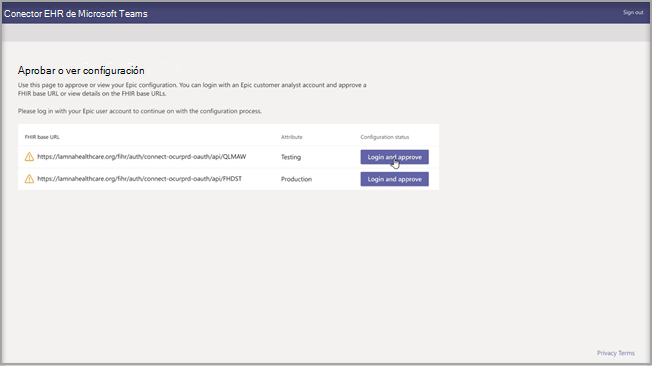
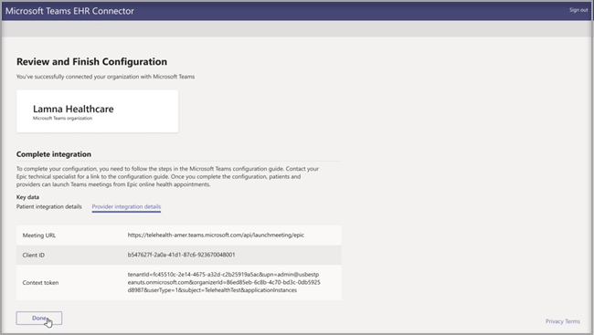
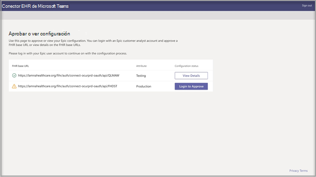

# Visitas virtuales con Teams: integración en EHRVirtual visits with Teams - Integration into EHR

El conector de la historia clínica electrónica (EHR) para Microsoft Teams hace que resulte fácil para el personal médico iniciar una visita virtual con un paciente o una consulta con otro proveedor en Teams directamente desde el sistema de EHR.Microsoft Teams Electronic Health Record (EHR) Connector makes it easy for clinicians to launch a virtual patient visit or consultation with another provider in Teams directly from the EHR system. Integrado en la nube de Microsoft 365, Microsoft Teams permite colaborar y comunicarse de forma sencilla y segura con herramientas de chat, vídeo, voz y salud en un único sitio central compatible con el cumplimiento de la ley HIPAA, la certificación HITECH y mucho más.Built on the Microsoft 365 cloud, Microsoft Teams enables simple, secure collaboration and communication with chat, video, voice, and healthcare tools in a single hub that supports compliance with HIPAA, HITECH certification, and more.
Con la plataforma de comunicación y colaboración de Teams, los profesionales de la medicina pueden poner fin fácilmente al desorden de los sistemas fragmentados y así dedicar su tiempo a proporcionar la mejor atención posible.The communication and collaboration platform of Teams makes it easy for clinicians to cut through the clutter of fragmented systems so they can spend time providing the best possible care. El conector de la historia clínica electrónica (EHR) para Microsoft Teams puede:Microsoft Teams Electronic Health Record (EHR) Connector can:

- Iniciar las visitas virtuales de Teams desde los portales de proveedores y pacientes.Launch Teams virtual visits from both provider and patient portals.
- Reescribir en los metadatos de EHR los eventos de conexión y desconexión para habilitar la conservación de registros y la auditoría automáticas.Write back into EHR metadata on connect and disconnect events to enable automatic auditing and record keeping.
- Integrarse en los flujos de trabajo existentes de profesionales médicos y pacientes al tiempo que les permite usar Microsoft Teams.Integrate into existing clinician and patient workflows while allowing them to use Microsoft Teams.

  Vea el vídeo sobre cómo administrar las visitas virtuales desde el portal de EHR.Watch the video of How to manage virtual visits from the EHR portal.

> [!VIDEO https://www.microsoft.com/videoplayer/embed/RE4HAtn]

## Antes de empezarBefore you begin

Debe asegurarse de que cumple los siguientes requisitos previos para poder integrar el conector de EHR:You’ll need to make sure you have the following prerequisites before you can integrate the EHR connector:

- Acceso para usar la aplicación Microsoft Teams en [catálogo de App Orchard de Epic](https://apporchard.epic.com/Gallery?id=6153).Access to use to the Microsoft Teams app in [Epic’s App Orchard marketplace](https://apporchard.epic.com/Gallery?id=6153).

- Suscripción activa a Microsoft Cloud para el sector sanitario o suscripción a la oferta independiente del conector de EHR para Microsoft Teams (solo se exige durante las pruebas de producción).Active subscription to Microsoft Cloud for Healthcare or subscription to Microsoft Teams EHR Connector standalone offer (only enforced during production testing).

- Los usuarios deben tener una licencia adecuada de Microsoft 365 u Office 365 que incluya reuniones de Microsoft Teams.Users must have an appropriate Microsoft 365 or Office 365 license that includes Microsoft Teams meetings.

- Microsoft Teams debe adoptarse y usarse dentro de la organización.Microsoft Teams should be adopted and used inside the organization.

- Las organizaciones deben tener la versión de Epic de noviembre de 2018 o posterior.Organizations must have with Epic version November 2018 or later.

- Los sistemas deben cumplir todos los [requisitos previos de software y explorador web](../../hardware-requirements-for-the-teams-app.md).Your systems must meet all [software and browser prerequisites](../../hardware-requirements-for-the-teams-app.md).

También necesitará información de las siguientes personas de la organización:You’ll also need information from the following people in your organization:

- Administrador de Microsoft 365Microsoft 365 administrator

- Analista de clientes de EpicEpic customer analyst

> [!Note]
> Revise la [Guía de integración de Telesalud de Epic-Microsoft Teams](https://galaxy.epic.com/Search/GetFile?Url=1!68!100!100100357) con su especialista técnico de Epic.Review the [Epic-Microsoft Teams Telehealth Integration Guide](https://galaxy.epic.com/Search/GetFile?Url=1!68!100!100100357) with your Epic technical specialist. Asegúrese de que se han completado todos los requisitos previos.Make sure that all pre-requisites are completed. 

## Configuración del conectorConnector setup

Para la configuración del conector, debe realizar las siguientes acciones:The connector setup requires that you:

- [Iniciar el portal de configuración del conector de EHRLaunch the EHR Connector configuration portal](ehr-admin.md#launch-the-ehr-connector-configuration-portal)
- [Información de configuraciónConfiguration information](ehr-admin.md#configuration-information)
- [Aprobar o ver configuraciónApprove or view configuration](ehr-admin.md#approve-or-view-configuration)
- [Revisar y finalizar la configuraciónReview and finish the configuration](ehr-admin.md#review-and-finish-the-configuration)

### [Iniciar el portal de configuración del conector de EHRLaunch the EHR Connector configuration portal](#launch-the-ehr-connector-configuration-portal)

Para configurar su organización sanitaria para iniciar visitas virtuales con Microsoft Teams, inicie el portal de configuración del conector de EHR.Configuring your healthcare organization to launch virtual visits with Microsoft Teams starts by launching the EHR Connector configuration portal. Configure una o varias organizaciones para probar la integración.You configure a single or multiple organizations to test the integration. Configure la dirección URL de prueba y producción en el portal de configuración.Configure the test and production URL in the configuration portal. Pruebe la integración del entorno de prueba de Epic antes de pasar a la producción.Test the integration from Epic’s test environment before moving to production.
  
- URL de configuración del conector de EHR: [https://ehrconnector.teams.microsoft.com](https://ehrconnector.teams.microsoft.com)EHR connector configuration URL: [https://ehrconnector.teams.microsoft.com](https://ehrconnector.teams.microsoft.com)

El administrador de Microsoft 365 y el analista de clientes de Epic de su organización deben completar los pasos de información e integración en el portal de configuración.The Microsoft 365 admin and Epic customer analyst from your organization must complete the information and integration steps in the configuration portal. Para obtener los pasos de configuración de Epic, póngase en contacto con el recurso de especialista técnico de Epic asignado a su organización.For Epic configuration steps, contact the Epic technical specialist resource assigned to your organization.

### [Información de configuraciónConfiguration information](#configuration-information)

El **administrador de Microsoft 365** debe realizar este paso.This step is to be completed by the **Microsoft 365 administrator**. El administrador de Microsoft 365 debe iniciar el portal de configuración del conector e iniciar sesión con las credenciales de Microsoft para iniciar el proceso de configuración.The Microsoft 365 administrator must launch the connector configuration portal and sign in with Microsoft credentials to start the configuration process.

Para completar este paso, el administrador de Microsoft 365 debe recibir una URL base válida de los Recursos Rápidos de Interoperabilidad en Salud (FHIR) de su especialista técnico de Epic y el nombre de usuario del analista de clientes de Epic que aprobará la configuración.To complete this step, the Microsoft 365 administrator must receive a valid Fast Health Interoperability Resources (FHIR) base URL from your Epic technical specialist and the username of the Epic customer analyst who will be approving the configuration. El administrador de Microsoft 365 debe iniciar la página de configuración del conector e iniciar sesión con las credenciales de Microsoft para iniciar el proceso de configuración.The Microsoft 365 administrator must launch the connector configuration page and sign in with Microsoft credentials to start the configuration process.

- La URL base de los FHIR es una dirección estática correspondiente al punto de conexión de API de los FHIR del servidor.The FHIR base URL is a static address corresponding to your server FHIR API endpoint. Una dirección URL de ejemplo es `https://lamnahealthcare.org/fihr/auth/connect-ocurprd-oauth/api/FHDST`.An example URL is `https://lamnahealthcare.org/fihr/auth/connect-ocurprd-oauth/api/FHDST`.

- El nombre del aprobador de la configuración es el nombre del analista de clientes de Epic que será responsable de aprobar la configuración en el siguiente paso.Configuration approver name is the name of the Epic customer analyst who will be responsible for approving the configuration in the next step. El analista de clientes de Epic es una persona de su organización que tiene acceso de inicio de sesión a Epic.The Epic customer analyst is a person in your organization with sign-in access to Epic.

  

### [Aprobar o ver configuraciónApprove or view configuration](#approve-or-view-configuration)

El analista de clientes de Epic de su organización sanitaria que se ha agregado como aprobador debe usar ahora la misma URL del conector de EHR del paso anterior para iniciar sesión con sus credenciales de Microsoft 365.The Epic customer analyst for your healthcare organization who was added as an approver must now use the same EHR Connector URL from the previous step to sign in using their Microsoft 365 credentials. Tras una validación correcta, se le pedirá al aprobador que inicie sesión con sus credenciales de Epic para validar la organización de Epic.After successful validation, the approver is going to be asked to sign in using their Epic credentials to validate the Epic organization.

> [!Note]
> El administrador de Microsoft 365 y el analista de clientes de Epic de su organización pueden ser la misma persona.The Microsoft 365 admin and Epic customer analyst in your organization can be the same person. En ese caso, agregue su propio nombre de usuario como aprobador.In that case, add your own username as approver. Aun así, tendrá que iniciar sesión en Epic para validar su acceso.You'll still need to sign in to Epic to validate your access. El inicio de sesión en Epic solo se usa para validar la URL base de los FHIR.The Epic sign in is only used to validate your FHIR base URL. Microsoft no almacenará credenciales ni tendrá acceso a datos de EHR con este inicio de sesión.Microsoft won't store credentials or access EHR data with this sign in.

  

Una vez que se haya iniciado sesión en Epic correctamente, el analista de clientes de Epic **debe** aprobar la configuración.After a successful Epic sign in, the Epic customer analyst **must** approve the configuration. Si la configuración no es correcta, el administrador de Microsoft 365 podrá modificar las configuraciones originales iniciando sesión de nuevo en el portal del conector de EHR para Microsoft.If the configuration isn't correct, the Microsoft 365 admin will have the ability to modify the original configurations by signing in to the Microsoft EHR connector portal again. 

### [Revisar y finalizar la configuraciónReview and finish the configuration](#review-and-finish-the-configuration)

Cuando el administrador de Epic apruebe la información de configuración, se le presentarán registros de integración para el inicio de los proveedores y los pacientes.When the configuration information is approved by the Epic administrator, you'll be presented with integration records for patient and provider launch. Estos registros son necesarios para completar la configuración de la visita virtual en Epic.These records are necessary to complete the virtual visit configuration in Epic. Consulte la Guía de integración de teleasistencia sanitaria de Epic-Microsoft Teams para obtener más información.Refer to the Epic-Microsoft Teams Telehealth Integration guide for more details.

> [!Note]  
> El analista de clientes de Epic o Microsoft 365 puede iniciar sesión en cualquier momento en el portal de configuración para ver los registros de integración y modificar la configuración de la organización, si es necesario.At any time the Microsoft 365 or Epic customer analyst can sign in to the configuration portal to view integration records and modify organization configuration, if needed.

> [!Note]
> El proceso de aprobación debe completarlo el analista de clientes de Epic para cada URL de los FHIR configurada previamente por el administrador de Microsoft.The approval process must be completed by the Epic customer analyst for every FHIR URL configured by the Microsoft admin before.

## Iniciar las visitas virtuales de TeamsLaunch Teams virtual visits

Después de completar los pasos del conector de EHR y la configuración de Epic, su organización estará lista para admitir visitas en vídeo con Microsoft Teams.After completing the EHR Connector steps and Epic configuration, your organization is ready to support video visits with Microsoft Teams.

### Requisitos previos de la visita virtualVirtual visit prerequisites

- Los sistemas deben cumplir todos los [requisitos previos de software y explorador web](../../hardware-requirements-for-the-teams-app.md).Your systems must meet all [software and browser prerequisites](../../hardware-requirements-for-the-teams-app.md).

- La organización sanitaria debe haber completado la configuración entre la organización de Epic y la organización de Microsoft 365.Healthcare organization must have completed the setup between the Epic organization and Microsoft 365 organization.

### Experiencia del proveedorProvider experience

Los proveedores sanitarios de su organización también pueden unirse a visitas virtuales con Microsoft Teams desde sus aplicaciones de proveedor de Epic (Hyperspace, Haiku, Canto).Healthcare providers from your organization can also join virtual visits with Microsoft Teams from their Epic provider applications (Hyperspace, Haiku, Canto). El botón **Iniciar visita virtual** está incorporado en el flujo del proveedor.The **Begin virtual visit** button is embedded in the provider flow.

Características principales de la experiencia del proveedor:Key features of the provider experience:

- Los proveedores pueden unirse a las visitas virtuales con navegadores web compatibles o con la aplicación de Microsoft Teams.Providers can join virtual visits using supported browsers or the Microsoft Teams application.

- Los proveedores deben llevar a cabo el inicio de sesión de un solo uso con su cuenta de Microsoft 365 al unirse a una visita virtual por primera vez.Providers must do a one-time sign-in with their Microsoft 365 account when joining a virtual visit for the first time.

- Después del inicio de sesión de un solo uso, se remitirá al proveedor directamente a la cita virtual en Microsoft Teams.After the one-time sign-in, the provider will be taken straight to the virtual appointment in Microsoft Teams. (El proveedor debe haber iniciado sesión en Microsoft Teams).(Provider must be signed-in to Microsoft Teams).

- El proveedor puede ver las actualizaciones en tiempo real de los participantes que se conectan y desconectan en una cita determinada.Provider can see real-time updates of participants connect and disconnect for a given appointment. El proveedor puede ver cuándo se conecta el paciente a una visita virtual.The provider can see when the patient is connected to a virtual visit.

  

### Experiencia del pacientePatient experience

El conector admite a los pacientes que se unen a visitas virtuales a través de la web y la aplicación móvil de MyChart.The connector supports patients joining virtual visits through MyChart web and mobile. A la hora de la cita, los pacientes pueden iniciar una visita virtual desde MyChart con el botón **Iniciar visita virtual**.At the time of the appointment, patients can start a virtual visit from MyChart using the **Begin virtual visit** button.

Características principales de la experiencia del paciente:Key features of the patient experience:

- Los pacientes pueden unirse a visitas virtuales desde exploradores web modernos en equipos de sobremesa y dispositivos móviles sin instalar aplicaciones.Patients can join virtual visits from modern web browsers on desktop and mobile without app installation.

- Los pacientes pueden unirse a las visitas virtuales con un solo clic y no se necesita ninguna otra cuenta ni inicio de sesión.Patients can join virtual visits with a single click and there is no other account or sign-in required.

- No es necesario que los pacientes creen una cuenta de Microsoft ni que inicien sesión para iniciar una visita virtual.Patients aren't required to create a Microsoft account or sign in to launch a virtual visit.

- Los pacientes estarán en una sala de espera hasta que el proveedor sanitario se una a la cita y los admita a la visita virtual.Patients will be placed in a lobby until the healthcare provider joins the appointment and admits them to the virtual visit.

- Hay pruebas de vídeo y micrófono disponibles en la sala de espera antes de unirse a la visita virtual.Testing of the video and microphone is available in the lobby before joining the virtual visit.

  

> [!Note]
> Epic, MyChart, Haiku y Canto son marcas comerciales de Epic Systems Corporation.Epic, MyChart, Haiku, and Canto are trademarks of Epic Systems Corporation.

### Privacidad y ubicación de los datosPrivacy and location of data

La integración de Teams en sistemas de EHR optimiza la cantidad de datos que se usan y almacenan durante los flujos de integración y de visita virtual.Teams integration into EHR systems optimizes the amount of data being used and stored during integration and virtual visit flows. La solución sigue los principios generales de privacidad y administración de datos de Teams, y las directrices estipuladas en Privacidad de Teams.The solution follows the overall Teams privacy and data management principles and guidelines outlined in Teams Privacy.

El conector de EHR para Microsoft Teams no almacena ni transfiere ningún dato personal de identificación ni ningún registro médico de pacientes o proveedores sanitarios desde el sistema de EHR.The Microsoft Teams EHR connector doesn't store nor transfer any identifiable personal data or any health records of patients or healthcare providers from the EHR system. El único dato que almacena el conector de EHR es la identificación única del usuario de EHR, que se usa durante la configuración de la reunión de Teams.The only data that is stored by the EHR connector is the EHR user’s unique ID, which is used during Teams meeting setup. La identificación única del usuario de EHR se almacena en una de las tres regiones geográficas que se describen en [¿Dónde se almacenan los datos de los clientes de Microsoft 365?](/microsoft-365/enterprise/o365-data-locations?view=o365-worldwide#data-center-geographies)The EHR user’s unique ID is stored in one of the three geographic regions described in [Where your Microsoft 365 customer data is stored](/microsoft-365/enterprise/o365-data-locations?view=o365-worldwide#data-center-geographies). Todos los chats, las grabaciones y demás datos que introduzcan en Teams los participantes de la reunión se almacenan según las directivas de almacenamiento existentes.All chat, recordings, and other data entered into Teams by the meeting participants are stored according to existing storage policies. Si desea obtener más información sobre la ubicación de los datos en Microsoft Teams, visite [Ubicaciones de los datos en Teams](../../location-of-data-in-teams.md).If you want to learn more information on the location of data in Microsoft Teams, visit [Locations of data in Teams](../../location-of-data-in-teams.md).