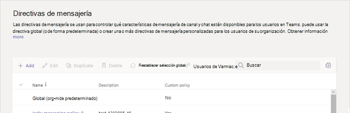
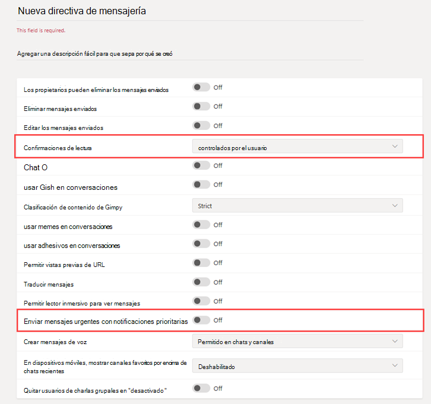

# Mensajería segura para organizaciones sanitariasSecure Messaging for healthcare organizations

Las directivas de mensajería se utilizan para controlar qué características de mensajería de canal y de chat están disponibles para los usuarios de Microsoft Teams y, además, forman parte de la implementación general de mensajería segura para organizaciones del sector sanitario, como hospitales, clínicas o consultorios médicos, donde resulta crucial recibir un mensaje para actuar de manera oportuna, al igual que saber cuándo se leen los mensajes cruciales.Messaging policies are used to control which chat and channel messaging features are available to users in Microsoft Teams, and are part of the overall deployment of Secure Messaging for healthcare organizations like Hospitals, clinics, or doctor's offices, where having a message picked up and acted upon in a timely manner is crucial, as is knowing when crucial messages are read.

Puede usar la directiva global (predeterminada para toda la organización) o bien crear una o más directivas de mensajería personalizadas para los miembros de la organización.You can use the global (Org-wide default) policy or create one or more custom messaging policies for people in your organization. Los usuarios de la organización obtendrán automáticamente la directiva global, a menos que cree y asigne una directiva personalizada.Users in your organization will automatically get the global policy unless you create and assign a custom policy. Después de crear una directiva personalizada, asígnela a un usuario o a grupos de usuarios de la organización.After you create a custom policy, assign it a user or groups of users in your organization. Por ejemplo, puede optar por permitir que solo ciertos roles de trabajo usen estas funciones (quizá solo médicos y enfermeras) y otros trabajadores (como el personal de limpieza o de cocina) obtengan un conjunto más limitado de funciones.For example, you may choose to only allow certain job roles to use these features (perhaps doctors and nurses only) and other workers (like the janitorial or kitchen staff) to get a more limited set of features. Decida usted mismo qué necesidades tiene su organización usando esta guía tan solo como una forma de sugerencia.Decide for yourself what needs your organization has, the guidance here is at most a suggestion.

Las directivas se administran fácilmente en el [Centro de administración de Microsoft Teams](https://admin.teams.microsoft.com) iniciando sesión con las credenciales de administrador y eligiendo **Directivas de mensajería** en el panel de navegación izquierdo.Policies can be easily managed in the [Microsoft Teams admin center](https://admin.teams.microsoft.com) by logging in with administrator credentials and choosing **Messaging policies** in the left navigation pane.

 

Para editar la directiva de mensajería predeterminada existente para la organización, haga clic en **Global (predeterminada para toda la organización)**, tras lo cual realice los cambios.To edit the existing default Messaging policy for your organization, click **Global (Org-wide default)**, and then make your changes. Para crear una nueva directiva de mensajería predeterminada, haga clic en **Añadir** y, después, seleccione la configuración deseada.To create a new custom messaging policy, click **Add** and then select your settings. Seleccione **Guardar** cuando termine.Choose **Save** when you are done.

Las siguientes configuraciones son de especial interés como aplicaciones del sector sanitario y deberían tenerse en cuenta al diseñar una directiva personalizada que se use en el mismo:The following settings are of special interest for Healthcare applications, and should be considered when designing a custom policy used in the Healthcare field:

## Confirmaciones de lecturaRead receipts

Las confirmaciones de lectura permiten al remitente de un mensaje de chat saber cuándo el destinatario leyó el mensaje en 1:1 y en los chats grupales de 20 personas o menos.Read receipts allows the sender of a chat message to know when their message was read by the recipient in 1:1 and group chats 20 people or less. Use esta opción para especificar si las confirmaciones de lectura las controla el usuario, están habilitadas para todos o si, por el contrario, están deshabilitadas.Use this setting to specify whether read receipts are user controlled, on for everyone, or off for everyone. Los mensajes y las confirmaciones son importantes en el sector sanitario porque eliminan la incertidumbre sobre si un mensaje se leyó o no.Message read receipts are important in Healthcare organizations because they remove uncertainly about whether a message was read.

Para aplicar al sector sanitario, elija entre **Controladas por el usuario** o **Habilitadas para todos**.For Healthcare applications, choose either **User controlled** or **On for everyone**. Tenga en cuenta que cuando se usa la configuración **Habilitadas para todos**, la única forma de establecer confirmaciones para todo el espacio empresarial es, o bien tener solo una directiva de mensajería para todo el espacio empresarial (la directiva predeterminada denominada «Global (predeterminada para toda la organización)») o bien que todas las directivas de mensajería del espacio empresarial usen la misma configuración para las confirmaciones.Be aware that when using the **On for everyone** setting, the only way to set receipts for the whole  tenant is either to have only one messaging policy for the whole tenant (the default policy named "Global (Org-wide Default)") or to have all messaging policies in the tenant use the same settings for receipts. Las característica de confirmaciones de lectura es más efectiva cuando se encuentra activa como **Habilitadas para todos**.The read receipts feature is most effective when the feature is enabled to **On for everyone**.

*Un ejemplo de uso sin confirmaciones de lectura:* Jakob Roth, un paciente de alto riesgo, es ingresado en el hospital.*Usage example without read receipts:* Jakob Roth, a high risk patient, is admitted to the hospital.  A Sofia Krause, una enfermera que trabaja como parte del equipo interdisciplinar (IDT) de trabajadores médicos, que incluye diferentes especialistas, se le ha asignado la coordinación de atención primaria de este paciente.Sofia Krause is a nurse working as part of the inter-disciplinary team (IDT) of medical workers, including different specialists, is assigned as the primary care coordinator in charge of this patient.  Sofía envía correos electrónicos y otros mensajes instantáneos a un grupo de enfermeras y médicos que utilizan una variedad de clientes y aplicaciones de mensajería y, a menudo, no obtiene respuesta o indicación de si los miembros del equipo leyeron un mensaje.Sofia sends emails and other instant messages to a groups of nurses and doctors who use a variety of messaging clients and apps, and often gets no response or indication whether a message was read by team members. Debido a procesos de comunicación liosos, la medicación de Jakob se aplicó incorrectamente y su estadía en el hospital se ve prolongada.Due to tangled communication processes, Jakob's medication is misapplied and his hospital stay is extended.

*Un ejemplo de uso con confirmaciones de lectura:* Jakob Roth, un paciente de alto riesgo, es ingresado en el hospital.*Usage example with read receipts:* Jakob Roth, a high risk patient, is admitted to the hospital.  A Sofia Krause, una enfermera que trabaja como parte del equipo interdisciplinar (IDT) de trabajadores médicos, que incluye diferentes especialistas, se le ha asignado la coordinación de atención primaria de este paciente.Sofia Krause is a nurse working as part of the inter-disciplinary team (IDT) of medical workers, including different specialists, is assigned as the primary care coordinator in charge of this patient.  Sofía inicia un chat grupal con un grupo de médicos y otras enfermeras que trabajarán con el paciente para coordinar la atención, y comienza un triaje de emergencia.Sofia starts a group chat with a set of doctors and other nurses who will be working with the patient to coordinate care and starts an emergency triage.  Las enfermeras y los médicos se comunican y colaboran sobre el plan de atención del paciente durante todo el proceso de coordinación de la atención médica.The nurses and doctors communicate and collaborate over the patient's care plan throughout the care coordination process.  Los mensajes importantes y urgentes se envían a través de conversaciones de chat grupal y 1:1.Important and urgent messages are sent through 1:1 and group chat conversations. Sofia utiliza la función de confirmación de lectura para determinar si los médicos o enfermeras seleccionados reciben y leen los mensajes enviados solicitando asistencia.Sofia uses the read receipts functionality to determine if messages sent requesting support are delivered and read by the targeted physicians or nurses. Los resultados del paciente Jakob son casi óptimos y se va a casa antes de tiempo porque el equipo de salud logró comunicarse de forma fluida.Jakob's patient outcomes are near-optimal and he goes home sooner because his health team communicates smoothly.

## Enviar mensajes urgentes con notificaciones prioritariasSend urgent messages using priority notifications

Un usuario puede marcar un mensaje como *urgente* al enviar mensajes de chat a otros usuarios.A user can mark a message as *urgent* when sending chat messages to other users. Esta función ayuda al personal del hospital a alertarse entre sí cuando un incidente crítico requiere de su atención.This feature helps hospital staff alert one another when a critical incident requires their attention. Al contrario que con los mensajes *importantes* normales, las [notificación prioritarias](https://support.microsoft.com/article/mark-a-message-as-important-or-urgent-in-teams-ea99d5b6-1317-4550-8d75-86ff14cd4462) notifican a los usuarios cada dos minutos durante un máximo de 20 minutos o hasta que el destinatario reciba y lea el mensaje, lo que maximiza la probabilidad de que se actúe en el momento oportuno.Unlike regular *important* messages, [priority notifications](https://support.microsoft.com/article/mark-a-message-as-important-or-urgent-in-teams-ea99d5b6-1317-4550-8d75-86ff14cd4462) notify users every two minutes for up to 20 minutes or until the message is picked up and read by the recipient, maximizing the likelihood that the message is acted upon in a timely manner.

Un administrador puede habilitar o deshabilitar la capacidad que los usuarios asignados a esta directiva tienen para enviar notificaciones de prioridad.An admin can enable or disable the ability for users assigned this policy to send priority notifications. Esta característica está activada de forma predeterminada.This feature is on by default. Es posible que el destinatario del mensaje prioritario no tenga la misma directiva de mensajería y, por lo tanto, no tenga la opción de deshabilitar la recepción de mensajes prioritarios.The recipient of the priority message might not have the same messaging policy, and will not have an option to disable receiving priority messages. Para su aplicación al sector sanitario, recomendamos habilitar la función para, al menos, algunos usuarios, aunque deberá determinar cuáles de ellos.For Healthcare applications, we recommend enabling the feature for at least some users, but you'll need to determine which ones.

*Ejemplo de uso:* Sofia Krause reingresa al paciente de alto riesgo Jakob Roth.*Usage example:* Sofia Krause is readmitting a high-risk patient, Jakob Roth. Manuela Carstens, médica, es la doctora de atención primaria de este paciente.Manuela Carstens, a physician, is the primary care doctor for this patient.  Sofia envía un mensaje a Manuela mediante una notificación de prioridad, en el que pide ayuda inmediata con el triaje de Jakob.Sofia sends a message to Manuela using a priority notification asking for immediate help with triage of Jakob.  El teléfono de Manuela recibe el mensaje pero Manuela no sintió la vibración del teléfono, con lo que no responde.Manuela's phone receives the message but Manuela didn't feel the phone vibration and does not reply. Teams vuelven a notificar a Manuela y continuará notificando de manera persistente hasta que ella lea el mensaje.Teams re-notifies Manuela and will continue to persistently re-notify until she reads the message. Si las confirmaciones de lectura también se habilitan, Sofía podrá saber que Manuela leyó el mensaje, incluso antes de que Manuela decida la respuesta.If read receipts are also enabled, Sofia can be aware that the message was read by Manuela, even before Manuela decides how to respond.

## Temas relacionadosRelated topics

- [Administrar las directivas de mensajería en TeamsManage messaging policies in Teams](../../messaging-policies-in-teams.md)
- [Introducción a Teams para organizaciones sanitariasGet started with Teams for Healthcare organizations](teams-in-hc.md)
