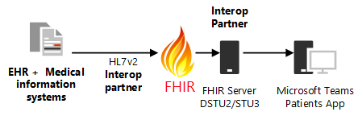

# Integración de registros sanitarios electrónicos en Microsoft Teams

[!INCLUDE [preview-feature](../../includes/preview-feature.md)]

Para participar en la versión preliminar privada, consulte [inscribirse en la versión preliminar privada](#enroll-in-the-private-preview).

Este artículo está dirigido a un desarrollador de TI de medicina general interesado en usar API de FHIR sobre un sistema de información de medicina para conectar con Microsoft Teams. Esto permitiría escenarios de coordinación de cuidados que se ajusten a las necesidades de una organización de salud.

Los artículos vinculados documentan las especificaciones de la interfaz de FHIR para la aplicación de pacientes de Microsoft Teams, y las siguientes secciones explican qué se necesita para configurar un servidor de FHIR y conectarse a la aplicación de pacientes en el entorno de desarrollo o en el inquilino. También necesitará estar familiarizado con la documentación del servidor de FHIR que haya elegido, que debe ser una de las opciones admitidas:
- Datica (a través de la oferta de [CMI](https://datica.com/compliant-managed-integration/) )
- Infor cloverleaf (a través del [puente de FHIR de Infor](https://pages.infor.com/hcl-infor-fhir-bridge-brochure.html))
- Redox (a través del [servidor R ^ FHIR](https://www.redoxengine.com/fhir/))
- Dapasoft (a través [de Corolar en FHIR](https://www.dapasoft.com/corolar-fhir-server-for-microsoft-teams/))

> [!NOTE]
> Este proceso no incluye los pasos que usan el centro de administración de Microsoft Teams o los cmdlets de PowerShell para habilitar características. La configuración se realiza por completo en el servidor FHIR y en el cliente de aplicaciones para pacientes.

A continuación se muestra la arquitectura de la aplicación para pacientes:

En las siguientes secciones, se explican los requisitos de la FHIR de acceso a datos de solo lectura para la aplicación de pacientes que un servidor de FHIR (o las API de FHIR habilitadas de EHR) debe cumplirse para poder integrarse con la aplicación de pacientes, entre los que se incluyen los siguientes:

- Expectativas sobre la autenticación de usuarios
- Requisitos técnicos y técnicos de la interfaz de integración
- Expectativas sobre rendimiento y fiabilidad
- Expectativas sobre los recursos de FHIR para que la aplicación de pacientes los admita
- Proceso de integración y modelo de compromiso esperado
- Cómo inscribirse a usted y a su cliente en la versión preliminar privada de la aplicación de pacientes
- Introducción a FHIR y algunos desafíos comunes que se enfrentan a la aplicación de pacientes
- Requisitos futuros para la siguiente iteración de la aplicación pacientes

> [!NOTE]
> En las siguientes secciones, se usa la palabra "Partner" o "Partner Interop" para referirse a cualquier organización de terceros que permita la integración con sistemas HCI para la aplicación de pacientes a través de FHIR y está implementando un servidor de FHIR para que coincida con las especificaciones de la lista.

## Requisitos técnicos y técnicos  

### Autenticación  

La autorización de nivel de aplicación *sin compatibilidad para autorización a nivel de usuario* es la forma más común admitida para realizar transformaciones de datos y exponer conexiones a datos de EHR a través de FHIR, aunque el sistema HCI pueda implementar la autorización a nivel de usuario. . El servicio de interoperabilidad (asociado) obtiene acceso elevado a los datos de EHR y cuando exponen los mismos datos que los recursos FHIR apropiados no hay ningún contexto de autorización pasado al consumidor del servicio de interoperabilidad (la aplicación de pacientes) que se integra con la interoperabilidad Servicio o plataforma. La aplicación de pacientes no podrá exigir la autorización de nivel de usuario, pero admite la autenticación de aplicaciones entre la aplicación de pacientes y el servicio del colaborador de interoperabilidad.

La aplicación para el modelo de autenticación de aplicaciones se describe a continuación:

La autenticación de servicio a servicio debe realizarse a través del flujo de credenciales de [cliente](https://www.oauth.com/oauth2-servers/access-tokens/client-credentials/)OAuth 2,0. El servicio asociado debe proporcionar lo siguiente:

1. El servicio asociado permite a la aplicación de pacientes crear una cuenta con el socio, lo que permite a la aplicación de pacientes generar y poseer el administrador de client_id y client_secret, administrado a través de un portal de registro de autenticación en el servidor de autenticación del asociado.
2. El servicio asociado posee el sistema de autenticación/autorización, que acepta y verifica (autentica) las credenciales de cliente proporcionadas y devuelve un token de acceso con el sugerencia de inquilino en el ámbito, como se describe a continuación.
3. Por razones de seguridad o en el caso de una infracción secreta, la aplicación de pacientes puede volver a generar el secreto e invalidar o eliminar el secreto anterior (el ejemplo de lo mismo está disponible en el portal de Azure: registro de la aplicación AAD)
4. El punto final de metadatos que hospeda la instrucción de conformidad debe ser no autenticado, debe ser accesible sin un token de autenticación.
5. El servicio asociado proporciona el punto final del token de la aplicación de pacientes para solicitar un token de acceso con un flujo de credenciales de cliente. La dirección URL del token como por servidor de autorización debe formar parte de la instrucción de conformidad (Capability) FHIR capturada de los metadatos en el servidor de FHIR como en este ejemplo:

* * *
    {"resourceType": "CapabilityStatement",.
        .
        .
        "Rest": [{"MODE": "Server", "Security": {"Extension": [{"extensión": [{"URL": "token", "valueUri": "https://login.contoso.com/145f4184-1b0b-41c7-ba24-b3c1291bfda1/oauth2/token"}, {"URL": "Authorize", "valueUri"https://login.contoso.com/145f4184-1b0b-41c7-ba24-b3c1291bfda1/oauth2/authorize: ""} "," URL ":"http://fhir-registry.smarthealthit.org/StructureDefinition/oauth-uris"}]," servicio ": [{" Coding ": [{" System ":"http://hl7.org/fhir/ValueSet/restful-security-service"," Code ":" OAuth " } ] } ] }, .
                .
                .
            } ] }

* * *

Una solicitud para un token de acceso consta de los siguientes parámetros:

* * *

    PUBLICAR/token HTTP/1.1 host: authorization-server.com

    Grant-Type = client_credentials &client_id = xxxxxxxxxx &client_secret = xxxxxxxxxx

* * *

El servicio asociado proporciona la aplicación client_id y client_secret para pacientes, administrada a través de un portal de registro de autenticación en el lado del socio. El servicio asociado proporciona el extremo para solicitar el token de acceso mediante un flujo de credenciales de cliente. Una respuesta correcta debe incluir los parámetros token_type, access_token y expires_in.

### Enrutamiento: asignación de inquilino de AAD al extremo de proveedor

La aplicación patients se conecta a un servicio asociado a través de un único punto de conexión. El servicio asociado posee y mantiene un mecanismo para asignar a cada cliente de Microsoft (ID de inquilino de AAD) a un proveedor de servicios de salud respectivo (servidor FHIR) con el que está trabajando el servicio asociado.

La asignación del inquilino de AAD a un extremo de proveedor usa el identificador de inquilino de AAD (GUID). La aplicación patients pasa el identificador de inquilino en el ámbito, mientras solicita un token de acceso para cada solicitud. El servicio asociado mantiene la asignación de identificador de inquilino en el extremo de proveedor y redirige las solicitudes a un extremo de proveedor basándose en el identificador de inquilino. Para ello, el socio admite la configuración en su extremo (manualmente o a través de un portal como parte de la incorporación de organizaciones de proveedores a su plataforma de interoperabilidad).

A continuación se muestra el flujo de trabajo de autenticación y enrutamiento:

1. Solicitud de token de acceso de aplicación mediante el envío de:
 
        {   grant_type: client_credentials,
            client_id: xxxxxx, 
            client_secret: xxxxxx,
            scope: {Provider Identifier, Ex: tenant ID}
        }

2. Responder con un token de aplicación:

        {  access_token: {JWT, with scope: tenant ID},
           expires_in: 156678,
           token_type: "Bearer",
        }

3. Solicitar datos protegidos con token de acceso.
4. Mensaje de autorización: seleccione el servidor de FHIR apropiado al que desea enrutar desde el identificador de inquilino en el ámbito
5. Envía los datos protegidos por la aplicación desde el servidor de FHIR autorizado después de autenticarse con el token de la aplicación.

## Interactúa

Las llamadas y los campos específicos usados por la aplicación de pacientes se documentan en los artículos siguientes. Seleccione la interfaz aplicable a las API de FHIR Server/FHIR.

- [Especificación de la interfaz DSTU2](dstu2-interface.md)
- [Especificación de la interfaz STU3](stu3-interface.md)

## Rendimiento y confiabilidad

Mientras la aplicación patients está en la vista previa privada, no hay ninguna garantía en el rendimiento de un extremo a otro. Entre los factores en el rendimiento se incluyen las latencias relativas de todos los saltos implicados en el flujo de trabajo, empezando desde el EHR del entorno del sistema, hasta el socio de interoperabilidad y su infra, incluido el servidor FHIR y el ecosistema de Office 365 y Aplicación de pacientes.

## Introducción a FHIR  

Si es nuevo en FHIR y necesita acceder fácilmente a un servidor de FHIR que pueda exponer a la interfaz de integración de Microsoft Teams HCI, Microsoft tiene un servidor de FHIR de código abierto para que todos los programadores lo usen. Para obtener más información sobre el servidor de FHIR de código abierto de Microsoft, consulte el artículo [What is FHIR Server for Azure](https://docs.microsoft.com/azure/healthcare-apis/overview-open-source-server) e impleméntelo para sus organizaciones.

También puede usar el entorno HSPC de espacio aislado abierto de Open para crear un EHR que también admita un servidor de FHIR abierto y use esta opción para familiarizarse con la aplicación de pacientes. Le recomendamos que lea la [documentación del espacio aislado de HSPC](https://healthservices.atlassian.net/wiki/spaces/HSPC/pages/64585866/HSPC+Sandbox). El espacio aislado no solo ofrece una forma sencilla, orientada a la interfaz de usuario y sencilla de usar para crear, agregar y editar pacientes, sino que también le ofrece varias muestras para comenzar.  

## Inscribirse en la versión preliminar privada

Una vez que haya creado el servidor de FHIR de código fuente abierto, es realmente fácil conectarse a la aplicación de pacientes dentro de su inquilino siguiendo los pasos que se indican a continuación:

1. [Comuníquese con nosotros](mailto:Teamsforhealthcare@service.microsoft.com?subject=Microsoft%20Teams%20Patients%20App%20private%20preview) a través de los siguientes detalles iniciales:  
    - Te llamas
    - Tu posición
    - La empresa u organización que represente
    - Por qué está interesado en la aplicación de pacientes para la integración de EHR

    Te volveremos lo antes posible con más preguntas y te guiaremos a través de un proceso para configurar la versión preliminar privada.

2. Asegúrese de que la aplicación de prueba de aplicaciones personalizadas está habilitada en el inquilino en el que va a probar la aplicación pacientes. Consulte [las directivas de permisos de aplicaciones](../../admin-settings.md) para obtener información sobre cómo activar esta opción desde el centro de administración de Teams para el inquilino de su cliente.

3. Transfiera localmente el manifiesto de la aplicación patients que recibirá de Microsoft (después de procesar su correo electrónico para nosotros) en un equipo del inquilino que se va a usar para la coordinación de cuidados y los escenarios de redondeo de los pacientes. Las instrucciones detalladas sobre cómo cargar una aplicación de forma simultánea están en [cargar un paquete de la aplicación a Microsoft Teams](/microsoftteams/platform/concepts/apps/apps-upload)

4. Vaya al canal general como propietario del equipo y, a continuación, haga clic en la pestaña pacientes. Debería ver una experiencia de primera ejecución que presentará dos opciones, es decir, el modo HCI y el modo manual. Seleccione el **modo de EHR** y copie el extremo del servidor FHIR (que acaba de instalar anteriormente con todos los datos necesarios y los recursos según las especificaciones anteriores) en el campo vínculo y asigne un nombre a la conexión que represente correctamente el servidor FHIR. Haga clic en conectar y todo está listo.

    

5. Empiece a usar la aplicación para buscar pacientes desde el servidor FHIR/EHR y agréguelos a una lista y envíenos [comentarios](mailto:Teamsforhealthcare@service.microsoft.com?subject=Microsoft%20Teams%20Patients%20App%20feedback) si algo no funciona. Además, para establecer una versión completamente autenticada de la aplicación de pacientes, > flujo de servidor de FHIR, participe en el diálogo sin conexión con Microsoft Teams para la ingeniería de productos de la salud, a través de la solicitud de correo electrónico mencionada anteriormente para clarificar los requisitos y le pondremos Ayude a habilitar esta opción en función de los requisitos de autenticación descritos anteriormente en el documento de interfaz FHIR.  

