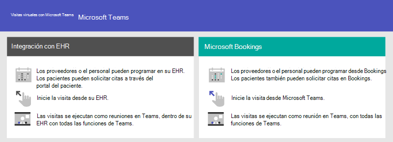
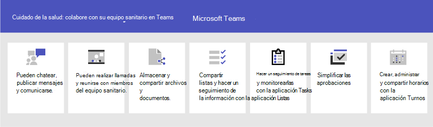

# Introducción a Teams para organizaciones sanitariasGet started with Teams for healthcare organizations

Microsoft Teams ofrece una serie de características de telemedicina que resultan útiles para los hospitales y otras organizaciones de salud.Microsoft Teams offers a number of telemedicine features useful for hospitals and other Healthcare organizations. Las características de Teams se están desarrollando para ayudar a los hospitales con:Teams features are under development to aid hospitals with:

- Visitas virtuales y la integración de la historia clínica electrónica (EHR)Virtual visits and Electronic Healthcare Record (EHR) integration
- Paquetes de directivas de TeamsTeams policy packages
- Mensajería seguraSecure messaging
- Plantillas de TeamsTeams templates
- Colaboración y coordinación de atención médicaCare coordination and collaboration

Esta función forma parte de la Nube de Microsoft para el cuidado de la salud.This functionality is part of the Microsoft Cloud for Healthcare. Obtenga más información sobre esta solución, que aúna capacidades de Azure, Dynamics 365 y Microsoft 365 en la [Nube de Microsoft para el cuidado de la salud](/industry/healthcare).Learn more about using this solution, which brings together capabilities from Azure, Dynamics 365, and Microsoft 365 at [Microsoft Cloud for Healthcare](/industry/healthcare).

Vea el siguiente vídeo para obtener más información sobre el uso de la colección del cuidado de la salud para mejorar la colaboración de los equipos sanitarios en Microsoft Teams.Watch the following video to learn more about using the healthcare collection to enhance health team collaboration in Microsoft Teams.

> [!VIDEO https://www.microsoft.com/videoplayer/embed/RE4Hqan]

> [!NOTE]
> El contenido de esta sección da por sentado que ya ha implementado Teams en su organización.The content in this section assumes that you've already deployed Teams in your organization. Si todavía no ha implementado Teams, empiece por leer [Cómo implementar Microsoft Teams](../../deploy-overview.md).If you haven't yet rolled out Teams, start by reading [How to roll out Microsoft Teams](../../deploy-overview.md).

Los siguientes escenarios están disponibles para las organizaciones del cuidado de la salud:The following scenarios are available for healthcare organizations:

| EscenarioScenario | DescripciónDescription | RequirementsRequirements |
| -------- | -------- | -------- |
| [Visitas virtuales con integración de la historia clínica electrónica (EHR)Virtual visits with Electronic Healthcare Record (EHR) integration](#virtual-visits-and-electronic-healthcare-record-ehr-integration) | Programe, administre y realice visitas virtuales con los pacientes.Schedule, manage, and conduct virtual visits with patients. Este escenario conecta Microsoft Teams y la plataforma Epic para admitir las visitas virtuales.This scenario connects Microsoft Teams and the Epic platform to support virtual visits. | Oferta independiente de suscripción activa de la Nube de Microsoft para el cuidado de la salud o suscripción del conector de EHR para Microsoft Teams.Active subscription to Microsoft Cloud for Healthcare or subscription to Microsoft Teams EHR Connector standalone offer.   Los usuarios deben tener una licencia adecuada de Microsoft 365 u Office 365 que incluya reuniones de Microsoft Teams\*.Users must have an appropriate Microsoft 365 or Office 365 license that includes Microsoft Teams meetings\*.   Las organizaciones deben tener la versión de Epic de noviembre de 2018 o posterior.Organizations must have with Epic version November 2018 or later.  [Detalles de los requisitos de EHRDetails for EHR requirements](ehr-admin.md#before-you-begin) |
| [Visitas virtuales con Microsoft Bookings y la aplicación de BookingsVirtual visits with Microsoft Bookings and the Bookings app](#virtual-visits-and-electronic-healthcare-record-ehr-integration) | Programe, administre y realice visitas virtuales con los pacientes.Schedule, manage, and conduct virtual visits with patients. Este escenario depende de Microsoft Bookings para admitir visitas virtuales.This scenario relies on Microsoft Bookings to support virtual visits. | Microsoft Bookings debe estar activado para la organización.Microsoft Bookings must be turned on for the organization.   Todos los usuarios de la aplicación de Bookings y todo el personal que participe en las reuniones debe tener una licencia que admita la programación de reuniones de Teams.All users of the Bookings app and all staff participating in meetings must have a license that supports Teams Meeting scheduling\*.  [Detalles de los requisitos de BookingsDetails for Bookings requirements](../../bookings-app-admin.md#prerequisites-for-using-the-bookings-app-in-teams)|
| [Paquetes de directivas de Microsoft TeamsTeams policy packages](#teams-policy-packages)| Asegúrese de que los dispositivos del personal clínico, del personal de información y de las salas de pacientes tengan el acceso adecuado a la función de Teams.Ensure that clinical workers, information workers, and patient room devices have the appropriate access to Teams functionality.| Los usuarios deben tener una licencia adecuada\*.Users must have an appropriate license\*. |
| [Mensajería seguraSecure messaging](#secure-messaging) | Obtenga atención más rápida de los mensajes urgentes y tenga la seguridad de que los mensajes se reciben y se leen.Get quicker attention to urgent messages and have confidence that the message was received and read. | Los usuarios deben tener una licencia adecuada\*.Users must have an appropriate license\*.  |
| [Plantillas de TeamsTeams templates](#teams-templates-for-healthcare-organizations) | Cree equipos que incluyan una plantilla predefinida de configuración, canales y aplicaciones preinstaladas para la comunicación y colaboración en una planta, sala o departamento, o entre varias plantas, salas o departamentos en un hospital.Create teams that include a predefined template of settings, channels, and pre-installed apps for communication and collaboration within a ward, pod, or department, or between multiple wards, pods, and departments within a hospital. | Los usuarios deben tener una licencia adecuada\*.Users must have an appropriate license\*.  |
| [Colaboración y coordinación de atención médicaCare coordination and collaboration](#care-coordination-and-collaboration) | El personal de medicina clínica y el personal general pueden colaborar internamente en los horarios, documentos, tareas, etc.Clinicians and staff can collaborate internally on schedules, documents, tasks, and so on.| Los usuarios deben tener una licencia adecuada\*.Users must have an appropriate license\*. |

\*Se admiten Office 365 A3, A5, E3 y E5, así como Microsoft 365 Empresa Estándar, A3, A5, E3 y E5.\*Office 365 A3, A5, E3, and E5, as well as Microsoft 365 Business Standard, A3, A5, E3, and E5 are supported. Para obtener más información sobre las licencias de Teams en general, consulte [Administrar el acceso del usuario a Teams](../../user-access.md).For more information about general Teams licensing, see [Manage user access to Teams](../../user-access.md).

## Visitas virtuales y la integración de la historia clínica electrónica (EHR)Virtual visits and Electronic Healthcare Record (EHR) integration

Use la plataforma completa de reuniones en Microsoft Teams para programar, administrar y realizar visitas virtuales con pacientes.Use the complete meetings platform in Microsoft Teams to schedule, manage, and conduct virtual visits with patients.

- Si su organización ya utiliza la historia clínica electrónica o EHR, puede integrar Microsoft Teams para disfrutar de una experiencia más sencilla.If your organization already uses Electronic Health Records, or EHR, you can integrate Microsoft Teams for a more seamless experience. El conector de Microsoft Teams para la historia clínica electrónica (EHR) hace que resulte fácil para el personal médico iniciar una visita virtual con un paciente o una consulta con otro proveedor en Teams directamente desde el sistema de EHR.Microsoft Teams Electronic Health Record (EHR) Connector makes it easy for clinicians to launch a virtual patient visit or consultation with another provider in Teams directly from the EHR system. Para más información, consulte [Visitas virtuales con Teams: integración en EHR](ehr-admin.md).To learn more, see [Virtual visits with Teams - Integration into EHR](ehr-admin.md).
- Si no usa una EHR admitida, puede usar Microsoft Bookings y la aplicación de Bookings en Teams.If you aren't using a supported EHR, you can use Microsoft Bookings and the Bookings app in Teams. Para más información, consulte [Aplicación de reservas y visitas virtuales de Microsoft Teams](../../bookings-app-admin.md).To learn more, see [Bookings app and virtual visits in Microsoft Teams](../../bookings-app-admin.md).

## Paquetes de directivas de TeamsTeams policy packages

Aplique paquetes de directivas de Teams para definir lo que los diferentes roles pueden hacer en Teams.Apply Teams policy packages to define what different roles can do in Teams. Por ejemplo, especifique directivas para:For example, specify policies for:

- Personal sanitario, como personal titulado de enfermería, personal encargado de enfermería, personal médico y trabajadores sociales, para que tengan acceso completo al chat, llamadas, administración de turnos y reuniones.Clinical workers, such as registered nurses, charge nurses, physicians, and social workers, so that they can have full access to chat, calling, shift management, and meetings.
- Personal de la información en su organización del cuidado de la salud, como personal de TI, personal de informática, personal de finanzas y responsables del cumplimiento normativo, para que tengan acceso completo al chat, llamadas y reuniones.Information workers in your healthcare organization, such as IT personnel, informatics staff, finance personnel, and compliance officers, can have full access to chat, calling, and meetings.
- Salas de pacientes, para control la configuración de los dispositivos en salas de pacientes.Patient rooms, to control settings for patient room devices.

Para más información, consulte [Paquetes de directivas de Teams para sanidad](../../policy-packages-healthcare.md).To learn more, see [Teams policy packages for healthcare](../../policy-packages-healthcare.md).

## Mensajería seguraSecure messaging

La mensajería segura admite la colaboración dentro de los equipos de salud, incluidas varias características nuevas:Secure messaging supports collaboration within health teams, including several new features:

- El remitente de un mensaje puede establecer prioridad especial para su mensaje, de modo que el destinatario reciban notificaciones repetidamente hasta que lea el mensaje.A message sender can set a special priority for their message, so the recipient is repeatedly notified until they read the message.
- El remitente de un mensaje puede solicitar una confirmación de lectura, para recibir una notificación cuando el destinatario lea el mensaje.A message sender can request a read receipt, so they are notified when a message they sent was read by the message recipient.

Combinadas, estas características ofrecen una atención más rápida de los mensajes urgentes y la seguridad de que los mensajes se reciben y se leen.Together, these features allow quicker attention to urgent messages and confidence that the message was received and read. Se pueden crear por paciente nuevos equipos de salud que usen estas características.New health teams using these features can be created on a per-patient basis. Estas características se basan en directivas y se pueden asignar a individuos o al equipos enteros.These features are policy-based, and can be assigned to individuals or entire Teams.

Para más información, consulte [Introducción a las directivas de mensajería segura para las organizaciones sanitarias](messaging-policies-hc.md).To learn more, see [Get started with Secure Messaging policies for Healthcare organizations](messaging-policies-hc.md).

Otro aspecto relacionado con la mensajería segura es la posibilidad de que otros espacios empresariales sean federados por organizaciones sanitarias, lo que permite una mejor comunicación entre espacios empresariales.Also related to secure messaging is the ability to have other tenants federated by Healthcare organizations, allowing richer inter-tenant communication. (Consulte [Administrar el acceso externo (federación) en Microsoft Teams](../../manage-external-access.md)).(See [Manage external access (federation) in Microsoft Teams](../../manage-external-access.md)).

## Plantillas de Teams para organizaciones sanitariasTeams templates for healthcare organizations

Se ha desarrollado nuevas plantillas para crear equipos para aplicar a hospitales, y se espera que pronto se publiquen más.New templates for creating Teams were developed to apply to a Hospital setting, and more are expected soon. Esto hace que resulte más fácil crear equipos que el personal sanitario puede usar para coordinar el cuidado de los pacientes en varios departamentos o plantas.This makes it easier to create teams that Healthcare workers use to coordinate care for patients in various departments or wards. Para más información, consulte [Introducción a las plantillas para las organizaciones sanitarias de Teams](./healthcare-templates-admin-console.md).To learn more, see [Get started with Teams templates for Healthcare organizations](./healthcare-templates-admin-console.md). Los equipos se pueden iniciar para departamentos internos como cardiología o para salas de pacientes, y se están desarrollando más plantillas.Teams can be started for internal departments such as cardiology, or for care wards, and more templates are in development.

## Colaboración y coordinación de atención médicaCare coordination and collaboration

Estreche la colaboración de su equipo sanitario para coordinar el cuidado de la salud y colaborar con Microsoft Teams.Bring your health team together to coordinate care and collaborate with Microsoft Teams.

Microsoft Teams permite al personal médico, personal clínico, personal de enfermería y otros colaborar de manera eficiente con características incluidas de colaboración en Microsoft Teams, tales como:Microsoft Teams enables physicians, clinicians, nurses, and other staff to collaborate efficiently with included collaboration features in Microsoft Teams, such as:

- Configurar equipos y canales para sus equipos sanitarios y personal de la información.Set up teams and channels for your health teams and information workers. Usar canales con pestañas para estructurar el trabajo, con la ayuda adicional que proporcionan pestañas en las que el personal puede anclar fuentes de información.Use channels with tabs as a way to structure their work, with additional help from tabs to which they can pin information sources.
- Pueden chatear, publicar mensajes y comunicarse.Chat, post messages, and communicate. Su equipo puede comunicarse constantemente sobre diferentes pacientes que necesitan atención.Your team can have persistent conversations about different patients needing attention.
- Pueden realizar llamadas y reunirse con miembros del equipo sanitario.Call and meet with members of the health team. Configure reuniones individuales o utilice las reuniones de canal para administrar reuniones diarias, con la tecnología de las características de Teams de audio, vídeo, pantalla compartida, grabación y transcripción.Set up individual meetings, or use channel meetings to manage daily meetings, both with the power of Teams audio, video, screen sharing, recording, and transcription features.
- Almacenar y compartir archivos y documentos.Store and share files and documents. Su equipo sanitario forma parte de un único equipo virtualizado que trabaja y colabora en documentos de Office.Your health team is part of a single virtualized team that works and collaborates on Office documents.

Además, su equipo puede usar aplicaciones en Teams para:In addition, your team can use apps in Teams to:

- Compartir listas y hacer un seguimiento de la información con la aplicación ListasShare lists and track information with the Lists app
- Hacer un seguimiento de tareas y monitorearlas con la aplicación TasksTrack and monitor tasks with the Tasks app
- Simplificar aprobaciones con la aplicación AprobacionesStreamline approvals with the Approvals app
- Crear, administrar y compartir horarios con la aplicación TurnosCreate, manage, and share schedules with the Shifts app

### Compartir listas y hacer un seguimiento de la información con la aplicación ListasShare lists and track information with the Lists app

> [!NOTE]
> Desde el 30 de octubre de 2020, la aplicación Pacientes se retiró y se reemplazó por la aplicación [Listas](https://support.microsoft.com/office/get-started-with-lists-in-teams-c971e46b-b36c-491b-9c35-efeddd0297db) en Teams.Effective October 30, 2020, the Patients app has been retired and replaced by the [Lists app](https://support.microsoft.com/office/get-started-with-lists-in-teams-c971e46b-b36c-491b-9c35-efeddd0297db) in Teams. Con Listas, los equipos del cuidado de la salud en su organización sanitaria pueden crear listas de pacientes para escenarios que van desde guardias y reuniones interdisciplinarias de equipo hasta seguimiento general de pacientes.With Lists, care teams in your healthcare organization can create patient lists for scenarios ranging from rounds and interdisciplinary team meetings to general patient monitoring.

La aplicación Lists en Microsoft Teams ayuda a los equipos a realizar un seguimiento de la información y a organizar el trabajo.The Lists app in Teams helps teams track information and organize work. La aplicación viene preinstalada para todos los usuarios de Teams y en una pestaña en todos los equipos y canales.The app is pre-installed for all Teams users and is available as a tab in every team and channel. Se pueden crear listas desde cero, desde plantillas predefinidas o mediante la importación de datos de Excel.Lists can be created from scratch, from predefined templates, or by importing data to Excel.

Los equipos de salud pueden usar la plantilla Pacientes para empezar.Health teams can use the Patients template to get started. Pueden crear listas para hacer un seguimiento de las necesidades y estado de los pacientes.They can create lists to track the needs and status of patients. Se pueden importar datos existentes sobre pacientes en hojas de cálculo de Excel para crear una lista en Teams.Existing patient data on Excel spreadsheets can be brought in to create a list in Teams. Estas listas se pueden usar para escenarios como guardias y supervisión de pacientes para coordinar el cuidado de la salud.These lists can be used for scenarios such as rounds and patient monitoring to coordinate care.

Por ejemplo, un miembro del personal encargado de enfermería puede crear una lista de pacientes en un equipo que incluya a todos los miembros del equipo sanitario.For example, a charge nurse creates a patient list in a team that includes all health team members. Durante las guardias, el equipo sanitario tiene acceso a Teams en sus dispositivos móviles y puede actualizar la información de los pacientes de la lista. Todos los miembros del equipo pueden ver la lista para sincronizarse. En las sesiones de guardia en las que el equipo sanitario se reúne para evaluar métricas clave de salud para asegurarse de que un paciente vaya por buen camino para recibir el alta, pueden compartir esta información mediante Teams en una pantalla grande de visualización.During rounds, the health team access Teams on their mobile devices and update patient information in the list, which everyone on the team can view to stay in sync. At rounding sessions where the health team gathers to discuss and evaluate key health performance metrics to ensure a patient is on the right glide path to discharge, they can share this information using Teams on a large display screen. los miembros del equipo sanitario que no se encuentren en el lugar de la reunión se pueden unir a distancia.health team members who aren't on site can join remotely.

Aquí tiene una lista de muestra para guardias de pacientes.Here's an example list which was set up for patient rounding.

:::image type="content" source="../../media/lists-patients-example.png" alt-text="Recorte de pantalla de lista de muestra para guardias de pacientes":::

Para más información, consulte [Administrar la aplicación Listas para su organización en Teams](../../manage-lists-app.md).To learn more, see [Manage the Lists app for your organization in Teams](../../manage-lists-app.md).

### Hacer un seguimiento de tareas y monitorearlas con la aplicación TasksTrack and monitor tasks with the Tasks app

Use [Tasks](https://support.microsoft.com/office/use-the-tasks-app-in-teams-e32639f3-2e07-4b62-9a8c-fd706c12c070) en Teams para hacer un seguimiento elementos pendientes para todo el equipo sanitario.Use [Tasks](https://support.microsoft.com/office/use-the-tasks-app-in-teams-e32639f3-2e07-4b62-9a8c-fd706c12c070) in Teams to track to do items for your whole health team. Su equipo sanitario puede crear, asignar y programar tareas, categorizar tareas y actualizar estados en cualquier momento, desde cualquier dispositivo que tenga Teams.Your health team can create, assign, and schedule tasks, categorize tasks, and update status at any time, from any device running Teams.

Para más información, consulte [Administrar la aplicación Tasks para su organización en Microsoft Teams](../../manage-tasks-app.md)To learn more, see [Manage the Tasks app for your organization in Microsoft Teams](../../manage-tasks-app.md)

### Simplificar aprobaciones con la aplicación AprobacionesStreamline approvals with the Approvals app

Use [Aprobaciones](https://support.microsoft.com/office/what-is-approvals-a9a01c95-e0bf-4d20-9ada-f7be3fc283d3) para simplificar todas sus solicitudes y procesos con su equipo.Use [Approvals](https://support.microsoft.com/office/what-is-approvals-a9a01c95-e0bf-4d20-9ada-f7be3fc283d3) to streamline all of your requests and processes with your team. Cree, administre y comparta aprobaciones directamente desde su centro para el trabajo en equipo.Create, manage, and share approvals directly from your hub for teamwork. Inicie un flujo de aprobación desde el mismo sitio desde el que envía un chat, en una conversación de canal o desde la propia lista de Aprobaciones.Start an approval flow from the same place you send a chat, in a channel conversation, or from the Approvals app itself. Solo tiene que seleccionar el tipo de aprobación, agregar detalles, adjuntar archivos y elegir aprobadores.Just select an approval type, add details, attach files, and choose approvers. Una vez enviado, los aprobadores reciben una notificación y pueden revisar y responder a la solicitud.Once submitted, approvers are notified and can review and act on the request.

Puede permitir la aplicación Aprobaciones para su organización y agregarla a sus equipos.You can allow the Approvals app for your organization and add it to your teams. Para más información, consulte [Disponibilidad de la aplicación Aprobaciones de Teams](../../approval-admin.md).To learn more, see [Teams Approvals app availability](../../approval-admin.md).

### Crear, administrar y compartir horarios con la aplicación Turnos y la integración de personal de primera líneaCreate, manage, and share schedules with the Shifts app and Frontline Worker integration

Microsoft Teams se integra con la aplicación Turnos y personal de primera línea, que se puede usar para coordinar características de turnos del personal y más.Microsoft Teams integrates with the Shifts app and Frontline Worker, which can be used to coordinate shift staffing features and more. Por ejemplo, en Turnos, los gerentes de enfermería pueden configurar y coordinar los horarios de su personal, y el personal de enfermería puede consultar horarios y cambiar turnos.For example, in Shifts, Nurse managers can set up and coordinate schedules for their staff, and nurses can check schedules and swap shifts. Teams incluye una política de configuración de la aplicación incorporada para trabajadores de primera línea puede asignar a los trabajadores de primera línea en su organización.Teams includes a built-in Frontline Worker app setup policy that you can assign to Frontline Workers in your organization. De forma predeterminada, la directiva incluye las aplicaciones Actividad, Turnos, Chat y Llamadas.By default, the policy includes the Activity, Shifts, Chat, and Calling apps. Esta directiva controla el comportamiento de estas aplicaciones, por ejemplo, se puede anclar la aplicación Turnos en la barra de la aplicación para que el equipo pueda acceder a la misma rápidamente.This policy controls behavior for these apps, for example, pinning the Shifts app to the app bar so the team can quickly access it.

Para más información, consulte [Administrar la aplicación Turnos para su organización en Microsoft Teams](../shifts/manage-the-shifts-app-for-your-organization-in-teams.md).To learn more, see [Manage the Shifts app for your organization in Microsoft Teams](../shifts/manage-the-shifts-app-for-your-organization-in-teams.md).

## Ayude a su personal médico y de la información a empezar a usar TeamsHelp your clinical and information workers get going with Teams

Hay muchos recursos disponibles para ayudar a todos los usuarios en su organización a familiarizarse con Teams:There are many resources available to help all of the users in your organization get comfortable with using Teams:

- Visite el [centro de adopción de Teams](https://adoption.microsoft.com/microsoft-teams/) para obtener consejos sobre la implementación de Teams si está iniciando la experiencia de su organización con Teams, o para expandir Teams a más ámbitos de su organización.Visit the [Teams adoption center](https://adoption.microsoft.com/microsoft-teams/) for advice on rolling out Teams if you are just starting your organization's journey with Teams, or expanding Teams into more areas of your organization.
- Considere configurar [formas de aprendizaje](https://adoption.microsoft.com/microsoft-365-learning-pathways/) personalizado para que los usuarios aprendan solamente a hacer sus tareas.Consider setting up custom [learning pathways](https://adoption.microsoft.com/microsoft-365-learning-pathways/) for your users to cover just the tasks they need to do.
- Obtenga ayuda y aprendizaje para sus usuarios sobre cómo realizar tareas básicas en Microsoft Teams en el [sitio de soporte técnico de Teams](https://support.microsoft.com/teams), incluidos [vídeos breves de aprendizaje](https://support.microsoft.com/office/microsoft-teams-video-training-4f108e54-240b-4351-8084-b1089f0d21d7).Get help and training for your users on how to perform basic tasks in Microsoft Teams on the [Teams support site](https://support.microsoft.com/teams), including [quick training videos](https://support.microsoft.com/office/microsoft-teams-video-training-4f108e54-240b-4351-8084-b1089f0d21d7). Asimismo, el sitio incluye ayuda y aprendizaje para las aplicaciones de Teams, incluidas [Listas](https://support.microsoft.com/office/get-started-with-lists-in-teams-c971e46b-b36c-491b-9c35-efeddd0297db), [Tasks](https://support.microsoft.com/office/use-the-tasks-app-in-teams-e32639f3-2e07-4b62-9a8c-fd706c12c070), [Aprobaciones](https://support.microsoft.com/office/what-is-approvals-a9a01c95-e0bf-4d20-9ada-f7be3fc283d3), [Bookings](https://support.microsoft.com/office/overview-of-the-bookings-app-in-teams-7b8569e1-0c8a-444e-b712-d9968b05110b) y [Turnos](https://support.microsoft.com/office/what-is-shifts-f8efe6e4-ddb3-4d23-b81b-bb812296b821).This site also has help and training for the Teams apps, including [Lists](https://support.microsoft.com/office/get-started-with-lists-in-teams-c971e46b-b36c-491b-9c35-efeddd0297db), [Tasks](https://support.microsoft.com/office/use-the-tasks-app-in-teams-e32639f3-2e07-4b62-9a8c-fd706c12c070), [Approvals](https://support.microsoft.com/office/what-is-approvals-a9a01c95-e0bf-4d20-9ada-f7be3fc283d3), [Bookings](https://support.microsoft.com/office/overview-of-the-bookings-app-in-teams-7b8569e1-0c8a-444e-b712-d9968b05110b), and [Shifts](https://support.microsoft.com/office/what-is-shifts-f8efe6e4-ddb3-4d23-b81b-bb812296b821).